# Line & Bell — Documentação completa do jogo

> ⚠️ **Aviso importante: todas as animações e artes usadas hoje são TEMPORÁRIAS.**
> Elas estão no jogo só para dar vida à aventura enquanto a criação da arte final não termina.
> Quando cada animação definitiva ficar pronta, ela substitui a temporária com o mesmo código.
> Isso vale para os sprites, os retratos, o cenário e os desenhos feitos no código.

> 🐉 **PARTE 2 — O Coração dos Elementos (novo nesta versão):**
> - Depois do “Fim?”, **Continuar** abre a Parte 2: o dragão acorda para pedir ajuda contra a **Quimera**, que rouba a luz dos guardiões (seção 16).
> - **A Bell é jogável:** troca com **T** / 🔄; ela atira estrelas, solta um leque de luz e canta para acalmar as feras. Cada uma tem a própria vida; quando uma cai, a outra assume (seção 19).
> - **Sete fases novas** com ambientação completa: Vale das Raízes, Fenda de Magma, Lago Espelhado, Pântano Sombrio, Picos do Vento, Olho da Tempestade e Coração dos Elementos — lama, correntes de vento, abismo de céu, chuva e relâmpagos (seção 17).
> - **Sete chefes novos:** os guardiões da **Terra**, da **Água** e do **Ar**, as junções **Pedra + Fogo** (Titã de Magma), **Terra + Água** (Hidra de Lama) e **Água + Ar** (Tempestade Viva), e a **Quimera Primordial**, junção de todos os elementos, em três fases (seção 20).
> - **Relógio do jogo** com dia e noite: 1 minuto real = 1 hora no jogo; os moradores dormem à noite e dá para descansar nas fontes (seção 18).
> - **Dicas no modo Fácil:** seta até o objetivo, dicas de cada chefe, aviso de vida baixa e dica na derrota (seção 21).
> - **Armaduras da Bell** (Vestido Reforçado, Manto Estelar e Armadura da Aurora) e a arte de armadura das duas (seção 19.3).
> - **Novos moradores** (Dona Cora, Seu Tião, Vó Brisa), 3 documentos, 1 conclusão e 3 escamas de guardião.
> - **Lista completa de arte necessária** para o jogo inteiro: personagens, armaduras, moradores, inimigos, chefes, cenário de cada fase, itens, interface, efeitos e dia/noite (seção 22).

> 🎨 **Revisão geral de design (seção 23.6):** todos os objetos e móveis agora seguem uma **régua de tamanhos** (medida real × a altura da Line); a fazenda, o vilarejo e todos os interiores foram reorganizados por zonas, com os caminhos livres; as casas do vilarejo, da floresta, do vale e do lago usam a casa em pixel art com telhados de cores diferentes; a Dona Rosa e o Seu Bento atendem dentro das lojas, atrás do balcão, e as lojas fecham à noite; os botões do celular formam um arco em volta do ⚔; a biblioteca foi limpa (arte antiga e fotos sem uso saíram) e as fotos foram refeitas.

> 🐴 **Itens 218 a 227 chegaram:** canto do cavalo no pasto (cavalete com sela, cabresto e escova), cesto de lã e tesoura de tosquia perto das ovelhas, bebedouro no galinheiro, concha de grãos no silo, ferraduras no celeiro e balde de ração perto do cocho.

> 🧺 **Itens 203 a 217 chegaram:** bebedouro de passarinho, dois postes de lampião na estrada, roda de carroça no celeiro, carrinho de flores, treliça, mangueira, tesoura de poda, cesto de maçãs, abóboras, banquinho e balde de ordenha no pasto, sapateira e galochas na varanda, cesto de prendedores debaixo do varal e silo de grãos.

> 🎮 **Poção e bomba no mesmo botão:** no celular há um botão só para o item do atalho; equipe na mochila o que quer deixar nele (bomba, poção, elixir…). Se o item equipado acabar, o botão passa sozinho para outro que ainda tenha. Os **ícones de todos os botões** estão na seção 8.1.

> 📱 **Botões do celular:** a poção (🧪), o trocar heroína (🔄) e o item do atalho (💣) subiram para cima dos botões de ação, longe do joystick. O botão do giro (🌀) saiu: **segurar o ⚔** faz o giro da Line (ou o leque de estrelas da Bell). **Sem espada, o ⚔ dá um soco** (seção 8.1).

> 🌻 **Itens 188 a 202 chegaram:** arco de jardim com a placa de boas-vindas na estrada norte da fazenda, cata-vento de galo no telhado do celeiro, sino na varanda, fumigador e pote de mel junto à colmeia, floreira na frente da casa, comedouro no galinheiro, cocho de feno, pedra de sal e bebedouro no pasto, bancada de mudas com luvas e bandeja de mudinhas ao lado da horta e um rolo de corda no píer.

> 🧺 **Itens 154 a 187 chegaram — a fazenda e a casa ganharam vida:** a casa da fazenda tem ilha de cozinha com banquetas, despensa, prateleira de temperos, relógio, quadro, vasos de planta e de flores, luminárias pendentes, arandelas, uma janela e a porta da despensa, que abre quando a Line chega perto. No terreno: caixa de correio, capacho, cadeira de balanço na varanda, lenha, colmeia, casinha de passarinho, espantalho, carrinho de mão, pá, enxada, suporte de ferramentas, sacos de sementes, balde, barril de chuva, cesto de colheita, ninho e cesto de ovos, cocho no pasto, latão de leite, composteira, ferradura no celeiro, banco e fogueira na beira do lago, taboas, vitórias-régias, caixote no píer e cogumelos. O regador da tarefa da manhã agora aparece de verdade no poço, e a pontezinha está no riacho do Lago Espelhado. Luminárias, janela e fogueira acendem sozinhas à noite. O item 153 não veio.

> 📱 **Ajustes do teste no celular (seção 23.5):** a Line não “cai” mais ao pegar a espada (a arte de “Feliz” era uma corrida com queda e saiu do jogo); as duas de mãos dadas e a dança do pôr do sol voltaram ao tamanho certo; a casa da fazenda não some mais da tela; no lanche do shopping aparece só a mesa delas. **Pedido de arte novo:** o Minas Shopping em peças — base só com chão e teto e cada loja, móvel e enfeite separado (seção 22.11.1).

> 🏡 **Itens 137 a 152 chegaram — fazenda nova e todas as casas por dentro:** a fazenda agora é o **terreno oficial** (item 144), com a casinha do Theo, a tigela (cheia e vazia), o varal, a mesa de piquenique, a cerca, a porteira, flores e mato da arte nova (itens 146 e 147). **Toda casa tem interior:** a casa da fazenda (cozinha, sala, quarto e banheiro, item 145, com os móveis dos itens 148 a 152), a cabana do caçador, a loja da Dona Rosa, a ferraria do Seu Bento, as três casas do vilarejo, a casa da Dona Cora e a do Seu Tião (seção 6.8). O prólogo usa o playground e a máquina de soco novos (itens 141 e 142), o pato e o gato entraram (138 e 139); a ovelha reenviada (137) foi recusada.

> 🎞️ **Line e Bell do mesmo tamanho e no mesmo ritmo em todas as animações:** poses inclinadas, agachadas e sentadas não aumentam nem diminuem mais a cabeça (ajuste medido pela cabeça, seção 26.5); a Bell anda e corre no mesmo passo da Line; as cenas do começo tocam no ritmo da artista (o beijo no túnel, a Line admirando a Bell e o soco na máquina estavam acelerados); reverência, toca aqui e vitória não piscam mais em meio segundo. No rapto aparece um dragão só: a arte antiga da Bell carregada já trazia outro dragão desenhado junto.

> 🐄 **Bichos maiores e galinhas andando de verdade:** todos os bichos cresceram (galinha 47 de altura, vaca 71, cavalo 90, porco e ovelha 48, Theo 36, pintinho 27; a Line tem 62). A galinha agora anda com uma perna depois da outra, e cada bicho olha para o lado em que anda (antes a galinha, a vaca, o cavalo e a ovelha andavam de ré).

> 📚 **Tudo num documento só:** o que falta criar (seção 23), o índice dos itens de arte recebidos (seção 24), o plano de criação por item (seção 25) e como rodar, publicar e editar o jogo (seção 26) agora ficam aqui dentro. Os arquivos soltos (`ANIMACOES_PENDENTES.md`, `LINE_BELL_INDICE_PARTES.md`, `LINE_BELL_PLANO_ANIMACOES_POR_ITEM.md`, `docs/ARTES_NECESSARIAS.md`, `arte/theo/LAYOUT_OFICIAL.md`) saíram do repositório.

> 🧙 **Itens 124 a 127 chegaram:** o **Mago** animado (parado, falando e fazendo magia), o **Espírito das Ruínas**, que agora aparece de verdade no altar (surgindo, flutuando e falando), e o **Theo** parado e andando nas 4 direções, alerta e curioso. O Theo está todo com arte nova.
> 📐 **Dimensão de cada cenário:** tabela e gabarito (planta) de cada fase na seção 22.12.
> 🎨 **Itens 108 a 137 chegaram:** vitória, magias, andar e correr em combate e pulo para a esquerda da Line; as duas comendo, beijo, toca aqui e costas das andanças; o dragão correndo; o **Guardião de Pedra completo**; o **fogo-fátuo** (a mesma arte colorida por elemento: azul, laranja, verde e branco) e a **sombra**; o **Theo**, a **galinha branca**, o **porco**, o **cavalo** e a **ovelha** com 12 quadros por animação, no mesmo tamanho dos bichos antigos.
> 🔁 **Para reenviar:** `LINE_BELL_WALK_TOGETHER`, `LINE_BELL_WALK_HANDS` e `LINE_BELL_RUN_TOGETHER` de frente e de lado (itens 110 a 112) vieram com todos os quadros iguais, parados, e o jogo segue com as versões que se mexem; `DRAGON_SLEEP` (item 118) não mostra o dragão dormindo; `LINE_BELL_DANCE` (item 113) perde a Line em alguns quadros; o item 108 veio de novo com 3 quadros vazios.
> 🎬 **Itens 77 a 80 chegaram:** as duas sentando juntas, sentadas paradas e a Bell com a cabeça no ombro da Line (no pôr do sol do epílogo, na proporção certa: sentadas, com uns 75% da altura de pé), e o **dragão parado e piscando** de verdade (saiu o quadro provisório do rugido).
> 🐔 **Arte nova (itens 132 a 134):** galinha marrom completa (9 animações), pintinho (parado, andando e correndo) e vaca (parada, andando, correndo e comendo), com 12 quadros cada, no mesmo tamanho dos bichos antigos.
> 📐 **Tamanho de cada imagem** pensando na tela cheia: tabela na seção 22.0.
> 🧭 **Modo Fácil:** guia discreto com trilha no chão pelo caminho de verdade, também para as tarefas da fazenda (seção 21).

> 🎨 **Arte nova (itens 50 a 108):**
> - **Bell** com arte nova: parada, andando e correndo nas 4 direções, pulo, susto, fuga, queda, captura, jaula, fuga da jaula, chamando e ajudando a Line, feliz, aliviada, chorando, risada, reverência, toca aqui e dança.
> - **Line e Bell juntas:** andando lado a lado, de mãos dadas, correndo, conversando, rindo, encostadas, segurando as mãos, abraço do resgate, fim do abraço, comemoração e as cenas do prólogo (encontro, abraço de chegada, BK, soco na máquina e o beijo no túnel).
> - **Dragão novo** em todos os golpes, no voo, na tontura, na queda e derrotado. O dragão antigo saiu do jogo. As animações novas duram o mesmo tempo que as antigas, porque é essa duração que está sincronizada com os golpes.
> - **Efeitos em pixel art:** impacto, faíscas, explosão, ponto fraco, corações, lágrimas, poeira e fumaça (seção 13).
> - O tamanho de cada personagem agora é **igualado entre as animações** (antes a Line encolhia ao rir, e a Bell nova vinha menor que a Line).
> - ⚠️ Os itens **96, 106 e 108** chegaram com imagens vazias (veja a seção 23).

> 📖 **Novidades da história (esta versão):**
> - Um **tema** que costura a aventura inteira: *luz não se rouba, se divide* (seção 3).
> - O **dragão ganhou motivo e voz**: o fogo dele esfria enquanto dorme, e ele acorda com frio procurando um coração brilhante. A Bell sonha com isso na manhã do rapto.
> - **Quatro interlúdios “Enquanto isso…”** mostram a Bell presa no covil, conversando e cantando para o dragão (seção 4).
> - **Final novo:** depois do golpe final, a Line divide a luz com o dragão em vez de apagá-lo, e o epílogo fecha a promessa do pôr do sol.
> - **Títulos de capítulo**, cenas de chegada no vilarejo, na gruta, nas minas e na forja, e uma fala da Line para cada documento achado.
> - **O caçador Tobias**, personagem novo na montanha, ouviu a Bell cantando; achando ele, a Dona Lurdes agradece.
> - **Linha do tempo corrigida:** as minas e a forja fecharam há cinquenta anos, quando a montanha começou a esquentar (por isso o Seu Zé e o Seu Bento se lembram).

> 🆕 **Novidades da versão anterior (mundo):**
> - **Fases bem maiores e interligadas**: a floresta, a gruta, as ruínas e a montanha dobraram de tamanho e ganharam atalhos entre si (seções 6 e 7.1).
> - **Vilarejo do Riacho**, área nova com cinco moradores, a **loja da Dona Rosa** e a **ferraria do Seu Bento** (seções 6.2, 7.3 e 7.4).
> - **Moedas** e **armaduras** que dão escudos (seções 7.2 e 7.3).
> - **Carrinho de mina** entre três estações, que só anda depois de achar a Alavanca de Ferro na montanha (seção 7.7).
> - **Dez itens, cada um com uma função**: poção, elixir, bomba, Pena de Fênix, chave, lanterna, gancho, bússola, botas e alavanca, com atalho **F** para o item equipado (seção 7.5).
> - **Bombas, gancho, chão em brasa e galerias escuras** que abrem caminhos novos (seção 7.8).
> - **12 documentos de investigação** com tipo, autor e data, que se juntam em **8 conclusões**; algumas ajudam contra o dragão (seção 7.6).
> - O **mapa só acende os lugares visitados** (seção 7.9).
> - **Menos vida espalhada**: sem comida de cura pelo chão e corações caindo bem menos (seção 7.5).
> - **Inimigos mais espertos**: contornam paredes, avisam os vizinhos, flanqueiam e fogem; morcegos novos nas Minas (seção 9).
> - **Testes automatizados** de todas as telas (seção 15).

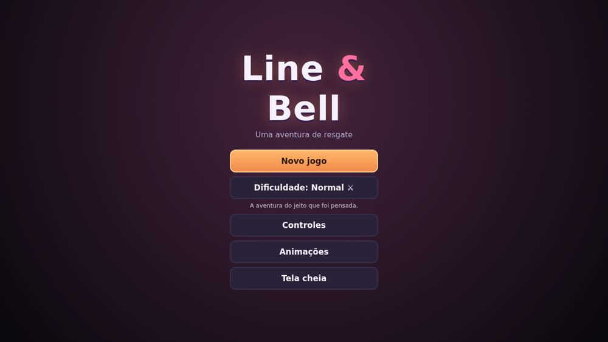
*Tela inicial, com a escolha de dificuldade*

**Jogar:** https://line-e-bell.vercel.app · **Código:** pasta `game/` deste repositório

## Sumário

- [1. Visão geral](#1-visao-geral)
- [2. Personagens](#2-personagens)
- [3. A história](#3-a-historia)
- [4. Roteiro completo, cena a cena](#4-roteiro-completo-cena-a-cena)
- [5. O primeiro encontro (prólogo)](#5-o-primeiro-encontro-prologo)
- [6. As fases](#6-as-fases)
- [7. Exploração: mundo interligado, vilarejo, loja, carrinho, itens, documentos e mapa](#7-exploracao-mundo-interligado-vilarejo-loja-carrinho-itens-documentos-e-mapa)
  - [7.1 Como as fases se ligam](#71-como-as-fases-se-ligam)
  - [7.2 Moedas](#72-moedas)
  - [7.3 Loja e ferraria](#73-loja-da-dona-rosa-e-ferraria-do-seu-bento)
  - [7.4 Moradores](#74-moradores-do-vilarejo)
  - [7.5 Mochila e itens](#75-mochila-e-itens-um-item-uma-funcao)
  - [7.6 Documentos e conclusões](#76-documentos-de-investigacao-e-conclusoes)
  - [7.7 Carrinho de mina](#77-carrinho-de-mina)
  - [7.8 Bombas, gancho, brasa e escuro](#78-bombas-gancho-chao-em-brasa-e-galerias-escuras)
  - [7.9 Mapa](#79-mapa-so-acende-onde-a-line-passou)
  - [7.10 Todos os baús](#710-todos-os-baus)
  - [7.11 Tochas e cristais](#711-tochas-e-cristais-como-achar)
  - [7.12 Arte necessária](#712-arte-necessaria-para-a-exploracao)
- [8. Como se joga](#8-como-se-joga)
- [9. Inimigos e chefes](#9-inimigos-e-chefes)
- [10. Lista completa de animações](#10-lista-completa-de-animacoes)
- [11. Retratos dos diálogos](#11-retratos-dos-dialogos)
- [12. Cenário e objetos](#12-cenario-e-objetos)
- [13. Efeitos visuais](#13-efeitos-visuais)
- [14. Como mandar arte nova](#14-como-mandar-arte-nova)
- [15. Estrutura técnica](#15-estrutura-tecnica)
- [16. Parte 2 — O Coração dos Elementos](#16-parte-2--o-coracao-dos-elementos)
- [17. As fases da Parte 2](#17-as-fases-da-parte-2)
- [18. Relógio: dia e noite](#18-relogio-dia-e-noite)
- [19. Bell jogável e as armaduras das duas](#19-bell-jogavel-e-as-armaduras-das-duas)
- [20. Chefes elementais](#20-chefes-elementais)
- [21. Dicas do modo Fácil](#21-dicas-do-modo-facil)
- [22. Arte necessária — lista completa](#22-arte-necessaria--lista-completa)
- [23. O que falta criar](#23-o-que-falta-criar)
- [24. Índice dos itens de arte recebidos](#24-indice-dos-itens-de-arte-recebidos)
- [25. Plano de criação das animações por item](#25-plano-de-criacao-das-animacoes-por-item)
- [26. Como rodar, publicar e editar o jogo](#26-como-rodar-publicar-e-editar-o-jogo)

## 1. Visão geral

**Line & Bell** é uma aventura de ação vista de cima, para navegador (PC e celular). Tudo começa com um prólogo jogável, **O primeiro encontro**, que conta como as duas se conheceram em 09/05/2024. Depois, a Line e a Bell já são namoradas e vivem numa fazendinha com o cachorro Theo. Um dragão leva a Bell, e a Line atravessa um vilarejo, uma floresta, uma gruta com minas abandonadas, ruínas mágicas e uma montanha de lava para resgatá-la. No caminho ela junta documentos de investigação, tira conclusões, compra armaduras, conserta um carrinho de mina e usa os itens da mochila para abrir caminhos novos.

| | |
|---|---|
| Gênero | Aventura / ação com exploração, visão de cima |
| Plataformas | Navegador no PC (teclado ou controle) e no celular (toque) |
| Duração | Parte 1: cerca de 1h30 a 2h explorando tudo (o prólogo leva uns 3 minutos). Parte 2: mais 2h a 2h30 |
| Prólogo | *O primeiro encontro* (09/05/2024): Minas Shopping, Playground e Túnel |
| Áreas | 3 do prólogo, 7 da Parte 1 (Fazendinha, Vilarejo do Riacho, Floresta Sussurrante, Gruta dos Ecos e Minas de Cristal, Ruínas Encantadas, Montanha de Brasa e Covil do Dragão) e 7 da Parte 2 (Vale das Raízes, Fenda de Magma, Lago Espelhado, Pântano Sombrio, Picos do Vento, Olho da Tempestade e Coração dos Elementos), todas interligadas |
| Chefes | Parte 1: Guardião de Pedra e o Dragão Vermelho. Parte 2: Colosso de Raízes, Serpente das Marés, Grifo da Tempestade, Titã de Magma, Hidra de Lama, Tempestade Viva e Quimera Primordial |
| Heroínas | Line (Parte 1) e Line + Bell, trocando a qualquer momento (Parte 2) |
| Relógio | Dia e noite: 1 minuto real = 1 hora no jogo |
| Exploração | 35 baús, 3 portas trancadas, paredes rachadas, postes do gancho, chão em brasa, galerias escuras, carrinho de mina entre 3 estações |
| Investigação | 15 documentos (com tipo, autor e data) e 9 conclusões |
| Vilarejo | 5 moradores, loja de itens e ferraria com 3 armaduras da Line e 3 da Bell; moedas caem dos inimigos e saem dos baús |
| Mochila | 13 itens, cada um com uma função, item no atalho (F), caderno de documentos e mapa que só acende onde a Line passou |
| Dificuldade | Fácil, Normal ou Difícil (menu inicial e pausa) |
| Salvamento | Automático, no navegador, ao entrar em cada área e nas fontes |
| Animações catalogadas | **554**: 261 com arte (temporária), 172 usando uma substituta, 121 desenhadas no código ou sem imagem |

## 2. Personagens

### Line
Protagonista. É fazendeira, corajosa e brincalhona, de boné preto, cabelo longo e roupa preta. Aprende a lutar com espada e, nas ruínas, a usar magia de luz. Nos diálogos tem 8 expressões.

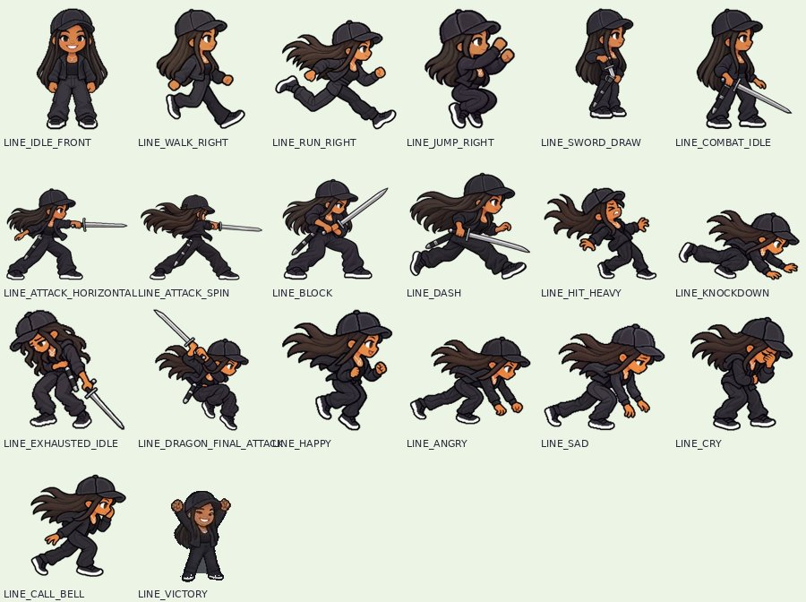
*Line: algumas das animações atuais (temporárias)*

### Bell
Namorada da Line: doce, risonha e mandona na medida certa. Usa óculos, blusa creme e short jeans. É levada pelo dragão no pôr do sol e fica presa numa jaula no covil, mas não fica parada: deixa a fita cair de propósito para a Line achar, conversa com o dragão, descobre que ele está com frio e canta para acalmá-lo. É ela quem entende o dragão primeiro.

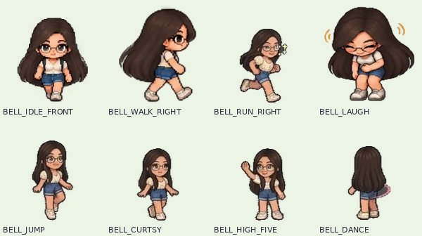
*Bell: animações atuais (temporárias)*

### Line e Bell juntas
As animações do casal aparecem nas cenas: mãos dadas, almoço, bitoquinha, dança, abraço do resgate e toca aqui.

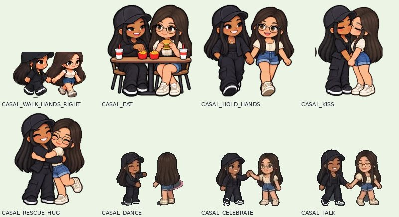
*Animações do casal (temporárias)*

### Theo
O shih-tzu da família. Late, pede comida, segue a Line pela fazenda depois de comer e fica esperando em casa durante a aventura.

#### ⭐ Theo: layout oficial para a arte final

> 💛 **Este é o Theo aprovado.** A arte que está no jogo hoje é **o layout oficial** para criar a arte final do Theo. A versão final deve **só melhorar** esta arte, **sem perder os traços**. Não é para redesenhar o personagem.

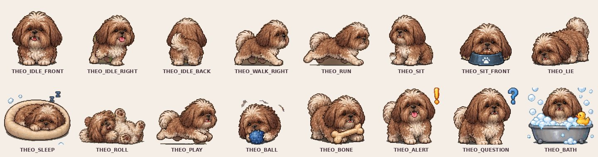
*O Theo como está no jogo hoje: o layout oficial*

**O que precisa continuar igual (os traços do Theo):**
- **Raça e formato:** shih-tzu fofinho, corpo baixo e redondo, pernas curtas e cabeça grande em relação ao corpo, no estilo chibi do jogo.
- **Pelagem:** marrom-caramelo, com mechas mais escuras nas orelhas e nas costas. O peito, as patas, a barba e o rabo são creme.
- **Cabeça:** topete arrepiado, orelhas longas e peludas caindo dos lados, franja por cima dos olhos.
- **Rosto:** olhos pretos, grandes e brilhantes, focinho curto com nariz preto e boquinha aberta com a língua rosa aparecendo.
- **Rabo:** enrolado para cima, bem peludo e claro.
- **Estilo:** pixel art detalhada, com contorno escuro e textura de pelo desenhada fio a fio.
- **Acessórios e cenas:** a caminha bege, a tigela azul com patinha, a bolinha azul, o osso, a banheira com o patinho, os corações e os sinais de ! e ?.

**O que pode melhorar:**
- Deixar todos os quadros no **mesmo tamanho**, com as patas sempre na mesma linha do chão.
- **Fundo transparente de verdade**, sem a sombra marrom da prancha e sem sombra no chão (o jogo desenha a sombra).
- Deixar o contorno mais limpo e as animações mais suaves, com mais quadros em andar, correr e brincar.
- Manter as 4 direções coerentes: frente, costas e lado direito. O lado esquerdo o jogo espelha.

A prancha original fica em `arte/referencias/theo_shihtzu.png`; a arte do Theo no jogo vem dos itens 126 a 130.

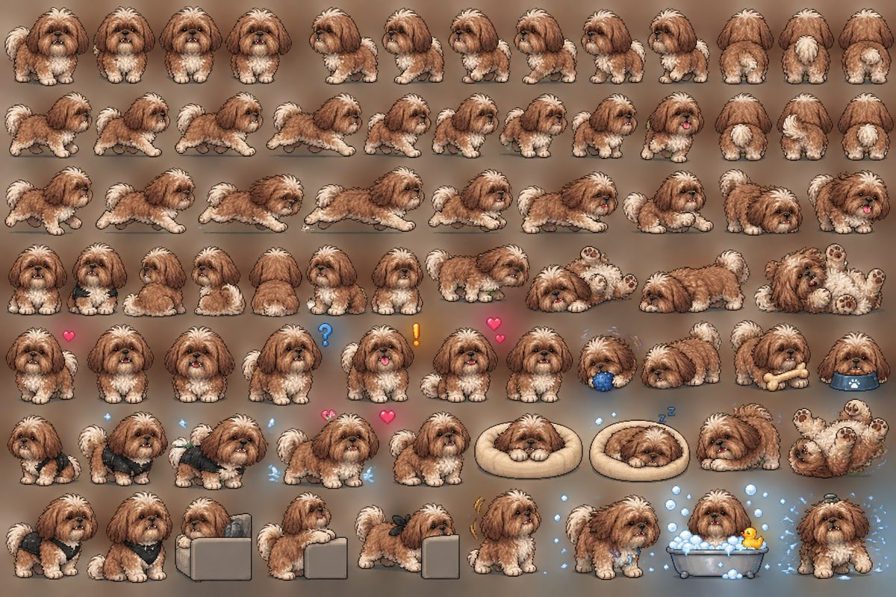
*Prancha original do Theo (layout oficial, referência para a arte final)*

### Bichos da fazenda
Galinhas (brancas e marrons), pintinhos, vacas, cavalo e porcos já têm arte. Ovelhas, patos e o gato ainda são desenhados no código.

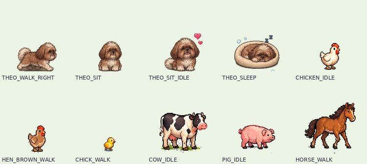
*Theo e bichos da fazenda (temporários)*

### Mago
Velho sábio da Floresta Sussurrante. Guarda a espada e explica o caminho. Tem arte animada: parado, falando quando a Line chega perto e fazendo magia antes de entregar a espada.

### Espírito das Ruínas
Voz antiga que mora no altar das Ruínas Encantadas e ensina a magia à Line. Ainda não tem visual próprio, só a luz do altar.

### Guardião de Pedra
Chefe das ruínas: um golem de pedra com um cristal azul no peito. Desenhado no código por enquanto.

### Dragão Vermelho
Dorme cem anos no topo da Montanha de Brasa, e enquanto dorme o fogo dele esfria. É o frio que o acorda. Ele acredita que o calor de um coração brilhante pode ser tomado, e por isso leva alguém a cada século. Fala pouco, em frases partidas (“Cem anos… dormindo. O fogo… esfria.”). Não é mau: está com frio. No fim, a Line divide a luz com ele e ele volta a dormir em paz, sem levar ninguém.

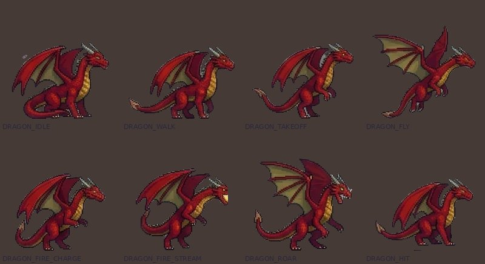
*Dragão vermelho (temporário)*

### Moradores do vilarejo e o caçador Tobias
Dona Rosa (mercadora), Seu Bento (ferreiro, aprendiz do Mestre Aurélio), Seu Zé (o mais velho, empurrava o carrinho de mina cinquenta anos atrás), Dona Lurdes (mulher do caçador) e o Pedrinho. O **Tobias**, caçador, foi atrás do dragão, torceu o pé e está na montanha, perto da fonte das brasas: foi ele quem ouviu a Bell cantando lá em cima. Hoje todos são desenhados no código (seção 7.12).

### Personagens citados nos documentos
- **Mestre Ivo:** o capataz que fechou as Minas de Cristal há cinquenta anos e levou a alavanca do carrinho para a forja.
- **Mestre Aurélio:** o ferreiro da Forja Antiga, mestre do Seu Bento, autor da receita da Armadura de Brasa.

### Criaturas
- **Sombras:** criaturas escuras que surgem depois que a Line pega a espada. Investem contra ela e são fracas contra a luz.
- **Fogos-fátuos:** luzinhas que flutuam, mantêm distância e atiram orbes. São azuis nas ruínas e de fogo na montanha.

## 3. A história

> **O fio da história:** *luz não se rouba, se divide.* O dragão acha que pode tomar a luz de um coração para se aquecer. Todo mundo que a Line encontra diz a mesma coisa de um jeito diferente: o Mago (“Luz não se rouba, menina. Se divide.”), o Espírito das Ruínas (“A luz que se divide nunca acaba. A que se prende, apaga.”), o Guardião (“O dragão também já foi luz, um dia.”) e a Bell, que canta para o dragão na jaula. No fim, a Line entende e faz isso.

**Prólogo — O primeiro encontro (09/05/2024).** No Minas Shopping, a Line vê a Bell de longe e fica encantada. Elas conversam, a Bell diz que a Line está atrasada e as duas comem BK. A Line confessa que está tímida porque a Bell é muito linda. De mãos dadas, vão ao playground, onde a Line tenta a máquina de soco, faz só 038 pontos e a Bell morre de rir. No túnel, dão o primeiro beijo. O tempo passa, e o sonho das duas vira uma fazendinha.

**Capítulo 1 — Nossa vidinha.** Amanhece na fazenda. A Bell acorda a Line e conta um sonho estranho: um dragão enorme, vermelho, **tremendo de frio**. A Line brinca que é fome de café. As duas cuidam da fazenda (ovos, horta, ração do Theo, carinho nos bichinhos), almoçam juntas e vão de mãos dadas ver o pôr do sol no lago. A Bell pede: “Promete que amanhã a gente volta?”. A Line promete: “Amanhã, depois de amanhã… todo dia que você quiser.” Elas dançam e dão uma bitoquinha.

**O rapto.** O céu escurece e um dragão vermelho mergulha do céu. A Bell reconhece: “É ele… o dragão do meu sonho.” Ele a leva. A Line corre, grita, chora, e decide ir buscá-la. Pede ao Theo que cuide da fazenda.

**Capítulo 2 — Atrás da Bell.** Na Floresta Sussurrante, o Mago conta a lenda: o dragão dorme cem anos, o fogo dele esfria, e ele acorda procurando o calor de um coração brilhante. A Line lembra do sonho da Bell. O Mago entrega a espada e aponta os caminhos: as ruínas ao norte, a gruta a leste, o Vilarejo do Riacho ao sul. *Enquanto isso*, no covil, a Bell acorda numa jaula; o dragão murmura de frio no sono, e ela se agarra a uma certeza: deixou a fita cair de propósito, e a Line sempre acha o que ela perde.

**O vilarejo e as minas.** No Vilarejo do Riacho, os moradores ajudam como podem: a Dona Rosa com poções e bombas, o Seu Bento com armaduras. O Seu Zé conta que, cinquenta anos atrás, a montanha começou a esquentar e a respirar de noite, e o capataz fechou as minas e levou a alavanca do carrinho para a Forja Antiga. A Dona Lurdes está aflita: o marido, o caçador Tobias, viu o dragão passar e não voltou. Na porta da cabana dele, a Line acha o bilhete: ele subiu a montanha atrás do dragão. Na Gruta dos Ecos, a Line chama pela Bell e só o eco responde. Mais a fundo ficam as Minas de Cristal, escuras e cheias de morcegos.

**Capítulo 3 — A luz das ruínas.** Nas Ruínas Encantadas, o Espírito das Ruínas passa a luz para a espada da Line e ensina: “A luz que se divide nunca acaba. A que se prende, apaga.” *Enquanto isso*, a Bell vê um clarão azul lá longe, nas ruínas, e sabe que é a Line. Ela pergunta ao dragão por que ele a levou, e ele responde em pedaços: cem anos dormindo, o fogo esfria, coração brilhante aquece. A Bell entende: ele não quer machucá-la, ele está com frio. A Line acende cristais, desfaz barreiras e vence o Guardião de Pedra, que entrega a Chuva de Estrelas e deixa uma última frase: “O dragão também já foi luz, um dia.” *Enquanto isso*, o dragão ruge de frio e a Bell canta para ele a cantiga da avó: “Dorme, fogo pequenino, que a noite vai passar… quem tem alguém do lado não precisa se apagar.” O dragão se aquece um pouco.

**Capítulo 4 — A Montanha de Brasa.** Perto da fonte das brasas, a Line encontra o Tobias com o pé torcido. Ele viu o dragão pousar e ouviu uma voz de moça cantando a noite inteira; quando ela canta, o dragão para de rugir. “É a Bell. Ela canta quando tá com medo, pra ficar corajosa.” Na Forja Antiga, a Line acha a receita do Mestre Aurélio e a alavanca do carrinho; na caverna escondida, uma escama **fria**. Ela acende as três tochas e o portão de fogo se abre. *Enquanto isso*, o dragão sente alguém subindo com uma espada de luz. “Ela vai levar a minha luz.” A Bell responde: “Ela vai me levar pra casa. E se você deixar, ela divide um pouquinho com você.”

**Capítulo final — O coração do dragão.** No covil, a Bell grita que a Line veio. O dragão pousa: “Veio… pela minha luz.” A Line responde que a Bell não é luz de ninguém: é a namorada dela. A Bell avisa que ele não é mau, só está com frio, e mostra o ponto fraco. A Line vence e dá o golpe final. As duas se abraçam. Então a Bell pede: “Olha pra ele.” O dragão treme de frio no chão. A Line entende o que todos disseram: **luz não se rouba, se divide.** Ela chama as estrelas sobre ele, e o fogo do peito volta a acender. “Quente… Faz cem anos que não fica quente. Obrigado, pequena luz. Agora eu durmo em paz. Sem levar ninguém.” A Bell dá boa noite a ele.

**Epílogo.** De volta à fazenda, no pôr do sol do lago, com o Theo latindo de alegria. A Bell repete a pergunta do começo: “Promete que amanhã a gente volta aqui?” A Line promete de novo, e dessa vez é a Bell quem completa: “…todo dia que a gente quiser.” Elas dançam. Aparece “Fim”… e, no escuro, um olho de dragão se abre: “Fim?”.

**A investigação.** Ao longo da aventura, a Line junta 12 documentos (marcas de garra, cartaz do vilarejo, carta do Mago, bilhete do Tobias, a lenda, o mapa rasgado, o relatório do capataz, as páginas do diário do Guardião, a receita do Mestre Aurélio, a escama fria e a fita da Bell) e tira 8 conclusões. Várias delas apontam para o mesmo segredo: o dragão está com frio.

## 4. Roteiro completo, cena a cena

Todas as falas estão exatamente como aparecem no jogo. Entre parênteses está a expressão do retrato. As linhas com ▶ indicam a animação que toca naquele momento: o código é o mesmo da lista da seção 10.

### 4.1 Prólogo 1: o Minas Shopping

Começa ao escolher **Novo jogo**, antes de tudo. A Line entra no shopping de costas para a câmera e vê a Bell esperando perto das mesas. Depois a Line anda livremente até a Bell.

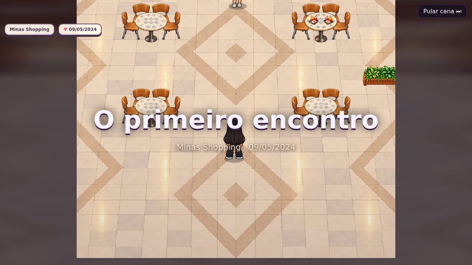
*Prólogo 1: o Minas Shopping*

> ▶ `LINE_IDLE`  
> 🎬 **Título na tela:** O primeiro encontro — Minas Shopping · …  
> ▶ `LINE_ADMIRE`  
> **Line** *(apaixonada)*: puxa ela é tão linda  
> ▶ `LINE_IDLE`  
> 💡 *Dica na tela:* Aproxime-se da Bell e pressione E para falar com ela.  

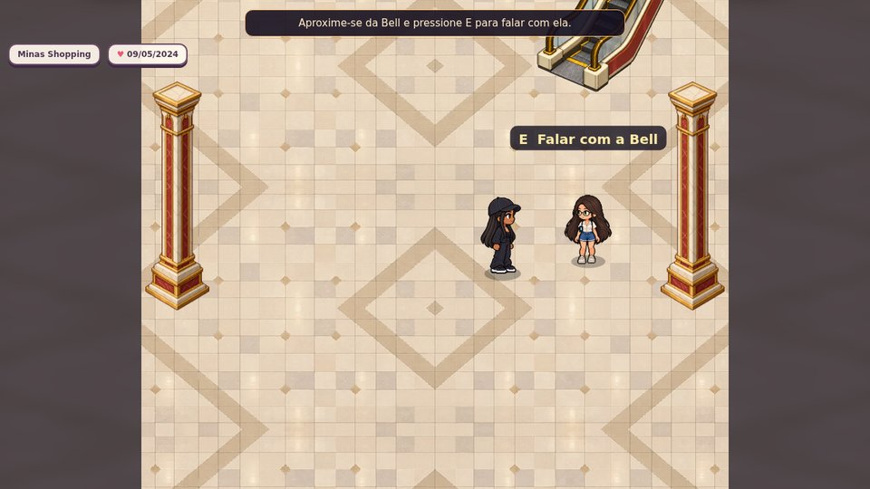
*Explorando o shopping: o botão Falar com a Bell aparece perto dela*

### 4.2 Prólogo 2: a conversa e o BK

Ao chegar perto da Bell e apertar **Falar com a Bell**. A câmera se aproxima (zoom) e cada fala usa uma animação das duas juntas. Depois elas andam até a mesa e comem BK.

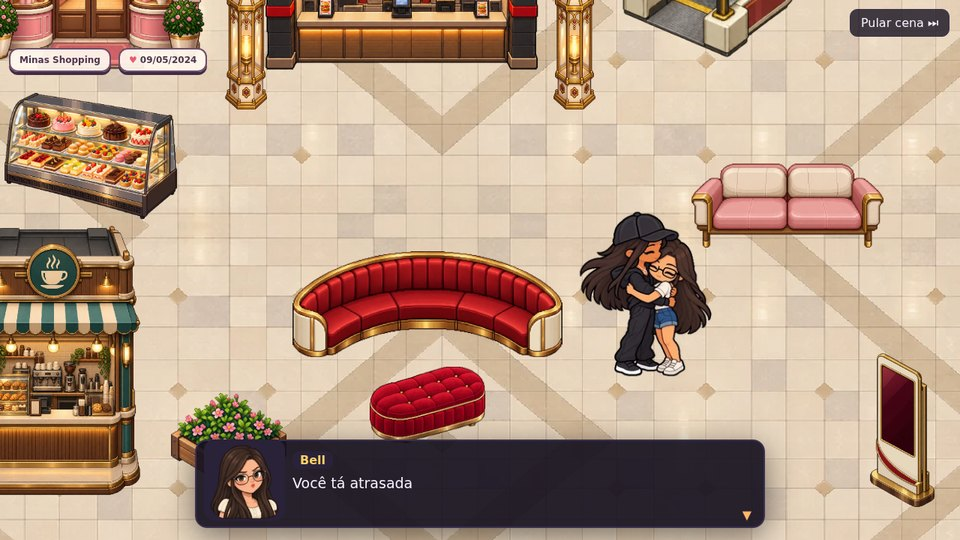
*Prólogo 2: a conversa e o BK*

> ▶ `LINE_BELL_MEET`  
> **Line** *(sorrindo)*: esse shopping é muito grande  
> ▶ `LINE_BELL_GREET_HUG`  
> **Bell** *(marota)*: Você tá atrasada  
> ▶ `LINE_BELL_MEET`  
> **Line** *(sorrindo)*: oq vamos comer?  
> **Bell** *(sorrindo)*: BK.  
> ▶ `LINE_BELL_BK`  
> **Bell** *(neutro)*: você parece estar tímida  
> **Line** *(apaixonada)*: é que você é muito linda  
> **Bell** *(apaixonada)*: *(sem fala, só o retrato)*  
> ▶ `LINE_BELL_MEET`  
> **Narradora**: As duas sorriem. Bell segura a mão da Line e elas saem juntas do shopping.  
> ▶ `LINE_BELL_WALK_HANDS`  

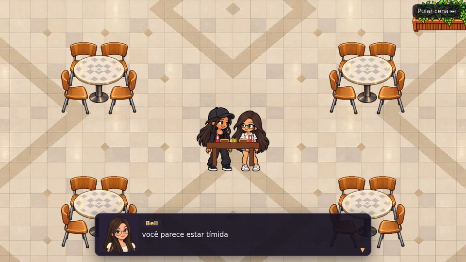
*BK no shopping: “você parece estar tímida”*

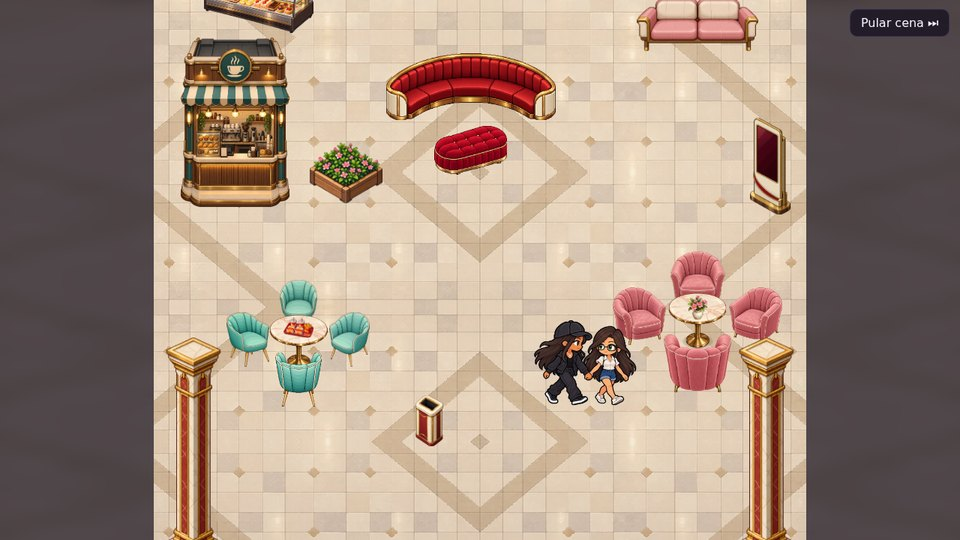
*Saindo do shopping de mãos dadas*

### 4.3 Prólogo 3: o Playground

As duas chegam de mãos dadas. A Line vai até a máquina de soco e a Bell fica olhando.

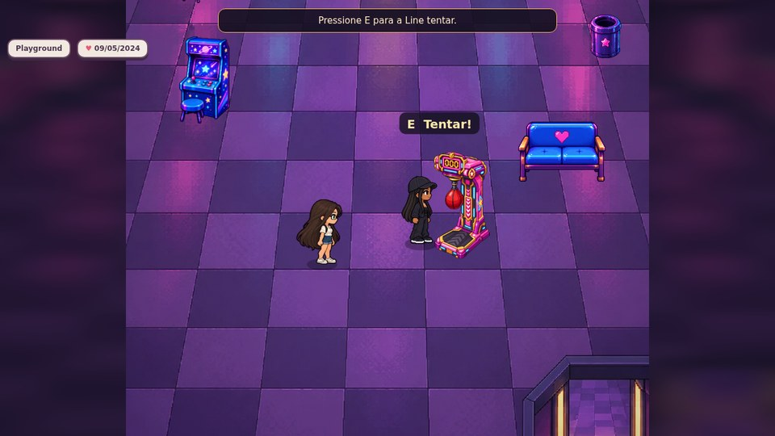
*Prólogo 3: o Playground*

> 💡 *Dica na tela:* Pressione E para a Line tentar.  

### 4.4 Prólogo 4: a máquina de soco

Ao apertar **Tentar!**. O placar vai de 000 para 038, a tela treme e a Bell gargalha.

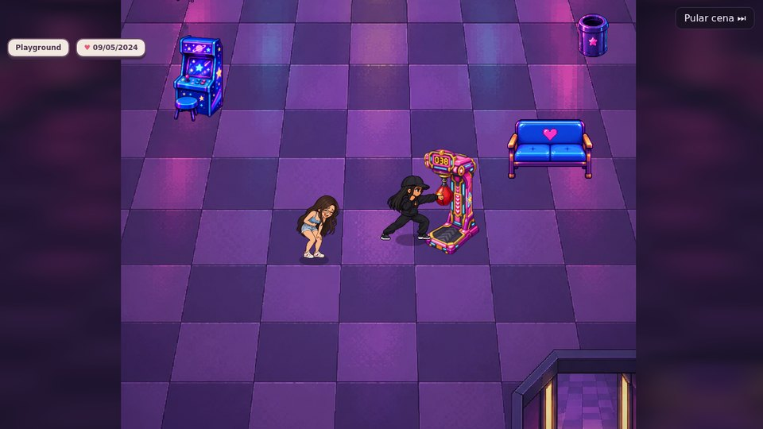
*Prólogo 4: a máquina de soco*

> ▶ `LINE_PUNCH_MACHINE`  
> ▶ `BELL_LAUGH_AT_LINE`  
> ▶ `LINE_IDLE`  
> **Bell** *(marota)*: HAHAHAHA! Você viu isso?  
> **Line** *(sorrindo)*: Eu não consegui bater direito… aquela coisa estava estragada.  
> ▶ `BELL_IDLE`  
> **Narradora**: Elas saem do playground com a barriga doendo de tanto rir.  

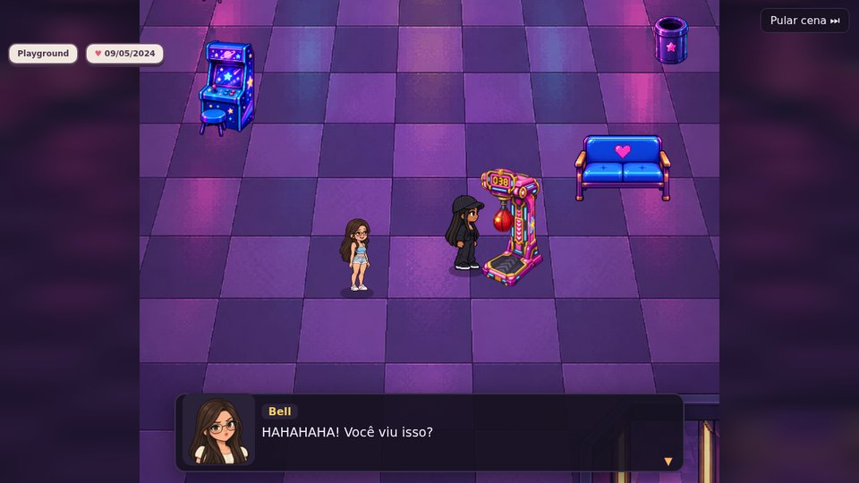
*A Bell gargalhando do soco da Line*

### 4.5 Prólogo 5: o túnel e a transição para a fazenda

As duas atravessam o túnel iluminado e se beijam. A tela escurece, a narração conta que o tempo passou e o jogo segue direto para a manhã na fazenda.

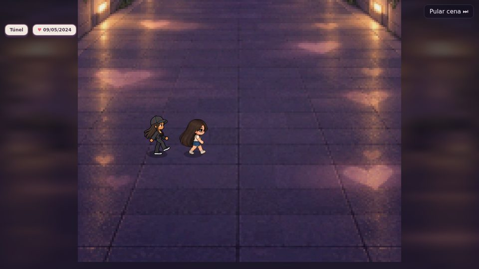
*Prólogo 5: o túnel e a transição para a fazenda*

> ▶ `LINE_BELL_TUNNEL_KISS`  
> **Bell & Line**: ♥  
> **Narradora**: E foi assim, entre um BK, uma máquina de soco “estragada” e um beijo no túnel, que a história delas começou.  
> **Narradora**: O tempo passou... e o sonho das duas virou uma fazendinha, um cachorrinho chamado Theo e muitas manhãs juntas.  

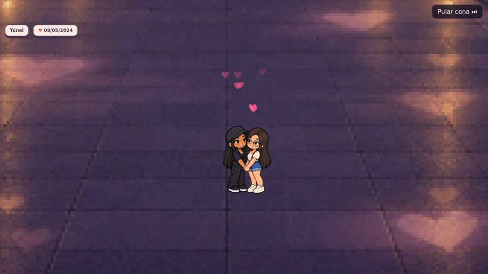
*O primeiro beijo no túnel*

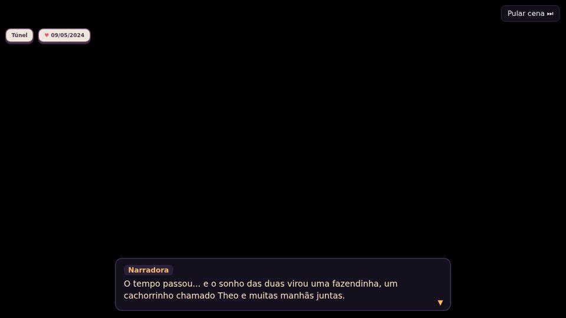
*Transição: “O tempo passou…”*

### 4.6 Manhã na fazenda

Começa logo depois do prólogo. A Line sai de casa e a Bell a espera no quintal.

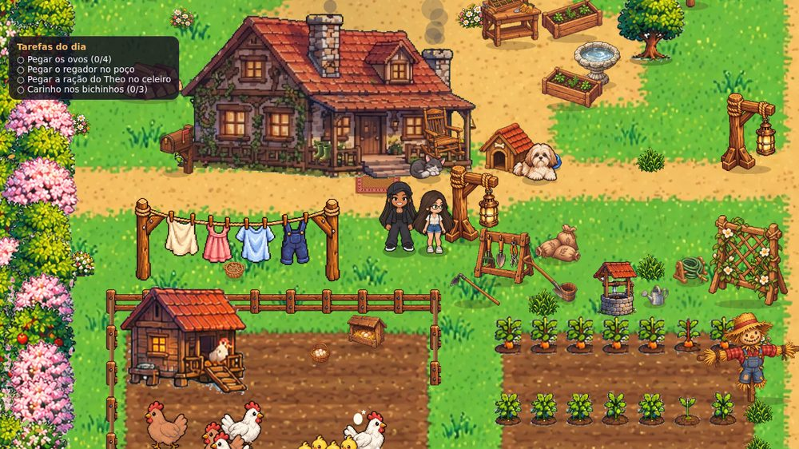
*Manhã na fazenda*

> ▶ `BELL_IDLE`  
> 🎬 **Título na tela:** Line & Bell — Capítulo 1 — Nossa vidinha  
> 💬 *Balão:* “Cocoricóóó!”  
> ▶ `LINE_IDLE`  
> ▶ `BELL_IDLE`  
> **Bell** *(rindo)*: Bom dia, dorminhoca! O galo já cantou três vezes.  
> **Line** *(marota)*: Bom dia, amor... só mais cinco minutinhos?  
> ▶ `BELL_IDLE`  
> **Bell** *(surpresa)*: Sonhei uma coisa tão estranha essa noite... um dragão enorme, vermelho, tremendo de frio.  
> **Line** *(rindo)*: Dragão com frio? Isso é fome de café, amor.  
> ▶ `BELL_LAUGH`  
> **Bell** *(sorrindo)*: Boba! Agora levanta: tem ovo pra pegar, horta pra regar e o Theo tá morrendo de fome.  
> 💬 *Balão:* “Au! Au!”  
> ▶ `LINE_LAUGH`  
> **Line** *(rindo)*: Tá bom, tá bom. Bora, fazendeira.  
> ▶ `BELL_CURTSY`  
> **Bell** *(apaixonada)*: E faz carinho nos bichinhos, que eles ficam com ciúme de mim.  
> ▶ `BELL_IDLE`  

### 4.7 As tarefas do dia

Parte jogável. O painel no canto mostra as tarefas: **pegar 4 ovos** no galinheiro, **pegar o regador** no poço e **regar os 4 canteiros**, **pegar a ração** no celeiro e **pôr na tigela do Theo**, e **fazer carinho em 3 bichinhos**. A Bell segue a Line e comenta cada tarefa com balões.

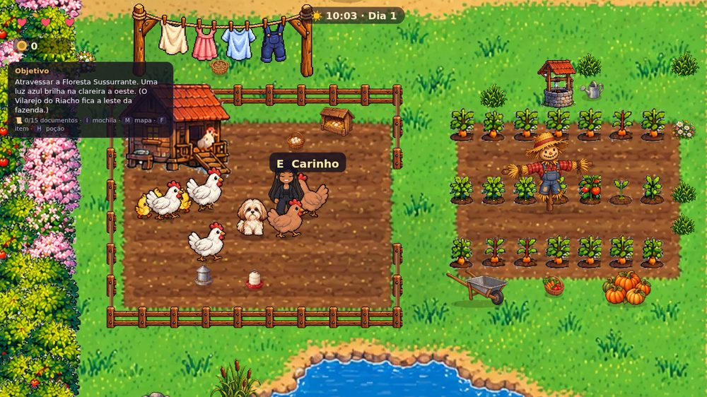
*As tarefas do dia*

### 4.8 Almoço

Quando todas as tarefas terminam, as duas dão um toca aqui e almoçam juntas na mesa do quintal.

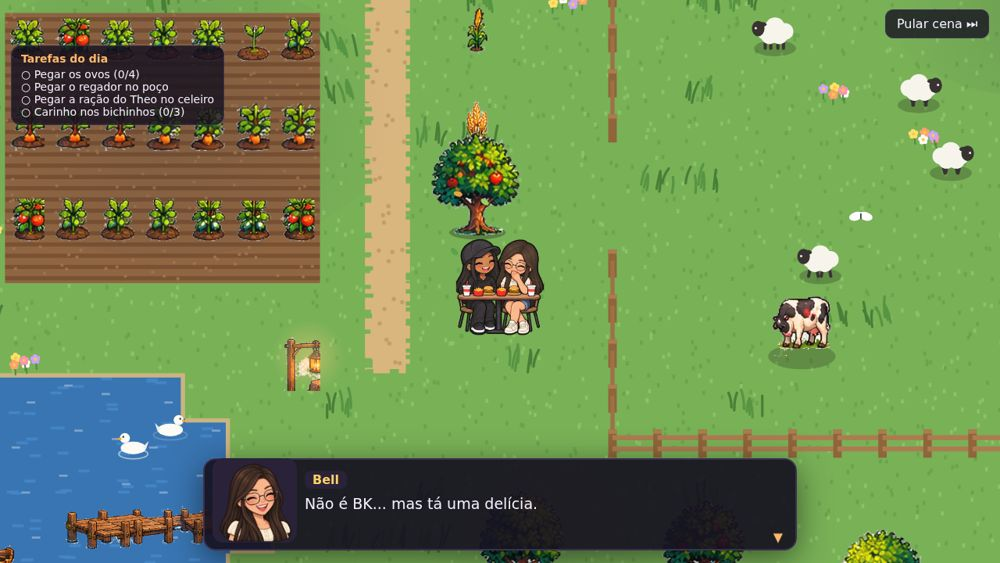
*Almoço*

> ▶ `BELL_LAUGH`  
> ▶ `LINE_BELL_CELEBRATE`  
> **Bell** *(rindo)*: Missão cumprida, fazendeira! Bora almoçar?  
> ▶ `LINE_BELL_EAT`  
> **Bell** *(rindo)*: Não é BK... mas tá uma delícia.  
> **Line** *(apaixonada)*: Tudo fica mais gostoso com você do lado.  
> **Bell** *(envergonhada)*: Para, boba!  
> **Line** *(sorrindo)*: Depois do almoço... bora ver o pôr do sol lá no lago?  
> **Bell** *(apaixonada)*: Só se for de mãos dadas.  

### 4.9 A tarde de mãos dadas

Parte jogável: a Line anda de mãos dadas com a Bell até o lago.

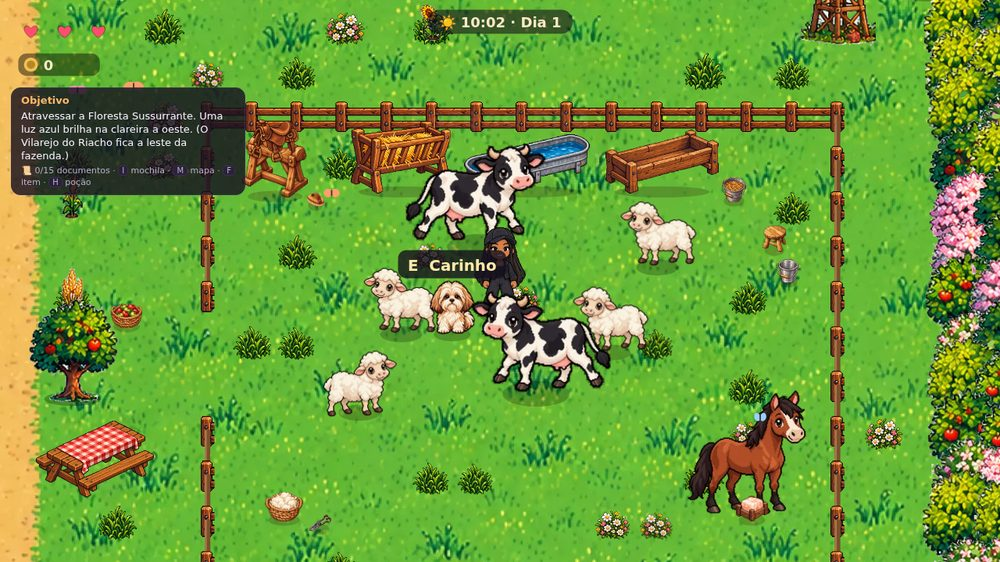
*A tarde de mãos dadas*

### 4.10 Pôr do sol e o rapto

No píer do lago. Esta é a cena mais longa do jogo.

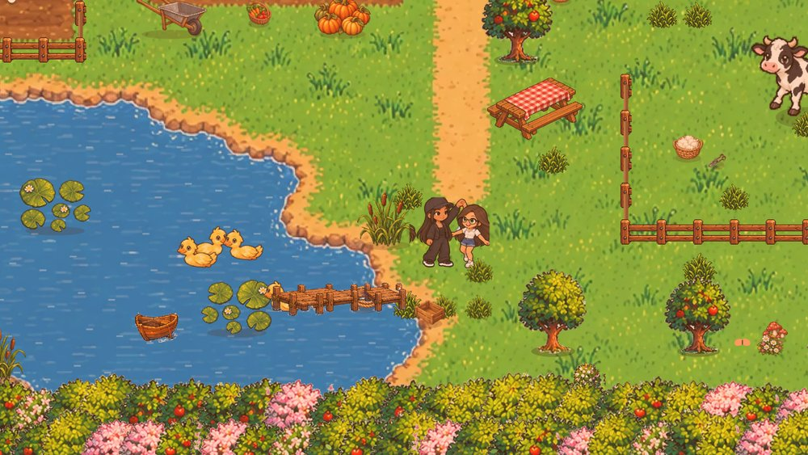
*Pôr do sol e o rapto*

> ▶ `LINE_BELL_HOLD_HANDS`  
> **Bell** *(apaixonada)*: O pôr do sol daqui é o meu favorito. Promete que amanhã a gente volta?  
> **Line** *(apaixonada)*: Prometo. Amanhã, depois de amanhã... todo dia que você quiser.  
> ▶ `LINE_BELL_DANCE`  
> ▶ `LINE_BELL_KISS`  
> ▶ `LINE_BELL_HOLD_HANDS`  
> **Bell** *(rindo)*: Boba...  
> ▶ `LINE_IDLE`  
> ▶ `BELL_SCARED`  
> 💬 *Balão:* “AU! AU! AU!”  
> **Bell** *(surpresa)*: Line... que barulho foi esse?  
> ▶ `DRAGON_FLY`  
> **Bell** *(surpresa)*: É ele... o dragão do meu sonho...  
> ▶ `LINE_SCARED`  
> **Line** *(surpresa)*: BELL! CORRE!  
> ▶ `DRAGON_AIR_ATTACK`  
> ▶ `BELL_CAPTURED`  
> ▶ `BELL_DRAGON_CARRIED`  
> ▶ `DRAGON_TAKEOFF`  
> **Bell** *(surpresa)*: LIIINE!  
> ▶ `DRAGON_FLY`  
> ▶ `LINE_CALL_BELL`  
> **Line** *(surpresa)*: BELL!!!  
> ▶ `LINE_CRY`  
> 💬 *Balão:* “Auuu...”  
> **Line** *(chorando)*: Ele voou pra montanha, do outro lado da floresta...  
> ▶ `LINE_DETERMINED`  
> **Line** *(brava)*: Theo, cuida da fazenda pra mim. Eu vou buscar a Bell.  

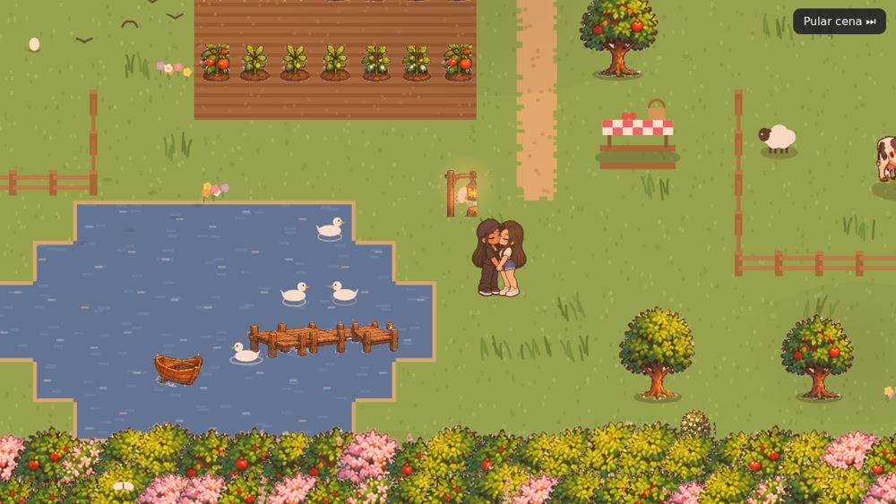
*A bitoquinha no lago*

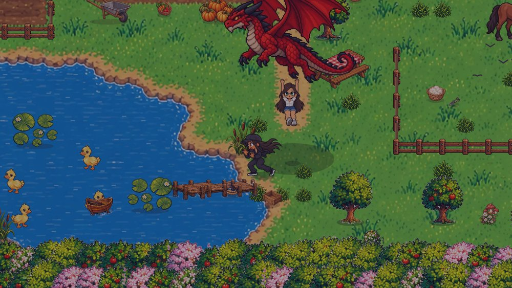
*O dragão leva a Bell*

### 4.11 Chegada na floresta

Primeira vez na Floresta Sussurrante. Começa o Capítulo 2.

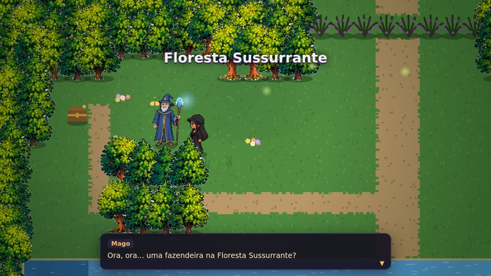
*Chegada na floresta*

> 🎬 **Título na tela:** Capítulo 2 — Atrás da Bell  
> **Line** *(neutro)*: A Floresta Sussurrante... O dragão foi pra montanha, do outro lado.  
> **Line** *(surpresa)*: Tem uma luz azul ali na clareira, a oeste. Será que mora alguém aqui?  

### 4.12 O Mago

Ao conversar com o Mago. A primeira conversa conta a história, a segunda (depois da espada) aponta para as ruínas e as seguintes sorteiam uma dica.

> **Mago**: Ora, ora... uma fazendeira na Floresta Sussurrante?  
> **Line** *(surpresa)*: Um dragão levou a Bell! Eu preciso chegar na montanha.  
> **Mago**: O dragão vermelho acordou, então... Fazia cem anos que ele dormia.  
> **Mago**: Dizem que o fogo dele esfria enquanto dorme. Ele acorda com frio, procurando o calor de um coração brilhante.  
> **Line** *(surpresa)*: A Bell sonhou com isso ontem à noite... um dragão tremendo de frio.  
> **Mago**: Os sonhos das pessoas boas às vezes escutam o que ninguém mais escuta.  
> **Mago**: Naquele baú aqui do lado guardei uma espada que espera por um coração corajoso. Ela é sua.  
> **Mago**: E lembre-se: quando o dragão se cansa, o peito dele brilha. É ali que você deve acertar.  
> **Line** *(sorrindo)*: Obrigada! Eu vou trazer ela de volta.  
> **Mago**: O baú, menina! A espada está no baú.  
> **Mago**: Espere! Tem mais uma coisa. O dragão selou o caminho da montanha com magia antiga.  
> **Mago**: Depois dos espinhos ficam as Ruínas Encantadas. No altar da luz, a sua espada pode aprender a brilhar.  
> **Line** *(surpresa)*: Magia? Eu? Eu só sei plantar cenoura...  
> **Mago**: Quem atravessa uma floresta por amor já tem o que a magia pede. Vá!  
> **Mago**: Ah, e na gruta a leste desta floresta deixei umas coisinhas úteis. Uma bússola, quem sabe... Aperte I para ver a mochila e M para o mapa.  
> **Mago**: Precisando de poções, o Vilarejo do Riacho fica ao sul daqui. A Dona Rosa tem mão aberta e o Seu Bento, mão pesada. Bom ferreiro.  

**Falas sorteadas do Mago** (mudam conforme o progresso):

- “Os espinhos ao norte não resistem a uma boa lâmina.”
- “As barreiras das ruínas só se desfazem com luz. Procure o altar na sala a oeste.”
- “Pule o riacho, corte os espinhos, ache o altar. Simples, não?”
- “Baús trancados? Não. Portas trancadas! Três, pelo mundo. E três chaves antigas escondidas em baús.”
- “O Tobias, caçador, mora na cabana a leste. Se alguém viu o dragão passar, foi ele.”
- “Cada documento que você guarda conta um pedaço da história. Junte dois que combinam e você entende mais do que imagina.”
- “Cristais apagados, barreiras de pé. Acenda todos e o caminho se abre.”
- “O Guardião de Pedra não sente a espada... mas a luz, ah, a luz ele sente.”
- “Sua magia volta sozinha, devagarinho. Não gaste tudo de uma vez!”
- “Três tochas guardam o portão da montanha. Acenda as três.”
- “Segure a magia até brilhar e solte: chuva de estrelas! Eu mesmo não faria melhor.”
- “O peito do dragão, lembre-se: quando ele cansar, o peito brilha.”
- “Luz não se rouba, menina. Se divide. Guarde isso: um dia vai fazer sentido.”
- “Quando ele encher o peito de ar, saia da frente. Fogo de dragão não se segura com espada.”

### 4.13 Espinhos sem espada

Ao chegar perto dos espinhos do norte sem a espada.

> **Line** *(neutro)*: Espinhos demais pra passar... Preciso de algo afiado para abrir caminho.  

### 4.14 A espada

Ao abrir o baú ao lado do Mago. Logo depois vem o primeiro interlúdio, e então aparecem as sombras.

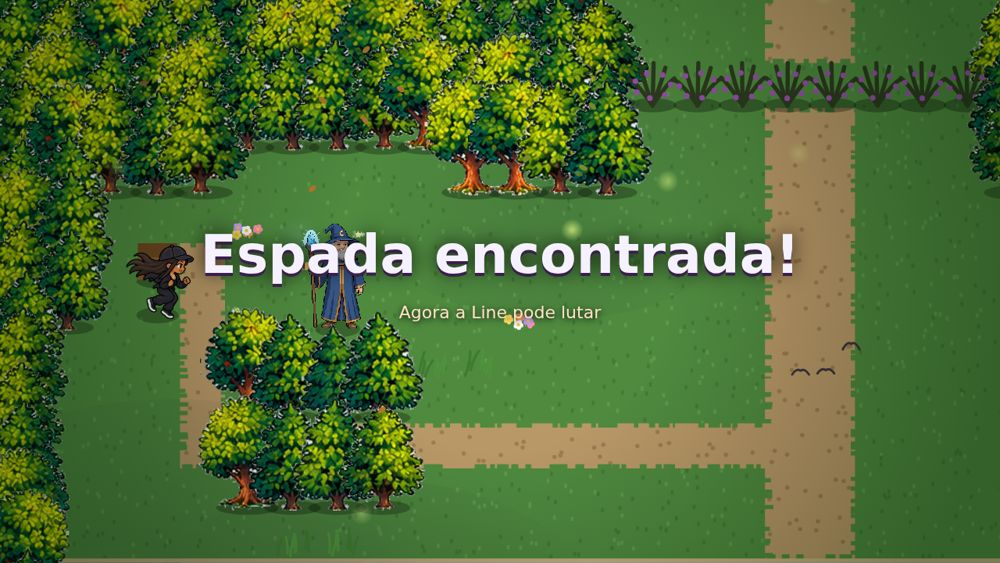
*A espada*

> ▶ `LINE_CROUCH`  
> ▶ `LINE_CROUCH_STAND`  
> ▶ `LINE_SWORD_DRAW`  
> ▶ `LINE_HAPPY`  
> 🎬 **Título na tela:** Espada encontrada! — Agora a Line pode lutar  
> **Line** *(rindo)*: Uma espada! Com isso eu consigo cortar os espinhos no caminho do norte.  
> 🎮 *Tutorial na tela:* J ou Z: atacar (3x = combo) · K ou X: giro · L ou C: esquivar (correndo = dash) · V ou B: defender (segure) · Espaço e depois J: ataque aéreo  
> ▶ `LINE_COMBAT_IDLE`  
> **Line** *(surpresa)*: Sombras?! Só podem ser coisa do dragão... Vem!  

### 4.15 Enquanto isso… (1): a Bell acorda na jaula

Depois da espada. A tela escurece e mostra o covil: o dragão dormindo, a Bell na jaula.

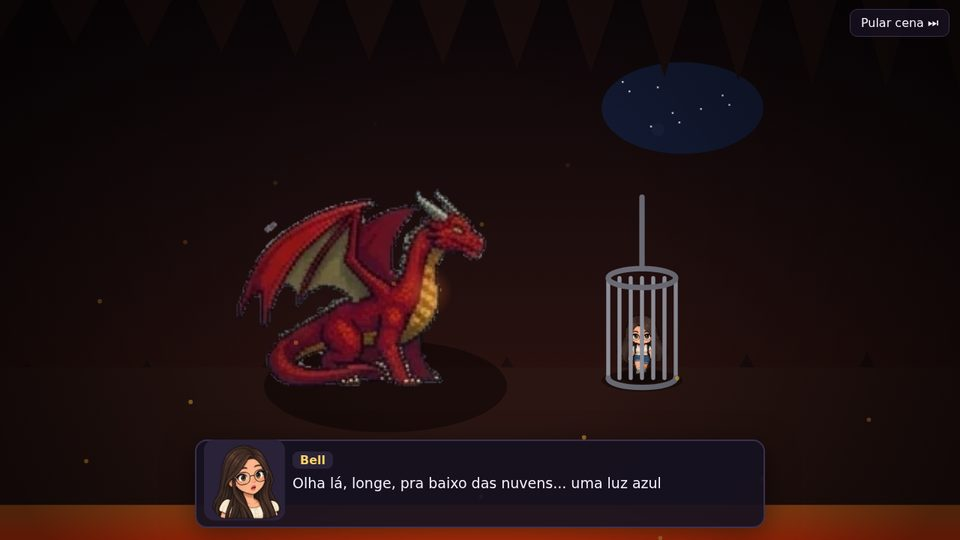
*Enquanto isso… (1): a Bell acorda na jaula*

> 🎬 **Título na tela:** Enquanto isso... — No topo da Montanha de Brasa  
> **Bell** *(surpresa)*: “Ai... minha cabeça. Onde eu tô?”  
> **Bell** *(brava)*: “Uma jaula. Sério, dragão? Uma JAULA?”  
> **Dragão**: “...zzz... frio... tanto frio...”  
> **Bell** *(rindo)*: “Frio? Você é um dragão de FOGO.”  
> **Bell** *(surpresa)*: “...Igualzinho ao do meu sonho. Tremendo.”  
> **Bell** *(neutro)*: “Tudo bem, Bell. Respira. Minha fita caiu lá embaixo, perto do portão. Eu deixei cair de propósito.”  
> **Bell** *(apaixonada)*: “A Line sempre acha as coisas que eu perco. Ela vem.”  

### 4.16 Chegada no Vilarejo do Riacho

Primeira vez no vilarejo. As conversas com os moradores estão na seção 7.4.

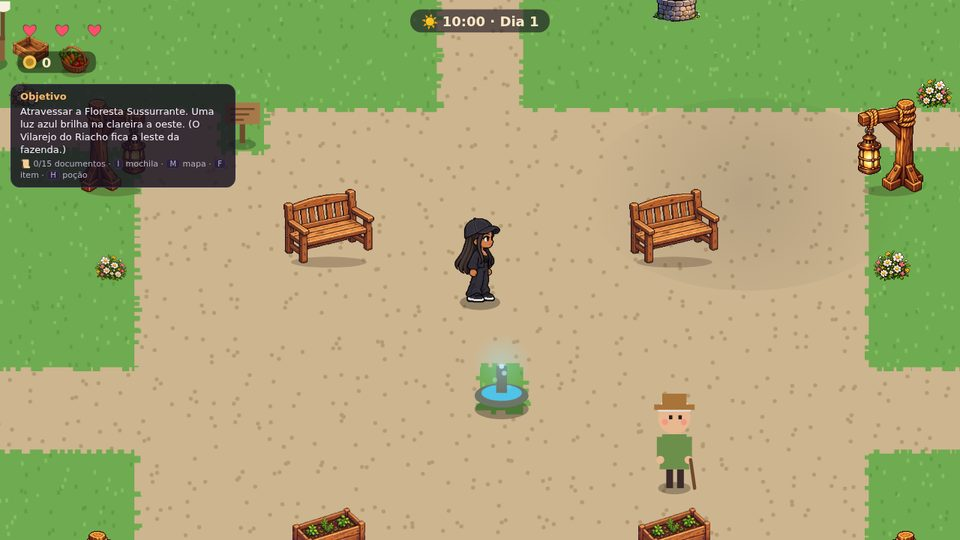
*Chegada no Vilarejo do Riacho*

> **Line** *(sorrindo)*: O Vilarejo do Riacho... A Bell ama a feira daqui. Toda semana ela volta com uma planta nova.  
> **Line** *(neutro)*: Alguém aqui deve ter visto pra onde o dragão foi.  

### 4.17 Chegada na Gruta dos Ecos

Primeira vez na gruta. A primeira fala muda se a Line já leu a carta do Mago.

> **Line** *(neutro)*: A Gruta dos Ecos... a gruta da carta do Mago.  
> **Line** *(neutro)*: Uma gruta... e que friozinho aqui dentro.  
> **Line** *(surpresa)*: Beeell?  
> **Narração** *(sistema)*: ...Bell... ell... ll...  
> **Line** *(marota)*: Só o eco. Óbvio, né, Line.  

### 4.18 Chegada nas Minas de Cristal

Ao passar para a metade leste da gruta. A segunda fala muda se a Line já tem a lanterna.

> **Line** *(surpresa)*: Trilhos... carrinhos velhos... Isso aqui era uma mina.  
> **Line** *(sorrindo)*: Ainda bem que eu trouxe a lanterna.  
> **Line** *(neutro)*: Lá pra dentro tá escuro demais. Uma lanterna ia bem agora.  

### 4.19 Chegada nas Ruínas Encantadas

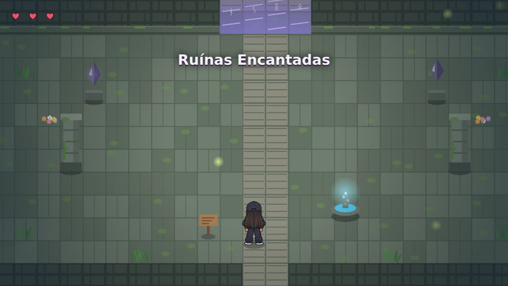
*Chegada nas Ruínas Encantadas*

> 🎬 **Título na tela:** Capítulo 3 — A luz das ruínas  
> **Line** *(surpresa)*: Ruínas... e essas pedras brilhando? Parece que o lugar tá respirando.  
> **Line** *(neutro)*: Paredes de luz fechando o caminho... O mago falou de um altar na sala a oeste.  

### 4.20 O altar da luz

Ao tocar a luz do altar, na sala a oeste do salão de entrada. Termina com o segundo interlúdio.

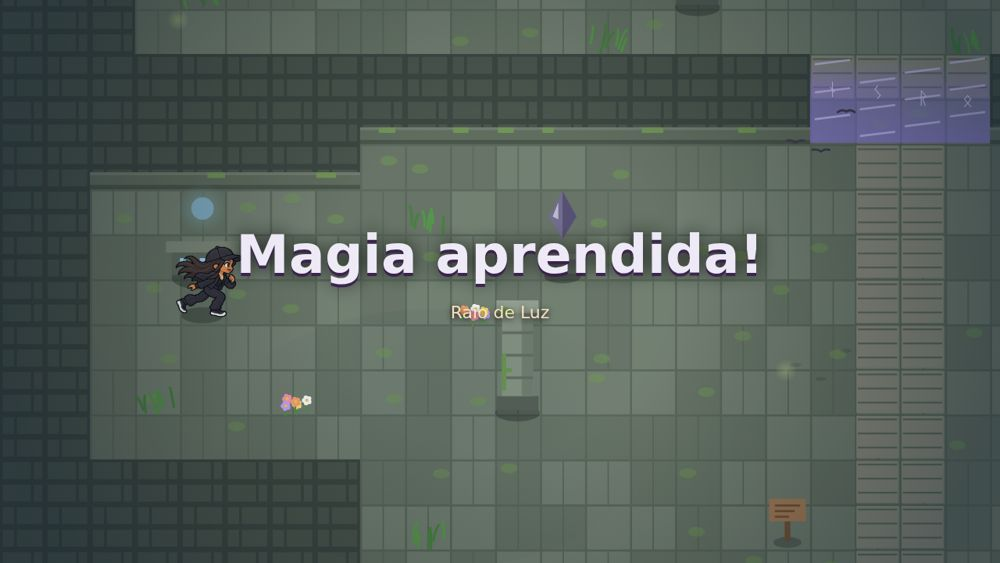
*O altar da luz*

> ▶ `LINE_IDLE`  
> **???**: Coração corajoso... vieste de longe.  
> **Line** *(surpresa)*: Quem tá falando?!  
> **Espírito das Ruínas**: Sou a luz que dorme nesta pedra. Estende a tua espada.  
> ▶ `LINE_SWORD_DRAW`  
> ▶ `LINE_HAPPY`  
> 🎬 **Título na tela:** Magia aprendida! — Raio de Luz  
> **Espírito das Ruínas**: A luz agora corre na tua lâmina. Acende os cristais apagados e as barreiras cairão.  
> **Espírito das Ruínas**: E lembra: a luz que se divide nunca acaba. A que se prende, apaga.  
> 🎮 *Tutorial na tela:* Q ou U: Raio de Luz (mira no inimigo ou cristal mais perto). Gasta 1 ◆ de magia, que volta sozinha. Sombras odeiam a luz!  
> ▶ `LINE_COMBAT_IDLE`  
> **Line** *(marota)*: Ih... as ruínas acordaram junto. Bora, espada brilhante!  

### 4.21 Enquanto isso… (2): o frio do dragão

Depois de aprender a magia.

> 🎬 **Título na tela:** Enquanto isso... — No covil do dragão  
> **Bell** *(surpresa)*: “Olha lá, longe, pra baixo das nuvens... uma luz azul. Nas ruínas.”  
> **Bell** *(apaixonada)*: “Line... é você, né?”  
> **Dragão**: “Pequena... luz. Não... fale.”  
> **Bell** *(brava)*: “Eu falo, sim. Por que você me pegou?”  
> **Dragão**: “Cem anos... dormindo. O fogo... esfria. Por dentro... frio.”  
> **Dragão**: “Coração brilhante... aquece. Sempre... aqueceu.”  
> **Bell** *(surpresa)*: “Então é isso... Você não quer me machucar. Você tá com frio.”  
> **Bell** *(neutro)*: “Mas não é assim que se esquenta alguém, sabia? Prendendo não funciona.”  
> **Dragão**: “...”  

### 4.22 O Guardião desperta

Ao se aproximar do Guardião, no salão norte das ruínas.

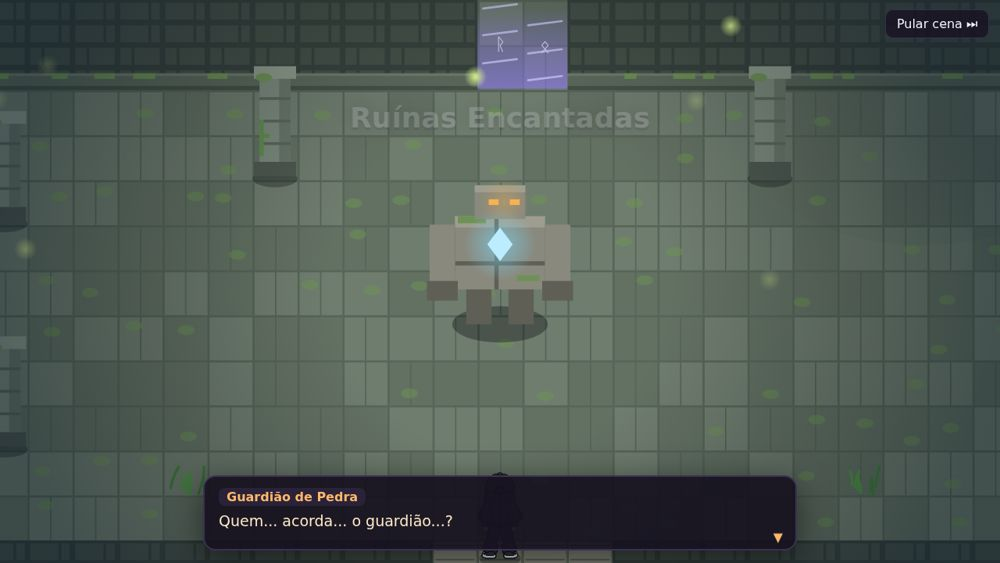
*O Guardião desperta*

> ▶ `LINE_IDLE`  
> **Guardião de Pedra**: Quem... acorda... o guardião...?  
> **Line** *(surpresa)*: Desculpa o barulho! Eu só preciso passar. O dragão levou a Bell!  
> **Guardião de Pedra**: Ninguém... passa. Só a luz... atravessa... a pedra.  
> ▶ `LINE_DETERMINED`  
> **Line** *(brava)*: Então vai ser na luz mesmo.  
> 💡 *Dica na tela:* Acerte o cristal do peito com a magia (Q) para abrir a guarda. Pule a onda do pisão!  

### 4.23 O Guardião vencido

Termina com o terceiro interlúdio.

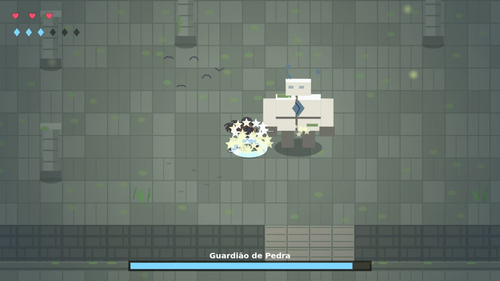
*O Guardião vencido*

> **Guardião de Pedra**: A luz... é tua... Que ela... te guie... até o céu...  
> **Guardião de Pedra**: O dragão... também já foi luz... um dia. Lembra... disso...  
> ▶ `LINE_RELIEVED`  
> 🎬 **Título na tela:** Nova magia! — Chuva de Estrelas  
> 🎮 *Tutorial na tela:* Segure Q (ou U) até a Line brilhar e solte: estrelas explodem em volta, atingindo tudo por perto. Gasta 3 ◆.  
> ▶ `LINE_HAPPY`  
> **Line** *(rindo)*: O caminho pro norte abriu! Espera só, Bell.  

### 4.24 Enquanto isso… (3): a cantiga

Depois de vencer o Guardião.

> 🎬 **Título na tela:** Enquanto isso... — No covil do dragão  
> **Dragão**: “GRRR... frio... FRIO...”  
> **Bell** *(sorrindo)*: “Shh... calma. Quer que eu cante? Minha vó cantava isso quando eu tinha medo do escuro.”  
> **Bell** *(apaixonada)*: “♪ Dorme, fogo pequenino, que a noite vai passar... ♪”  
> **Bell** *(apaixonada)*: “♪ Quem tem alguém do lado não precisa se apagar. ♪”  
> **Dragão**: “...Quente. Um pouco... quente.”  
> **Bell** *(sorrindo)*: “Viu? Luz não se rouba, dragão. Se divide.”  
> **Bell** *(apaixonada)*: “Quando a Line chegar, você vai entender. Ela brilha muito mais que eu.”  

### 4.25 Chegada na Montanha de Brasa

Começa o Capítulo 4. A câmera mostra as três tochas.

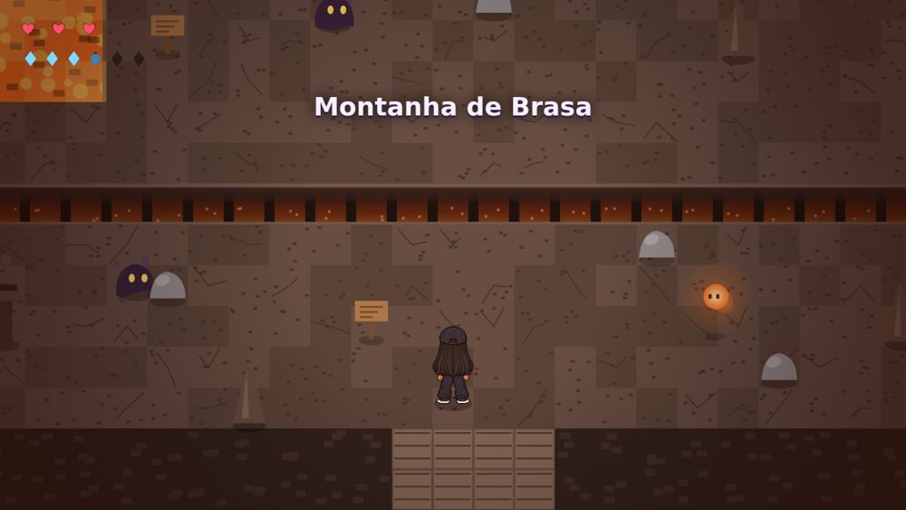
*Chegada na Montanha de Brasa*

> 🎬 **Título na tela:** Capítulo 4 — A Montanha de Brasa  
> **Line** *(neutro)*: A Montanha de Brasa... O covil do dragão fica lá no topo.  
> **Line** *(apaixonada)*: Tô quase aí, Bell. Aguenta só mais um pouquinho.  
> **Line** *(marota)*: Tem um portão de fogo lá em cima... e três tochas apagadas pelo caminho. Aposto que a luz acende.  
> **Line**: neutro  
> 💡 *Dica na tela:* Acenda as três tochas com a magia (Q). As apagadas soltam fumaça e aparecem no mapa (M).  

### 4.26 A Forja Antiga

Ao chegar perto da bigorna da Forja Antiga, na montanha.

> **Line** *(surpresa)*: Uma forja... A bigorna ainda tá morna. Faz tempo que ninguém bate ferro aqui, mas a montanha não deixa esfriar.  
> **Line** *(neutro)*: Será que foi aqui que o Seu Bento aprendeu o ofício?  

### 4.27 O portão se abre

Quando a terceira tocha acende. Termina com o último interlúdio.

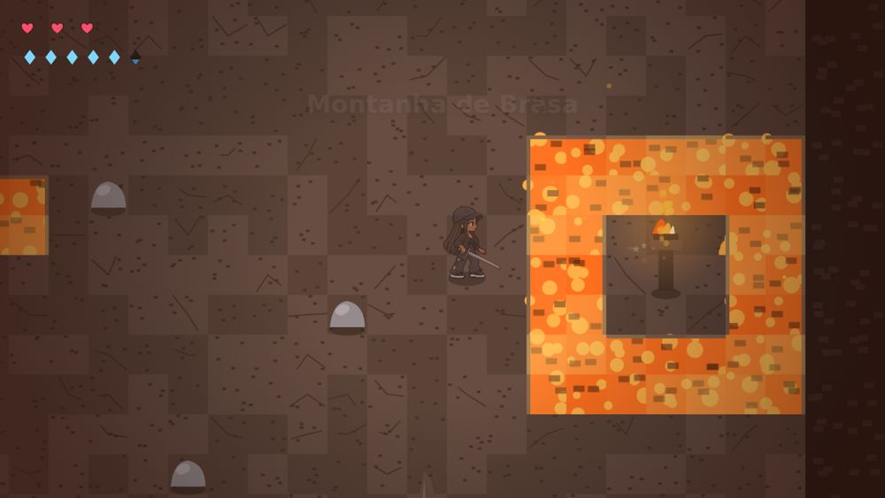
*O portão se abre*

> ▶ `LINE_DETERMINED`  
> **Line** *(brava)*: O portão abriu! Aguenta firme, Bell. Tô chegando.  

### 4.28 Enquanto isso… (4): alguém está subindo

Depois que o portão de fogo abre.

> 🎬 **Título na tela:** Enquanto isso... — No covil do dragão  
> **Dragão**: “O portão... abriu. Alguém... subindo. Espada... de luz.”  
> **Bell** *(rindo)*: “É ela! Eu falei que ela vinha!”  
> **Dragão**: “Ela vai... levar... a minha luz.”  
> **Bell** *(neutro)*: “Ela vai me levar pra casa. E se você deixar... ela divide um pouquinho com você.”  
> **Dragão**: “Ninguém... divide. Todos... correm.”  
> **Bell** *(apaixonada)*: “A Line não corre. Você vai ver.”  

### 4.29 Baú de coração extra

Há três: na sala trancada da gruta, na alcova leste das ruínas e na plataforma cercada de fendas na montanha.

> ▶ `LINE_CROUCH`  
> ▶ `LINE_CROUCH_STAND`  
> ▶ `LINE_HAPPY`  
> 🎬 **Título na tela:** Coração extra! — A vida máxima da Line aumentou  

### 4.30 O covil do dragão

Começa o Capítulo final. Na primeira vez a cena é completa; nas próximas tentativas, a luta começa direto.

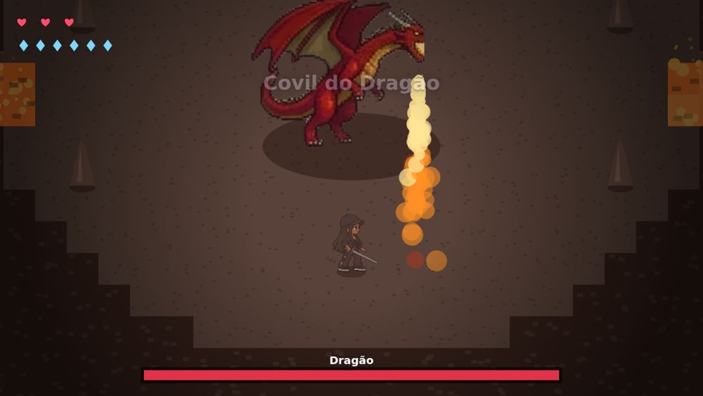
*O covil do dragão*

> ▶ `DRAGON_ROAR`  
> ▶ `LINE_DETERMINED`  
> **Line** *(neutro)*: De novo. Dessa vez eu não caio.  
> 🎬 **Título na tela:** Capítulo final — O coração do dragão  
> ▶ `BELL_CALL_LINE`  
> **Bell** *(surpresa)*: Line?! LINE! Você veio!  
> **Line** *(marota)*: Eu prometi, não prometi?  
> ▶ `BELL_TRAPPED`  
> ▶ `DRAGON_GLIDE`  
> ▶ `DRAGON_LAND`  
> ▶ `DRAGON_ROAR`  
> ▶ `DRAGON_IDLE`  
> ▶ `LINE_SWORD_DRAW`  
> **Dragão**: Espada... de luz. Veio... pela minha luz.  
> ▶ `LINE_ANGRY`  
> **Line** *(brava)*: Ela não é SUA luz. É a minha namorada. Solta ela. AGORA.  
> ▶ `BELL_SCARED`  
> **Bell** *(surpresa)*: Line! Ele tá com frio, ele não é mau... mas não vai me soltar fácil!  
> **Bell** *(surpresa)*: Quando ele cansa, o peito dele brilha. É ali!  
> ▶ `BELL_TRAPPED`  

### 4.31 A luz dividida

Logo depois do abraço do resgate, dentro da cena da vitória. A fala sobre a escama só aparece se a Line achou a escama fria.

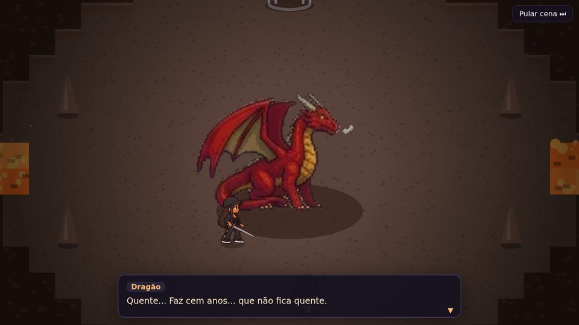
*A luz dividida*

> ▶ `BELL_IDLE`  
> **Bell** *(neutro)*: Line... espera. Olha pra ele.  
> **Dragão**: Frio... tanto... frio...  
> **Line** *(surpresa)*: Ele tá... tremendo?  
> **Bell** *(neutro)*: O fogo dele tá apagando. Por isso ele leva alguém a cada cem anos: acha que dá pra roubar a luz de um coração.  
> **Line** *(surpresa)*: A escama fria... O Guardião disse que ele também já foi luz.  
> **Line** *(surpresa)*: O Guardião disse que ele também já foi luz, um dia...  
> ▶ `LINE_DETERMINED`  
> **Line** *(apaixonada)*: Luz não se rouba. Se divide.  
> ▶ `LINE_CAST_CHARGE`  
> ▶ `LINE_CAST_STARS`  
> ▶ `DRAGON_BLINK`  
> **Dragão**: Quente... Faz cem anos... que não fica quente.  
> **Dragão**: Obrigado... pequena luz. Agora eu... durmo em paz. Sem levar... ninguém.  
> ▶ `DRAGON_SLEEP`  
> ▶ `BELL_HAPPY`  
> **Bell** *(sorrindo)*: Boa noite, dragão.  
> ▶ `LINE_IDLE`  
> **Bell** *(apaixonada)*: Eu sabia que você ia entender. Você brilha mais do que eu falei pra ele.  

### 4.32 Vitória e epílogo

Depois do golpe final. A parte da luz dividida (acima) acontece no meio desta cena, depois do abraço.

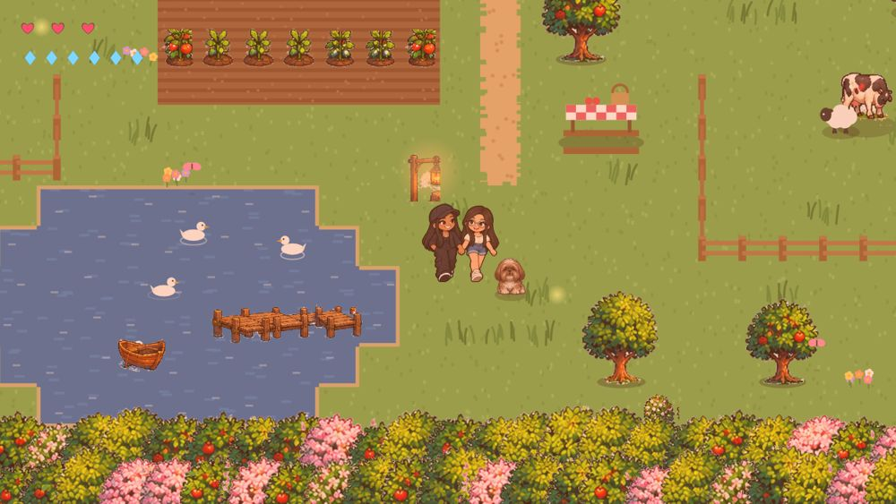
*Vitória e epílogo*

> ▶ `LINE_SWORD_SHEATHE`  
> ▶ `LINE_VICTORY`  
> ▶ `LINE_EXHAUSTED_IDLE`  
> ▶ `BELL_BREAK_FREE`  
> ▶ `LINE_BELL_RESCUE_HUG`  
> ▶ `LINE_HAPPY`  
> ▶ `BELL_HAPPY`  
> **Bell** *(rindo)*: Eu sabia que você vinha. Eu sabia!  
> ▶ `LINE_RELIEVED`  
> **Line** *(surpresa)*: Você tá bem? Ele te machucou?  
> ▶ `BELL_RELIEVED`  
> **Bell** *(apaixonada)*: Agora que você tá aqui, eu tô ótima.  
> ▶ `LINE_BELL_HUG_RELEASE`  
> ▶ `LINE_LAUGH`  
> **Line** *(marota)*: Então... será que ainda dá tempo de ver o pôr do sol?  
> ▶ `BELL_HAPPY`  
> **Bell** *(apaixonada)*: Só se for de mãos dadas. Sempre.  
> 💬 *Balão:* “Au! Au!”  
> **Bell** *(rindo)*: O Theo cuidou direitinho da fazenda, viu?  
> **Bell** *(apaixonada)*: Promete que amanhã a gente volta aqui?  
> **Line** *(apaixonada)*: Prometo. Amanhã, depois de amanhã...  
> **Bell** *(rindo)*: ...todo dia que a gente quiser.  
> ▶ `LINE_BELL_DANCE`  
> 🎬 **Título na tela:** Fim — Obrigada por jogar!  
> 🎬 **Título na tela:** Fim?  

### 4.33 Baú com itens ou pistas

Todos os baús que não são a espada nem o coração extra. A Line agacha, o baú abre e aparece o que ela encontrou.

> ▶ `LINE_CROUCH`  
> ▶ `LINE_CROUCH_STAND`  
> ▶ `LINE_HAPPY`  
> **Line** *(surpresa)*: Uma bússola! A agulha aponta pra... um baú? Deve mostrar os tesouros que ainda não achei.  
> **Line** *(marota)*: Uma chave antiga. Deve abrir alguma daquelas portas trancadas.  
> **Line** *(sorrindo)*: Uma lanterna! Agora as galerias escuras das minas não me assustam.  
> **Line** *(surpresa)*: Um gancho com corda! Com ele dá pra atravessar de um poste até outro, por cima da água.  
> **Line** *(surpresa)*: Uma alavanca de ferro, pesada... Tem um carrinho desenhado no cabo.  
> **Line** *(sorrindo)*: É a alavanca do freio do carrinho de mina! Se eu encaixar numa estação, ele volta a andar.  
> **Line** *(apaixonada)*: Uma Pena de Fênix... Se eu cair, ela me levanta. Ufa.  
> **Line** *(marota)*: Bombas! Com elas eu quebro aquelas paredes rachadas. Ficam no atalho: é só apertar F (ou o botão do item).  

### 4.34 Documento encontrado

Ao pegar um papel brilhando no chão, examinar um lugar ou abrir um baú com documento. O texto aparece parágrafo por parágrafo; se ele completar uma conclusão, aparece o título “💡 Conclusão!”. Com os 12, coração extra.

> ▶ `LINE_CROUCH`  
> ▶ `LINE_CROUCH_STAND`  
> ▶ `LINE_IDLE`  
> 🎬 **Título na tela:** Pista encontrada! — … …  
> **Line**: 💡 Conclusão!  
> **Line**: surpresa  
> ▶ `LINE_HAPPY`  
> 🎬 **Título na tela:** Caderno completo! — A Line entendeu tudo: coração extra  
> **Line** *(brava)*: Agora eu sei tudo sobre esse dragão. Segura, Bell, que eu tô indo.  
> **Line** *(neutro)*: Vou guardar isso no caderno. … de … documentos.  

### 4.35 Examinar um lugar

Pontos de exame: as marcas de garra no píer, o cartaz do vilarejo e o bilhete na porta da cabana do caçador.

> ▶ `LINE_CROUCH`  
> ▶ `LINE_CROUCH_STAND`  

### 4.36 Porta trancada

Nas três portas trancadas: sem chave a Line comenta; com chave, a porta abre e a chave some.

> **Line** *(neutro)*: Trancada. Tem uma fechadura antiga... preciso de uma chave.  
> ▶ `LINE_HAPPY`  
> **Line** *(marota)*: Abriu! Vamos ver o que tem aí dentro.  

### 4.37 Poste de gancho sem o gancho

Ao chegar num poste do gancho antes de achar o gancho (sala leste das ruínas).

> **Line** *(neutro)*: Um poste com uma argola de ferro... e outro igual do outro lado. Com um gancho e corda eu passaria.  

### 4.38 Conversa com os moradores

Ao falar com qualquer morador do vilarejo. As falas mudam com o progresso e estão na seção 7.4. Com a Dona Rosa e o Seu Bento, a conversa termina abrindo a loja.


### 4.39 O carrinho de mina

Numa estação, antes de consertar o carrinho. Sem a alavanca, a Line comenta o que falta; com ela, encaixa a alavanca e o carrinho volta a andar.

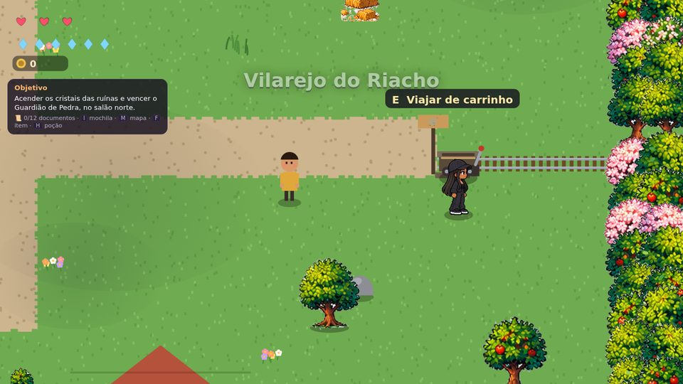
*O carrinho de mina*

> **Line** *(neutro)*: Um carrinho de mina nos trilhos. Falta a alavanca do freio... sem ela não sai do lugar.  
> **Line** *(neutro)*: Alguém deve saber onde foi parar essa alavanca.  
> **Line** *(neutro)*: O relatório do capataz disse que a alavanca ficou na Forja Antiga, na montanha.  
> ▶ `LINE_CROUCH`  
> ▶ `LINE_CROUCH_STAND`  
> ▶ `LINE_HAPPY`  
> 🎬 **Título na tela:** Carrinho consertado! — Agora dá para viajar entre as estações descobertas  
> **Line** *(sorrindo)*: Clique! Encaixou. Agora o carrinho me leva de estação em estação.  

### 4.40 Placas

| Onde | Texto |
|---|---|
| Floresta, perto das raízes | Cuidado com as raízes! Correndo por cima delas você pode tropeçar. Ande devagar (solte o correr). |
| Floresta, antes do riacho | Riacho à frente. Para atravessar, pule! (Espaço ou botão Pular). Correndo, o pulo vai mais longe. |
| Ruínas, salão de entrada | Ruínas Encantadas. Só a luz atravessa as barreiras. O altar da luz fica na sala a oeste. |
| Montanha, início | Fendas na rocha! Pule para atravessar (Espaço). Correndo, o pulo vai mais longe. |
| Montanha, fonte | Fonte das brasas: beba para recuperar vida e magia. Se cair, você volta para cá. |

### 4.41 Balões dos bichos e da Bell (na fazenda)

- Cocoricóóó! (galo, de manhã)
- Au! / Au! Au! / Au! Au! ♥ / Auuu~ (fome) / Auuu... / AU! AU! AU! (Theo)
- Piu! (pintinhos)
- Quatro ovinhos! Vai ter bolo hoje. (Bell)
- Rega as cenouras com carinho! (Bell)
- A horta tá feliz. E eu também! (Bell)
- O Theo já tá sentindo o cheiro! (Bell)
- Os bichinhos te amam. Eu entendo eles. (Bell)

### 4.42 Dicas que aparecem durante o jogo

| Quando | Texto |
|---|---|
| Item novo | Aviso no canto: “🧪 Poção de Vida ×2”, “📜 Pista: Carta do Mago”… |
| Cura rápida sem item | 🎒 Nenhum item de cura na mochila / ❤️ A vida já está cheia |
| Prólogo, no shopping | Aproxime-se da Bell e pressione E para falar com ela. (No celular: toque no botão.) |
| Prólogo, no playground | Pressione E para a Line tentar. (No celular: toque no botão.) |
| Primeiros passos | WASD ou setas para andar, Shift para correr, E para interagir. As tarefas ficam no canto da tela. |
| Tarde | Leve a Bell até o lago, de mãos dadas. |
| Depois do rapto | Siga pelo caminho ao norte, até a floresta. (Shift para correr) |
| Sem espada | A Line ainda não tem uma arma. Explore a floresta! |
| Raízes | Ops! Correndo sobre raízes a Line tropeça. Atravesse andando. |
| Água | Caiu na água! Pule (Espaço) para atravessar o riacho. |
| Fenda | Caiu na fenda! Pule (Espaço) para atravessar. Correndo, o pulo vai mais longe. |
| Sem magia | A Line ainda não sabe magia. Dizem que as Ruínas Encantadas guardam uma luz antiga... |
| Sem mana | Sem magia! Ela volta sozinha aos poucos, e os cristais azuis que os inimigos soltam recarregam. |
| Barreira | Uma barreira de luz se desfez! Acenda todos os cristais de cada sala para abrir caminho. |
| Fonte | Vida e magia renovadas! Se a Line cair nesta área, ela volta para esta fonte. |
| Guardião | Acerte o cristal do peito com a magia (Q) para abrir a guarda. Pule a onda do pisão! |
| Guardião, espada na pedra | Clang! A espada não arranha a pedra. Acerte o cristal do peito com a magia (Q) para abrir a guarda! |
| Guardião tonto | O cristal rachou e o guardião ficou tonto! Agora a espada funciona: ataque! |
| Guardião, cristal recarregando | O cristal do guardião ainda está brilhando forte. Desvie e tente de novo daqui a pouco! |
| Dragão: fogo | Fogo! Saia da frente ou esquive (L/C). Defender não segura as chamas. |
| Dragão: fogo em círculo | Fogo em círculo! Fique colada no dragão ou esquive através das chamas. |
| Dragão: cauda | Golpe de cauda! Pule (Espaço) quando o anel laranja piscar forte, ou corra para longe. |
| Dragão: mergulho | Ele vai mergulhar! Corra da sombra dele ou pule no último instante. |
| Dragão: ponto fraco | O dragão está atordoado! Ataque o ponto fraco brilhando no peito dele. |
| Dragão: fim | O dragão não aguenta mais! Chegue perto e aperte ATACAR para o golpe final. |

## 5. O primeiro encontro (prólogo)

> ⚠️ **As animações e artes do prólogo também são temporárias.** Várias usam uma animação substituta, e o playground ainda é desenhado no código.

O prólogo é a história de como a Line e a Bell se conheceram. Ele vem **antes de tudo**: ao escolher **Novo jogo**, o jogo começa no Minas Shopping, em 09/05/2024. Tudo segue o HTML *Bell-Line-Primeiro-Encontro-v26*: os três lugares, as posições, as falas (com a mesma grafia), as expressões dos retratos, a narradora, as dicas, o placar da máquina de soco e as etiquetas de lugar e data. O menu do HTML não foi usado: o jogo mantém o próprio menu. As ilustrações de close-up do HTML viraram animações das duas juntas com a câmera se aproximando (zoom).

### 5.1 O fluxo completo

| # | Lugar | O que acontece | Jogável? | Animações | Câmera |
|---|---|---|---|---|---|
| 1 | Minas Shopping | Título *O primeiro encontro* e *Minas Shopping · 09/05/2024*. A Line admira a Bell de longe: “puxa ela é tão linda”. | não | `LINE_IDLE` (de costas), `LINE_ADMIRE`, `BELL_WAIT` | normal |
| 2 | Minas Shopping | A Line anda até a Bell. Perto dela aparece o botão **Falar com a Bell**. | sim, só andar | `LINE_WALK_*`, `BELL_WAIT` | segue a Line |
| 3 | Minas Shopping | A Line se aproxima e as duas conversam: shopping grande, “Você tá atrasada”, “oq vamos comer?”, “BK.”. | não | `LINE_BELL_MEET`, `LINE_BELL_GREET_HUG` | zoom 1,6× |
| 4 | Minas Shopping (mesa) | As duas andam até a mesa e comem BK. “você parece estar tímida” / “é que você é muito linda”. | não | `LINE_WALK_*`, `BELL_WALK_*`, `LINE_BELL_BK` | zoom na mesa |
| 5 | Minas Shopping | A Bell segura a mão da Line e as duas saem juntas do shopping. | não | `LINE_BELL_MEET`, `LINE_BELL_WALK_HANDS` | volta ao normal |
| — | transição | Brilho rosa e a tela escurece. | — | — | — |
| 6 | Playground | As duas chegam. A Line para na máquina de soco, a Bell fica ao lado. Aparece o botão **Tentar!**. | só o botão | `LINE_WALK_*`, `BELL_WALK_*`, `LINE_IDLE`, `BELL_IDLE` | normal |
| 7 | Playground | A Line soca: o placar vai de 000 para **038**, a tela treme e a Bell gargalha. “HAHAHAHA! Você viu isso?” / “Eu não consegui bater direito… aquela coisa estava estragada.” | não | `LINE_PUNCH_MACHINE`, `BELL_LAUGH_AT_LINE` | tremor no impacto |
| 8 | Playground | Narradora: elas saem com a barriga doendo de tanto rir. | não | `LINE_WALK_*`, `BELL_WALK_*` | normal |
| — | transição | Brilho rosa e a tela escurece. | — | — | — |
| 9 | Túnel | As duas atravessam o túnel e se beijam, com corações subindo. “Bell & Line ♥”. | não | `LINE_WALK_RIGHT`, `BELL_WALK_RIGHT`, `LINE_BELL_TUNNEL_KISS` | zoom 1,6× |
| 10 | Túnel → fazenda | Narradora fecha a história. A tela escurece: “O tempo passou... e o sonho das duas virou uma fazendinha…”. Começa a manhã na fazenda. | não | — | escurece |

### 5.2 Ambientação de cada lugar

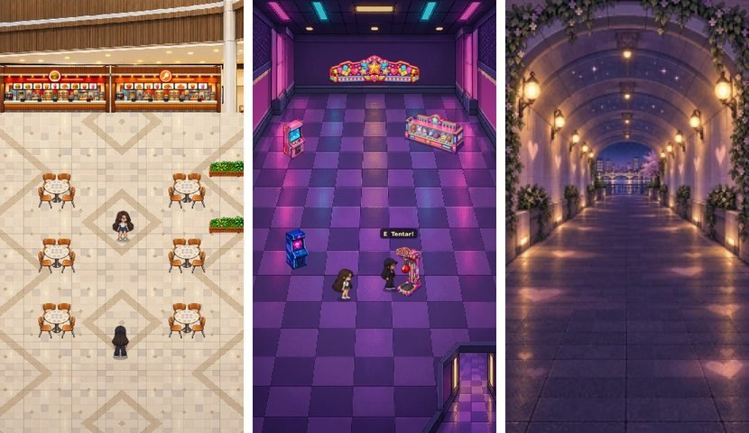
*Os três lugares: Minas Shopping, Playground e Túnel (temporários)*

A tela do HTML é vertical (360×640). No jogo, o lugar ocupa essa mesma área, centralizado, e em telas largas as laterais mostram o próprio cenário borrado e escurecido. A área onde dá para andar é a mesma do HTML.

**Minas Shopping**
- **Fundo:** ilustração vertical do shopping, com piso claro de losangos rosados, mesinhas redondas com flores, cadeiras rosas e verdes, plantas, vitrines de doces e cafés, escada rolante ao fundo e luz quente. É a imagem do próprio HTML (720×1280), com o mesmo sombreado suave por cima.
- **Posições:** a Line entra por baixo, à esquerda, de costas. A Bell espera à direita, perto do sofá vermelho, olhando para a esquerda. A mesa do BK fica no centro.
- **Precisa de arte final:** a ilustração do shopping, feita a partir do **modelo real** abaixo, e uma versão da mesa com o lanche do BK, se o casal comendo não vier com a mesa desenhada.

#### ⭐ Minas Shopping: modelo real para a arte final

> 💛 **Este é o cenário de verdade do Minas Shopping**: a praça de alimentação onde as duas se encontraram. A ilustração final do shopping deve usar esta foto como **modelo**, no estilo do jogo. A ilustração que está no jogo hoje (vinda do HTML) é **temporária**.

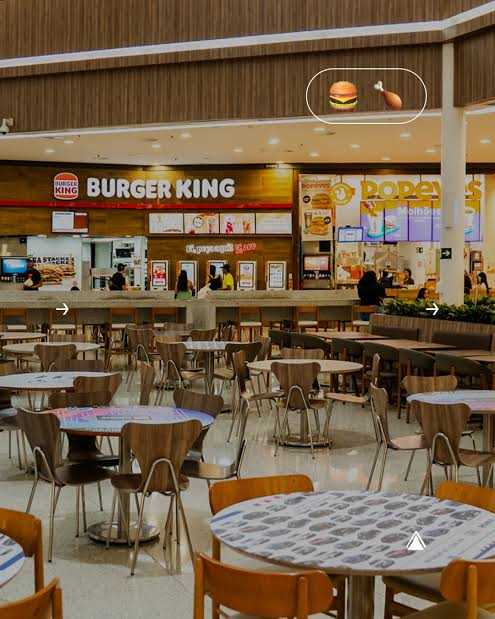
*Praça de alimentação do Minas Shopping: modelo para a arte final*

**O que a arte precisa ter, seguindo a foto:**
- **Praça de alimentação**, não um corredor de lojas.
- **Burger King** ao fundo, com o letreiro vermelho e bege sobre o balcão marrom, as telas de cardápio e os pôsteres de lanche. É onde elas comem o BK.
- Ao lado, outra lanchonete com letreiro amarelo e laranja (na foto é o Popeyes).
- **Teto** de madeira ripada, com luzes embutidas e uma faixa clara iluminada.
- **Pilar branco** grande do lado direito.
- Um **balcão** comprido de pedra na frente das lojas e uma **floreira** com plantas à direita.
- **Piso** claro de porcelanato, bem polido, refletindo as luzes.
- **Mesas redondas** com o tampo claro estampado de desenhos e pé central metálico.
- **Cadeiras** de madeira curvada, cor caramelo, com pernas finas de metal. Algumas mesas têm banco estofado encostado.
- **Luz quente e aconchegante**, com tons de madeira, bege, caramelo e o vermelho do BK.

**Como encaixar no jogo:**
- A tela é vertical (360×640), vista um pouco de cima. As lojas ficam no alto e as mesas se espalham pela área onde dá para andar.
- A Line entra por baixo, à esquerda. A Bell espera à direita, perto das mesas. A mesa do BK fica no centro e as duas se sentam nela.
- As setas, o ícone de hambúrguer e coxinha e o triângulo que aparecem na foto são do app onde ela foi tirada e **não fazem parte do cenário**.

A foto também fica salva em `arte/referencias/minas_shopping_modelo.jpg`.

**Playground**
- **Fundo:** desenhado no código igual ao HTML. Tem o piso xadrez roxo, parede escura, dois fliperamas à esquerda (um rosa com tela azul-piscina e um azul com tela rosa), um painel rosa no alto e um balcão de prêmios embaixo.
- **Máquina de soco:** a mesma que aparece na animação `LINE_PUNCH_MACHINE`, parada no lugar do soco. Em cima dela há um **placar** rosa com números amarelos que mostra **000** e vira **038** no impacto.
- **Precisa de arte final:** a ilustração do playground (fliperamas, balcão, luzes, piso) e a máquina de soco separada, parada e com o placar.

#### Playground: o cenário como está no jogo

> Este é o playground que aparece hoje no jogo, desenhado no código a partir do HTML do primeiro encontro. Ele é **temporário** e serve de **mapa** para a ilustração final: onde fica cada coisa e onde as duas se posicionam.

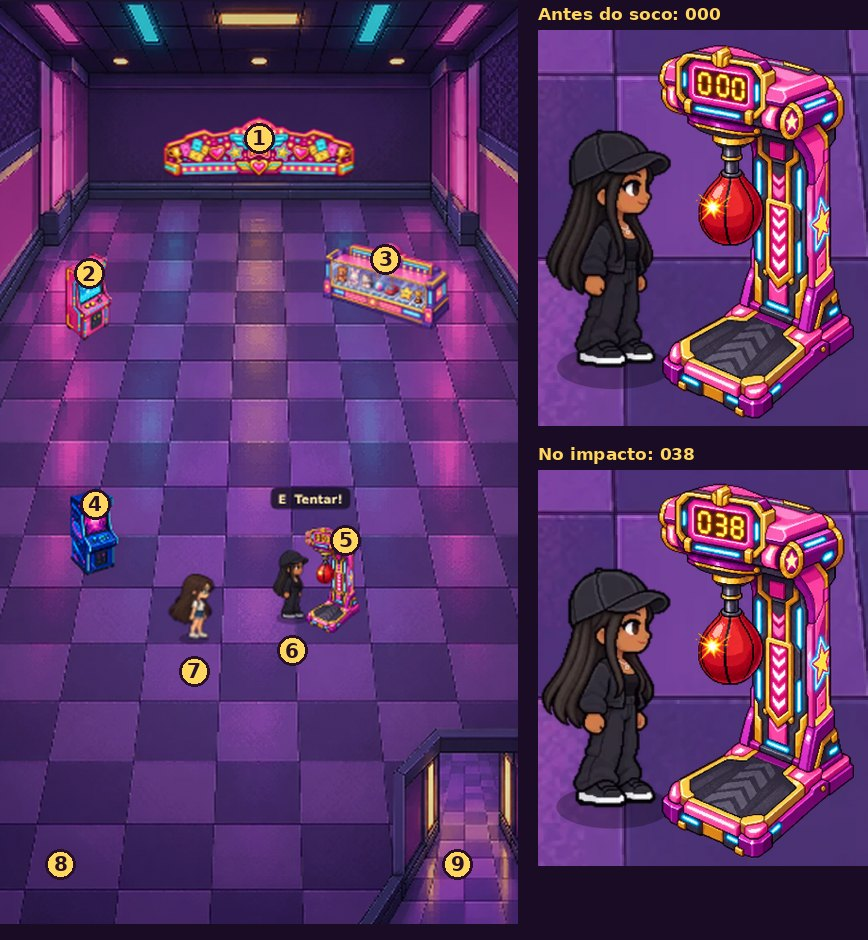
*Playground no jogo hoje, com cada parte numerada e o placar antes e depois do soco*

| # | Parte | Como está hoje | O que a arte final deve mostrar |
|---|---|---|---|
| 1 | Fliperama rosa | alto, à esquerda: letreiro rosa, tela azul-piscina e dois botões amarelos | máquina de fliperama com tela acesa, controles e luzes |
| 2 | Fliperama azul | logo abaixo do primeiro: letreiro azul e tela rosa | outro fliperama, com cores diferentes do primeiro |
| 3 | Painel rosa | no alto, ao centro | letreiro luminoso ou painel de prêmios do playground |
| 4 | Máquina de soco e placar | no meio da sala, com o saco vermelho. O placar mostra 000 e vira 038 no soco | a mesma máquina da `LINE_PUNCH_MACHINE`, parada, com o placar digital em cima |
| 5 | Balcão de prêmios | embaixo, à direita, com sete prêmios rosa | balcão com bichinhos de pelúcia e brindes |
| 6 | Piso | xadrez roxo em quadrados de 32 px | piso de playground colorido, que combine com as luzes |
| 7 | Paredes | faixas rosadas nas laterais e embaixo | paredes com luzes neon e decoração |
| 8 | Fundo | roxo bem escuro em cima e embaixo | teto e entrada do playground, com luz baixa e clima de fliperama |

**Posições (na tela de 360×640 do HTML):**
- **A Line** para em frente à máquina de soco (x 204, y 315).
- **A Bell** fica olhando do lado esquerdo (x 150, y 340).
- As duas **entram por baixo, à esquerda**, e saem pela direita, embaixo.

**Clima:** playground de shopping, com luz baixa roxa e rosa, telas brilhando e um ar divertido. É onde a Bell morre de rir.


**Túnel**
- **Fundo:** ilustração vertical do túnel em arco, com lampiões, trepadeiras com flores, corações de luz no chão e a cidade à noite ao fundo. É a imagem do HTML, com uma vinheta roxa leve.
- **Posições:** as duas entram pela esquerda e se encontram no meio do túnel para o beijo.
- **Precisa de arte final:** a ilustração do túnel.

**Cores e clima:** as transições entre lugares têm um brilho rosa (247, 178, 200) antes de escurecer. O túnel começa com esse tom rosa, que some aos poucos. No prólogo não há nuvens, pássaros, bichos, corações de vida, magia nem painel de tarefas: a Line anda sem espada.

### 5.3 Interface do prólogo

- **Etiquetas no alto, à esquerda**, como no HTML: o nome do lugar (*Minas Shopping*, *Playground* ou *Túnel*) e *♥ 09/05/2024*. Elas somem na transição para a fazenda.
- **Faixa de dica** no alto: “Aproxime-se da Bell e pressione E para falar com ela.” e “Pressione E para a Line tentar.” No celular, o texto fala em tocar no botão.
- **Botão de ação:** *Falar com a Bell* e *Tentar!*. No celular, os botões de luta, pulo e magia ficam escondidos durante o prólogo.
- **Caixa de diálogo** com retrato, igual ao resto do jogo. A *Narradora* aparece sem retrato.
- **Pular cena (Tab):** pula cada cena. Pulando tudo, o jogo passa pelos três lugares e chega na fazenda.

### 5.4 Transições

- **Entre lugares** (shopping → playground → túnel): brilho rosa por 0,8 s enquanto a tela escurece em 0,9 s. O novo lugar surge clareando.
- **Do túnel para a fazenda:** depois do beijo, a tela escurece em 1,6 s, a câmera volta ao normal e a narradora fala sobre o tempo que passou, com a tela preta. Então a fazenda aparece e começa a cena *Manhã na fazenda* (Capítulo 1).

### 5.5 Todas as animações do prólogo

Estas são as animações próprias do prólogo, no grupo **Primeiro encontro (prólogo)** da seção 10. As que ainda não têm arte usam uma substituta parecida.

| Código | Quando aparece e o que precisa mostrar | Quadros | Status hoje |
|---|---|---:|---|
| `LINE_ADMIRE` | Início: a Line vê a Bell de longe. Precisa da Line de costas ou de lado, com a mão no peito, corações e o corpo balançando. | 5 | ✅ temporária |
| `BELL_WAIT` | A Bell esperando no shopping: olha para os lados, mexe no cabelo, confere o celular. Virada para a esquerda. | 4 | ✅ temporária |
| `LINE_BELL_MEET` | As duas frente a frente, conversando e sorrindo. Usada no “esse shopping é muito grande”, no “oq vamos comer?” e antes de saírem. | 3 | ✅ temporária |
| `LINE_BELL_GREET_HUG` | Abraço de chegada no “Você tá atrasada”. O HTML mostra a Bell pulando no abraço com uma perna levantada. | 4 | ✅ temporária |
| `LINE_BELL_BK` | As duas sentadas à mesa comendo BK (hambúrguer, batata e refri), com a mesa desenhada. O HTML tem 3 quadros. | 6 | ✅ temporária |
| `LINE_PUNCH_MACHINE` | A Line soca a máquina, com a máquina e o placar na mesma animação. O impacto é por volta da metade. | 3 | ✅ temporária |
| `LINE_PUNCH` | Soco sem espada (usa a arte do soco na máquina, em 6 quadros) | 3 | ✅ temporária |
| `BELL_LAUGH_AT_LINE` | A Bell gargalhando da Line: se dobra de rir, bate na perna, enxuga as lágrimas. | 2 | ✅ temporária |
| `LINE_BELL_TUNNEL_KISS` | O primeiro beijo: as duas se aproximam de mãos dadas, se beijam e se afastam sorrindo. O HTML tem 8 quadros. | 7 | ✅ temporária |

**Animações que o prólogo reaproveita** (já existem, também temporárias): `LINE_IDLE`, `LINE_IDLE_BACK`, `LINE_WALK_RIGHT`, `LINE_WALK_LEFT`, `LINE_WALK_FRONT`, `LINE_WALK_BACK`, `BELL_IDLE`, `BELL_WALK_RIGHT`, `BELL_WALK_LEFT`, `BELL_WALK_FRONT`, `BELL_WALK_BACK` e `LINE_BELL_WALK_HANDS` (saindo do shopping de mãos dadas).

**Efeitos do prólogo** (feitos no código): corações subindo no beijo, anel de impacto e tremor de tela no soco, brilho rosa das transições, zoom da câmera e escurecer.

### 5.6 Retratos usados no prólogo

| Personagem | Expressões | Onde |
|---|---|---|
| Line | `apaixonada`, `sorriso` | “puxa ela é tão linda”, “é que você é muito linda” / conversa, soco |
| Bell | `maroto`, `sorriso`, `neutro`, `apaixonada` | “Você tá atrasada”, “HAHAHAHA!” / “BK.” / “você parece estar tímida” / o olhar apaixonado sem fala |
| Narradora | sem retrato | três falas: saída do shopping, saída do playground e o fim no túnel |
| Bell & Line | sem retrato | o “♥” depois do beijo |

### 5.7 Arte que já existe no HTML

O HTML do primeiro encontro já traz ilustrações das duas juntas: o abraço, o BK na mesa, as duas de mãos dadas, o beijo (tira de 8 quadros), a caminhada e o BK animado. Hoje o jogo usa as animações que já tinha no lugar delas, mas essas ilustrações são a melhor referência (ou até a base) para a arte final de `LINE_BELL_GREET_HUG`, `LINE_BELL_BK`, `LINE_BELL_MEET`, `LINE_BELL_TUNNEL_KISS` e `LINE_BELL_WALK_HANDS`.

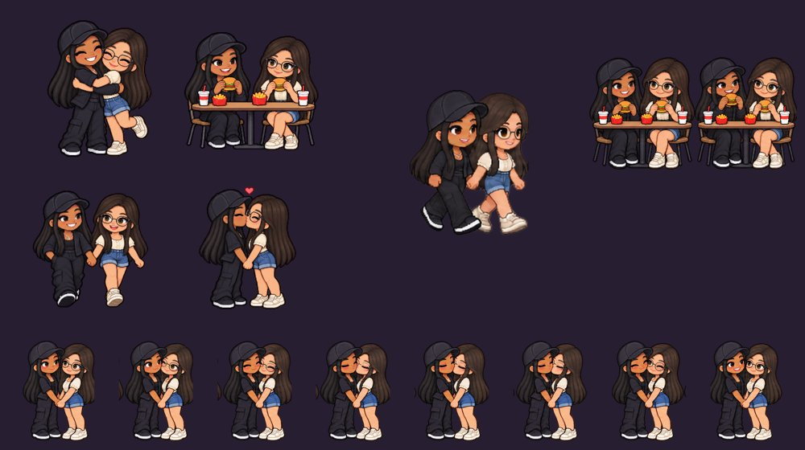
*Ilustrações do HTML do primeiro encontro (referência para a arte final)*

### 5.8 O que falta para a versão final do prólogo

- [ ] `LINE_ADMIRE`, `BELL_WAIT`, `LINE_BELL_MEET`, `LINE_BELL_GREET_HUG`, `LINE_BELL_BK`, `BELL_LAUGH_AT_LINE` e `LINE_BELL_TUNNEL_KISS` com arte própria.
- [ ] `LINE_PUNCH_MACHINE` final e a máquina de soco parada, com o mesmo desenho.
- [ ] Ilustração do Playground (hoje desenhada no código).
- [ ] Ilustração final do Minas Shopping seguindo a foto-modelo da praça de alimentação (seção 5.2), com o Burger King.
- [ ] Versão final da ilustração do Túnel.
- [ ] Line parada de costas (`LINE_IDLE_BACK`) caprichada para a entrada no shopping.
- [ ] Opcional: música e sons (passos no shopping, fliperamas, o soco, o beijo).

### 5.9 Progresso e salvamento

- **Novo jogo** sempre começa pelo prólogo.
- Se o jogador fechar o jogo **no meio do prólogo**, **Continuar** recomeça o prólogo do início (ele é curto).
- Terminado o prólogo, o jogo marca `encontroFeito` e salva já na fazenda. Jogos salvos antes do prólogo existir continuam de onde pararam.

## 6. As fases

Os três lugares do prólogo (Minas Shopping, Playground e Túnel) estão na seção 5. A aventura tem **sete áreas**, todas ligadas entre si (a seção 7.1 mostra como). As áreas ficaram bem maiores nesta versão:

| Área | Tamanho (tiles) | Baús | Inimigos | Novidades |
|---|---|---|---|---|
| Fazendinha | 46 × 34 | 1 | — | estrada nova para o vilarejo, a leste |
| Vilarejo do Riacho | 60 × 40 | 1 | — | área nova: moradores, loja, ferraria, fonte e estação do carrinho |
| Floresta Sussurrante | 76 × 44 | 5 | 10 sombras | cabana do caçador, lago com ilha (gancho), pedra rachada (bomba), saída para o vilarejo |
| Gruta dos Ecos | 64 × 44 | 7 | 5 sombras, 2 fogos-fátuos azuis, 5 morcegos | metade nova: as **Minas de Cristal**, escuras, com morcegos, trilhos, estação e abismo (gancho) |
| Ruínas Encantadas | 70 × 36 | 5 | 8 sombras, 6 fogos-fátuos azuis | torre nordeste (gancho), sala leste, atalho para as Minas |
| Montanha de Brasa | 72 × 40 | 5 | 8 fogos-fátuos de fogo, 9 sombras | Forja Antiga, estação, chão em brasa, atalho para as Minas |
| Covil do Dragão | 26 × 20 | 0 | — | — |

### 6.1 Fazendinha
O chão da fazenda é o **terreno oficial** (item 144), uma imagem só, e o mapa foi ajustado em cima dela: a casa fica no noroeste, com a casinha do Theo e a tigela ao lado, o varal e o galinheiro logo abaixo, a horta e o poço no meio, o pasto com porteira a leste e o lago ao sul. A porta da casa leva para dentro (seção 6.8).

**Objetos da fazenda (itens 158 a 227):** no pasto, o canto do cavalo (cavalete com sela, cabresto e escova) e a tosquia (cesto de lã e tesoura); bebedouro no galinheiro; concha de grãos no silo; ferraduras no celeiro; arco com a placa de boas-vindas na estrada norte; postes de lampião na estrada; bebedouro de passarinho, treliça, mangueira, carrinho de flores, cesto de maçãs e abóboras pela fazenda; sapateira e galochas na varanda; cesto de prendedores debaixo do varal; roda de carroça e silo de grãos no celeiro; banquinho e balde de ordenha no pasto; caixa de correio, capacho, cadeira de balanço e sino na varanda; floreira na frente da casa; fumigador e pote de mel junto à colmeia; cata-vento no telhado do celeiro; comedouro no galinheiro; cocho de feno, pedra de sal e bebedouro no pasto; bancada de mudas com luvas e bandeja ao lado da horta; rolo de corda no píer; lenha, colmeia e casinha de passarinho perto da casa; suporte de ferramentas, balde, sacos de sementes e o **regador** (que some quando a Line o pega na tarefa da manhã) junto do poço; espantalho, cesto de colheita, pá, enxada e carrinho de mão na horta; ninho e cesto de ovos no galinheiro; barril de chuva, ferradura, latão de leite e composteira no celeiro; cocho no pasto; banco e **fogueira** (acesa à noite) na beira do lago, com taboas, vitórias-régias e um caixote no píer; cogumelos debaixo das árvores. Cada objeto tem volume: a Line passa na frente e atrás, e os maiores ocupam o chão.

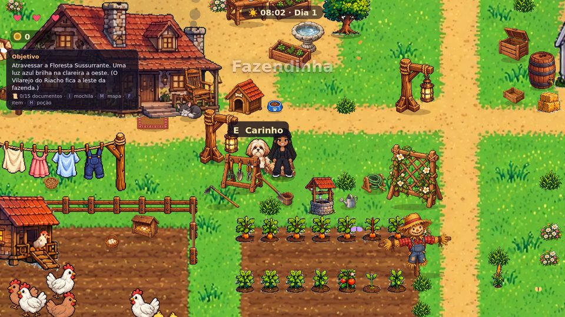
*Objetos novos perto da casa: caixa de correio, capacho, cadeira de balanço, lenha, colmeia, ferramentas, balde e regador*

Casa com varanda e duas chaminés, celeiro, galinheiro, horta, poço, moinho, pasto, chiqueiro, lago com píer e barco, varal, casinha do Theo, mesa de piquenique, árvores frutíferas e flores. Tem borboletas, pássaros, nuvens, folhas caindo e fumaça nas chaminés. De manhã, a luz é clara. À tarde, o céu fica alaranjado, e depois do rapto vira noite com vaga-lumes.

Depois do rapto, abre a **estrada do leste**, que leva ao Vilarejo do Riacho. Antes disso a estrada fica fechada: a Line não sai da fazenda no meio do dia com a Bell.

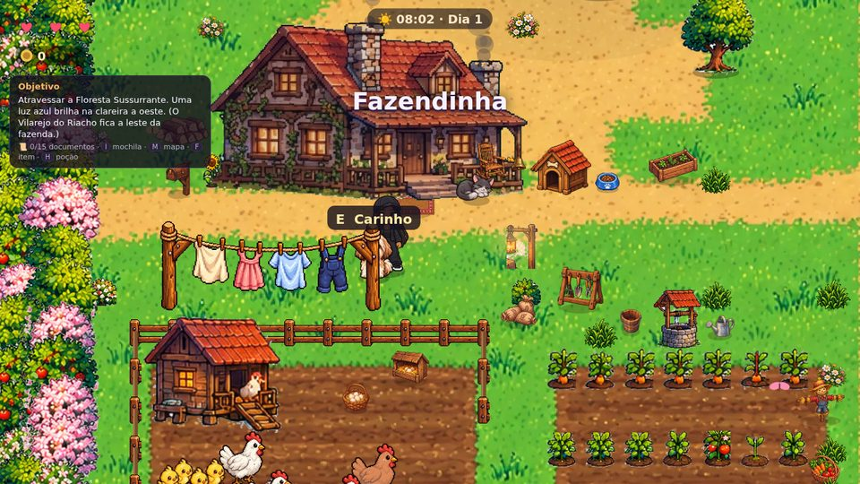
*A casa da fazenda no terreno oficial: casinha do Theo, tigela, varal, galinheiro, horta e poço*

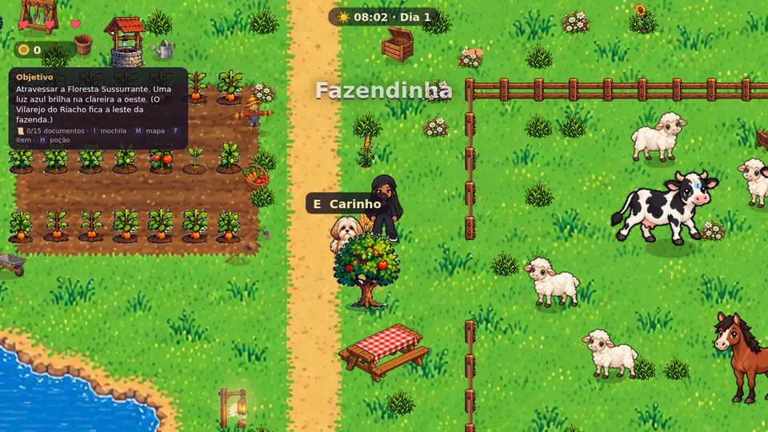
*Horta, pomar, lago e o pasto com cerca nova*

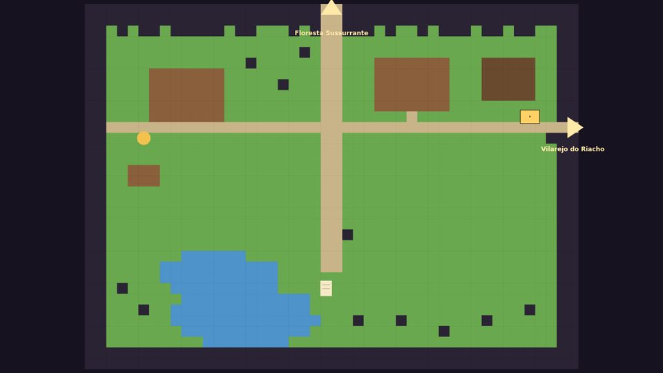
*Mapa da fazendinha: saída norte para a floresta e estrada leste para o vilarejo*

### 6.2 Vilarejo do Riacho (área nova)
Um vilarejo pequeno a leste da fazenda, com uma praça de terra batida no meio, fonte, quadro de avisos, casinhas de telhado colorido, barraca de feira, um riacho ao sul e a estação do carrinho de mina a leste. Não tem inimigos: é o lugar seguro da aventura.

- **Praça:** a fonte (cura e vira ponto de retorno) e o **cartaz do vilarejo**, que é um documento de investigação.
- **Loja da Dona Rosa** (casa de telhado roxo, a oeste da praça, com letreiro; a Dona Rosa atende **lá dentro, atrás do balcão**): vende poções, elixir, bombas, a Pena de Fênix e as Botas de Andarilha.
- **Ferraria do Seu Bento** (casa de telhado azul, a leste, com letreiro; a bigorna, a lenha e o barril ficam do lado de fora): o Seu Bento atende **lá dentro, atrás do balcão**, e vende as armaduras. As duas lojas fecham à noite.
- **Estação do Vilarejo:** o carrinho de mina parado nos trilhos, esperando a alavanca do freio.
- **Moradores:** Dona Rosa, Seu Bento, Seu Zé (o mais velho, conta a história do carrinho), Dona Lurdes (mulher do caçador) e o Pedrinho (que corre de um lado para o outro e conta da pedra rachada).
- **Saídas:** oeste para a fazenda e norte para a floresta.


*O Vilarejo do Riacho: praça, fonte e moradores*

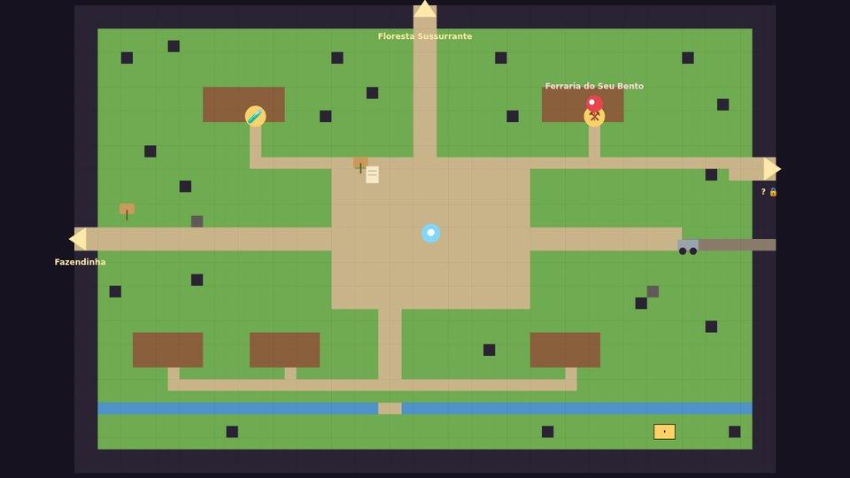
*Mapa do vilarejo: loja (oeste), ferraria (leste), praça, riacho e estação*

### 6.3 Floresta Sussurrante
Trilha com raízes (correr sobre elas faz a Line tropeçar, a não ser com as Botas de Andarilha), riacho para pular, a clareira do Mago com o baú da espada, espinhos que fecham o norte e sombras depois que a espada é pega. Ela cresceu para o leste e para o sul:

- **Clareira do Mago (oeste):** o Mago, o baú da espada e o baú da **Carta do Mago**.
- **Trilha leste:** leva à entrada da Gruta dos Ecos.
- **Cabana do caçador (nordeste):** na porta está pregado o **bilhete do caçador** Tobias.
- **Clareira do lago (sudeste):** um lago com uma **ilha no meio**, alcançada com o **gancho** entre dois postes. Mais ao sul, uma **pedra rachada** esconde um baú: precisa de **bomba**.
- **Saídas:** sul para a fazenda, norte para as ruínas (depois da espada), leste para a gruta e sudeste para o vilarejo.

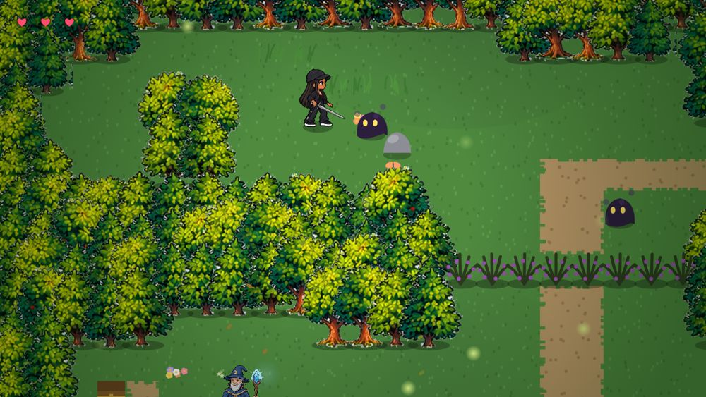
*Sombras na floresta*

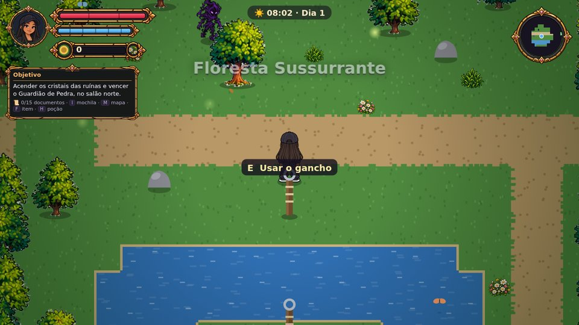
*O poste do gancho na beira do lago: do outro lado fica a ilha*

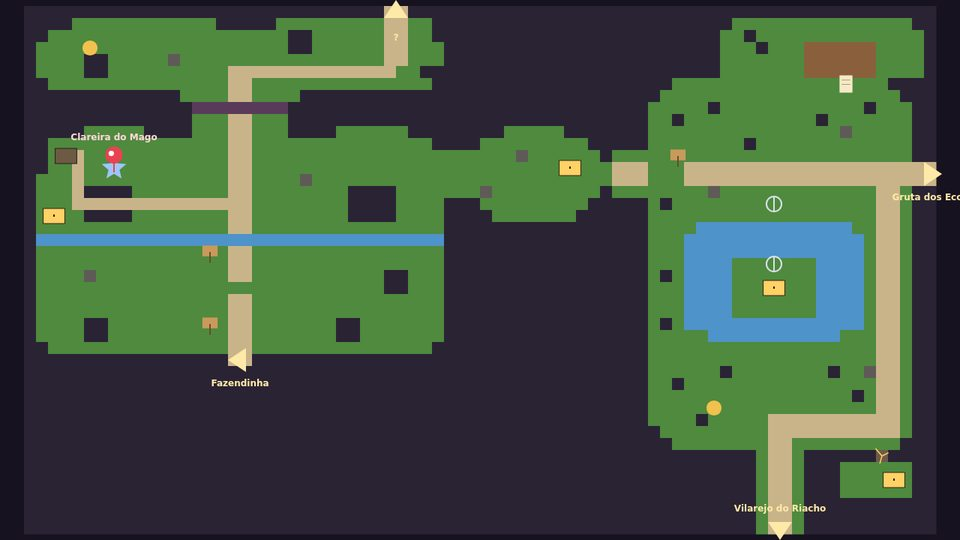
*Mapa da floresta: clareira do Mago, cabana do caçador, lago com ilha e as quatro saídas*

### 6.4 Gruta dos Ecos e Minas de Cristal
A gruta ficou com o dobro do tamanho. A metade oeste é a caverna azulada de antes; a metade leste são as **Minas de Cristal**, abandonadas desde que o dragão acordou.

- **Gruta (oeste):** fonte, pergaminho da **Lenda da Montanha**, a bússola, um elixir, uma chave e a sala trancada com o coração extra e o **Mapa rasgado**.
- **Salão de entrada das Minas:** o baú da **lanterna**, a placa das minas, a **Estação das Minas** e o **relatório do capataz**.
- **Galerias escuras:** sem a lanterna, a Line só enxerga um pouquinho em volta; com ela, a luz fica bem maior. Moram ali os **morcegos**. No meio, um baú de bombas.
- **Abismo:** uma fenda funda que só se atravessa com o **gancho**. Do outro lado, a **Pena de Fênix**.
- **Paredes rachadas:** duas, que abrem com **bomba** o atalho para a **Montanha de Brasa** (leste).
- **Saídas:** oeste para a floresta, norte para as ruínas (um atalho que só abre acendendo o cristal do lado das ruínas) e leste para a montanha (depois das paredes rachadas).

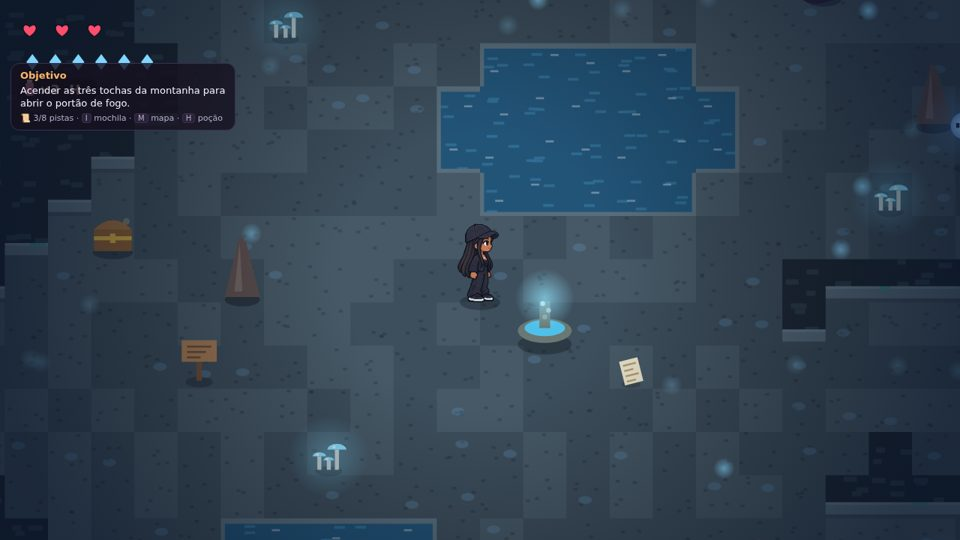
*A Gruta dos Ecos: fonte, cogumelos luminosos e o pergaminho da lenda*

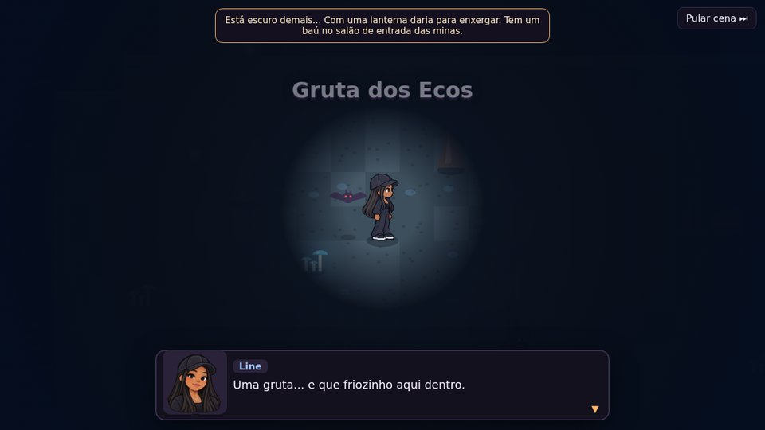
*Galeria escura sem lanterna: a Line quase não enxerga*

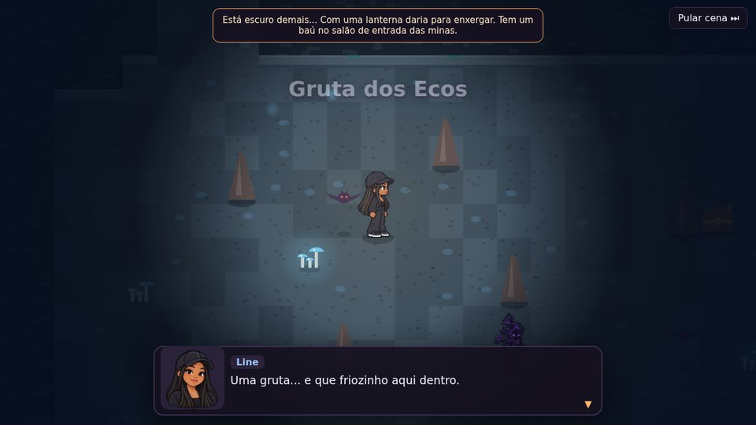
*A mesma galeria com a lanterna*

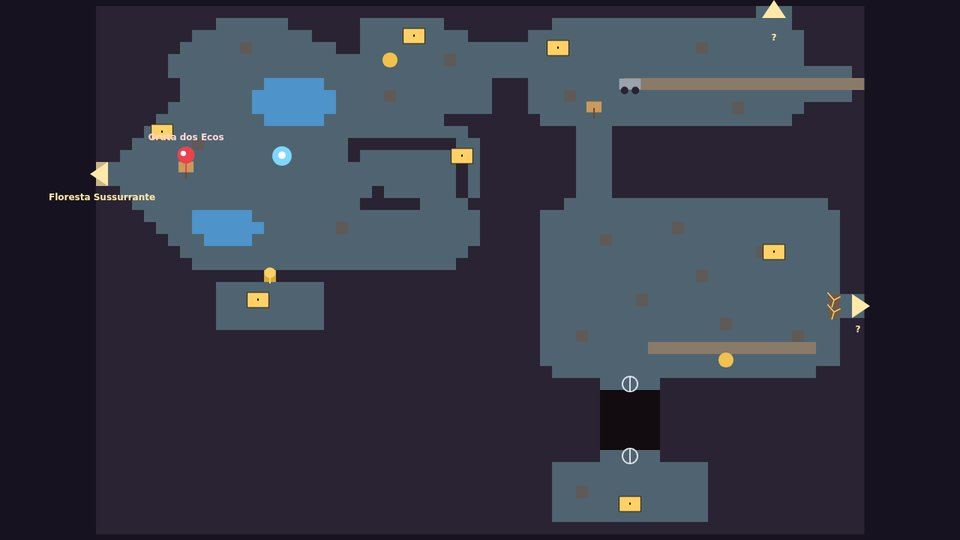
*Mapa da gruta e das Minas: a gruta azul a oeste, as minas a leste, a estação, o abismo e os atalhos*

### 6.5 Ruínas Encantadas
Um templo antigo de pedra e musgo, organizado em salas:

- **Salão sul (entrada):** a placa, uma fonte e dois cristais que abrem a barreira do meio. A oeste fica a **sala do altar**, onde a Line aprende a magia, e no chão, perto dele, a **página 1 do diário do Guardião**.
- **Salão do meio:** dois lagos com um cristal numa ilhota em cada um (só acendem de longe, com o Raio de Luz), mais um cristal, pilares, sombras e fogos-fátuos. A leste fica a **alcova com o coração extra**.
- **Salão norte:** arena com pilares onde dorme o **Guardião de Pedra**. Vencido, ele desfaz a última barreira, que leva à montanha.
- **Ala leste da entrada:** pilares, sombras e um baú com **chave antiga** e moedas.
- **Biblioteca (trancada):** o baú com a **página 2 do diário** e um elixir.
- **Sala leste (nova):** o baú do **gancho**.
- **Torre nordeste (nova):** do outro lado de um fosso, alcançada com o gancho entre dois postes. Tem um baú com elixir e 60 moedas.
- **Atalho sudeste (novo):** um corredor fechado por uma barreira de luz; acendendo o cristal da sala do lado, ele abre a passagem para as Minas.
- **Saídas:** sul para a floresta, norte para a montanha (depois do Guardião) e sudeste para as Minas.

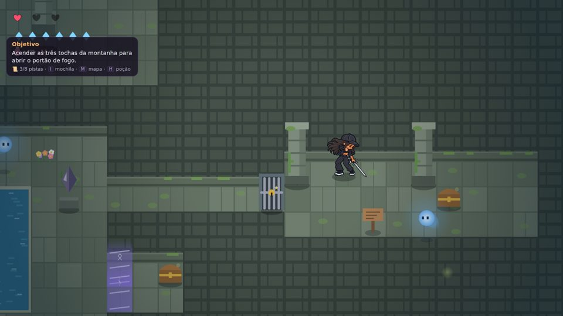
*A biblioteca trancada das ruínas*

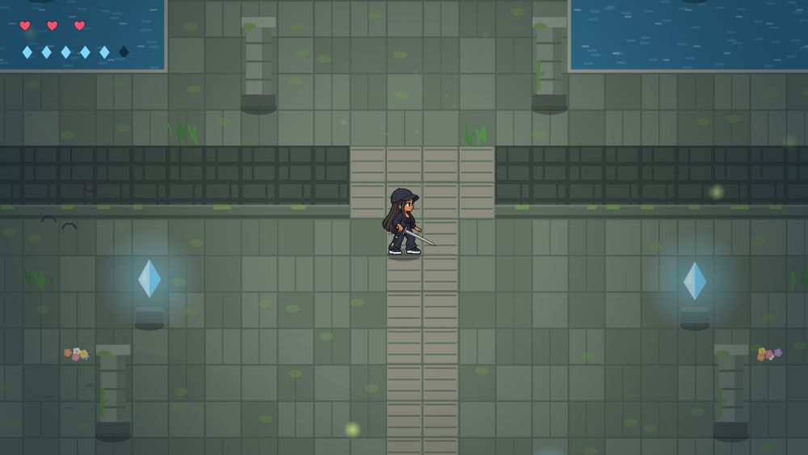
*Cristais acesos e barreira desfeita*

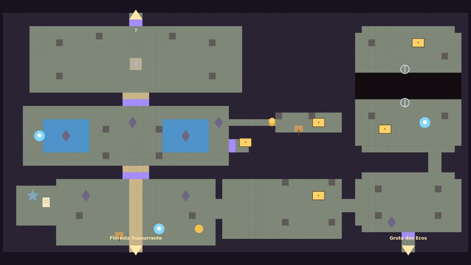
*Mapa das ruínas: salões, biblioteca, torre do gancho e o atalho para as Minas*

### 6.6 Montanha de Brasa
Rocha vulcânica, rios de lava e brasas subindo:

- **Início:** uma fenda para pular e a **primeira tocha**, perto da placa.
- **Meio:** lava dos dois lados, a **fonte das brasas** e a segunda tocha, numa **ilha no meio da lava**, que só acende de longe.
- **Topo:** a **terceira tocha**, a **plataforma com o coração extra** e o **portão de fogo**, que abre com as três tochas. Perto dele, a **fita de cabelo da Bell**.
- **Encosta leste:** um baú com **chave antiga** e a porta de ferro da **caverna escondida**, onde estão a **escama vermelha** e uma poção.
- **Forja Antiga (nova):** a sala do X vermelho do mapa rasgado. Tem a bigorna do Mestre Aurélio, a **receita da Armadura de Brasa** e o baú da **Alavanca de Ferro**.
- **Estação da Forja (nova):** a terceira estação do carrinho.
- **Chão em brasa (novo):** um caminho de brasa rasa que queima a Line (meio coração a cada meio segundo). Só com a **Armadura de Brasa** dá para atravessar até o baú do fundo, com 90 moedas e um elixir.
- **Saídas:** sul para as ruínas, norte para o covil (pelo portão de fogo) e leste para as Minas.


*A tocha da ilha de lava, que só acende de longe*

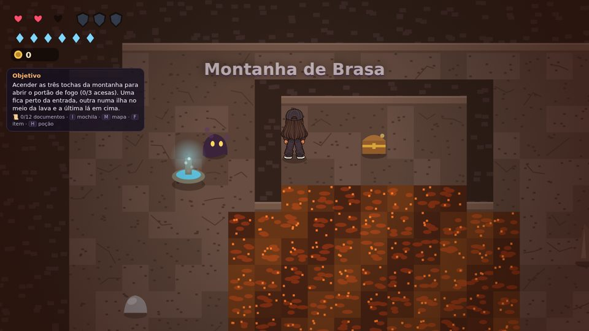
*O chão em brasa da montanha*

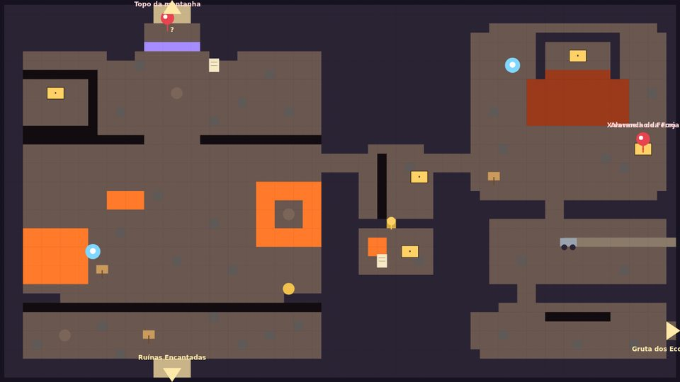
*Mapa da montanha: as três tochas, o portão, a Forja Antiga, a estação e o chão em brasa*

### 6.7 Covil do Dragão
Caverna escura com lava nas laterais e estalagmites. A Bell fica numa jaula ao fundo. Quando a Line entra, a entrada desmorona e a luta começa. É a única área sem volta.

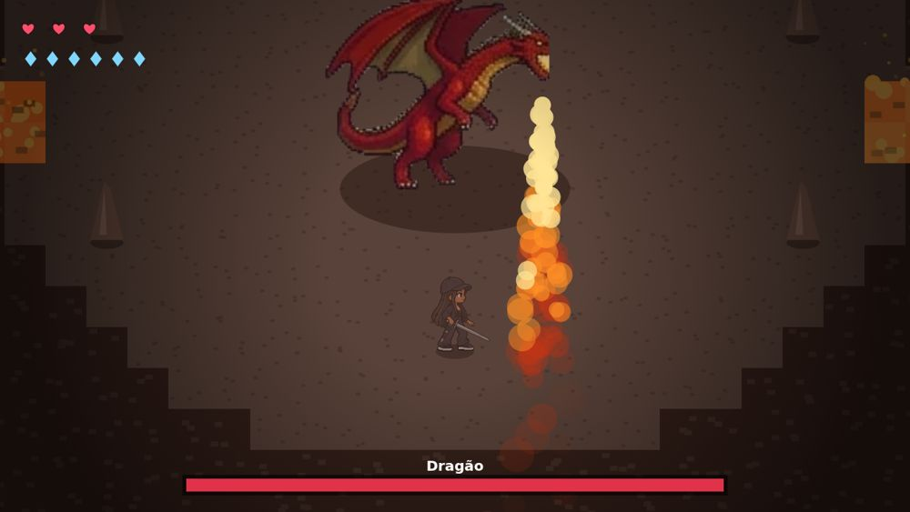
*O dragão cospe fogo no covil*

### 6.8 Casas por dentro
Toda casa do jogo tem interior. Perto da porta aparece **Entrar**; para sair, é só descer pelo caminho de pedra até a porta. Os móveis têm volume: a Line passa na frente e atrás deles, e não atravessa camas, mesas e estantes.

| Casa | Onde fica | Piso | O que tem dentro |
|---|---|---|---|
| Casa da fazenda | fazendinha (noroeste) | madeira, terracota na cozinha, azulejo no banheiro | cozinha com fogão, geladeira, pia, ilha com banquetas, despensa, temperos, relógio, quadro e mesa com vaso e luminária; sala com lareira, sofá, poltronas, estantes, plantas e luminária; quarto com cama de casal, criados-mudos, guarda-roupa e espelho; banheiro com vaso, pia e box; corredor com a porta da despensa (abre quando a Line chega perto), janela e arandelas |
| Cabana do caçador | floresta (nordeste) | madeira | lareira, estante, cama, poltrona, cestos, uma caminha de cachorro, relógio e o suporte de ferramentas com balde |
| Loja da Dona Rosa | vilarejo (oeste) | terracota | estantes cheias, balcão com vaso e luminária, barril, caixote, cestos, sacos de sementes, cesto de colheita e planta |
| Ferraria do Seu Bento | vilarejo (leste) | lajota de pedra | forja acesa, bigorna, bancada, barris, caixote, lenha, ferramentas e balde |
| Casas do vilarejo (3) | vilarejo (sul) | madeira e terracota | fogão, geladeira, mesa, camas, sofá, poltronas e estantes |
| Casa da Dona Cora | Vale das Raízes | terracota | cozinha completa, mesa, cama e cesto |
| Casa do Seu Tião | Lago Espelhado | azulejo | cômoda, cama, poltrona, mesinha e cesto |

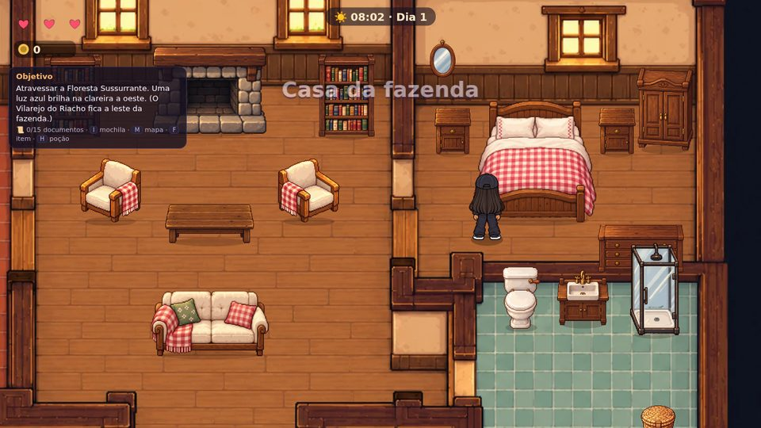
*A casa da fazenda por dentro: quarto, sala e banheiro*

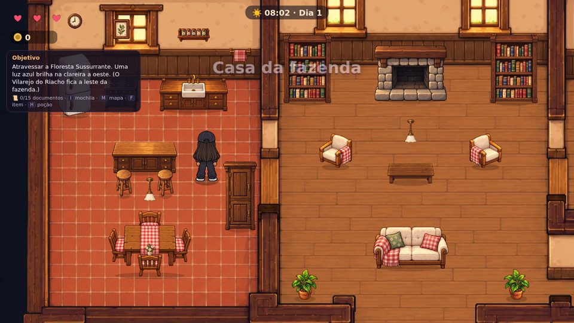
*Cozinha e sala da casa da fazenda*

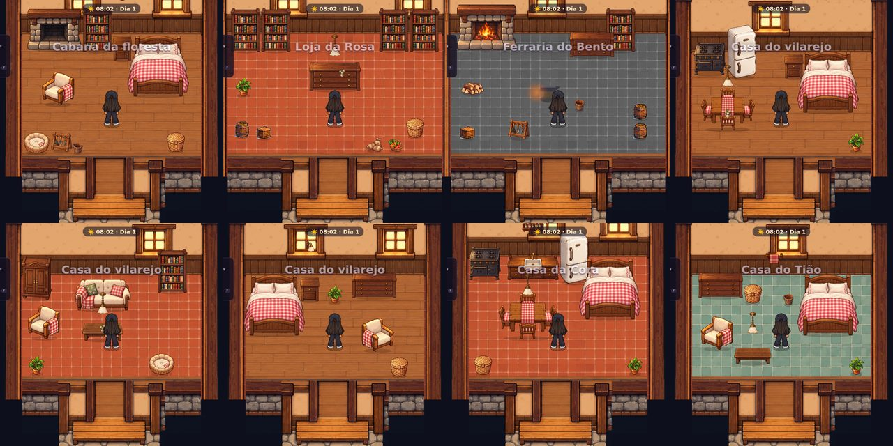
*As outras casas por dentro: cabana, loja, ferraria, três casas do vilarejo, casa da Cora e casa do Tião*

## 7. Exploração: mundo interligado, vilarejo, loja, carrinho, itens, documentos e mapa

> ⚠️ Tudo desta seção também é **temporário**: os itens aparecem como emojis e os objetos novos (moradores, carrinho, postes, bombas, paredes rachadas) são desenhados no código até a arte final chegar.

Depois do rapto, o jogo vira uma aventura de exploração: sete áreas ligadas por vários caminhos, um vilarejo com loja e ferraria, moedas, armaduras, dez itens (cada um com uma função), doze documentos de investigação que se juntam em oito conclusões, um carrinho de mina que liga três estações e um mapa que só acende onde a Line já passou.

### 7.1 Como as fases se ligam

```
                         [ Covil ]
                             │ portão de fogo (3 tochas)
                    [ Montanha de Brasa ]══ estação da Forja
                     │               │ paredes rachadas (bomba)
        Guardião ─── │               │
                [ Ruínas ]──atalho──[ Gruta dos Ecos + Minas ]══ estação das Minas
                     │  (cristal)     │
         espinhos ── │                │
                [ Floresta Sussurrante ]
                     │           │
               [ Fazendinha ]──[ Vilarejo do Riacho ]══ estação do Vilarejo
                        estrada leste (depois do rapto)
```

| De | Para | O que abre o caminho |
|---|---|---|
| Fazendinha | Floresta | livre |
| Fazendinha | Vilarejo | depois do rapto |
| Vilarejo | Floresta | livre |
| Floresta | Gruta | livre |
| Floresta | Ruínas | cortar os espinhos com a espada |
| Gruta (Minas) | Ruínas | acender o cristal da sala sudeste das ruínas; antes disso a barreira fecha a passagem |
| Gruta (Minas) | Montanha | explodir as duas paredes rachadas com bombas |
| Ruínas | Montanha | vencer o Guardião de Pedra |
| Montanha | Covil | acender as três tochas |
| Vilarejo · Minas · Forja | (carrinho) | encaixar a Alavanca de Ferro numa estação e descobrir as outras |

Toda saída tem caminho de volta (menos o covil), e os testes automatizados conferem isso em cada mudança (seção 15).

### 7.2 Moedas

- **De onde vêm:** inimigos derrotados soltam moedas (sombra 1 a 3, fogo-fátuo 2 a 3, morcego 1 a 2, Guardião 30); quase todos os baús têm moedas; e há montinhos brilhando pelo chão.
- As moedas soltas voam até a Line quando ela chega perto e somem depois de 25 segundos.
- **HUD:** o total fica embaixo dos corações e da magia.
- **Para que servem:** comprar na loja da Dona Rosa e na ferraria do Seu Bento.

### 7.3 Loja da Dona Rosa e ferraria do Seu Bento

Falando com a Dona Rosa ou com o Seu Bento, a conversa termina com a janela da loja. Cada produto mostra o preço, a descrição e quanto a Line já tem. Se faltar dinheiro, a loja diz quanto falta. **Esc** ou **Sair** fecha.

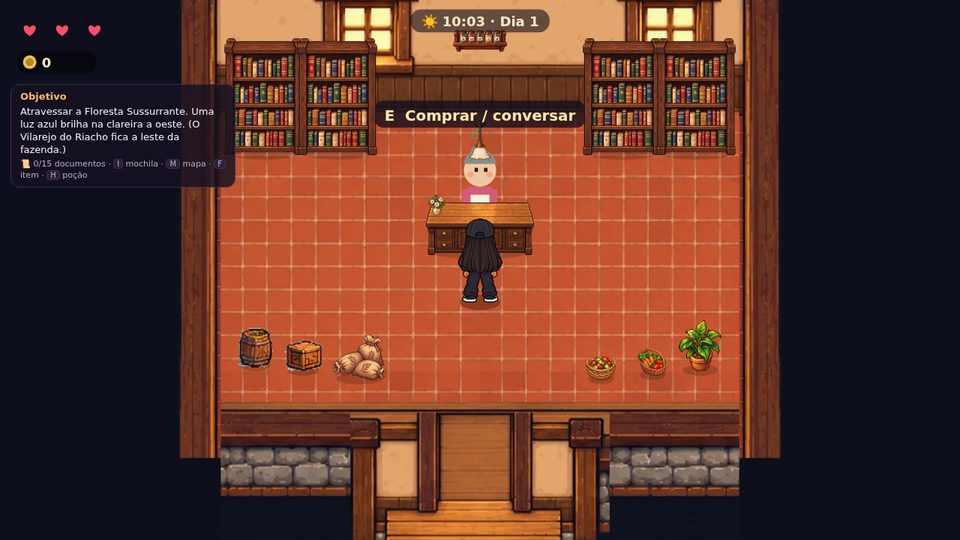
*A loja da Dona Rosa*

| Loja | Produto | Preço | Observação |
|---|---|---|---|
| Loja da Dona Rosa | 🧪 Poção de Vida | 20 | — |
| Loja da Dona Rosa | 💧 Elixir de Luz | 25 | — |
| Loja da Dona Rosa | 💣 Bombas (3) | 30 | vem com 3 |
| Loja da Dona Rosa | 🪶 Pena de Fênix | 80 | máximo 1 |
| Loja da Dona Rosa | 👢 Botas de Andarilha | 60 | máximo 1 |
| Ferraria do Seu Bento | 🥋 Túnica Acolchoada | 40 | 1 escudo |
| Ferraria do Seu Bento | ⛓️ Cota de Malha | 90 | 2 escudos |
| Ferraria do Seu Bento | 🔥 Armadura de Brasa | 160 | 3 escudos · não queima na brasa · só com a receita do Mestre Aurélio |
| Ferraria do Seu Bento | 👗 Vestido Reforçado | 60 | 1 escudo |
| Ferraria do Seu Bento | 🌟 Manto Estelar | 130 | 2 escudos |
| Ferraria do Seu Bento | 🌈 Armadura da Aurora | 220 | 3 escudos · não queima na brasa · só com a receita do Mestre Aurélio |

**Armaduras e escudos 🛡:** cada escudo segura um golpe inteiro antes de chegar nos corações. Os escudos aparecem em azul ao lado dos corações e voltam sozinhos, um por vez (6 segundos cada), depois de 5 segundos sem apanhar. Beber de uma fonte enche todos. Só dá para comprar uma armadura melhor que a atual.

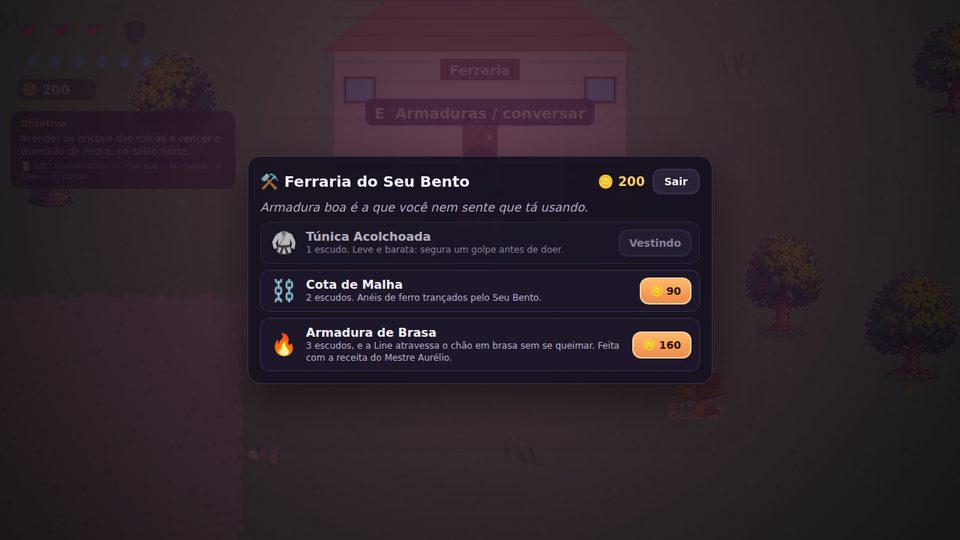
*A ferraria do Seu Bento com as três armaduras*

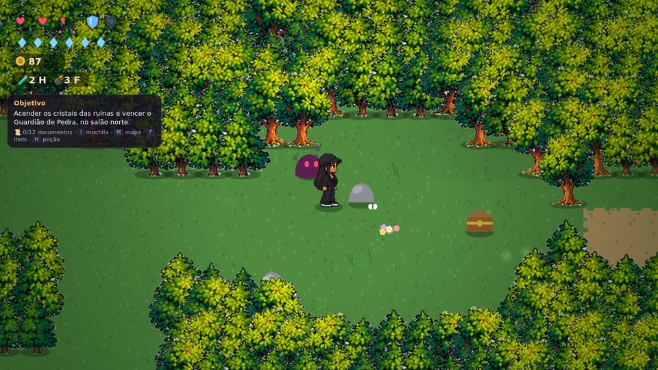
*HUD: corações, escudos da armadura, magia, moedas e o item do atalho*

### 7.4 Moradores do vilarejo

| Morador | Quem é | O que conta |
|---|---|---|
| Dona Rosa 🧪 | mercadora | fica sabendo da Bell e oferece poções e bombas; depois lembra para que servem as bombas |
| Seu Bento ⚒️ | ferreiro, aprendiz do Mestre Aurélio | conta que aprendeu o ofício na Forja Antiga e explica os escudos; ao ver a receita, reconhece a letra do mestre depois de cinquenta anos e passa a forjar a Armadura de Brasa |
| Seu Zé | o morador mais velho | empurrava o carrinho quando era moço; conta que há cinquenta anos a montanha esquentou e o Mestre Ivo fechou as minas e levou a alavanca; depois comemora o carrinho andando |
| Dona Lurdes | mulher do caçador Tobias | está aflita porque o marido não voltou; depois do bilhete, pede para a Line procurá-lo na montanha; quando a Line acha o Tobias, agradece com **2 Poções de Vida** (uma vez) |
| Tobias (na montanha) | caçador, com o pé torcido perto da fonte das brasas | viu o dragão pousar e ouviu a Bell cantando; “quando ela canta, o dragão para de rugir”; a Line conta que a Bell canta quando está com medo, para ficar corajosa |
| Pedrinho | menino curioso | conta da pedra rachada da floresta; depois que ela explode, fica encantado |

As falas mudam conforme o progresso (itens, documentos e o carrinho), e o jogo guarda com quem a Line já conversou.

### 7.5 Mochila e itens (um item, uma função)

A mochila abre com **I** (ou o botão 🎒 no celular, que mostra quantos itens novos chegaram) e pausa o jogo. Tem três abas: **Itens**, **Pistas** e **Mapa**. Também dá para abrir pela pausa.

No topo da aba Itens fica o **equipamento**: moedas, armadura e o item que está no **atalho**. Itens usáveis podem ser equipados no atalho e usados a qualquer momento com **F** (ou o botão do item no celular). A **poção** tem o atalho próprio **H** (botão 🧪).

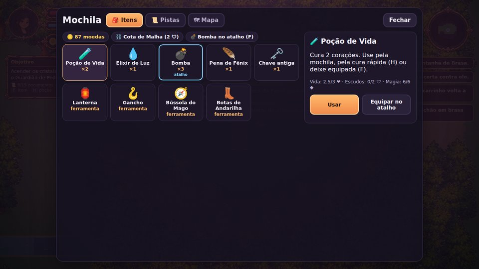
*A aba de itens: equipamento no topo, grade de itens e o detalhe do item escolhido*

| Item | Tipo | O que faz | Onde achar |
|---|---|---|---|
| 🧪 Poção de Vida | gasta ao usar · vai no atalho F | Cura 2 corações. Use pela mochila, pela cura rápida (H) ou deixe equipada (F). | loja da Dona Rosa (20); baús da floresta e da montanha |
| 💧 Elixir de Luz | gasta ao usar · vai no atalho F | Enche toda a magia de uma vez. | loja (25); baús da gruta, biblioteca, torre das ruínas e montanha |
| 💣 Bomba | gasta ao usar · vai no atalho F | Explode 2 segundos depois de colocada: quebra paredes e pedras rachadas e fere inimigos em volta. Afaste-se! Equipe e use com F. | loja (3 por 30); baús da floresta, vilarejo e Minas |
| 🪶 Pena de Fênix | gasta ao usar | Se a Line cair, a pena queima e ela se levanta com metade da vida. Funciona sozinha. | loja (80); do outro lado do abismo das Minas |
| 🗝️ Chave antiga | chave (some ao abrir) | Abre uma porta trancada e some. Há três portas trancadas pelo mundo. | baús da gruta, das ruínas e da montanha |
| 🏮 Lanterna | ferramenta (fica para sempre) | Clareia as galerias escuras das Minas de Cristal. Funciona sozinha. | salão de entrada das Minas |
| 🪝 Gancho | ferramenta (fica para sempre) | Perto de um poste de gancho, puxa a Line até o outro poste, por cima de rios e abismos. | sala leste das ruínas |
| 🧭 Bússola do Mago | ferramenta (fica para sempre) | Marca no mapa os baús que ainda não foram abertos, mesmo onde a Line ainda não passou. | salão norte da gruta |
| 👢 Botas de Andarilha | ferramenta (fica para sempre) | A Line corre mais rápido e não tropeça mais nas raízes. | loja da Dona Rosa (60) |
| ⚙️ Alavanca de Ferro | item da história | A alavanca do freio do carrinho de mina. Com ela encaixada, o carrinho volta a andar entre as estações. | Forja Antiga, na montanha |
| 🟢 Escama da Terra | item da história | Presente do Colosso libertado. Cheira a chuva no mato. O Seu Bento sabe usar escamas de guardião. |  |
| 🔵 Escama da Água | item da história | Presente da Serpente libertada. Sempre molhadinha e fresca. O Seu Bento sabe usar escamas de guardião. |  |
| ⚪ Pena-escama do Ar | item da história | Presente do Grifo libertado. Leve como nuvem. O Seu Bento sabe usar escamas de guardião. |  |

**Menos vida espalhada:** não existem mais pães, maçãs nem flores de cura pelo mapa. A vida volta nas **fontes**, nas **poções** (compradas ou achadas) e em corações que caem dos inimigos só de vez em quando (e nunca com a vida cheia). A chance de cair coração baixou para 25% no Fácil, 10% no Normal e 4% no Difícil.

### 7.6 Documentos de investigação e conclusões

A aba **Pistas** virou um caderno de investigação. São **12 documentos**, cada um com **tipo** (anotação, cartaz, carta, diário, pergaminho, mapa, relatório, receita, objeto), **autor**, **data**, o lugar onde foi achado e o texto completo em parágrafos. Cada tipo tem cara de papel diferente no leitor (o relatório é datilografado, o diário tem lombada, o cartaz tem moldura). Alguns documentos **marcam um lugar no mapa** com um alfinete 📍, sem acender a área.

Quando dois documentos combinam, a Line tira uma **conclusão** (aparece um título “💡 Conclusão!” e ela fica anotada no caderno). Algumas conclusões mudam o jogo.

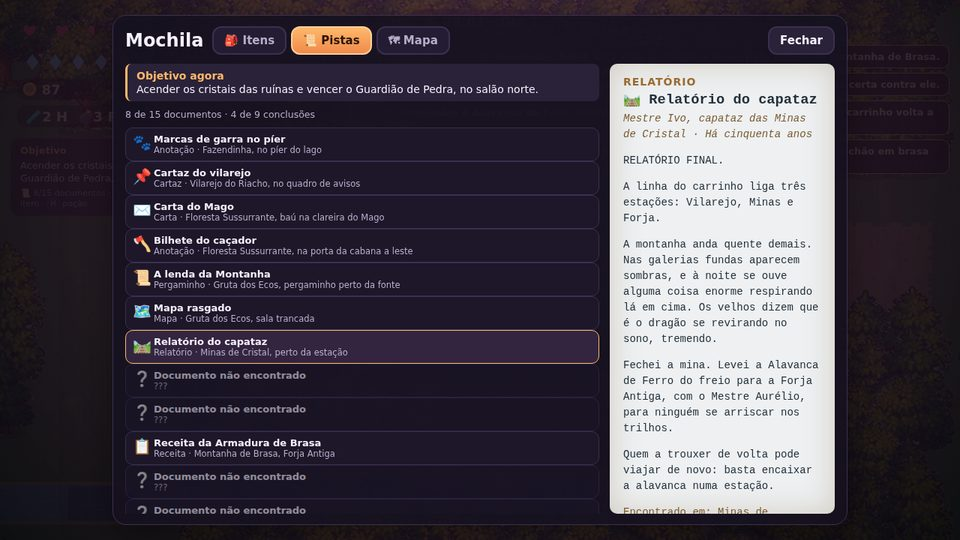
*O caderno de investigação com o relatório do capataz aberto*

| # | Documento | Tipo | Autor | Onde | Marca no mapa |
|---|---|---|---|---|---|
| 1 | 🐾 Marcas de garra no píer | Anotação | Anotação da Line | Fazendinha, no píer do lago | — |
| 2 | 📌 Cartaz do vilarejo | Cartaz | Conselho do Vilarejo do Riacho | Vilarejo do Riacho, no quadro de avisos | 📍 Clareira do Mago |
| 3 | ✉️ Carta do Mago | Carta | O Mago | Floresta Sussurrante, baú na clareira do Mago | 📍 Gruta dos Ecos |
| 4 | 🪓 Bilhete do caçador | Anotação | Tobias, caçador da floresta | Floresta Sussurrante, na porta da cabana a leste | 📍 Topo da montanha |
| 5 | 📜 A lenda da Montanha | Pergaminho | Autor desconhecido | Gruta dos Ecos, pergaminho perto da fonte | — |
| 6 | 🗺️ Mapa rasgado | Mapa | Cartógrafo das minas | Gruta dos Ecos, sala trancada | 📍 X vermelho da Forja |
| 7 | 🛤️ Relatório do capataz | Relatório | Mestre Ivo, capataz das Minas de Cristal | Minas de Cristal, perto da estação | 📍 Alavanca de Ferro |
| 8 | 📖 Diário do Guardião, página 1 | Diário | O Guardião de Pedra | Ruínas Encantadas, no chão perto do altar | — |
| 9 | 📖 Diário do Guardião, página 2 | Diário | O Guardião de Pedra | Ruínas Encantadas, biblioteca trancada | — |
| 10 | 📋 Receita da Armadura de Brasa | Receita | Mestre Aurélio, ferreiro da forja | Montanha de Brasa, Forja Antiga | 📍 Ferraria do Seu Bento |
| 11 | 🔥 Escama vermelha | Objeto encontrado | Anotação da Line | Montanha de Brasa, caverna escondida | — |
| 12 | 🎀 Fita de cabelo da Bell | Objeto encontrado | Anotação da Line | Montanha de Brasa, perto do portão de fogo | — |
| 13 | 🌱 Diário da Dona Cora | Diário | Dona Cora, jardineira do vale | Vale das Raízes, perto da horta | 📍 Ninho do Colosso |
| 14 | 🎵 Canção das águas | Pergaminho | Vó do Seu Tião | Lago Espelhado, margem leste | 📍 Ilha da Serpente |
| 15 | 🪶 Pena de tempestade | Objeto encontrado | Anotação da Bell | Picos do Vento, platô leste | 📍 Ninho do Grifo |

**Conclusões:**

| Conclusão | Junta | Efeito no jogo |
|---|---|---|
| 💡 A Bell está viva: o dragão a levou para o topo da Montanha de Brasa. | Marcas de garra no píer + Bilhete do caçador | — |
| 💡 O dragão teme a luz. A magia das Ruínas é a arma certa contra ele. | Carta do Mago + A lenda da Montanha | — |
| 💡 Os cristais são as chaves das barreiras, e o Guardião guarda a Chuva de Estrelas no peito. | Diário do Guardião, página 1 + Diário do Guardião, página 2 | — |
| 💡 A Alavanca de Ferro está na Forja Antiga. Encaixada numa estação, o carrinho volta a andar. | Relatório do capataz + Mapa rasgado | — |
| 💡 O Seu Bento, do vilarejo, sabe forjar a Armadura de Brasa: com ela, o chão em brasa não queima. | Receita da Armadura de Brasa + Cartaz do vilarejo | A Armadura de Brasa aparece na ferraria. |
| 💡 Quando o dragão cansa, o peito racha e fica exposto. E o fogo lá dentro está fraco: ele está com frio. | A lenda da Montanha + Escama vermelha | Golpes no peito do dragão tiram 1 de vida a mais. |
| 💡 A Chuva de Estrelas apaga o fogo do dragão por um instante. | Diário do Guardião, página 2 + Escama vermelha | A Chuva de Estrelas interrompe o fogo do dragão. |
| 💡 A Bell deixou a fita de propósito: ela está logo depois do portão de fogo. | Fita de cabelo da Bell + Mapa rasgado | — |
| 💡 Todos os guardiões adoeceram do mesmo jeito: a sombra de muitas cores. A Quimera morde, rouba a luz e deixa o resto bravo. | Diário da Dona Cora + Canção das águas + Pena de tempestade | Os chefes ficam cansados um ataque mais cedo. |

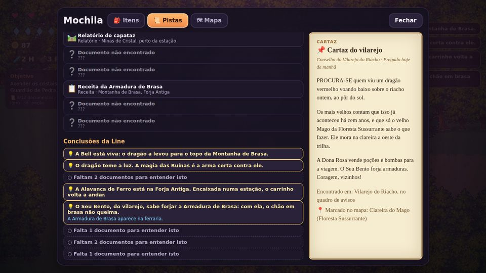
*As conclusões da Line, embaixo da lista de documentos*

**O que a Line diz ao achar cada documento** (depois de ler o texto):

| Documento | Fala da Line |
|---|---|
| 🐾 Marcas de garra no píer | “Aguenta firme, Bell.” |
| 📌 Cartaz do vilarejo | “Então não fui só eu que vi... O vilarejo inteiro tá assustado.” |
| ✉️ Carta do Mago | “O Mago sabia de tudo isso... e mesmo assim me deu uma espada. Ele acredita em mim.” |
| 🪓 Bilhete do caçador | “Uma moça de óculos gritando um nome... Era o meu. Ela tava me chamando.” |
| 📜 A lenda da Montanha | “Fome de luz... o coração mais brilhante. Claro que ele levou a Bell.” |
| 🗺️ Mapa rasgado | “Com esse pedaço de mapa, agora eu sei onde fica o covil. E tem uma caverna escondida na montanha!” |
| 🛤️ Relatório do capataz | “A alavanca do carrinho tá na Forja Antiga... Se eu achar, dá pra cortar caminho pelos trilhos.” |
| 📖 Diário do Guardião, página 1 | “Os cristais são as chaves... Por isso as barreiras brilham igualzinho a eles.” |
| 📖 Diário do Guardião, página 2 | “A Chuva de Estrelas tá no peito do Guardião. Vou ter que vencer ele.” |
| 📋 Receita da Armadura de Brasa | “Mestre Aurélio... o Seu Bento aprendeu com ele! Preciso mostrar isso pra ele no vilarejo.” |
| 🔥 Escama vermelha | “Fria. Um dragão de fogo com escama fria... Igual ao sonho da Bell.” |
| 🎀 Fita de cabelo da Bell | “Bell... Ela deixou cair de propósito. Eu sei que deixou. Tô chegando, amor.” |
| 🌱 Diário da Dona Cora | “Ele cansa depois de bater três vezes... e a flor do peito abre. Coitado, deve doer mesmo.” |
| 🎵 Canção das águas | “Bell, olha: uma canção de ninar pra Serpente. Você canta isso?” |
| 🪶 Pena de tempestade | “A letra é da Bell! “Aí é com ela”... Pode deixar, amor.” |

Ao juntar os 12 documentos: título **Caderno completo!**, coração extra e a fala “Agora eu sei tudo sobre esse dragão. Segura, Bell, que eu tô indo.”

**Textos completos dos documentos:**

> **🐾 Marcas de garra no píer** · *Anotação · Anotação da Line · Ontem, depois do pôr do sol*  
> Três riscos fundos na madeira do píer, e um rastro de brasa apagada apontando para o norte, na direção da floresta.  
>
> Não tem sangue em lugar nenhum. Ele levou a Bell, não machucou. Ela está viva.  
>
> Anotei a direção. Eu vou atrás.  
>
> *Encontrado em: Fazendinha, no píer do lago*

> **📌 Cartaz do vilarejo** · *Cartaz · Conselho do Vilarejo do Riacho · Pregado hoje de manhã*  
> PROCURA-SE quem viu um dragão vermelho voando baixo sobre o riacho ontem, ao pôr do sol.  
>
> Os mais velhos contam que isso já aconteceu há cem anos, e que só o velho Mago da Floresta Sussurrante sabe o que fazer. Ele mora na clareira a oeste da trilha.  
>
> A Dona Rosa vende poções e bombas para a viagem. O Seu Bento forja armaduras. Coragem, vizinhos!  
>
> *Encontrado em: Vilarejo do Riacho, no quadro de avisos*

> **✉️ Carta do Mago** · *Carta · O Mago · Sem data*  
> Para quem encontrar esta carta:  
>
> O dragão vermelho dorme há cem anos na Montanha de Brasa. Quando acorda, leva o que mais brilha aos olhos dele. Selou a montanha com magia antiga: só a luz das Ruínas Encantadas atravessa o selo.  
>
> Há também uma gruta a leste desta floresta, onde guardei coisas que podem ajudar.  
>
> — O Mago  
>
> *Encontrado em: Floresta Sussurrante, baú na clareira do Mago*

> **🪓 Bilhete do caçador** · *Anotação · Tobias, caçador da floresta · Ontem à noite*  
> Lurdes, se você achar este bilhete antes de mim: não se preocupe.  
>
> Ao pôr do sol, o clarão vermelho passou por cima da cabana carregando alguém: uma moça de óculos, gritando um nome. Foi direto para o topo da Montanha de Brasa.  
>
> Vou subir atrás dele para ver onde ele pousa. Volto logo.  
>
> Se outra pessoa ler isto: o caminho mais curto até a montanha passa pelas Ruínas. As Minas, a leste, também chegam lá, para quem tiver luz e coragem.  
>
> *Encontrado em: Floresta Sussurrante, na porta da cabana a leste*

> **📜 A lenda da Montanha** · *Pergaminho · Autor desconhecido · Há cem anos*  
> A cada cem anos o dragão desperta com fome de luz. Leva para o covil a pessoa de coração mais brilhante e a guarda numa jaula de ferro.  
>
> Os antigos diziam que o fogo dele esfria enquanto ele dorme, e que é o frio que o acorda. Ninguém nunca perguntou por quê.  
>
> Dizem também que o dragão não teme a espada: teme a luz, que o cansa. E quando cansa, o peito dele se abre.  
>
> *Encontrado em: Gruta dos Ecos, pergaminho perto da fonte*

> **🗺️ Mapa rasgado** · *Mapa · Cartógrafo das minas · Há cem anos*  
> Um pedaço de mapa antigo. Mostra a Montanha de Brasa: um portão de fogo guardado por três tochas e, depois dele, o covil no topo.  
>
> Na encosta leste, uma porta de ferro esconde uma caverna. E há um X vermelho numa sala chamada Forja Antiga.  
>
> *Encontrado em: Gruta dos Ecos, sala trancada*

> **🛤️ Relatório do capataz** · *Relatório · Mestre Ivo, capataz das Minas de Cristal · Há cinquenta anos*  
> RELATÓRIO FINAL.  
>
> A linha do carrinho liga três estações: Vilarejo, Minas e Forja.  
>
> A montanha anda quente demais. Nas galerias fundas aparecem sombras, e à noite se ouve alguma coisa enorme respirando lá em cima. Os velhos dizem que é o dragão se revirando no sono, tremendo.  
>
> Fechei a mina. Levei a Alavanca de Ferro do freio para a Forja Antiga, com o Mestre Aurélio, para ninguém se arriscar nos trilhos.  
>
> Quem a trouxer de volta pode viajar de novo: basta encaixar a alavanca numa estação.  
>
> *Encontrado em: Minas de Cristal, perto da estação*

> **📖 Diário do Guardião, página 1** · *Diário · O Guardião de Pedra · Há mil anos*  
> Fui feito de pedra para guardar a luz.  
>
> Os cristais do templo são minhas chaves: acesos, as barreiras caem.  
>
> Se alguém chegar aqui com um coração corajoso, que a luz do altar o escolha.  
>
> *Encontrado em: Ruínas Encantadas, no chão perto do altar*

> **📖 Diário do Guardião, página 2** · *Diário · O Guardião de Pedra · Há mil anos*  
> O dragão tem medo da Chuva de Estrelas. Quando as estrelas caem em volta dele, o fogo dele apaga por um instante.  
>
> Guardo essa magia no meu peito. Só a entrego para quem me vencer sem ódio.  
>
> *Encontrado em: Ruínas Encantadas, biblioteca trancada*

> **📋 Receita da Armadura de Brasa** · *Receita · Mestre Aurélio, ferreiro da forja · Há cinquenta anos*  
> Receita da Armadura de Brasa: cota de malha temperada no calor da montanha, com placas de cobre por cima.  
>
> Resiste à brasa rasa: quem a veste atravessa o chão em brasa sem se queimar.  
>
> Vou deixar a forja. A montanha esquentou demais, e o Ivo fechou as minas. Meu aprendiz, o jovem Bento, sabe fazer esta armadura: quem achar esta receita, leve até ele no vilarejo.  
>
> *Encontrado em: Montanha de Brasa, Forja Antiga*

> **🔥 Escama vermelha** · *Objeto encontrado · Anotação da Line · Hoje*  
> Uma escama do tamanho da minha mão. Fria. Um dragão de fogo, e a escama dele está fria.  
>
> Está rachada no meio. O peito dele é o lugar mais fraco, exatamente como a lenda diz.  
>
> E ele perde escamas quando voa alto: então ele se cansa quando mergulha.  
>
> *Encontrado em: Montanha de Brasa, caverna escondida*

> **🎀 Fita de cabelo da Bell** · *Objeto encontrado · Anotação da Line · Hoje*  
> A fita azul que a Bell usava hoje de manhã.  
>
> Ela deixou cair de propósito, eu sei: é o jeito dela de dizer “tô aqui, vem me buscar”.  
>
> Falta pouco, amor.  
>
> *Encontrado em: Montanha de Brasa, perto do portão de fogo*

> **🌱 Diário da Dona Cora** · *Diário · Dona Cora, jardineira do vale · Semana passada*  
> Segunda: uma sombra de muitas cores passou baixinho sobre o vale. Tinha cheiro de pedra queimada.  
>
> Terça: o Colosso não veio regar as raízes. Elas acordaram sozinhas e derrubaram o Zeca da carroça.  
>
> Quarta: vi o Colosso de longe. Folhas pretas nas costas. Bate no chão três vezes e depois para, ofegando, com a flor do peito aberta. Coitado. Parece que dói.  
>
> *Encontrado em: Vale das Raízes, perto da horta*

> **🎵 Canção das águas** · *Pergaminho · Vó do Seu Tião · Há muito tempo*  
> “Dorme, serpente, que a lua já vem,
espelha as estrelas, não morde ninguém...”  
>
> Quando a Serpente mergulha, ninguém a alcança: olha as bolhas, que ela sai debaixo delas.  
>
> Mas quando alguém canta pra ela, ela para pra ouvir. Toda fera para.  
>
> *Encontrado em: Lago Espelhado, margem leste*

> **🪶 Pena de tempestade** · *Objeto encontrado · Anotação da Bell · Hoje*  
> Uma pena enorme, cinza por cima e branca por baixo. Dá choquinho quando encosta.  
>
> O Grifo voa alto demais pra espada da Line. Mas as minhas estrelas sobem!  
>
> E quando cansa, ele pousa. Aí é com ela.  
>
> *Encontrado em: Picos do Vento, platô leste*

### 7.7 Carrinho de mina

Três estações ligadas por trilhos: **Vilarejo**, **Minas** (na gruta) e **Forja** (na montanha). O carrinho começa quebrado: falta a **Alavanca de Ferro** do freio, que o capataz levou para a Forja Antiga quando o dragão acordou.

1. Chegar perto de uma estação a marca como **descoberta** (aviso “🛤️ Estação descoberta”).
2. Sem a alavanca, o botão diz **Ver o carrinho** e a Line comenta o que falta (e, se já leu o relatório do capataz, lembra onde a alavanca está).
3. Com a alavanca, o botão diz **Encaixar a alavanca**: a Line encaixa, aparece “Carrinho consertado!” e a alavanca sai da mochila.
4. Daí em diante, **Viajar de carrinho** abre a escolha do destino. Só aparecem as estações já descobertas; as outras ficam com cadeado.
5. A viagem é uma cena: a Line entra no carrinho, ele desce os trilhos e sai da tela, e chega na outra estação do mesmo jeito.


*A estação do vilarejo com a alavanca encaixada*

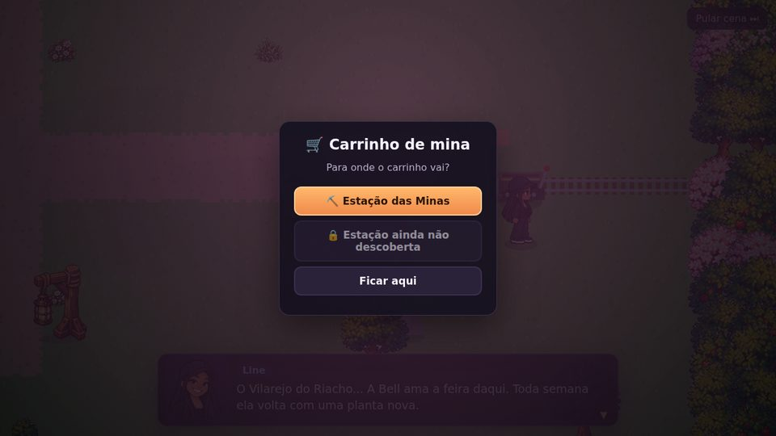
*Escolha do destino*

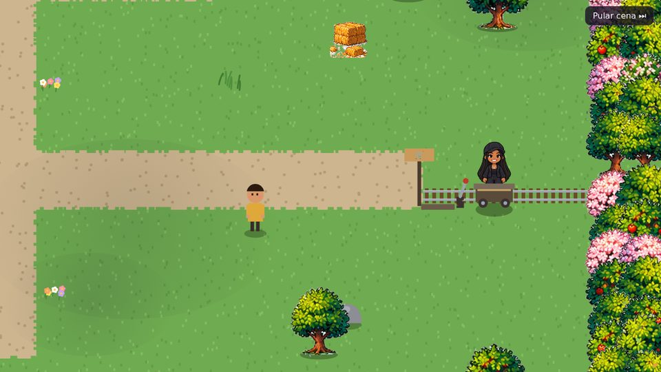
*A Line andando de carrinho*

### 7.8 Bombas, gancho, chão em brasa e galerias escuras

- **Paredes e pedras rachadas 🪨:** têm rachaduras desenhadas. Uma **bomba** (atalho **F**) explode 2 segundos depois de colocada, quebra as rachaduras num raio de 2 tiles, fere inimigos em volta (o Guardião só quando está tonto) e machuca a Line se ela ficar perto. Cabem 2 bombas acesas ao mesmo tempo. O que explodiu fica salvo. Há uma pedra rachada na floresta e duas paredes nas Minas.
- **Postes do gancho 🪝:** vêm em pares, um de cada lado da água ou do abismo. Com o **gancho** na mochila, perto de um poste aparece **Usar o gancho** e a Line é puxada pela corda até depois do outro poste. Dá para ir e voltar. Pares: lago da floresta, fosso das ruínas e abismo das Minas.
- **Chão em brasa 🔥:** queima meio coração a cada meio segundo, sem defesa. Só a **Armadura de Brasa** protege.
- **Galerias escuras:** nas Minas, a tela escurece em volta da Line. Sem a lanterna ela enxerga um círculo pequeno e o mapa abre bem devagar; com a lanterna, a luz fica quente e bem maior.

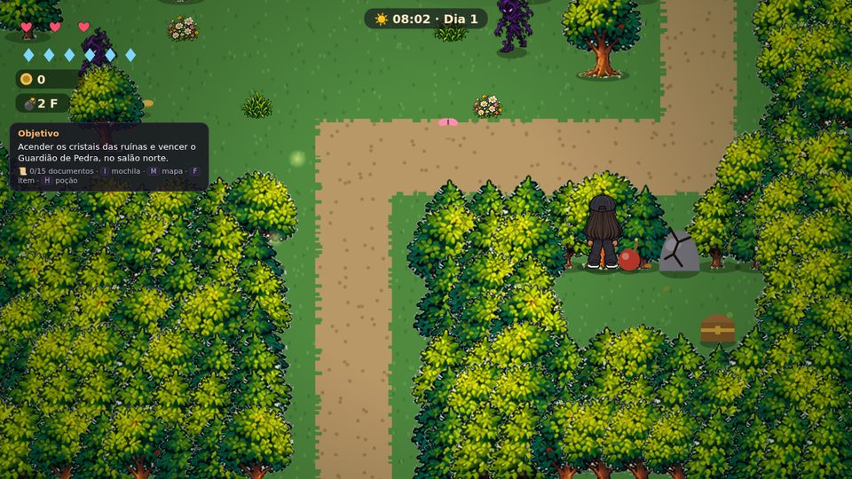
*Bomba acesa perto da pedra rachada da floresta*

### 7.9 Mapa: só acende onde a Line passou

A aba **Mapa** (tecla **M**) tem duas visões:

- **Área:** o lugar atual em miniatura. **Só aparece o que a Line já viu**: a névoa abre num raio de 7 tiles enquanto ela anda (3 no escuro sem lanterna), e o que foi explorado fica salvo. Ícones: baús, fontes, cristais e tochas, portas trancadas, documentos, paredes rachadas, postes do gancho, estações, lojas, placas, moradores, saídas e a Line (bolinha rosa). Com a **Bússola do Mago**, os baús fechados aparecem mesmo na névoa. Os documentos põem **alfinetes 📍** nos lugares que citam, mesmo em áreas ainda apagadas, **sem acender a área**.
- **Mundo:** um pergaminho com os lugares ligados por trilhas. **Só acendem os lugares visitados** (e a fazenda); os vizinhos aparecem como “Lugar desconhecido”. Depois que o carrinho é consertado, a linha dos trilhos aparece ligando as três estações. Embaixo de cada lugar: porcentagem explorada, baús abertos e documentos achados.

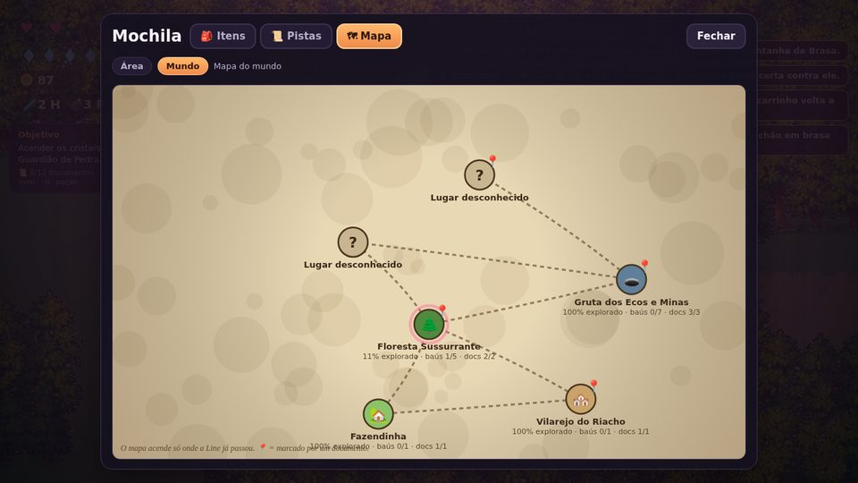
*Mapa do mundo: só os lugares visitados acendem*

### 7.10 Todos os baús

| Área | Onde | O que tem |
|---|---|---|
| Fazendinha | atrás do chiqueiro (aparece depois do rapto) | 🪙 20 moedas |
| Vilarejo do Riacho | canto sudeste do vilarejo, perto do riacho | 💣 Bomba ×2 + 🪙 30 moedas |
| Floresta Sussurrante | clareira do Mago | ⚔️ a espada |
| Floresta Sussurrante | clareira do Mago, mais ao sul | ✉️ Carta do Mago + 🪙 10 moedas |
| Floresta Sussurrante | meio da trilha leste | 🪙 25 moedas |
| Floresta Sussurrante | ilha no lago da clareira leste (só com o **gancho**) | 🧪 Poção de Vida + 🪙 30 moedas |
| Floresta Sussurrante | canto sudeste, atrás da **pedra rachada** (precisa de **bomba**) | 💣 Bomba ×2 + 🪙 45 moedas |
| Gruta dos Ecos | salão norte | 🧭 Bússola do Mago |
| Gruta dos Ecos | canto oeste | 💧 Elixir de Luz |
| Gruta dos Ecos | nicho leste | 🗝️ Chave antiga |
| Gruta dos Ecos | sala trancada do sul (precisa de **chave**) | ❤️ coração extra |
| Gruta dos Ecos | salão de entrada das Minas | 🏮 Lanterna |
| Gruta dos Ecos | galeria escura das Minas (precisa de **lanterna** para achar) | 💣 Bomba ×3 |
| Gruta dos Ecos | do outro lado do abismo das Minas (só com o **gancho**) | 🪶 Pena de Fênix + 🪙 40 moedas |
| Ruínas Encantadas | alcova do salão do meio (abre com um cristal) | ❤️ coração extra |
| Ruínas Encantadas | ala leste da entrada | 🗝️ Chave antiga + 🪙 20 moedas |
| Ruínas Encantadas | biblioteca trancada (precisa de **chave**) | 💧 Elixir de Luz + 📖 Diário do Guardião, página 2 |
| Ruínas Encantadas | sala leste nova | 🪝 Gancho |
| Ruínas Encantadas | torre nordeste, do outro lado do fosso (só com o **gancho**) | 💧 Elixir de Luz + 🪙 60 moedas |
| Montanha de Brasa | plataforma cercada de fendas, no topo | ❤️ coração extra |
| Montanha de Brasa | encosta leste | 🗝️ Chave antiga + 🪙 20 moedas |
| Montanha de Brasa | caverna escondida (precisa de **chave**) | 🧪 Poção de Vida + 🪙 30 moedas |
| Montanha de Brasa | Forja Antiga (sala do X vermelho do mapa) | ⚙️ Alavanca de Ferro |
| Montanha de Brasa | depois do chão em brasa (só com a **Armadura de Brasa**) | 💧 Elixir de Luz + 🪙 90 moedas |

São **24 baús** (3 com coração extra), **3 portas trancadas** e **3 chaves** (qualquer chave abre qualquer porta e some depois de usada).

### 7.11 Tochas e cristais: como achar

- **Tochas apagadas** têm brasa fraca, soltam fumaça e têm um anel laranja pulsando no chão.
- Ao chegar na montanha pela primeira vez, a câmera mostra as **três tochas**.
- Cada luz acesa mostra a contagem: **🔥 Tocha acesa (1/3)**, **💎 Cristal aceso (1/2)**. O painel **Objetivo** mostra **(n/3 acesas)**.
- No mapa, as tochas da montanha aparecem mesmo onde a Line ainda não passou, e as apagadas piscam.

| Grupo | Onde | Luzes | Abre |
|---|---|---|---|
| Barreira sul | Ruínas, salão de entrada | 2 cristais | o salão do meio |
| Barreira do meio | Ruínas, salão do meio (2 nas ilhotas dos lagos) | 3 cristais | o salão norte (Guardião) |
| Alcova | Ruínas, salão do meio (leste) | 1 cristal | o baú de coração extra |
| Atalho das Minas | Ruínas, sala sudeste | 1 cristal | o corredor para as Minas |
| Portão de fogo | Montanha: entrada, ilha de lava e topo | 3 tochas | o caminho para o covil |

### 7.12 Arte necessária para a exploração

| Objeto | Como está hoje | Arte final sugerida |
|---|---|---|
| Itens da mochila (10) | emojis + bolinha colorida no chão | ícone 64×64 de cada item e versão pequena no chão |
| Moedas | moedinhas amarelas desenhadas no código | moeda dourada com brilho girando (4 a 6 quadros) |
| Moradores (5) | bonecos simples desenhados no código | sprites parados e andando (frente/lado/costas) no estilo da Line e da Bell; retratos para os diálogos |
| Casas do vilarejo, loja e ferraria | casa genérica com letreiro | casas de telhado colorido; loja com toldo e prateleira; ferraria com fornalha |
| Barraca de feira, bigorna | desenho simples | barraca com toldo listrado e frutas; bigorna com brasa animada |
| Carrinho de mina e estação | caixa com rodas, placa e alavanca | carrinho de madeira com ferragens; estação com plataforma; animação do carrinho andando e da Line dentro |
| Trilhos | tiles desenhados no código | tiles de trilho retos e curvos |
| Parede e pedra rachada | rachaduras desenhadas | versão de caverna (gruta, ruínas, montanha) e de floresta; animação de desmoronar |
| Bomba | bolinha preta com pavio | bomba redonda com pavio aceso piscando e explosão (6 a 8 quadros) |
| Poste do gancho e corda | poste de madeira com argola | poste com argola de ferro; corda e gancho; Line pendurada atravessando (`LINE_GRAPPLE`, sugestão nova) |
| Chão em brasa | tiles com brasa pulsando | tiles de brasa rasa com brilho animado |
| Morcego | desenhado no código | morcego dormindo pendurado, voando e dando rasante |
| Escuro e lanterna | gradiente em volta da Line | a própria Line segurando a lanterna (`LINE_LANTERN_WALK`, sugestão nova) |
| Escudos da armadura | escudos azuis no HUD | ícone de escudo cheio e vazio |
| Armaduras na Line | não aparecem no sprite | variações de roupa da Line para túnica, malha e brasa (opcional) |
| Documentos no chão | papel com linhas | um ícone por tipo: bilhete, pergaminho, mapa, relatório, receita, objeto |

## 8. Como se joga

### 8.1 Controles

| Ação | Teclado | Controle | Celular |
|---|---|---|---|
| Andar | WASD / setas | analógico | arrastar no lado esquerdo |
| Correr | Shift (segurar) | gatilho / analógico até o fim | arrastar até o fim |
| Atacar (3x = combo; sem espada, soco) | J / Z | A | ⚔ |
| Ataque giratório | K / X | X | segurar ⚔ |
| Esquivar (correndo = dash) | L / C | B | 💨 |
| Defender (segurar) | V / B | LB | 🛡 |
| Pular (+ atacar no ar) | Espaço | Y | ⤴ |
| Magia: Raio de Luz | Q / U | RB | ✨ |
| Chuva de Estrelas | segurar Q / U e soltar | segurar RB | segurar ✨ |
| Interagir / ler / abrir | E / Enter | Select | botão que aparece |
| Mochila (itens e documentos) | I | — | 🎒 |
| Mapa | M | — | 🎒 → Mapa |
| Usar poção | H | — | equipe a poção e use o botão do item |
| Usar o item do atalho (bomba, poção, elixir…) | F | — | botão do item (💣 / 🧪 …) |
| Pausar | Esc / P | Start | ⏸ |
| Pular cena | Tab | — | Pular cena |

**Posição dos botões no celular:** o joystick fica na metade esquerda da tela. Os botões de ação formam um **arco em volta do ⚔**, no canto direito: ⤴ pular à esquerda, ✨ magia na diagonal, 💨 esquivar em cima e 🛡 defender no arco de fora; o **item do atalho** (bomba, poção, elixir… o que estiver equipado) e o **🔄 trocar heroína** ficam no topo do arco, longe do joystick. O botão de interagir aparece mais acima ainda. Não existe mais o botão 🌀: **segurando o ⚔** sai o giro (Line) ou o leque de estrelas (Bell), emendado no golpe. **Sem espada**, o ⚔ dá um **soco** de alcance curto (a arte do soco na máquina do primeiro encontro).

#### Ícones dos botões do celular

Todos os botões de toque, o que cada um faz e quando aparece. Hoje são emojis: para a arte final, cada ícone vira um desenho em pixel art no mesmo estilo do jogo (tamanhos na tabela).

| Ícone | Botão | O que faz | Quando aparece | Onde fica | Arte final (desenhar) |
|---|---|---|---|---|---|
| — | Joystick | arrastar na metade esquerda move a Line; até o fim, corre | sempre (em jogo) | metade esquerda da tela | base 120×120 e pino 52×52 (desenhar em 2×: 240 e 104) |
| ⚔ | Atacar | golpe de espada (3 toques = combo); **segurar** = giro da Line ou leque de estrelas da Bell; **sem espada, soco**; perto de algo, interage | sempre | canto inferior direito (o maior) | ícone 80×80 (desenhar 160×160): espada; com a Bell, estrela |
| ⤴ | Pular | pula; no ar, ⚔ faz o ataque aéreo | com espada | à esquerda do ⚔ | 62×62 (desenhar 124×124) |
| 💨 | Esquivar | esquiva; correndo vira dash | com espada | acima do ⚔ | 62×62 (124×124) |
| 🛡 | Defender | segurar para bloquear | com espada (apagado antes) | arco de fora, à esquerda | 62×62 (124×124) |
| ✨ | Magia | Raio de Luz; segurar e soltar = Chuva de Estrelas; com a Bell, canção | depois de aprender a magia | na diagonal, entre ⤴ e 💨 | 62×62 (124×124); com a Bell, nota musical |
| 💣 🧪 💧… | Item do atalho | usa o item equipado na mochila: bomba, poção, elixir, pena… (mostra o ícone e a quantidade). **Poção e bomba usam o mesmo botão**: equipe na mochila o que quiser deixar ali | quando há um item equipado com quantidade | topo do arco | 44×44 (88×88): um ícone por item, os mesmos da mochila |
| 🔄 | Trocar heroína | troca entre a Line e a Bell (mostra quem entra: 💖 Bell ou ⚔ Line) | Parte 2, com a Bell jogável | topo do arco, à direita do item | 44×44 (88×88): as duas carinhas com setas |
| 🎒 | Mochila | itens, documentos, conclusões e mapa | fora das cenas | canto superior direito | 44×44 (88×88) |
| ⏸ | Pausar | abre a pausa | fora das cenas | canto superior direito | 44×44 (88×88) |
| texto | Interagir | aparece com o nome da ação (Abrir, Ler, Entrar, Comprar / conversar, Carinho…) | perto de algo que dá para usar | acima de todos, à direita | botão de texto (borda e fundo em pixel art, 9-slice) |
| Pular cena ⏭ | Pular cena | pula a cena atual | durante as cenas | canto superior direito | botão de texto |

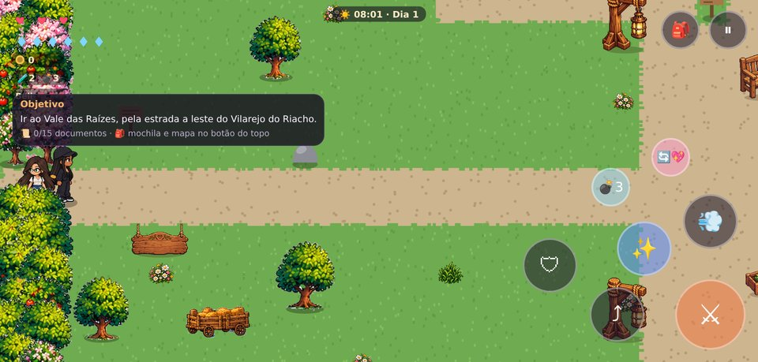
*Os botões no celular: o item do atalho e a troca de heroína em cima; ataque, pulo, esquiva, defesa e magia embaixo*

### 8.2 Combate com espada

| Golpe | Animação | Dano | Observação |
|---|---|---|---|
| 1º golpe | `LINE_ATTACK_HORIZONTAL` | 1 | começa o combo |
| 2º golpe | `LINE_ATTACK_VERTICAL` | 1 | apertar de novo durante o 1º |
| 3º golpe | `LINE_ATTACK_COMBO` | 1 + 1 | acerta duas vezes |
| Ataque correndo | `LINE_ATTACK_DIAGONAL` | 2 | com investida para frente |
| Giro | `LINE_ATTACK_SPIN` | 2 | acerta em volta |
| Ataque aéreo | `LINE_ATTACK_AIR` | 2 | pular + atacar, com onda de choque ao cair |
| Golpe final | `LINE_DRAGON_FINAL_ATTACK` | — | só no fim da luta com o dragão |

- **Defesa:** segurar bloqueia golpes físicos (não bloqueia fogo). Leva a `LINE_BLOCK`.
- **Esquiva e dash:** a Line fica invencível por um instante (`LINE_DODGE` e `LINE_DASH`).
- **Guardar a espada:** depois de 4 segundos sem inimigos por perto, ela guarda a espada sozinha (`LINE_SWORD_SHEATHE`).

### 8.3 Magia

- **Raio de Luz** (aprendido no altar das ruínas):
  - Custa 1 ◆.
  - A mira vai sozinha no inimigo ou cristal mais perto à frente. O Guardião é mira certa.
  - As sombras levam dano extra.
  - Acende cristais e tochas e queima espinhos.
- **Chuva de Estrelas** (depois de vencer o Guardião):
  - Segurar o botão até a Line brilhar e soltar. Custa 3 ◆.
  - Explosão em volta que atinge todos os inimigos e acende cristais e tochas próximos.
- **Barra de magia:** 6 ◆ embaixo dos corações.
  - Recarrega sozinha, cerca de 1 ◆ a cada 2,6 s no Normal.
  - Os cristais azuis que os inimigos soltam dão +2 ◆.

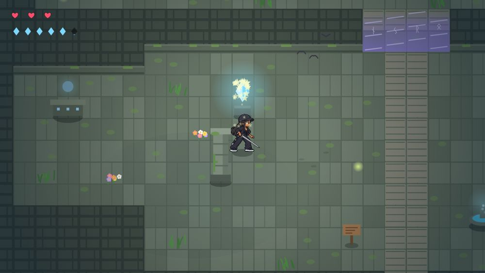
*Raio de Luz acendendo um cristal*

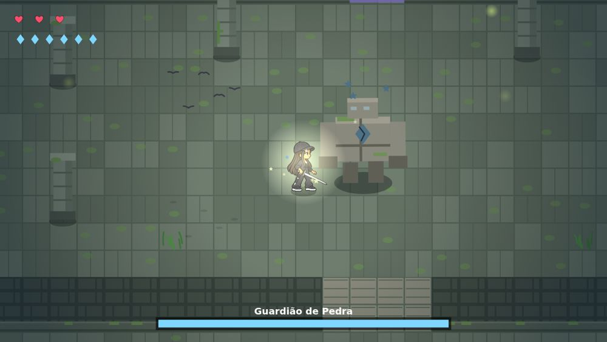
*Carregando a Chuva de Estrelas*

### 8.4 Vida, itens e progresso

- **Corações:**
  - Começam em 3 (6 metades), e cada baú de coração extra dá mais 1.
  - No Fácil, a Line ganha 1 coração a mais.
  - Com 1 coração ou menos, ela fica com a animação de exausta.
- **Coração no chão:** cura 1 coração. Cai dos inimigos só de vez em quando (e nunca com a vida cheia).
- **Escudos (armadura):** cada escudo segura um golpe antes dos corações e volta sozinho depois de um tempo sem apanhar (seção 7.3).
- **Moedas:** caem dos inimigos e saem dos baús; servem na loja e na ferraria (seção 7.2).
- **Pena de Fênix:** se estiver na mochila quando a Line cair, ela queima e a Line levanta com metade da vida.
- **Cristal azul:** +2 ◆ de magia. Também cai dos inimigos.
- **Fontes:** curam tudo, enchem a magia e viram ponto de retorno. Se a Line cair, ela volta para a última fonte bebida naquela área.
- **Água e fendas:** cair tira meio coração e devolve a Line para o último lugar seguro.
- **Portas trancadas:** três portas de ferro (gruta, ruínas e montanha). Chegue perto: com uma chave antiga aparece **Abrir com a chave**; sem chave, **Trancada**.
- **Salvamento automático:** ao entrar em cada área, ao abrir baús, pegar itens e documentos, comprar, abrir portas, explodir paredes, acender cristais, descobrir estações e beber das fontes, e ao abrir a mochila. O botão **Continuar** retoma dali, com a mochila, as moedas, a armadura, os documentos e o mapa explorado. Saves de versões antigas são convertidos sozinhos (pães e maçãs viram moedas, a Flor da Lua vira poção, e as áreas que cresceram recomeçam do zero).

### 8.5 Dificuldade

| | Fácil 🌸 | Normal ⚔ | Difícil 🔥 |
|---|---|---|---|
| Vida dos chefes | 60% | 100% | 135% |
| Velocidade dos ataques | mais lentos (1,35×) | normal | mais rápidos (0,85×) |
| Corações extras | +1 | — | — |
| Chance de cair coração (só com a vida incompleta) | 25% | 10% | 4% |
| Recarga da magia | 1,7× | 1× | 0,75× |
| Guarda aberta do Guardião | +30% | normal | −20% |
| Espada no Guardião com a guarda fechada | arranha um pouco | não | não |

A dificuldade fica salva no navegador e pode ser trocada a qualquer momento, também pela pausa.

## 9. Inimigos e chefes

**Inteligência dos inimigos (nova):** todos enxergam de verdade, com linha de visão, e não veem a Line através de paredes, árvores e casas. Quando perdem a Line de vista, procuram um caminho pela grade do mapa e contornam os obstáculos. Quem vê a Line primeiro **avisa os vizinhos**, e eles não se amontoam uns em cima dos outros. Ninguém entra no chão em brasa.

### Sombra
- **Vida:** 3.
- **Comportamento:** vaga até ver a Line. Então persegue pelo caminho mais curto, tenta **chegar pelo lado** quando há outra sombra atacando de frente, se prepara e dá uma investida. Com 1 de vida, **foge** e volta depois. Se a Line some por muito tempo, volta para o seu canto.
- **Defesa:** bloquear a investida deixa a sombra tonta.
- **Fraqueza:** leva dano extra da luz.
- **Onde aparece:** na floresta (depois da espada), nas ruínas (depois da magia) e na montanha.

### Fogo-fátuo
- **Vida:** 2.
- **Comportamento:** flutua, mantém distância, se prepara brilhando e atira um orbe lento, que dá para pular ou bloquear.
- **Onde aparece:** nas ruínas e na gruta (azul) e na montanha (de fogo).
- **Novo:** só atira quando enxerga a Line; se ela se esconde atrás de uma parede, ele contorna até achar um ângulo.

### Morcego (novo)
- **Vida:** 1.
- **Comportamento:** dorme pendurado nas galerias escuras das Minas. Acorda quando a Line chega perto (de mais longe se ela estiver com a lanterna), voa em círculos em volta dela e dá **rasantes**. Se ela se afasta, volta a dormir no mesmo lugar.
- **Onde aparece:** nas Minas de Cristal, depois da espada.

### Guardião de Pedra (chefe das ruínas)
- **Vida:** 14 no Normal.
- **Guarda:** a espada não fere a pedra. O Raio de Luz racha o cristal do peito e deixa o Guardião **tonto por 4,5 s**. Só então a espada funciona.
- **Ataques:**
  - **Pisão:** levanta os braços, com um círculo vermelho de aviso, e solta uma onda no chão. Precisa pular.
  - **Arremesso de pedra:** uma por vez. Dá para desviar ou bloquear.
- **Ajuda:** ao sair do atordoamento, ele solta um cristal de magia (e um coração, se a Line estiver com metade da vida ou menos). Vencido, dá 30 moedas.

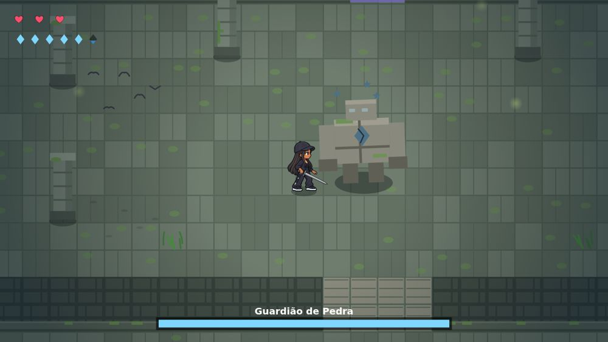
*Guardião de Pedra durante a luta*

### Dragão Vermelho (chefe final)
- **Vida:** 70 no Normal.
- **Ataques:**
  - **Garra:** círculo vermelho no chão antes do golpe.
  - **Cauda:** anel laranja que precisa ser pulado.
  - **Fogo em cone:** não dá para bloquear.
  - **Voo e mergulho:** a sombra dele segue a Line.
  - **Poeira.**
  - **Fogo em círculo desesperado:** quando está com pouca vida.
- **Ponto fraco:** depois de levar dano suficiente, ele fica atordoado e o peito brilha em azul. É o ponto fraco. Com a conclusão **do peito** (lenda + escama), cada golpe ali tira 1 a mais.
- **Fogo:** com a conclusão **das estrelas** (diário pág. 2 + escama), a Chuva de Estrelas apaga o fogo dele no meio do sopro.
- **Fim da luta:** aparece o botão **GOLPE FINAL**.

## 10. Lista completa de animações

> ⚠️ **Lembrete: toda a arte atual é temporária** e vai ser trocada pela versão final, mantendo o mesmo código.

Esta é a lista de **todas** as animações que o jogo usa ou vai usar. O código é o nome exato que a arte precisa ter para entrar sozinha no jogo. Animações de lado podem vir só viradas para a **direita**: o jogo espelha para a esquerda.

**Legenda do status:**
- ✅ **Tem arte (temporária):** já aparece no jogo, mas ainda será trocada pela final.
- 🔁 **Substituta:** ainda não tem arte própria. O jogo usa outra animação parecida no lugar (indicada na tabela).
- ✏️ **Desenho no código:** ainda não tem arte. O jogo desenha uma forma provisória ou usa uma imagem parada.

**Resumo:** 554 animações. ✅ 261 com arte temporária, 🔁 172 com substituta e ✏️ 121 desenhadas no código.

| Grupo | Total | ✅ | 🔁 | ✏️ |
|---|---:|---:|---:|---:|
| Primeiro encontro (prólogo) | 9 | 9 | 0 | 0 |
| Line — movimento | 31 | 31 | 0 | 0 |
| Line — combate | 27 | 27 | 0 | 0 |
| Line — emoções | 10 | 9 | 1 | 0 |
| Bell | 34 | 34 | 0 | 0 |
| Line e Bell juntas | 26 | 18 | 8 | 0 |
| Dragão | 27 | 26 | 1 | 0 |
| Magia e criaturas (novo) | 13 | 13 | 0 | 0 |
| Inimigos (novo) | 5 | 5 | 0 | 0 |
| Efeitos | 13 | 13 | 0 | 0 |
| Bichos da fazenda | 67 | 67 | 0 | 0 |
| Personagens de apoio (novo) | 6 | 6 | 0 | 0 |
| Bell jogável (Parte 2) | 18 | 0 | 18 | 0 |
| Chefe: Colosso de Raízes (Parte 2) | 12 | 0 | 0 | 12 |
| Chefe: Serpente das Marés (Parte 2) | 11 | 0 | 0 | 11 |
| Chefe: Grifo da Tempestade (Parte 2) | 11 | 0 | 0 | 11 |
| Chefe: Titã de Magma (Parte 2) | 11 | 0 | 0 | 11 |
| Chefe: Hidra de Lama (Parte 2) | 12 | 0 | 0 | 12 |
| Chefe: Tempestade Viva (Parte 2) | 12 | 0 | 0 | 12 |
| Chefe: Quimera Primordial (Parte 2) | 22 | 0 | 0 | 22 |
| Fogos-fátuos dos elementos (Parte 2) | 9 | 0 | 9 | 0 |
| Moradores (todos, incluindo os da Parte 2) | 30 | 0 | 0 | 30 |
| Dragão amigo (Parte 2) | 3 | 0 | 3 | 0 |
| Line com armadura: Túnica Acolchoada | 23 | 0 | 23 | 0 |
| Line com armadura: Cota de Malha | 23 | 0 | 23 | 0 |
| Line com armadura: Armadura de Brasa | 23 | 0 | 23 | 0 |
| Bell com armadura: Vestido Reforçado | 21 | 0 | 21 | 0 |
| Bell com armadura: Manto Estelar | 21 | 0 | 21 | 0 |
| Bell com armadura: Armadura da Aurora | 21 | 0 | 21 | 0 |
| Outras animações recebidas | 3 | 3 | 0 | 0 |

### 10.1 Primeiro encontro (prólogo)

| Código | O que é | Quadros | Loop | Status | Origem da arte atual |
|---|---|---:|:---:|---|---|
| `LINE_ADMIRE` | Line vê a Bell de longe (“puxa ela é tão linda”) *(sugestão nova)* | 5 |  | ✅ temporária | LINE_BELL_ITEM_103 |
| `BELL_WAIT` | Bell esperando a Line no shopping *(sugestão nova)* | 4 | sim | ✅ temporária | LINE_BELL_ITEM_103 |
| `LINE_BELL_MEET` | Frente a frente, sorrindo (conversa no shopping) *(sugestão nova)* | 3 | sim | ✅ temporária | LINE_BELL_ITEM_104 |
| `LINE_BELL_GREET_HUG` | Abraço de chegada (“Você tá atrasada”) *(sugestão nova)* | 4 | sim | ✅ temporária | LINE_BELL_ITEM_104 |
| `LINE_BELL_BK` | Comendo BK juntas no shopping *(sugestão nova)* | 6 | sim | ✅ temporária | LINE_BELL_ITEM_105 |
| `LINE_PUNCH_MACHINE` | Soco na máquina (primeiro encontro) | 3 |  | ✅ temporária | LINE_BELL_ITEM_106 |
| `LINE_PUNCH` | Soco sem espada (usa a arte do soco na máquina, em 6 quadros) | 3 |  | ✅ temporária | LINE_BELL_ITEM_106 |
| `BELL_LAUGH_AT_LINE` | Bell gargalhando do soco da Line *(sugestão nova)* | 2 | sim | ✅ temporária | LINE_BELL_ITEM_106 |
| `LINE_BELL_TUNNEL_KISS` | O primeiro beijo, no túnel *(sugestão nova)* | 7 |  | ✅ temporária | LINE_BELL_ITEM_107 |

### 10.2 Line — movimento

| Código | O que é | Quadros | Loop | Status | Origem da arte atual |
|---|---|---:|:---:|---|---|
| `LINE_IDLE_FRONT` | Parada | 7 | sim | ✅ temporária | LINE_BELL_ITEM_01 |
| `LINE_IDLE_BACK` | Parada | 2 | sim | ✅ temporária | LINE_BELL_ITEM_04 |
| `LINE_IDLE_LEFT` | Parada | 3 | sim | ✅ temporária | LINE_BELL_ITEM_03 |
| `LINE_IDLE_RIGHT` | Parada | 8 | sim | ✅ temporária | LINE_BELL_ITEM_04 |
| `LINE_LOOK_SIDES_FRONT` | Olhar para os lados | 7 |  | ✅ temporária | LINE_BELL_ITEM_02 |
| `LINE_BLINK_FRONT` | Piscar | 5 |  | ✅ temporária | LINE_BELL_ITEM_03 |
| `LINE_WALK_FRONT` | Andar | 4 | sim | ✅ temporária | LINE_BELL_ITEM_07 |
| `LINE_WALK_BACK` | Andar | 4 | sim | ✅ temporária | LINE_BELL_ITEM_07 |
| `LINE_WALK_LEFT` | Andar | 14 | sim | ✅ temporária | LINE_BELL_ITEM_06 |
| `LINE_WALK_RIGHT` | Andar | 8 | sim | ✅ temporária | LINE_BELL_ITEM_05 |
| `LINE_RUN_FRONT` | Correr | 8 | sim | ✅ temporária | LINE_BELL_ITEM_11 |
| `LINE_RUN_BACK` | Correr | 4 | sim | ✅ temporária | LINE_BELL_ITEM_11 |
| `LINE_RUN_LEFT` | Correr | 14 | sim | ✅ temporária | LINE_BELL_ITEM_10 |
| `LINE_RUN_RIGHT` | Correr | 8 | sim | ✅ temporária | LINE_BELL_ITEM_09 |
| `LINE_RUN_START_FRONT` | Começar a correr | 7 |  | ✅ temporária | LINE_BELL_ITEM_13 |
| `LINE_RUN_START_BACK` | Começar a correr | 7 |  | ✅ temporária | LINE_BELL_ITEM_13 |
| `LINE_RUN_START_LEFT` | Começar a correr | 7 |  | ✅ temporária | LINE_BELL_ITEM_13 |
| `LINE_RUN_START_RIGHT` | Começar a correr | 5 |  | ✅ temporária | LINE_BELL_ITEM_08 |
| `LINE_RUN_STOP_FRONT` | Parar de correr | 7 |  | ✅ temporária | LINE_BELL_ITEM_13 |
| `LINE_RUN_STOP_BACK` | Parar de correr | 7 |  | ✅ temporária | LINE_BELL_ITEM_14 |
| `LINE_RUN_STOP_LEFT` | Parar de correr | 6 |  | ✅ temporária | LINE_BELL_ITEM_12 |
| `LINE_RUN_STOP_RIGHT` | Parar de correr | 4 |  | ✅ temporária | LINE_BELL_ITEM_12 |
| `LINE_JUMP_LEFT` | Pular | 11 |  | ✅ temporária | LINE_BELL_ITEM_117 |
| `LINE_JUMP_RIGHT` | Pular | 11 |  | ✅ temporária | LINE_BELL_ITEM_15 |
| `LINE_LAND_LEFT` | Aterrissar | 5 |  | ✅ temporária | LINE_BELL_ITEM_117 |
| `LINE_LAND_RIGHT` | Aterrissar | 5 |  | ✅ temporária | LINE_BELL_ITEM_16 |
| `LINE_CROUCH` | Agachar | 3 |  | ✅ temporária | LINE_BELL_ITEM_17 |
| `LINE_CROUCH_STAND` | Levantar do agachamento | 3 |  | ✅ temporária | LINE_BELL_ITEM_18 |
| `LINE_STUMBLE` | Tropeçar | 4 |  | ✅ temporária | LINE_BELL_ITEM_19 |
| `LINE_FALL` | Cair | 4 |  | ✅ temporária | LINE_BELL_ITEM_20 |
| `LINE_GROUND_STAND` | Levantar do chão | 6 |  | ✅ temporária | LINE_BELL_ITEM_21 |

### 10.3 Line — combate

| Código | O que é | Quadros | Loop | Status | Origem da arte atual |
|---|---|---:|:---:|---|---|
| `LINE_SWORD_DRAW` | Sacar espada | 4 |  | ✅ temporária | LINE_BELL_ITEM_22 |
| `LINE_SWORD_SHEATHE` | Guardar espada | 6 |  | ✅ temporária | LINE_BELL_ITEM_23 |
| `LINE_COMBAT_IDLE` | Postura de combate | 3 | sim | ✅ temporária | LINE_BELL_ITEM_24 |
| `LINE_COMBAT_WALK_FRONT` | Andar com a espada em mãos *(sugestão nova)* | 2 | sim | ✅ temporária | LINE_BELL_ITEM_114 |
| `LINE_COMBAT_WALK_BACK` | Andar com a espada em mãos *(sugestão nova)* | 2 | sim | ✅ temporária | LINE_BELL_ITEM_114 |
| `LINE_COMBAT_WALK_LEFT` | Andar com a espada em mãos *(sugestão nova)* | 4 | sim | ✅ temporária | LINE_BELL_ITEM_114 |
| `LINE_COMBAT_WALK_RIGHT` | Andar com a espada em mãos *(sugestão nova)* | 4 | sim | ✅ temporária | LINE_BELL_ITEM_114 |
| `LINE_COMBAT_RUN_FRONT` | Correr com a espada em mãos *(sugestão nova)* | 4 | sim | ✅ temporária | LINE_BELL_ITEM_115 |
| `LINE_COMBAT_RUN_BACK` | Correr com a espada em mãos *(sugestão nova)* | 2 | sim | ✅ temporária | LINE_BELL_ITEM_115 |
| `LINE_COMBAT_RUN_LEFT` | Correr com a espada em mãos *(sugestão nova)* | 4 | sim | ✅ temporária | LINE_BELL_ITEM_115 |
| `LINE_COMBAT_RUN_RIGHT` | Correr com a espada em mãos *(sugestão nova)* | 4 | sim | ✅ temporária | LINE_BELL_ITEM_115 |
| `LINE_ATTACK_HORIZONTAL` | Ataque horizontal | 4 |  | ✅ temporária | LINE_BELL_ITEM_25 |
| `LINE_ATTACK_VERTICAL` | Ataque vertical | 8 |  | ✅ temporária | LINE_BELL_ITEM_26 |
| `LINE_ATTACK_DIAGONAL` | Ataque diagonal | 9 |  | ✅ temporária | LINE_BELL_ITEM_27 |
| `LINE_ATTACK_COMBO` | Combo | 15 |  | ✅ temporária | LINE_BELL_ITEM_28 |
| `LINE_ATTACK_SPIN` | Ataque giratório | 8 |  | ✅ temporária | LINE_BELL_ITEM_29 |
| `LINE_ATTACK_AIR` | Ataque aéreo | 10 |  | ✅ temporária | LINE_BELL_ITEM_30 |
| `LINE_BLOCK` | Bloquear | 6 |  | ✅ temporária | LINE_BELL_ITEM_31 |
| `LINE_DODGE` | Esquivar | 6 |  | ✅ temporária | LINE_BELL_ITEM_32 |
| `LINE_DASH` | Dash | 5 |  | ✅ temporária | LINE_BELL_ITEM_33 |
| `LINE_HIT_LIGHT` | Receber dano leve | 5 |  | ✅ temporária | LINE_BELL_ITEM_34 |
| `LINE_HIT_HEAVY` | Receber golpe forte | 4 |  | ✅ temporária | LINE_BELL_ITEM_35 |
| `LINE_THROWN` | Ser arremessada | 4 |  | ✅ temporária | LINE_BELL_ITEM_36 |
| `LINE_KNOCKDOWN` | Cair após golpe | 6 |  | ✅ temporária | LINE_BELL_ITEM_37 |
| `LINE_INJURED_STAND` | Levantar machucada | 6 |  | ✅ temporária | LINE_BELL_ITEM_38 |
| `LINE_EXHAUSTED_IDLE` | Exausta | 6 | sim | ✅ temporária | LINE_BELL_ITEM_39 |
| `LINE_DRAGON_FINAL_ATTACK` | Ataque final contra o dragão | 7 |  | ✅ temporária | LINE_BELL_ITEM_40 |

### 10.4 Line — emoções

| Código | O que é | Quadros | Loop | Status | Origem da arte atual |
|---|---|---:|:---:|---|---|
| `LINE_HAPPY` | Feliz | 20 |  | 🔁 usa `LINE_VICTORY` |  |
| `LINE_LAUGH` | Rindo | 6 |  | ✅ temporária | LINE_BELL_ITEM_42 |
| `LINE_DETERMINED` | Determinada | 6 | sim | ✅ temporária | LINE_BELL_ITEM_43 |
| `LINE_ANGRY` | Brava | 6 | sim | ✅ temporária | LINE_BELL_ITEM_44 |
| `LINE_SCARED` | Assustada | 4 | sim | ✅ temporária | LINE_BELL_ITEM_45 |
| `LINE_SAD` | Triste | 4 | sim | ✅ temporária | LINE_BELL_ITEM_46 |
| `LINE_CRY` | Chorando | 6 | sim | ✅ temporária | LINE_BELL_ITEM_47 |
| `LINE_CALL_BELL` | Gritando por Bell | 6 |  | ✅ temporária | LINE_BELL_ITEM_48 |
| `LINE_RELIEVED` | Aliviada | 5 |  | ✅ temporária | LINE_BELL_ITEM_49 |
| `LINE_VICTORY` | Comemorando a vitória *(sugestão nova)* | 4 |  | ✅ temporária | LINE_BELL_ITEM_109 |

### 10.5 Bell

| Código | O que é | Quadros | Loop | Status | Origem da arte atual |
|---|---|---:|:---:|---|---|
| `BELL_IDLE_FRONT` | Parada | 3 | sim | ✅ temporária | LINE_BELL_ITEM_50 |
| `BELL_IDLE_BACK` | Parada | 1 | sim | ✅ temporária | LINE_BELL_ITEM_51 |
| `BELL_IDLE_LEFT` | Parada | 1 | sim | ✅ temporária | LINE_BELL_ITEM_51 |
| `BELL_IDLE_RIGHT` | Parada | 1 | sim | ✅ temporária | LINE_BELL_ITEM_51 |
| `BELL_BLINK_FRONT` | Piscar | 2 |  | ✅ temporária | LINE_BELL_ITEM_50 |
| `BELL_LOOK_SIDES_FRONT` | Olhar para os lados | 3 |  | ✅ temporária | LINE_BELL_ITEM_50 |
| `BELL_WALK_FRONT` | Andar | 4 | sim | ✅ temporária | LINE_BELL_ITEM_54 |
| `BELL_WALK_BACK` | Andar | 4 | sim | ✅ temporária | LINE_BELL_ITEM_54 |
| `BELL_WALK_LEFT` | Andar | 5 | sim | ✅ temporária | LINE_BELL_ITEM_53 |
| `BELL_WALK_RIGHT` | Andar | 5 | sim | ✅ temporária | LINE_BELL_ITEM_52 |
| `BELL_RUN_FRONT` | Correr | 4 | sim | ✅ temporária | LINE_BELL_ITEM_57 |
| `BELL_RUN_BACK` | Correr | 4 | sim | ✅ temporária | LINE_BELL_ITEM_57 |
| `BELL_RUN_LEFT` | Correr | 5 | sim | ✅ temporária | LINE_BELL_ITEM_56 |
| `BELL_RUN_RIGHT` | Correr | 5 | sim | ✅ temporária | LINE_BELL_ITEM_55 |
| `BELL_LAUGH` | Gargalhada *(sugestão nova)* | 2 | sim | ✅ temporária | LINE_BELL_ITEM_108 |
| `BELL_JUMP` | Pular | 3 |  | ✅ temporária | LINE_BELL_ITEM_58 |
| `BELL_LAND` | Aterrissar | 2 |  | ✅ temporária | LINE_BELL_ITEM_58 |
| `BELL_GROUND_STAND` | Levantar do chão | 2 |  | ✅ temporária | LINE_BELL_ITEM_58 |
| `BELL_SCARED` | Assustada | 3 | sim | ✅ temporária | LINE_BELL_ITEM_59 |
| `BELL_FLEE` | Fugir | 4 | sim | ✅ temporária | LINE_BELL_ITEM_59 |
| `BELL_FALL` | Cair | 4 |  | ✅ temporária | LINE_BELL_ITEM_60 |
| `BELL_CAPTURED` | Ser capturada | 4 |  | ✅ temporária | LINE_BELL_ITEM_61 |
| `BELL_DRAGON_CARRIED` | Ser carregada pelo dragão | 4 | sim | ✅ temporária | LINE_BELL_ITEM_62 |
| `BELL_TRAPPED` | Presa | 3 | sim | ✅ temporária | LINE_BELL_ITEM_63 |
| `BELL_ESCAPE_ATTEMPT` | Tentar escapar | 3 | sim | ✅ temporária | LINE_BELL_ITEM_63 |
| `BELL_BREAK_FREE` | Conseguir se libertar | 4 |  | ✅ temporária | LINE_BELL_ITEM_64 |
| `BELL_CALL_LINE` | Chamar Line | 4 | sim | ✅ temporária | LINE_BELL_ITEM_65 |
| `BELL_HELP_LINE` | Ajudar Line | 4 |  | ✅ temporária | LINE_BELL_ITEM_66 |
| `BELL_HAPPY` | Feliz | 2 | sim | ✅ temporária | LINE_BELL_ITEM_67 |
| `BELL_RELIEVED` | Aliviada | 2 |  | ✅ temporária | LINE_BELL_ITEM_67 |
| `BELL_CRY` | Chorando | 3 | sim | ✅ temporária | LINE_BELL_ITEM_67 |
| `BELL_CURTSY` | Reverência *(sugestão nova)* | 4 |  | ✅ temporária | LINE_BELL_ITEM_108 |
| `BELL_HIGH_FIVE` | Toca aqui *(sugestão nova)* | 2 |  | ✅ temporária | LINE_BELL_ITEM_108 |
| `BELL_DANCE` | Dançando (giro) *(sugestão nova)* | 3 | sim | ✅ temporária | LINE_BELL_ITEM_108 |

### 10.6 Line e Bell juntas

| Código | O que é | Quadros | Loop | Status | Origem da arte atual |
|---|---|---:|:---:|---|---|
| `LINE_BELL_WALK_TOGETHER_FRONT` | Andando lado a lado | 16 | sim | 🔁 usa `LINE_BELL_WALK_TOGETHER` |  |
| `LINE_BELL_WALK_TOGETHER_BACK` | Andando lado a lado | 4 | sim | ✅ temporária | LINE_BELL_ITEM_110 |
| `LINE_BELL_WALK_TOGETHER_LEFT` | Andando lado a lado | 16 | sim | 🔁 usa `LINE_BELL_WALK_TOGETHER` |  |
| `LINE_BELL_WALK_TOGETHER_RIGHT` | Andando lado a lado | 16 | sim | 🔁 usa `LINE_BELL_WALK_TOGETHER` |  |
| `LINE_BELL_WALK_HANDS_FRONT` | Andando de mãos dadas | 6 | sim | ✅ temporária | Laboratório v7 |
| `LINE_BELL_WALK_HANDS_BACK` | Andando de mãos dadas | 4 | sim | ✅ temporária | LINE_BELL_ITEM_111 |
| `LINE_BELL_WALK_HANDS_LEFT` | Andando de mãos dadas | 16 | sim | 🔁 usa `LINE_BELL_WALK_HANDS` |  |
| `LINE_BELL_WALK_HANDS_RIGHT` | Andando de mãos dadas | 16 | sim | 🔁 usa `LINE_BELL_WALK_HANDS` |  |
| `LINE_BELL_RUN_TOGETHER_FRONT` | Correndo juntas | 12 | sim | 🔁 usa `LINE_BELL_RUN_TOGETHER` |  |
| `LINE_BELL_RUN_TOGETHER_BACK` | Correndo juntas | 4 | sim | ✅ temporária | LINE_BELL_ITEM_112 |
| `LINE_BELL_RUN_TOGETHER_LEFT` | Correndo juntas | 12 | sim | 🔁 usa `LINE_BELL_RUN_TOGETHER` |  |
| `LINE_BELL_RUN_TOGETHER_RIGHT` | Correndo juntas | 12 | sim | 🔁 usa `LINE_BELL_RUN_TOGETHER` |  |
| `LINE_BELL_TALK` | Conversando | 3 | sim | ✅ temporária | LINE_BELL_ITEM_71 |
| `LINE_BELL_LAUGH` | Rindo juntas | 3 | sim | ✅ temporária | LINE_BELL_ITEM_71 |
| `LINE_BELL_EAT` | Almoçando juntas *(sugestão nova)* | 6 | sim | ✅ temporária | LINE_BELL_ITEM_113 |
| `LINE_BELL_KISS` | Bitoquinha *(sugestão nova)* | 7 |  | ✅ temporária | LINE_BELL_ITEM_113 |
| `BELL_LEAN_ON_LINE` | Bell encostando na Line | 4 |  | ✅ temporária | LINE_BELL_ITEM_72 |
| `LINE_BELL_HOLD_HANDS` | Segurando as mãos | 3 | sim | ✅ temporária | LINE_BELL_ITEM_73 |
| `LINE_BELL_RESCUE_HUG` | Abraço do resgate | 4 | sim | ✅ temporária | LINE_BELL_ITEM_74 |
| `LINE_BELL_HUG_RELEASE` | Separação do abraço | 4 |  | ✅ temporária | LINE_BELL_ITEM_75 |
| `LINE_BELL_CELEBRATE` | Comemorando (toca aqui) | 4 |  | ✅ temporária | LINE_BELL_ITEM_76 |
| `LINE_BELL_HIGH_FIVE` | Toca aqui com brilho *(sugestão nova)* | 3 |  | ✅ temporária | LINE_BELL_ITEM_113 |
| `LINE_BELL_DANCE` | Dançando juntas *(sugestão nova)* | 4 | sim | ✅ temporária | arte/linebell/LINE_BELL_DANCE |
| `LINE_BELL_SIT_DOWN` | Sentando juntas | 4 |  | ✅ temporária | LINE_BELL_ITEM_77 |
| `BELL_HEAD_ON_LINE` | Bell apoiando a cabeça na Line | 4 |  | ✅ temporária | LINE_BELL_ITEM_78 |
| `LINE_BELL_SIT_IDLE` | Idle das duas sentadas | 4 | sim | ✅ temporária | LINE_BELL_ITEM_79 |

### 10.7 Dragão

| Código | O que é | Quadros | Loop | Status | Origem da arte atual |
|---|---|---:|:---:|---|---|
| `DRAGON_IDLE` | Parado respirando | 3 | sim | ✅ temporária | LINE_BELL_ITEM_80 |
| `DRAGON_BLINK` | Piscar | 2 |  | ✅ temporária | LINE_BELL_ITEM_80 |
| `DRAGON_WALK` | Andar | 4 | sim | ✅ temporária | LINE_BELL_ITEM_81 |
| `DRAGON_RUN` | Correr | 4 | sim | ✅ temporária | LINE_BELL_ITEM_118 |
| `DRAGON_TURN` | Virar | 3 |  | ✅ temporária | LINE_BELL_ITEM_81 |
| `DRAGON_WINGS_OPEN` | Abrir asas | 3 |  | ✅ temporária | LINE_BELL_ITEM_82 |
| `DRAGON_TAKEOFF` | Decolar | 3 |  | ✅ temporária | LINE_BELL_ITEM_82 |
| `DRAGON_FLY` | Voar | 4 | sim | ✅ temporária | LINE_BELL_ITEM_83 |
| `DRAGON_GLIDE` | Planar | 2 | sim | ✅ temporária | LINE_BELL_ITEM_83 |
| `DRAGON_LAND` | Pousar | 5 |  | ✅ temporária | LINE_BELL_ITEM_84 |
| `DRAGON_ROAR` | Rugir | 4 |  | ✅ temporária | LINE_BELL_ITEM_85 |
| `DRAGON_BITE` | Morder | 5 |  | ✅ temporária | LINE_BELL_ITEM_86 |
| `DRAGON_CLAW_ATTACK` | Ataque de garra | 5 |  | ✅ temporária | LINE_BELL_ITEM_87 |
| `DRAGON_TAIL_ATTACK` | Golpe de cauda | 5 |  | ✅ temporária | LINE_BELL_ITEM_88 |
| `DRAGON_FIRE_CHARGE` | Preparar fogo | 5 |  | ✅ temporária | LINE_BELL_ITEM_89 |
| `DRAGON_FIRE_BREATH` | Cuspir fogo | 3 |  | ✅ temporária | LINE_BELL_ITEM_89 |
| `DRAGON_FIRE_STREAM` | Fogo contínuo | 6 | sim | ✅ temporária | LINE_BELL_ITEM_90 |
| `DRAGON_AIR_ATTACK` | Ataque aéreo | 6 |  | ✅ temporária | LINE_BELL_ITEM_91 |
| `DRAGON_HIT` | Receber dano | 4 |  | ✅ temporária | LINE_BELL_ITEM_92 |
| `DRAGON_WEAK_POINT_HIT` | Ponto fraco atingido | 4 |  | ✅ temporária | LINE_BELL_ITEM_92 |
| `DRAGON_STUNNED` | Atordoado | 5 | sim | ✅ temporária | LINE_BELL_ITEM_93 |
| `DRAGON_DESPERATE_ATTACK` | Ataque desesperado | 6 |  | ✅ temporária | LINE_BELL_ITEM_94 |
| `DRAGON_FINAL_HIT` | Receber golpe final | 6 |  | ✅ temporária | LINE_BELL_ITEM_95 |
| `DRAGON_FALL` | Cair | 5 |  | ✅ temporária | LINE_BELL_ITEM_96 |
| `DRAGON_DEFEATED` | Derrotado | 2 | sim | ✅ temporária | LINE_BELL_ITEM_96 |
| `DRAGON_SLEEP` | Dormir *(sugestão nova)* | 1 | sim | 🔁 usa `DRAGON_DEFEATED` |  |
| `DRAGON_EYE_OPEN_END` | Ressurgir no final | 6 |  | ✅ temporária | LINE_BELL_ITEM_97 |

### 10.8 Magia e criaturas (novo)

| Código | O que é | Quadros | Loop | Status | Origem da arte atual |
|---|---|---:|:---:|---|---|
| `LINE_CAST_SPELL` | Line lança o Raio de Luz *(sugestão nova)* | 4 |  | ✅ temporária | LINE_BELL_ITEM_116 |
| `LINE_CAST_CHARGE` | Line carregando a Chuva de Estrelas *(sugestão nova)* | 4 | sim | ✅ temporária | LINE_BELL_ITEM_116 |
| `LINE_CAST_STARS` | Line solta a Chuva de Estrelas *(sugestão nova)* | 4 |  | ✅ temporária | LINE_BELL_ITEM_116 |
| `GOLEM_SLEEP` | Guardião de Pedra dormindo *(sugestão nova)* | 1 | sim | ✅ temporária | LINE_BELL_ITEM_119 |
| `GOLEM_IDLE` | Guardião parado *(sugestão nova)* | 1 | sim | ✅ temporária | LINE_BELL_ITEM_119 |
| `GOLEM_WALK` | Guardião andando *(sugestão nova)* | 2 | sim | ✅ temporária | LINE_BELL_ITEM_119 |
| `GOLEM_SLAM` | Guardião: pisão (onda no chão) *(sugestão nova)* | 2 |  | ✅ temporária | LINE_BELL_ITEM_120 |
| `GOLEM_THROW` | Guardião: arremessar pedra *(sugestão nova)* | 2 |  | ✅ temporária | LINE_BELL_ITEM_120 |
| `GOLEM_STUNNED` | Guardião tonto (cristal rachado) *(sugestão nova)* | 1 | sim | ✅ temporária | LINE_BELL_ITEM_121 |
| `GOLEM_DEATH` | Guardião desmoronando *(sugestão nova)* | 3 |  | ✅ temporária | LINE_BELL_ITEM_121 |
| `WISP_IDLE` | Fogo-fátuo flutuando *(sugestão nova)* | 12 | sim | ✅ temporária | LINE_BELL_ITEM_122 |
| `WISP_ATTACK` | Fogo-fátuo atirando *(sugestão nova)* | 12 |  | ✅ temporária | LINE_BELL_ITEM_122 |
| `WISP_DEATH` | Fogo-fátuo apagando *(sugestão nova)* | 12 |  | ✅ temporária | LINE_BELL_ITEM_122 |

### 10.9 Inimigos (novo)

| Código | O que é | Quadros | Loop | Status | Origem da arte atual |
|---|---|---:|:---:|---|---|
| `SHADOW_IDLE` | Sombra — parada *(sugestão nova)* | 12 | sim | ✅ temporária | LINE_BELL_ITEM_123 |
| `SHADOW_MOVE` | Sombra — andar *(sugestão nova)* | 12 | sim | ✅ temporária | LINE_BELL_ITEM_123 |
| `SHADOW_ATTACK` | Sombra — investida *(sugestão nova)* | 12 |  | ✅ temporária | LINE_BELL_ITEM_123 |
| `SHADOW_HIT` | Sombra — receber dano *(sugestão nova)* | 12 |  | ✅ temporária | LINE_BELL_ITEM_123 |
| `SHADOW_DEATH` | Sombra — desaparecer *(sugestão nova)* | 12 |  | ✅ temporária | LINE_BELL_ITEM_123 |

### 10.10 Efeitos

| Código | O que é | Quadros | Loop | Status | Origem da arte atual |
|---|---|---:|:---:|---|---|
| `FX_FIRE` | Fogo | 5 | sim | ✅ temporária | LINE_BELL_ITEM_98 |
| `FX_EMBERS` | Brasas | 5 | sim | ✅ temporária | LINE_BELL_ITEM_98 |
| `FX_FIRE_LIGHT` | Iluminação do fogo | 5 | sim | ✅ temporária | LINE_BELL_ITEM_98 |
| `FX_SMOKE` | Fumaça | 5 |  | ✅ temporária | LINE_BELL_ITEM_99 |
| `FX_DUST` | Poeira | 5 |  | ✅ temporária | LINE_BELL_ITEM_99 |
| `FX_IMPACT` | Impacto | 5 |  | ✅ temporária | LINE_BELL_ITEM_100 |
| `FX_SPARKS` | Faíscas | 5 |  | ✅ temporária | LINE_BELL_ITEM_100 |
| `FX_EXPLOSION` | Explosão | 6 |  | ✅ temporária | LINE_BELL_ITEM_100 |
| `FX_SWORD_TRAIL` | Rastro da espada | 6 |  | ✅ temporária | LINE_BELL_ITEM_101 |
| `FX_DRAGON_WEAK_POINT` | Ponto fraco do dragão | 5 | sim | ✅ temporária | LINE_BELL_ITEM_101 |
| `FX_TEARS` | Lágrimas | 5 | sim | ✅ temporária | LINE_BELL_ITEM_102 |
| `FX_HEARTS` | Corações | 5 |  | ✅ temporária | LINE_BELL_ITEM_102 |
| `FX_AMBIENT_PARTICLES` | Partículas ambientais | 6 | sim | ✅ temporária | LINE_BELL_ITEM_102 |

### 10.11 Bichos da fazenda

| Código | O que é | Quadros | Loop | Status | Origem da arte atual |
|---|---|---:|:---:|---|---|
| `THEO_ALERT` | Theo — Theo alerta | 12 |  | ✅ temporária | LINE_BELL_ITEM_126 |
| `THEO_BALL` | Theo — Theo com a bolinha | 12 |  | ✅ temporária | LINE_BELL_ITEM_128 |
| `THEO_BATH` | Theo — Theo no banho | 12 |  | ✅ temporária | LINE_BELL_ITEM_130 |
| `THEO_BONE` | Theo — Theo com o osso | 12 |  | ✅ temporária | LINE_BELL_ITEM_128 |
| `THEO_IDLE_BACK` | Theo — idle back | 12 |  | ✅ temporária | LINE_BELL_ITEM_126 |
| `THEO_IDLE_FRONT` | Theo — idle front | 12 |  | ✅ temporária | LINE_BELL_ITEM_126 |
| `THEO_IDLE_LEFT` | Theo — idle left | 12 |  | ✅ temporária | LINE_BELL_ITEM_126 |
| `THEO_IDLE_RIGHT` | Theo — idle right | 12 |  | ✅ temporária | LINE_BELL_ITEM_126 |
| `THEO_LIE` | Theo — Theo deitado | 12 |  | ✅ temporária | LINE_BELL_ITEM_129 |
| `THEO_PLAY` | Theo — Theo brincando | 12 |  | ✅ temporária | LINE_BELL_ITEM_128 |
| `THEO_QUESTION` | Theo — Theo curioso | 12 |  | ✅ temporária | LINE_BELL_ITEM_126 |
| `THEO_ROLL` | Theo — Theo de barriga pra cima | 12 |  | ✅ temporária | LINE_BELL_ITEM_130 |
| `THEO_RUN` | Theo — Correr | 7 |  | ✅ temporária | LINE_BELL_ITEM_128 |
| `THEO_SIT` | Theo — sit | 12 |  | ✅ temporária | LINE_BELL_ITEM_129 |
| `THEO_SIT_FRONT` | Theo — Theo comendo | 12 |  | ✅ temporária | LINE_BELL_ITEM_129 |
| `THEO_SIT_IDLE` | Theo — Theo apaixonado | 12 |  | ✅ temporária | LINE_BELL_ITEM_129 |
| `THEO_SLEEP` | Theo — Theo dormindo | 12 |  | ✅ temporária | LINE_BELL_ITEM_129 |
| `THEO_WALK_BACK` | Theo — walk back | 7 |  | ✅ temporária | LINE_BELL_ITEM_127 |
| `THEO_WALK_FRONT` | Theo — walk front | 7 |  | ✅ temporária | LINE_BELL_ITEM_127 |
| `THEO_WALK_LEFT` | Theo — walk left | 7 |  | ✅ temporária | LINE_BELL_ITEM_127 |
| `THEO_WALK_RIGHT` | Theo — walk right | 7 |  | ✅ temporária | LINE_BELL_ITEM_127 |
| `CHICKEN_EAT` | Galinha branca — Comer | 12 |  | ✅ temporária | LINE_BELL_ITEM_131 |
| `CHICKEN_IDLE` | Galinha branca — Parado | 12 |  | ✅ temporária | LINE_BELL_ITEM_131 |
| `CHICKEN_LAY_EGG` | Galinha branca — Botar ovo | 12 |  | ✅ temporária | LINE_BELL_ITEM_131 |
| `CHICKEN_PECK` | Galinha branca — Bicar o chão | 12 |  | ✅ temporária | LINE_BELL_ITEM_131 |
| `CHICKEN_RUN` | Galinha branca — Correr | 12 |  | ✅ temporária | LINE_BELL_ITEM_131 |
| `CHICKEN_SCARED` | Galinha branca — Assustada | 12 |  | ✅ temporária | LINE_BELL_ITEM_131 |
| `CHICKEN_SCRATCH` | Galinha branca — Ciscar | 12 |  | ✅ temporária | LINE_BELL_ITEM_131 |
| `CHICKEN_SLEEP` | Galinha branca — Dormindo | 12 |  | ✅ temporária | LINE_BELL_ITEM_131 |
| `CHICKEN_WALK` | Galinha branca — Andar | 12 |  | ✅ temporária | LINE_BELL_ITEM_131 |
| `HEN_BROWN_EAT` | Galinha marrom — Comer | 12 |  | ✅ temporária | LINE_BELL_ITEM_132 |
| `HEN_BROWN_IDLE` | Galinha marrom — Parado | 12 |  | ✅ temporária | LINE_BELL_ITEM_132 |
| `HEN_BROWN_LAY_EGG` | Galinha marrom — Botar ovo | 12 |  | ✅ temporária | LINE_BELL_ITEM_132 |
| `HEN_BROWN_PECK` | Galinha marrom — Bicar o chão | 12 |  | ✅ temporária | LINE_BELL_ITEM_132 |
| `HEN_BROWN_RUN` | Galinha marrom — Correr | 12 |  | ✅ temporária | LINE_BELL_ITEM_132 |
| `HEN_BROWN_SCARED` | Galinha marrom — Assustada | 12 |  | ✅ temporária | LINE_BELL_ITEM_132 |
| `HEN_BROWN_SCRATCH` | Galinha marrom — Ciscar | 12 |  | ✅ temporária | LINE_BELL_ITEM_132 |
| `HEN_BROWN_SLEEP` | Galinha marrom — Dormindo | 12 |  | ✅ temporária | LINE_BELL_ITEM_132 |
| `HEN_BROWN_WALK` | Galinha marrom — Andar | 12 |  | ✅ temporária | LINE_BELL_ITEM_132 |
| `CHICK_IDLE` | Pintinho — Parado | 12 |  | ✅ temporária | LINE_BELL_ITEM_133 |
| `CHICK_RUN` | Pintinho — Correr | 12 |  | ✅ temporária | LINE_BELL_ITEM_133 |
| `CHICK_WALK` | Pintinho — Andar | 12 |  | ✅ temporária | LINE_BELL_ITEM_133 |
| `COW_EAT` | Vaca — Comer | 12 |  | ✅ temporária | LINE_BELL_ITEM_134 |
| `COW_IDLE` | Vaca — Parado | 12 |  | ✅ temporária | LINE_BELL_ITEM_134 |
| `COW_RUN` | Vaca — Correr | 12 |  | ✅ temporária | LINE_BELL_ITEM_134 |
| `COW_WALK` | Vaca — Andar | 12 |  | ✅ temporária | LINE_BELL_ITEM_134 |
| `PIG_FRONT` | Porco — De frente | 12 |  | ✅ temporária | LINE_BELL_ITEM_135 |
| `PIG_IDLE` | Porco — Parado | 12 |  | ✅ temporária | LINE_BELL_ITEM_135 |
| `PIG_LIE` | Porco — Deitado | 12 |  | ✅ temporária | LINE_BELL_ITEM_135 |
| `PIG_MUD` | Porco — Rolando na lama | 12 |  | ✅ temporária | LINE_BELL_ITEM_135 |
| `PIG_WALK` | Porco — Andar | 12 |  | ✅ temporária | LINE_BELL_ITEM_135 |
| `HORSE_EAT` | Cavalo — Comer | 12 |  | ✅ temporária | LINE_BELL_ITEM_136 |
| `HORSE_IDLE` | Cavalo — Parado | 12 |  | ✅ temporária | LINE_BELL_ITEM_136 |
| `HORSE_RUN` | Cavalo — Correr | 12 |  | ✅ temporária | LINE_BELL_ITEM_136 |
| `HORSE_WALK` | Cavalo — Andar | 12 |  | ✅ temporária | LINE_BELL_ITEM_136 |
| `SHEEP_IDLE` | Ovelha — Parado *(sugestão nova)* | 12 | sim | ✅ temporária | LINE_BELL_ITEM_137 |
| `SHEEP_WALK` | Ovelha — Andar *(sugestão nova)* | 12 | sim | ✅ temporária | LINE_BELL_ITEM_137 |
| `SHEEP_RUN` | Ovelha — Correr *(sugestão nova)* | 12 | sim | ✅ temporária | LINE_BELL_ITEM_137 |
| `SHEEP_EAT` | Ovelha — Comer grama *(sugestão nova)* | 12 | sim | ✅ temporária | LINE_BELL_ITEM_137 |
| `DUCK_IDLE` | Pato — Parado *(sugestão nova)* | 12 | sim | ✅ temporária | LINE_BELL_ITEM_138 |
| `DUCK_WALK` | Pato — Andar *(sugestão nova)* | 11 | sim | ✅ temporária | LINE_BELL_ITEM_138 |
| `DUCK_SWIM` | Pato — Nadando *(sugestão nova)* | 11 | sim | ✅ temporária | LINE_BELL_ITEM_138 |
| `DUCK_RUN` | Pato — Correr *(sugestão nova)* | 11 | sim | ✅ temporária | LINE_BELL_ITEM_138 |
| `CAT_IDLE` | Gato — Parado *(sugestão nova)* | 12 | sim | ✅ temporária | LINE_BELL_ITEM_139 |
| `CAT_WALK` | Gato — Andar *(sugestão nova)* | 11 | sim | ✅ temporária | LINE_BELL_ITEM_139 |
| `CAT_SLEEP` | Gato — Dormindo *(sugestão nova)* | 12 | sim | ✅ temporária | LINE_BELL_ITEM_139 |
| `CAT_PURR` | Gato — Carinho (ronronando) *(sugestão nova)* | 12 | sim | ✅ temporária | LINE_BELL_ITEM_139 |

### 10.12 Personagens de apoio (novo)

| Código | O que é | Quadros | Loop | Status | Origem da arte atual |
|---|---|---:|:---:|---|---|
| `MAGO_IDLE` | Mago parado, respirando *(sugestão nova)* | 12 | sim | ✅ temporária | LINE_BELL_ITEM_124 |
| `MAGO_TALK` | Mago falando / gesticulando *(sugestão nova)* | 12 | sim | ✅ temporária | LINE_BELL_ITEM_124 |
| `MAGO_CAST` | Mago fazendo um feitiço *(sugestão nova)* | 12 |  | ✅ temporária | LINE_BELL_ITEM_124 |
| `SPIRIT_APPEAR` | Espírito das Ruínas aparecendo no altar *(sugestão nova)* | 9 |  | ✅ temporária | LINE_BELL_ITEM_125 |
| `SPIRIT_IDLE` | Espírito das Ruínas flutuando *(sugestão nova)* | 12 | sim | ✅ temporária | LINE_BELL_ITEM_125 |
| `SPIRIT_TALK` | Espírito das Ruínas falando *(sugestão nova)* | 12 | sim | ✅ temporária | LINE_BELL_ITEM_125 |

### 10.13 Bell jogável (Parte 2)

| Código | O que é | Quadros | Loop | Status | Origem da arte atual |
|---|---|---:|:---:|---|---|
| `BELL_COMBAT_IDLE_FRONT` | Bell em guarda, estrelas girando na mão | 8 | sim | 🔁 usa `BELL_IDLE_FRONT` |  |
| `BELL_COMBAT_IDLE_BACK` | Bell em guarda, estrelas girando na mão | 8 | sim | 🔁 usa `BELL_IDLE_BACK` |  |
| `BELL_COMBAT_IDLE_LEFT` | Bell em guarda, estrelas girando na mão | 8 | sim | 🔁 usa `BELL_IDLE_LEFT` |  |
| `BELL_COMBAT_IDLE_RIGHT` | Bell em guarda, estrelas girando na mão | 8 | sim | 🔁 usa `BELL_IDLE_RIGHT` |  |
| `BELL_ATTACK_STAR` | Bell atira uma estrela (braço à frente) | 8 |  | 🔁 usa `BELL_HIGH_FIVE` |  |
| `BELL_ATTACK_SPREAD` | Bell gira e solta o leque de 3 estrelas de luz | 10 |  | 🔁 usa `BELL_DANCE` |  |
| `BELL_ATTACK_AIR` | Bell atira estrela no ar (pulando) | 6 |  | 🔁 usa `BELL_JUMP` |  |
| `BELL_SING` | Bell canta a Canção (notas coloridas saindo) | 12 | sim | 🔁 usa `BELL_HAPPY` |  |
| `BELL_BLOCK` | Bell se protege com um escudo de luz rosa | 6 |  | 🔁 usa `BELL_IDLE_RIGHT` |  |
| `BELL_DODGE` | Bell esquiva (pulinho de lado) | 6 |  | 🔁 usa `BELL_JUMP` |  |
| `BELL_DASH` | Bell arrancada | 6 |  | 🔁 usa `BELL_RUN_RIGHT` |  |
| `BELL_HIT` | Bell recebe dano | 4 |  | 🔁 usa `BELL_SCARED` |  |
| `BELL_KNOCKDOWN` | Bell cai no chão (golpe forte) | 6 |  | 🔁 usa `BELL_FALL` |  |
| `BELL_EXHAUSTED_IDLE` | Bell cansada, ofegante (pouca vida) | 8 | sim | 🔁 usa `BELL_IDLE_RIGHT` |  |
| `BELL_CROUCH` | Bell agachada (beber na fonte / pegar item) | 6 |  | 🔁 usa `BELL_IDLE_FRONT` |  |
| `BELL_DETERMINED` | Bell decidida (punhos fechados) | 6 | sim | 🔁 usa `BELL_IDLE_FRONT` |  |
| `BELL_CELEBRATE` | Bell comemora vitória | 12 |  | 🔁 usa `BELL_HAPPY` |  |
| `BELL_TALK` | Bell falando (cenas) | 8 | sim | 🔁 usa `BELL_IDLE_FRONT` |  |

### 10.14 Chefe: Colosso de Raízes (Parte 2)

| Código | O que é | Quadros | Loop | Status | Origem da arte atual |
|---|---|---:|:---:|---|---|
| `COLOSSO_SLEEP` | Colosso de Raízes — dormindo (antes da luta) | 8 | sim | ✏️ código / falta |  |
| `COLOSSO_IDLE` | Colosso de Raízes — parado, respirando | 8 | sim | ✏️ código / falta |  |
| `COLOSSO_WAKE` | Colosso de Raízes — acordando / rugido de apresentação | 12 |  | ✏️ código / falta |  |
| `COLOSSO_ATTACK` | Colosso de Raízes — ataque genérico (usado quando o golpe não tem arte própria) | 10 |  | ✏️ código / falta |  |
| `COLOSSO_ROOTS` | Colosso de Raízes — raízes saindo do chão em linha | 10 |  | ✏️ código / falta |  |
| `COLOSSO_THORNS` | Colosso de Raízes — anel de espinhos | 10 |  | ✏️ código / falta |  |
| `COLOSSO_MUD` | Colosso de Raízes — cuspe de lama | 10 |  | ✏️ código / falta |  |
| `COLOSSO_SUMMON` | Colosso de Raízes — chama sombras | 10 |  | ✏️ código / falta |  |
| `COLOSSO_STUNNED` | Colosso de Raízes — cansado, núcleo exposto (hora de atacar) | 8 | sim | ✏️ código / falta |  |
| `COLOSSO_HIT` | Colosso de Raízes — recebe dano | 4 |  | ✏️ código / falta |  |
| `COLOSSO_DEATH` | Colosso de Raízes — derrotado (se desfaz em luz) | 14 |  | ✏️ código / falta |  |
| `COLOSSO_FREED` | Colosso de Raízes — libertado, volta às cores verdadeiras e agradece | 12 | sim | ✏️ código / falta |  |

### 10.15 Chefe: Serpente das Marés (Parte 2)

| Código | O que é | Quadros | Loop | Status | Origem da arte atual |
|---|---|---:|:---:|---|---|
| `SERPENTE_SLEEP` | Serpente das Marés — dormindo (antes da luta) | 8 | sim | ✏️ código / falta |  |
| `SERPENTE_IDLE` | Serpente das Marés — parado, respirando | 8 | sim | ✏️ código / falta |  |
| `SERPENTE_WAKE` | Serpente das Marés — acordando / rugido de apresentação | 12 |  | ✏️ código / falta |  |
| `SERPENTE_ATTACK` | Serpente das Marés — ataque genérico (usado quando o golpe não tem arte própria) | 10 |  | ✏️ código / falta |  |
| `SERPENTE_DIVE` | Serpente das Marés — mergulho (some e reaparece) | 10 |  | ✏️ código / falta |  |
| `SERPENTE_WATER_JET` | Serpente das Marés — jatos de água | 10 |  | ✏️ código / falta |  |
| `SERPENTE_WAVE` | Serpente das Marés — onda | 10 |  | ✏️ código / falta |  |
| `SERPENTE_STUNNED` | Serpente das Marés — cansado, núcleo exposto (hora de atacar) | 8 | sim | ✏️ código / falta |  |
| `SERPENTE_HIT` | Serpente das Marés — recebe dano | 4 |  | ✏️ código / falta |  |
| `SERPENTE_DEATH` | Serpente das Marés — derrotado (se desfaz em luz) | 14 |  | ✏️ código / falta |  |
| `SERPENTE_FREED` | Serpente das Marés — libertado, volta às cores verdadeiras e agradece | 12 | sim | ✏️ código / falta |  |

### 10.16 Chefe: Grifo da Tempestade (Parte 2)

| Código | O que é | Quadros | Loop | Status | Origem da arte atual |
|---|---|---:|:---:|---|---|
| `GRIFO_SLEEP` | Grifo da Tempestade — dormindo (antes da luta) | 8 | sim | ✏️ código / falta |  |
| `GRIFO_IDLE` | Grifo da Tempestade — parado, respirando | 8 | sim | ✏️ código / falta |  |
| `GRIFO_WAKE` | Grifo da Tempestade — acordando / rugido de apresentação | 12 |  | ✏️ código / falta |  |
| `GRIFO_ATTACK` | Grifo da Tempestade — ataque genérico (usado quando o golpe não tem arte própria) | 10 |  | ✏️ código / falta |  |
| `GRIFO_GUST` | Grifo da Tempestade — rajada de vento | 10 |  | ✏️ código / falta |  |
| `GRIFO_FEATHERS` | Grifo da Tempestade — leque de penas | 10 |  | ✏️ código / falta |  |
| `GRIFO_LIGHTNING` | Grifo da Tempestade — chama raios | 10 |  | ✏️ código / falta |  |
| `GRIFO_STUNNED` | Grifo da Tempestade — cansado, núcleo exposto (hora de atacar) | 8 | sim | ✏️ código / falta |  |
| `GRIFO_HIT` | Grifo da Tempestade — recebe dano | 4 |  | ✏️ código / falta |  |
| `GRIFO_DEATH` | Grifo da Tempestade — derrotado (se desfaz em luz) | 14 |  | ✏️ código / falta |  |
| `GRIFO_FREED` | Grifo da Tempestade — libertado, volta às cores verdadeiras e agradece | 12 | sim | ✏️ código / falta |  |

### 10.17 Chefe: Titã de Magma (Parte 2)

| Código | O que é | Quadros | Loop | Status | Origem da arte atual |
|---|---|---:|:---:|---|---|
| `MAGMA_SLEEP` | Titã de Magma — dormindo (antes da luta) | 8 | sim | ✏️ código / falta |  |
| `MAGMA_IDLE` | Titã de Magma — parado, respirando | 8 | sim | ✏️ código / falta |  |
| `MAGMA_WAKE` | Titã de Magma — acordando / rugido de apresentação | 12 |  | ✏️ código / falta |  |
| `MAGMA_ATTACK` | Titã de Magma — ataque genérico (usado quando o golpe não tem arte própria) | 10 |  | ✏️ código / falta |  |
| `MAGMA_SLAM` | Titã de Magma — pisão (onda no chão) | 10 |  | ✏️ código / falta |  |
| `MAGMA_FIRE_RAIN` | Titã de Magma — chuva de fogo | 10 |  | ✏️ código / falta |  |
| `MAGMA_THROW` | Titã de Magma — arremesso de rocha | 10 |  | ✏️ código / falta |  |
| `MAGMA_FIRE_FAN` | Titã de Magma — leque de fogo | 10 |  | ✏️ código / falta |  |
| `MAGMA_STUNNED` | Titã de Magma — cansado, núcleo exposto (hora de atacar) | 8 | sim | ✏️ código / falta |  |
| `MAGMA_HIT` | Titã de Magma — recebe dano | 4 |  | ✏️ código / falta |  |
| `MAGMA_DEATH` | Titã de Magma — derrotado (se desfaz em luz) | 14 |  | ✏️ código / falta |  |

### 10.18 Chefe: Hidra de Lama (Parte 2)

| Código | O que é | Quadros | Loop | Status | Origem da arte atual |
|---|---|---:|:---:|---|---|
| `HIDRA_SLEEP` | Hidra de Lama — dormindo (antes da luta) | 8 | sim | ✏️ código / falta |  |
| `HIDRA_IDLE` | Hidra de Lama — parado, respirando | 8 | sim | ✏️ código / falta |  |
| `HIDRA_WAKE` | Hidra de Lama — acordando / rugido de apresentação | 12 |  | ✏️ código / falta |  |
| `HIDRA_ATTACK` | Hidra de Lama — ataque genérico (usado quando o golpe não tem arte própria) | 10 |  | ✏️ código / falta |  |
| `HIDRA_ROOTS` | Hidra de Lama — raízes saindo do chão em linha | 10 |  | ✏️ código / falta |  |
| `HIDRA_WATER_JET` | Hidra de Lama — jatos de água | 10 |  | ✏️ código / falta |  |
| `HIDRA_WAVE` | Hidra de Lama — onda | 10 |  | ✏️ código / falta |  |
| `HIDRA_DIVE` | Hidra de Lama — mergulho (some e reaparece) | 10 |  | ✏️ código / falta |  |
| `HIDRA_MUD` | Hidra de Lama — cuspe de lama | 10 |  | ✏️ código / falta |  |
| `HIDRA_STUNNED` | Hidra de Lama — cansado, núcleo exposto (hora de atacar) | 8 | sim | ✏️ código / falta |  |
| `HIDRA_HIT` | Hidra de Lama — recebe dano | 4 |  | ✏️ código / falta |  |
| `HIDRA_DEATH` | Hidra de Lama — derrotado (se desfaz em luz) | 14 |  | ✏️ código / falta |  |

### 10.19 Chefe: Tempestade Viva (Parte 2)

| Código | O que é | Quadros | Loop | Status | Origem da arte atual |
|---|---|---:|:---:|---|---|
| `TEMPESTADE_SLEEP` | Tempestade Viva — dormindo (antes da luta) | 8 | sim | ✏️ código / falta |  |
| `TEMPESTADE_IDLE` | Tempestade Viva — parado, respirando | 8 | sim | ✏️ código / falta |  |
| `TEMPESTADE_WAKE` | Tempestade Viva — acordando / rugido de apresentação | 12 |  | ✏️ código / falta |  |
| `TEMPESTADE_ATTACK` | Tempestade Viva — ataque genérico (usado quando o golpe não tem arte própria) | 10 |  | ✏️ código / falta |  |
| `TEMPESTADE_LIGHTNING` | Tempestade Viva — chama raios | 10 |  | ✏️ código / falta |  |
| `TEMPESTADE_GUST` | Tempestade Viva — rajada de vento | 10 |  | ✏️ código / falta |  |
| `TEMPESTADE_WATER_JET` | Tempestade Viva — jatos de água | 10 |  | ✏️ código / falta |  |
| `TEMPESTADE_WAVE` | Tempestade Viva — onda | 10 |  | ✏️ código / falta |  |
| `TEMPESTADE_FEATHERS` | Tempestade Viva — leque de penas | 10 |  | ✏️ código / falta |  |
| `TEMPESTADE_STUNNED` | Tempestade Viva — cansado, núcleo exposto (hora de atacar) | 8 | sim | ✏️ código / falta |  |
| `TEMPESTADE_HIT` | Tempestade Viva — recebe dano | 4 |  | ✏️ código / falta |  |
| `TEMPESTADE_DEATH` | Tempestade Viva — derrotado (se desfaz em luz) | 14 |  | ✏️ código / falta |  |

### 10.20 Chefe: Quimera Primordial (Parte 2)

| Código | O que é | Quadros | Loop | Status | Origem da arte atual |
|---|---|---:|:---:|---|---|
| `QUIMERA_SLEEP` | Quimera Primordial — dormindo (antes da luta) | 8 | sim | ✏️ código / falta |  |
| `QUIMERA_IDLE` | Quimera Primordial — parado, respirando | 8 | sim | ✏️ código / falta |  |
| `QUIMERA_WAKE` | Quimera Primordial — acordando / rugido de apresentação | 12 |  | ✏️ código / falta |  |
| `QUIMERA_ATTACK` | Quimera Primordial — ataque genérico (usado quando o golpe não tem arte própria) | 10 |  | ✏️ código / falta |  |
| `QUIMERA_SLAM` | Quimera Primordial — pisão (onda no chão) | 10 |  | ✏️ código / falta |  |
| `QUIMERA_THROW` | Quimera Primordial — arremesso de rocha | 10 |  | ✏️ código / falta |  |
| `QUIMERA_FIRE_RAIN` | Quimera Primordial — chuva de fogo | 10 |  | ✏️ código / falta |  |
| `QUIMERA_FIRE_FAN` | Quimera Primordial — leque de fogo | 10 |  | ✏️ código / falta |  |
| `QUIMERA_ROOTS` | Quimera Primordial — raízes saindo do chão em linha | 10 |  | ✏️ código / falta |  |
| `QUIMERA_THORNS` | Quimera Primordial — anel de espinhos | 10 |  | ✏️ código / falta |  |
| `QUIMERA_MUD` | Quimera Primordial — cuspe de lama | 10 |  | ✏️ código / falta |  |
| `QUIMERA_DIVE` | Quimera Primordial — mergulho (some e reaparece) | 10 |  | ✏️ código / falta |  |
| `QUIMERA_WATER_JET` | Quimera Primordial — jatos de água | 10 |  | ✏️ código / falta |  |
| `QUIMERA_WAVE` | Quimera Primordial — onda | 10 |  | ✏️ código / falta |  |
| `QUIMERA_GUST` | Quimera Primordial — rajada de vento | 10 |  | ✏️ código / falta |  |
| `QUIMERA_FEATHERS` | Quimera Primordial — leque de penas | 10 |  | ✏️ código / falta |  |
| `QUIMERA_LIGHTNING` | Quimera Primordial — chama raios | 10 |  | ✏️ código / falta |  |
| `QUIMERA_STUNNED` | Quimera Primordial — cansado, núcleo exposto (hora de atacar) | 8 | sim | ✏️ código / falta |  |
| `QUIMERA_HIT` | Quimera Primordial — recebe dano | 4 |  | ✏️ código / falta |  |
| `QUIMERA_DEATH` | Quimera Primordial — derrotado (se desfaz em luz) | 14 |  | ✏️ código / falta |  |
| `QUIMERA_PHASE` | Quimera — muda de fase (troca a cor do núcleo e o elemento) | 12 |  | ✏️ código / falta |  |
| `QUIMERA_CALM` | Quimera — acalmada no final (“é... quente”) | 8 | sim | ✏️ código / falta |  |

### 10.21 Fogos-fátuos dos elementos (Parte 2)

| Código | O que é | Quadros | Loop | Status | Origem da arte atual |
|---|---|---:|:---:|---|---|
| `WISP_EARTH_IDLE` | Fogo-fátuo de terra (verde-musgo) — flutuando | 8 | sim | 🔁 usa `WISP_IDLE` |  |
| `WISP_EARTH_ATTACK` | Fogo-fátuo de terra (verde-musgo) — atirando | 8 |  | 🔁 usa `WISP_ATTACK` |  |
| `WISP_EARTH_DEATH` | Fogo-fátuo de terra (verde-musgo) — apagando | 8 |  | 🔁 usa `WISP_DEATH` |  |
| `WISP_WATER_IDLE` | Fogo-fátuo de água (azul) — flutuando | 8 | sim | 🔁 usa `WISP_IDLE` |  |
| `WISP_WATER_ATTACK` | Fogo-fátuo de água (azul) — atirando | 8 |  | 🔁 usa `WISP_ATTACK` |  |
| `WISP_WATER_DEATH` | Fogo-fátuo de água (azul) — apagando | 8 |  | 🔁 usa `WISP_DEATH` |  |
| `WISP_AIR_IDLE` | Fogo-fátuo de ar (branco) — flutuando | 8 | sim | 🔁 usa `WISP_IDLE` |  |
| `WISP_AIR_ATTACK` | Fogo-fátuo de ar (branco) — atirando | 8 |  | 🔁 usa `WISP_ATTACK` |  |
| `WISP_AIR_DEATH` | Fogo-fátuo de ar (branco) — apagando | 8 |  | 🔁 usa `WISP_DEATH` |  |

### 10.22 Moradores (todos, incluindo os da Parte 2)

| Código | O que é | Quadros | Loop | Status | Origem da arte atual |
|---|---|---:|:---:|---|---|
| `CORA_IDLE` | Dona Cora (jardineira do vale) — parado | 8 | sim | ✏️ código / falta |  |
| `CORA_TALK` | Dona Cora (jardineira do vale) — falando | 8 | sim | ✏️ código / falta |  |
| `CORA_SLEEP` | Dona Cora (jardineira do vale) — dormindo (noite) | 4 | sim | ✏️ código / falta |  |
| `TIAO_IDLE` | Seu Tião (pescador do lago) — parado | 8 | sim | ✏️ código / falta |  |
| `TIAO_TALK` | Seu Tião (pescador do lago) — falando | 8 | sim | ✏️ código / falta |  |
| `TIAO_SLEEP` | Seu Tião (pescador do lago) — dormindo (noite) | 4 | sim | ✏️ código / falta |  |
| `BRISA_IDLE` | Vó Brisa (pastora dos picos) — parado | 8 | sim | ✏️ código / falta |  |
| `BRISA_TALK` | Vó Brisa (pastora dos picos) — falando | 8 | sim | ✏️ código / falta |  |
| `BRISA_SLEEP` | Vó Brisa (pastora dos picos) — dormindo (noite) | 4 | sim | ✏️ código / falta |  |
| `ROSA_IDLE` | Dona Rosa (loja) — parado | 8 | sim | ✏️ código / falta |  |
| `ROSA_TALK` | Dona Rosa (loja) — falando | 8 | sim | ✏️ código / falta |  |
| `ROSA_SLEEP` | Dona Rosa (loja) — dormindo (noite) | 4 | sim | ✏️ código / falta |  |
| `BENTO_IDLE` | Seu Bento (ferraria) — parado | 8 | sim | ✏️ código / falta |  |
| `BENTO_TALK` | Seu Bento (ferraria) — falando | 8 | sim | ✏️ código / falta |  |
| `BENTO_SLEEP` | Seu Bento (ferraria) — dormindo (noite) | 4 | sim | ✏️ código / falta |  |
| `ZE_IDLE` | Seu Zé — parado | 8 | sim | ✏️ código / falta |  |
| `ZE_TALK` | Seu Zé — falando | 8 | sim | ✏️ código / falta |  |
| `ZE_SLEEP` | Seu Zé — dormindo (noite) | 4 | sim | ✏️ código / falta |  |
| `LURDES_IDLE` | Dona Lurdes — parado | 8 | sim | ✏️ código / falta |  |
| `LURDES_TALK` | Dona Lurdes — falando | 8 | sim | ✏️ código / falta |  |
| `LURDES_SLEEP` | Dona Lurdes — dormindo (noite) | 4 | sim | ✏️ código / falta |  |
| `PEDRO_IDLE` | Pedrinho — parado | 8 | sim | ✏️ código / falta |  |
| `PEDRO_TALK` | Pedrinho — falando | 8 | sim | ✏️ código / falta |  |
| `PEDRO_SLEEP` | Pedrinho — dormindo (noite) | 4 | sim | ✏️ código / falta |  |
| `TOBIAS_IDLE` | Tobias (caçador) — parado | 8 | sim | ✏️ código / falta |  |
| `TOBIAS_TALK` | Tobias (caçador) — falando | 8 | sim | ✏️ código / falta |  |
| `TOBIAS_SLEEP` | Tobias (caçador) — dormindo (noite) | 4 | sim | ✏️ código / falta |  |
| `TIAO_FISH` | Seu Tião — pescando no píer | 12 | sim | ✏️ código / falta |  |
| `BENTO_FORGE` | Seu Bento — martelando na bigorna | 8 | sim | ✏️ código / falta |  |
| `PEDRO_RUN` | Pedrinho — correndo pra lá e pra cá | 8 | sim | ✏️ código / falta |  |

### 10.23 Dragão amigo (Parte 2)

| Código | O que é | Quadros | Loop | Status | Origem da arte atual |
|---|---|---:|:---:|---|---|
| `DRAGON_TALK` | Dragão falando calmo (abertura da Parte 2) | 6 | sim | 🔁 usa `DRAGON_IDLE` |  |
| `DRAGON_BOW` | Dragão abaixa a cabeça (pede ajuda / agradece) | 8 |  | 🔁 usa `DRAGON_IDLE` |  |
| `DRAGON_CURL_SLEEP` | Dragão dormindo enrolado perto da casa (fazenda) | 4 | sim | 🔁 usa `DRAGON_DEFEATED` |  |

### 10.24 Line com armadura: Túnica Acolchoada

| Código | O que é | Quadros | Loop | Status | Origem da arte atual |
|---|---|---:|:---:|---|---|
| `LINE_TUNICA_IDLE_FRONT` | Line com Túnica Acolchoada — parada | 12 |  | 🔁 usa `LINE_IDLE_FRONT` |  |
| `LINE_TUNICA_IDLE_BACK` | Line com Túnica Acolchoada — parada | 12 |  | 🔁 usa `LINE_IDLE_BACK` |  |
| `LINE_TUNICA_IDLE_LEFT` | Line com Túnica Acolchoada — parada | 12 |  | 🔁 usa `LINE_IDLE_LEFT` |  |
| `LINE_TUNICA_IDLE_RIGHT` | Line com Túnica Acolchoada — parada | 12 |  | 🔁 usa `LINE_IDLE_RIGHT` |  |
| `LINE_TUNICA_WALK_FRONT` | Line com Túnica Acolchoada — andando | 12 |  | 🔁 usa `LINE_WALK_FRONT` |  |
| `LINE_TUNICA_WALK_BACK` | Line com Túnica Acolchoada — andando | 12 |  | 🔁 usa `LINE_WALK_BACK` |  |
| `LINE_TUNICA_WALK_LEFT` | Line com Túnica Acolchoada — andando | 12 |  | 🔁 usa `LINE_WALK_LEFT` |  |
| `LINE_TUNICA_WALK_RIGHT` | Line com Túnica Acolchoada — andando | 12 |  | 🔁 usa `LINE_WALK_RIGHT` |  |
| `LINE_TUNICA_RUN_FRONT` | Line com Túnica Acolchoada — correndo | 12 |  | 🔁 usa `LINE_RUN_FRONT` |  |
| `LINE_TUNICA_RUN_BACK` | Line com Túnica Acolchoada — correndo | 12 |  | 🔁 usa `LINE_RUN_BACK` |  |
| `LINE_TUNICA_RUN_LEFT` | Line com Túnica Acolchoada — correndo | 12 |  | 🔁 usa `LINE_RUN_LEFT` |  |
| `LINE_TUNICA_RUN_RIGHT` | Line com Túnica Acolchoada — correndo | 12 |  | 🔁 usa `LINE_RUN_RIGHT` |  |
| `LINE_TUNICA_COMBAT_IDLE` | Line com Túnica Acolchoada — em guarda | 12 |  | 🔁 usa `LINE_COMBAT_IDLE` |  |
| `LINE_TUNICA_ATTACK_HORIZONTAL` | Line com Túnica Acolchoada — golpe horizontal | 12 |  | 🔁 usa `LINE_ATTACK_HORIZONTAL` |  |
| `LINE_TUNICA_ATTACK_VERTICAL` | Line com Túnica Acolchoada — golpe vertical | 12 |  | 🔁 usa `LINE_ATTACK_VERTICAL` |  |
| `LINE_TUNICA_ATTACK_COMBO` | Line com Túnica Acolchoada — golpe final do combo | 12 |  | 🔁 usa `LINE_ATTACK_COMBO` |  |
| `LINE_TUNICA_ATTACK_SPIN` | Line com Túnica Acolchoada — giro | 12 |  | 🔁 usa `LINE_ATTACK_SPIN` |  |
| `LINE_TUNICA_CAST_SPELL` | Line com Túnica Acolchoada — Raio de Luz | 12 |  | 🔁 usa `LINE_CAST_SPELL` |  |
| `LINE_TUNICA_BLOCK` | Line com Túnica Acolchoada — defesa | 12 |  | 🔁 usa `LINE_BLOCK` |  |
| `LINE_TUNICA_DODGE` | Line com Túnica Acolchoada — esquiva | 12 |  | 🔁 usa `LINE_DODGE` |  |
| `LINE_TUNICA_JUMP` | Line com Túnica Acolchoada — pulo | 12 |  | 🔁 usa `LINE_JUMP_RIGHT` |  |
| `LINE_TUNICA_HIT_LIGHT` | Line com Túnica Acolchoada — recebe dano | 12 |  | 🔁 usa `LINE_HIT_LIGHT` |  |
| `LINE_TUNICA_KNOCKDOWN` | Line com Túnica Acolchoada — cai no chão | 12 |  | 🔁 usa `LINE_KNOCKDOWN` |  |

### 10.25 Line com armadura: Cota de Malha

| Código | O que é | Quadros | Loop | Status | Origem da arte atual |
|---|---|---:|:---:|---|---|
| `LINE_MALHA_IDLE_FRONT` | Line com Cota de Malha — parada | 12 |  | 🔁 usa `LINE_IDLE_FRONT` |  |
| `LINE_MALHA_IDLE_BACK` | Line com Cota de Malha — parada | 12 |  | 🔁 usa `LINE_IDLE_BACK` |  |
| `LINE_MALHA_IDLE_LEFT` | Line com Cota de Malha — parada | 12 |  | 🔁 usa `LINE_IDLE_LEFT` |  |
| `LINE_MALHA_IDLE_RIGHT` | Line com Cota de Malha — parada | 12 |  | 🔁 usa `LINE_IDLE_RIGHT` |  |
| `LINE_MALHA_WALK_FRONT` | Line com Cota de Malha — andando | 12 |  | 🔁 usa `LINE_WALK_FRONT` |  |
| `LINE_MALHA_WALK_BACK` | Line com Cota de Malha — andando | 12 |  | 🔁 usa `LINE_WALK_BACK` |  |
| `LINE_MALHA_WALK_LEFT` | Line com Cota de Malha — andando | 12 |  | 🔁 usa `LINE_WALK_LEFT` |  |
| `LINE_MALHA_WALK_RIGHT` | Line com Cota de Malha — andando | 12 |  | 🔁 usa `LINE_WALK_RIGHT` |  |
| `LINE_MALHA_RUN_FRONT` | Line com Cota de Malha — correndo | 12 |  | 🔁 usa `LINE_RUN_FRONT` |  |
| `LINE_MALHA_RUN_BACK` | Line com Cota de Malha — correndo | 12 |  | 🔁 usa `LINE_RUN_BACK` |  |
| `LINE_MALHA_RUN_LEFT` | Line com Cota de Malha — correndo | 12 |  | 🔁 usa `LINE_RUN_LEFT` |  |
| `LINE_MALHA_RUN_RIGHT` | Line com Cota de Malha — correndo | 12 |  | 🔁 usa `LINE_RUN_RIGHT` |  |
| `LINE_MALHA_COMBAT_IDLE` | Line com Cota de Malha — em guarda | 12 |  | 🔁 usa `LINE_COMBAT_IDLE` |  |
| `LINE_MALHA_ATTACK_HORIZONTAL` | Line com Cota de Malha — golpe horizontal | 12 |  | 🔁 usa `LINE_ATTACK_HORIZONTAL` |  |
| `LINE_MALHA_ATTACK_VERTICAL` | Line com Cota de Malha — golpe vertical | 12 |  | 🔁 usa `LINE_ATTACK_VERTICAL` |  |
| `LINE_MALHA_ATTACK_COMBO` | Line com Cota de Malha — golpe final do combo | 12 |  | 🔁 usa `LINE_ATTACK_COMBO` |  |
| `LINE_MALHA_ATTACK_SPIN` | Line com Cota de Malha — giro | 12 |  | 🔁 usa `LINE_ATTACK_SPIN` |  |
| `LINE_MALHA_CAST_SPELL` | Line com Cota de Malha — Raio de Luz | 12 |  | 🔁 usa `LINE_CAST_SPELL` |  |
| `LINE_MALHA_BLOCK` | Line com Cota de Malha — defesa | 12 |  | 🔁 usa `LINE_BLOCK` |  |
| `LINE_MALHA_DODGE` | Line com Cota de Malha — esquiva | 12 |  | 🔁 usa `LINE_DODGE` |  |
| `LINE_MALHA_JUMP` | Line com Cota de Malha — pulo | 12 |  | 🔁 usa `LINE_JUMP_RIGHT` |  |
| `LINE_MALHA_HIT_LIGHT` | Line com Cota de Malha — recebe dano | 12 |  | 🔁 usa `LINE_HIT_LIGHT` |  |
| `LINE_MALHA_KNOCKDOWN` | Line com Cota de Malha — cai no chão | 12 |  | 🔁 usa `LINE_KNOCKDOWN` |  |

### 10.26 Line com armadura: Armadura de Brasa

| Código | O que é | Quadros | Loop | Status | Origem da arte atual |
|---|---|---:|:---:|---|---|
| `LINE_BRASA_IDLE_FRONT` | Line com Armadura de Brasa — parada | 12 |  | 🔁 usa `LINE_IDLE_FRONT` |  |
| `LINE_BRASA_IDLE_BACK` | Line com Armadura de Brasa — parada | 12 |  | 🔁 usa `LINE_IDLE_BACK` |  |
| `LINE_BRASA_IDLE_LEFT` | Line com Armadura de Brasa — parada | 12 |  | 🔁 usa `LINE_IDLE_LEFT` |  |
| `LINE_BRASA_IDLE_RIGHT` | Line com Armadura de Brasa — parada | 12 |  | 🔁 usa `LINE_IDLE_RIGHT` |  |
| `LINE_BRASA_WALK_FRONT` | Line com Armadura de Brasa — andando | 12 |  | 🔁 usa `LINE_WALK_FRONT` |  |
| `LINE_BRASA_WALK_BACK` | Line com Armadura de Brasa — andando | 12 |  | 🔁 usa `LINE_WALK_BACK` |  |
| `LINE_BRASA_WALK_LEFT` | Line com Armadura de Brasa — andando | 12 |  | 🔁 usa `LINE_WALK_LEFT` |  |
| `LINE_BRASA_WALK_RIGHT` | Line com Armadura de Brasa — andando | 12 |  | 🔁 usa `LINE_WALK_RIGHT` |  |
| `LINE_BRASA_RUN_FRONT` | Line com Armadura de Brasa — correndo | 12 |  | 🔁 usa `LINE_RUN_FRONT` |  |
| `LINE_BRASA_RUN_BACK` | Line com Armadura de Brasa — correndo | 12 |  | 🔁 usa `LINE_RUN_BACK` |  |
| `LINE_BRASA_RUN_LEFT` | Line com Armadura de Brasa — correndo | 12 |  | 🔁 usa `LINE_RUN_LEFT` |  |
| `LINE_BRASA_RUN_RIGHT` | Line com Armadura de Brasa — correndo | 12 |  | 🔁 usa `LINE_RUN_RIGHT` |  |
| `LINE_BRASA_COMBAT_IDLE` | Line com Armadura de Brasa — em guarda | 12 |  | 🔁 usa `LINE_COMBAT_IDLE` |  |
| `LINE_BRASA_ATTACK_HORIZONTAL` | Line com Armadura de Brasa — golpe horizontal | 12 |  | 🔁 usa `LINE_ATTACK_HORIZONTAL` |  |
| `LINE_BRASA_ATTACK_VERTICAL` | Line com Armadura de Brasa — golpe vertical | 12 |  | 🔁 usa `LINE_ATTACK_VERTICAL` |  |
| `LINE_BRASA_ATTACK_COMBO` | Line com Armadura de Brasa — golpe final do combo | 12 |  | 🔁 usa `LINE_ATTACK_COMBO` |  |
| `LINE_BRASA_ATTACK_SPIN` | Line com Armadura de Brasa — giro | 12 |  | 🔁 usa `LINE_ATTACK_SPIN` |  |
| `LINE_BRASA_CAST_SPELL` | Line com Armadura de Brasa — Raio de Luz | 12 |  | 🔁 usa `LINE_CAST_SPELL` |  |
| `LINE_BRASA_BLOCK` | Line com Armadura de Brasa — defesa | 12 |  | 🔁 usa `LINE_BLOCK` |  |
| `LINE_BRASA_DODGE` | Line com Armadura de Brasa — esquiva | 12 |  | 🔁 usa `LINE_DODGE` |  |
| `LINE_BRASA_JUMP` | Line com Armadura de Brasa — pulo | 12 |  | 🔁 usa `LINE_JUMP_RIGHT` |  |
| `LINE_BRASA_HIT_LIGHT` | Line com Armadura de Brasa — recebe dano | 12 |  | 🔁 usa `LINE_HIT_LIGHT` |  |
| `LINE_BRASA_KNOCKDOWN` | Line com Armadura de Brasa — cai no chão | 12 |  | 🔁 usa `LINE_KNOCKDOWN` |  |

### 10.27 Bell com armadura: Vestido Reforçado

| Código | O que é | Quadros | Loop | Status | Origem da arte atual |
|---|---|---:|:---:|---|---|
| `BELL_VESTIDO_IDLE_FRONT` | Bell com Vestido Reforçado — parada | 12 |  | 🔁 usa `BELL_IDLE_FRONT` |  |
| `BELL_VESTIDO_IDLE_BACK` | Bell com Vestido Reforçado — parada | 12 |  | 🔁 usa `BELL_IDLE_BACK` |  |
| `BELL_VESTIDO_IDLE_LEFT` | Bell com Vestido Reforçado — parada | 12 |  | 🔁 usa `BELL_IDLE_LEFT` |  |
| `BELL_VESTIDO_IDLE_RIGHT` | Bell com Vestido Reforçado — parada | 12 |  | 🔁 usa `BELL_IDLE_RIGHT` |  |
| `BELL_VESTIDO_WALK_FRONT` | Bell com Vestido Reforçado — andando | 12 |  | 🔁 usa `BELL_WALK_FRONT` |  |
| `BELL_VESTIDO_WALK_BACK` | Bell com Vestido Reforçado — andando | 12 |  | 🔁 usa `BELL_WALK_BACK` |  |
| `BELL_VESTIDO_WALK_LEFT` | Bell com Vestido Reforçado — andando | 12 |  | 🔁 usa `BELL_WALK_LEFT` |  |
| `BELL_VESTIDO_WALK_RIGHT` | Bell com Vestido Reforçado — andando | 12 |  | 🔁 usa `BELL_WALK_RIGHT` |  |
| `BELL_VESTIDO_RUN_FRONT` | Bell com Vestido Reforçado — correndo | 12 |  | 🔁 usa `BELL_RUN_FRONT` |  |
| `BELL_VESTIDO_RUN_BACK` | Bell com Vestido Reforçado — correndo | 12 |  | 🔁 usa `BELL_RUN_BACK` |  |
| `BELL_VESTIDO_RUN_LEFT` | Bell com Vestido Reforçado — correndo | 12 |  | 🔁 usa `BELL_RUN_LEFT` |  |
| `BELL_VESTIDO_RUN_RIGHT` | Bell com Vestido Reforçado — correndo | 12 |  | 🔁 usa `BELL_RUN_RIGHT` |  |
| `BELL_VESTIDO_COMBAT_IDLE` | Bell com Vestido Reforçado — em guarda | 12 |  | 🔁 usa `BELL_IDLE_RIGHT` |  |
| `BELL_VESTIDO_ATTACK_STAR` | Bell com Vestido Reforçado — atira estrela | 12 |  | 🔁 usa `BELL_HIGH_FIVE` |  |
| `BELL_VESTIDO_ATTACK_SPREAD` | Bell com Vestido Reforçado — leque de estrelas | 12 |  | 🔁 usa `BELL_DANCE` |  |
| `BELL_VESTIDO_SING` | Bell com Vestido Reforçado — canção | 12 |  | 🔁 usa `BELL_HAPPY` |  |
| `BELL_VESTIDO_BLOCK` | Bell com Vestido Reforçado — escudo de luz | 12 |  | 🔁 usa `BELL_IDLE_RIGHT` |  |
| `BELL_VESTIDO_DODGE` | Bell com Vestido Reforçado — esquiva | 12 |  | 🔁 usa `BELL_JUMP` |  |
| `BELL_VESTIDO_JUMP` | Bell com Vestido Reforçado — pulo | 12 |  | 🔁 usa `BELL_JUMP` |  |
| `BELL_VESTIDO_HIT` | Bell com Vestido Reforçado — recebe dano | 12 |  | 🔁 usa `BELL_SCARED` |  |
| `BELL_VESTIDO_KNOCKDOWN` | Bell com Vestido Reforçado — cai no chão | 12 |  | 🔁 usa `BELL_FALL` |  |

### 10.28 Bell com armadura: Manto Estelar

| Código | O que é | Quadros | Loop | Status | Origem da arte atual |
|---|---|---:|:---:|---|---|
| `BELL_ESTELAR_IDLE_FRONT` | Bell com Manto Estelar — parada | 12 |  | 🔁 usa `BELL_IDLE_FRONT` |  |
| `BELL_ESTELAR_IDLE_BACK` | Bell com Manto Estelar — parada | 12 |  | 🔁 usa `BELL_IDLE_BACK` |  |
| `BELL_ESTELAR_IDLE_LEFT` | Bell com Manto Estelar — parada | 12 |  | 🔁 usa `BELL_IDLE_LEFT` |  |
| `BELL_ESTELAR_IDLE_RIGHT` | Bell com Manto Estelar — parada | 12 |  | 🔁 usa `BELL_IDLE_RIGHT` |  |
| `BELL_ESTELAR_WALK_FRONT` | Bell com Manto Estelar — andando | 12 |  | 🔁 usa `BELL_WALK_FRONT` |  |
| `BELL_ESTELAR_WALK_BACK` | Bell com Manto Estelar — andando | 12 |  | 🔁 usa `BELL_WALK_BACK` |  |
| `BELL_ESTELAR_WALK_LEFT` | Bell com Manto Estelar — andando | 12 |  | 🔁 usa `BELL_WALK_LEFT` |  |
| `BELL_ESTELAR_WALK_RIGHT` | Bell com Manto Estelar — andando | 12 |  | 🔁 usa `BELL_WALK_RIGHT` |  |
| `BELL_ESTELAR_RUN_FRONT` | Bell com Manto Estelar — correndo | 12 |  | 🔁 usa `BELL_RUN_FRONT` |  |
| `BELL_ESTELAR_RUN_BACK` | Bell com Manto Estelar — correndo | 12 |  | 🔁 usa `BELL_RUN_BACK` |  |
| `BELL_ESTELAR_RUN_LEFT` | Bell com Manto Estelar — correndo | 12 |  | 🔁 usa `BELL_RUN_LEFT` |  |
| `BELL_ESTELAR_RUN_RIGHT` | Bell com Manto Estelar — correndo | 12 |  | 🔁 usa `BELL_RUN_RIGHT` |  |
| `BELL_ESTELAR_COMBAT_IDLE` | Bell com Manto Estelar — em guarda | 12 |  | 🔁 usa `BELL_IDLE_RIGHT` |  |
| `BELL_ESTELAR_ATTACK_STAR` | Bell com Manto Estelar — atira estrela | 12 |  | 🔁 usa `BELL_HIGH_FIVE` |  |
| `BELL_ESTELAR_ATTACK_SPREAD` | Bell com Manto Estelar — leque de estrelas | 12 |  | 🔁 usa `BELL_DANCE` |  |
| `BELL_ESTELAR_SING` | Bell com Manto Estelar — canção | 12 |  | 🔁 usa `BELL_HAPPY` |  |
| `BELL_ESTELAR_BLOCK` | Bell com Manto Estelar — escudo de luz | 12 |  | 🔁 usa `BELL_IDLE_RIGHT` |  |
| `BELL_ESTELAR_DODGE` | Bell com Manto Estelar — esquiva | 12 |  | 🔁 usa `BELL_JUMP` |  |
| `BELL_ESTELAR_JUMP` | Bell com Manto Estelar — pulo | 12 |  | 🔁 usa `BELL_JUMP` |  |
| `BELL_ESTELAR_HIT` | Bell com Manto Estelar — recebe dano | 12 |  | 🔁 usa `BELL_SCARED` |  |
| `BELL_ESTELAR_KNOCKDOWN` | Bell com Manto Estelar — cai no chão | 12 |  | 🔁 usa `BELL_FALL` |  |

### 10.29 Bell com armadura: Armadura da Aurora

| Código | O que é | Quadros | Loop | Status | Origem da arte atual |
|---|---|---:|:---:|---|---|
| `BELL_AURORA_IDLE_FRONT` | Bell com Armadura da Aurora — parada | 12 |  | 🔁 usa `BELL_IDLE_FRONT` |  |
| `BELL_AURORA_IDLE_BACK` | Bell com Armadura da Aurora — parada | 12 |  | 🔁 usa `BELL_IDLE_BACK` |  |
| `BELL_AURORA_IDLE_LEFT` | Bell com Armadura da Aurora — parada | 12 |  | 🔁 usa `BELL_IDLE_LEFT` |  |
| `BELL_AURORA_IDLE_RIGHT` | Bell com Armadura da Aurora — parada | 12 |  | 🔁 usa `BELL_IDLE_RIGHT` |  |
| `BELL_AURORA_WALK_FRONT` | Bell com Armadura da Aurora — andando | 12 |  | 🔁 usa `BELL_WALK_FRONT` |  |
| `BELL_AURORA_WALK_BACK` | Bell com Armadura da Aurora — andando | 12 |  | 🔁 usa `BELL_WALK_BACK` |  |
| `BELL_AURORA_WALK_LEFT` | Bell com Armadura da Aurora — andando | 12 |  | 🔁 usa `BELL_WALK_LEFT` |  |
| `BELL_AURORA_WALK_RIGHT` | Bell com Armadura da Aurora — andando | 12 |  | 🔁 usa `BELL_WALK_RIGHT` |  |
| `BELL_AURORA_RUN_FRONT` | Bell com Armadura da Aurora — correndo | 12 |  | 🔁 usa `BELL_RUN_FRONT` |  |
| `BELL_AURORA_RUN_BACK` | Bell com Armadura da Aurora — correndo | 12 |  | 🔁 usa `BELL_RUN_BACK` |  |
| `BELL_AURORA_RUN_LEFT` | Bell com Armadura da Aurora — correndo | 12 |  | 🔁 usa `BELL_RUN_LEFT` |  |
| `BELL_AURORA_RUN_RIGHT` | Bell com Armadura da Aurora — correndo | 12 |  | 🔁 usa `BELL_RUN_RIGHT` |  |
| `BELL_AURORA_COMBAT_IDLE` | Bell com Armadura da Aurora — em guarda | 12 |  | 🔁 usa `BELL_IDLE_RIGHT` |  |
| `BELL_AURORA_ATTACK_STAR` | Bell com Armadura da Aurora — atira estrela | 12 |  | 🔁 usa `BELL_HIGH_FIVE` |  |
| `BELL_AURORA_ATTACK_SPREAD` | Bell com Armadura da Aurora — leque de estrelas | 12 |  | 🔁 usa `BELL_DANCE` |  |
| `BELL_AURORA_SING` | Bell com Armadura da Aurora — canção | 12 |  | 🔁 usa `BELL_HAPPY` |  |
| `BELL_AURORA_BLOCK` | Bell com Armadura da Aurora — escudo de luz | 12 |  | 🔁 usa `BELL_IDLE_RIGHT` |  |
| `BELL_AURORA_DODGE` | Bell com Armadura da Aurora — esquiva | 12 |  | 🔁 usa `BELL_JUMP` |  |
| `BELL_AURORA_JUMP` | Bell com Armadura da Aurora — pulo | 12 |  | 🔁 usa `BELL_JUMP` |  |
| `BELL_AURORA_HIT` | Bell com Armadura da Aurora — recebe dano | 12 |  | 🔁 usa `BELL_SCARED` |  |
| `BELL_AURORA_KNOCKDOWN` | Bell com Armadura da Aurora — cai no chão | 12 |  | 🔁 usa `BELL_FALL` |  |

### 10.30 Outras animações recebidas

| Código | O que é | Quadros | Loop | Status | Origem da arte atual |
|---|---|---:|:---:|---|---|
| `LINE_BELL_WALK_TOGETHER` | Line e Bell — Andando lado a lado | 4 | sim | ✅ temporária | LINE_BELL_ITEM_68 |
| `LINE_BELL_WALK_HANDS` | Line e Bell — Andando de mãos dadas | 4 | sim | ✅ temporária | LINE_BELL_ITEM_69 |
| `LINE_BELL_RUN_TOGETHER` | Line e Bell — Correndo juntas | 5 | sim | ✅ temporária | LINE_BELL_ITEM_70 |

*Na coluna Quadros, as animações ✅ mostram quantos quadros diferentes a arte atual tem. As que faltam mostram quantos quadros o jogo espera (é uma sugestão, pode vir com mais ou menos).*

### 10.31 O que ainda falta ter arte própria, por prioridade

**Aparecem na história (prioridade 1):**
- **Prólogo (primeiro encontro):** `LINE_ADMIRE`, `BELL_WAIT`, `LINE_BELL_MEET`, `LINE_BELL_GREET_HUG`, `LINE_BELL_BK`, `BELL_LAUGH_AT_LINE` e `LINE_BELL_TUNNEL_KISS` (detalhes na seção 5.5).
- **Bell:**
  - `BELL_SCARED`, `BELL_CAPTURED` e `BELL_DRAGON_CARRIED`: assustada, capturada e carregada pelo dragão.
  - `BELL_TRAPPED`, `BELL_CALL_LINE` e `BELL_ESCAPE_ATTEMPT`: presa na jaula, chamando a Line e tentando escapar.
  - `BELL_BREAK_FREE`, `BELL_HAPPY` e `BELL_RELIEVED`: se libertando e feliz.
  - Corrida de frente e de costas.
- **Dragão:** `DRAGON_TAIL_ATTACK`, `DRAGON_CLAW_ATTACK` próprio, `DRAGON_STUNNED`, `DRAGON_FALL`, `DRAGON_DEFEATED`, `DRAGON_SLEEP` e `DRAGON_AIR_ATTACK`.
- **Magia:** `LINE_CAST_SPELL`, `LINE_CAST_CHARGE` e `LINE_CAST_STARS`.
- **Guardião de Pedra:** todos os `GOLEM_*`.
- **Fogo-fátuo:** todos os `WISP_*`.
- **Casal:** `LINE_BELL_HUG_RELEASE`, `LINE_BELL_SIT_DOWN` e `LINE_BELL_SIT_IDLE` (o epílogo no lago).

**Deixam o jogo mais bonito (prioridade 2):**
- Sombras (`SHADOW_*`).
- Line com a espada na mão andando e correndo (`LINE_COMBAT_WALK_*` e `LINE_COMBAT_RUN_*`).
- Mago e Espírito das Ruínas.
- Ovelha, pato e gato.
- O resto das animações do casal.

**Opcionais (prioridade 3):** efeitos `FX_*` (hoje são partículas feitas no código), `LINE_JUMP_LEFT` e `LINE_LAND_LEFT` (o jogo espelha as da direita).

## 11. Retratos dos diálogos

> ⚠️ Os retratos atuais também são temporários.

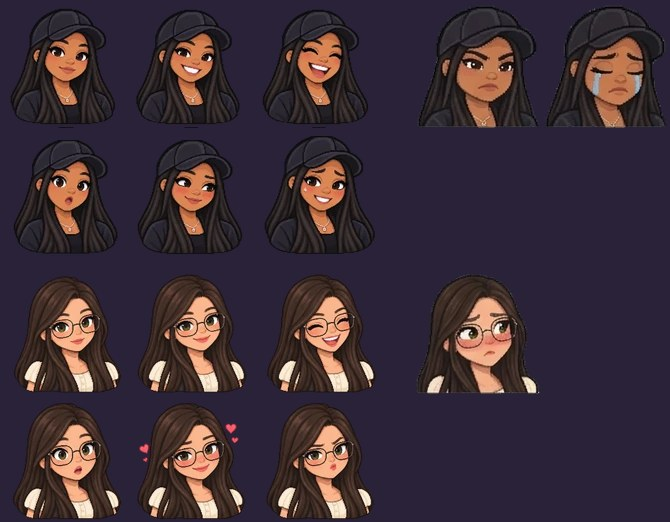
*Retratos atuais: 6 expressões básicas + tira extra de cada uma*

| Expressão | Código usado no roteiro | Line | Bell |
|---|---|---|---|
| Neutra | `neutro` | ✅ | ✅ |
| Sorrindo | `sorriso` | ✅ | ✅ |
| Rindo | `riso` | ✅ | ✅ |
| Surpresa | `surpresa` | ✅ | ✅ |
| Apaixonada | `apaixonada` | ✅ | ✅ |
| Marota | `maroto` | ✅ | ✅ |
| Brava | `bravo` | ✅ | 🔁 usa neutra |
| Chorando | `chorando` | ✅ | 🔁 usa surpresa |
| Envergonhada | `envergonhada` | 🔁 usa apaixonada | ✅ |

**Retratos que ainda faltam:**
- **Personagens sem retrato:** Mago, Espírito das Ruínas e Guardião de Pedra.
- **Expressões que faltam:** Bell brava, Bell chorando e Line envergonhada.

As fontes são os retratos 3×2 do HTML *Primeiro Encontro* e a prancha “Line & Bell”, que deu as expressões extras.

## 12. Cenário e objetos

> ⚠️ O cenário atual também é temporário: parte vem de pacotes de arte recebidos, parte é desenhada no código.

| Área | Já usa arte (temporária) | Ainda desenhado no código (precisa de arte) |
|---|---|---|
| Minas Shopping (prólogo) | ilustração do shopping, vinda do HTML do primeiro encontro (temporária; a final segue a foto-modelo da seção 5.2) | — |
| Playground (prólogo) | máquina de soco (recortada da animação `LINE_PUNCH_MACHINE`) | piso xadrez, paredes, fliperamas, painel, balcão de prêmios, placar da máquina |
| Túnel (prólogo) | ilustração do túnel, vinda do HTML do primeiro encontro | — |
| Fazendinha | casa (prancha Farmhouse), celeiro, galinheiro, moinho, poço, árvores e frutíferas, cerejeiras, horta (cenoura e tomate), feno, carroça, lampiões, píer, barco, girassóis, milho, trigo, arbustos, pedras, placa | chão de grama, caminho, água do lago, cercas, flores pequenas, mato, varal, mesa, casinha do Theo, tigela |
| Floresta | pinheiros e árvores | chão, raízes, riacho, espinheiros, baú, placas, pedras |
| Gruta dos Ecos | — | chão e paredes azuladas, água funda, estalagmites, cogumelos luminosos, fonte, placa, porta de ferro, baús |
| Ruínas Encantadas | — | chão de lajes, paredes, pilares, cristais (apagado e aceso), altar com orbe, fonte, barreira de luz, lagos, baú |
| Montanha de Brasa | — | chão vulcânico, paredes, fendas, lava, tochas (apagada e acesa), portão de fogo, pedras, estalagmites, fonte, baú |
| Covil | — | chão, paredes, lava, estalagmites, jaula da Bell |

**Objetos novos desenhados no código (precisam de arte):** porta de ferro trancada, cogumelos luminosos, documentos no chão, os 10 itens da mochila (hoje emojis), moedas, tochas, moradores, casas do vilarejo, carrinho, estações e trilhos, postes do gancho, bombas, paredes rachadas, chão em brasa, morcegos e o mapa do mundo. A lista completa, com o que cada um deve mostrar, está na **seção 7.12**.

Pranchas de referência já recebidas ficam em `arte/referencias/`: fazenda, casa, Theo, galinhas, pacote Line & Bell, tileset, o modelo do Minas Shopping e os gabaritos de cada fase. As referências do dragão antigo saíram (o dragão do jogo vem dos itens 80 a 97).

## 13. Efeitos visuais

### 13.1 Efeitos com arte (itens 98 a 102)

Os efeitos em pixel art já entram no jogo. Se a arte de um efeito faltar, o jogo volta sozinho para o efeito desenhado em código.

| Efeito | Item | Onde aparece no jogo |
|---|---|---|
| `FX_IMPACT` | 100 | a cada golpe que acerta um inimigo ou chefe |
| `FX_SPARKS` | 100 | quando a Line bloqueia um golpe com a defesa |
| `FX_EXPLOSION` | 100 | na explosão das bombas |
| `FX_DRAGON_WEAK_POINT` | 101 | no peito do dragão, enquanto o ponto fraco está aberto |
| `FX_HEARTS` | 102 | na bitoquinha do pôr do sol, no abraço do resgate e no epílogo |
| `FX_TEARS` | 102 | quando a Line chora depois do rapto |
| `FX_DUST` | 99 | na onda do ataque aéreo e no pouso do dragão no covil |
| `FX_SMOKE` | 99 | saindo das tochas apagadas da montanha |
| `FX_SWORD_TRAIL`, `FX_AMBIENT_PARTICLES`, `FX_FIRE`, `FX_EMBERS`, `FX_FIRE_LIGHT` | 98, 101, 102 | recebidos e carregados, mas ainda não usados: o rastro da espada do jogo muda de forma a cada golpe (horizontal, vertical, giro), e o fogo e a luz do fogo são desenhados junto com as tochas e o dragão; `FX_FIRE_LIGHT` é um octógono opaco, que precisaria de transparência para iluminar o cenário |

### 13.2 Efeitos desenhados no código

Estes continuam temporários, feitos no código:

- **Luta:**
  - Rastro azul da espada.
  - Impacto (anel branco), faíscas de bloqueio e poeira.
  - Onda do ataque aéreo e onda do pisão do Guardião.
- **Magia:**
  - Raio de Luz (bola brilhante com rastro).
  - Carga e explosão da Chuva de Estrelas.
  - Brilho dos cristais e chamas das tochas.
  - Brilho das barreiras e runas.
- **Dragão:**
  - Fogo do dragão (partículas).
  - Brilho do ponto fraco e estrelas de tontura.
- **Ambiente:**
  - Corações, folhas caindo, fumaça das chaminés, brasas da lava, gotas d’água.
  - Vaga-lumes, borboletas, pássaros e sombras das nuvens.
- **Prólogo:**
  - Corações subindo no beijo, impacto e tremor no soco.
  - Brilho rosa nas transições e zoom da câmera nos closes.
- **Tela:**
  - Tremor de tela, flash branco e pausas de impacto.
  - Tons de cor por horário e área.
  - O olho do dragão no final.

Os códigos `FX_*` da seção 10.10 são para quando esses efeitos ganharem arte própria.

## 14. Como mandar arte nova

1. **Formatos aceitos:**
   - HTML de item (`LINE_BELL_ITEM_XX.html`, um PNG por quadro).
   - HTML de laboratório.
   - Pasta `arte/<grupo>/<CÓDIGO>/00.png, 01.png…`.
   - Uma **prancha**: imagem com vários quadros, que eu recorto.
2. **Nome:** o código precisa ser exatamente o da seção 10.
3. **Fundo transparente de verdade.** Nada de quadriculado ou fundo cinza desenhado.
4. **Mesmo tamanho** em todos os quadros de uma animação, com os pés sempre na mesma linha.
5. **Virada para a direita** nas animações de lado.
6. **Sem sombra no chão e sem rótulos** dentro dos quadros. O jogo desenha a sombra.
7. **Theo:** a arte final deve seguir o layout oficial da seção 2, só melhorando, sem perder os traços.
8. **Tamanho recomendado:**
   - Personagens: o corpo com cerca de 200 a 250 px de altura.
   - Dragão: corpo com cerca de 400 px, em quadros de 512×512.
   - Bichos: 100 a 150 px.
9. Quando a arte chega, o extrator (`tools/extrair_sprites.py`) monta as folhas e ela entra no jogo sozinha, no lugar da temporária.

## 15. Estrutura técnica

| Arquivo | O que faz |
|---|---|
| `game/index.html` | página do jogo, menus, controles de toque |
| `game/js/jogo.js` | motor: áreas, câmera, combate, HUD, salvamento |
| `game/js/entidades.js` | Line, Bell, Sombra, partículas |
| `game/js/magia.js` | magia, cristais, tochas, barreiras, fontes, Fogo-fátuo e Guardião |
| `game/js/dragao.js` | o dragão e seus ataques |
| `game/js/bichos.js` | bichos da fazenda e o Mago |
| `game/js/fazenda.js` | capítulo da fazenda e tarefas |
| `game/js/encontro.js` | prólogo *O primeiro encontro*: lugares, máquina de soco, cenas e falas |
| `game/js/cenas.js` | cenas e falas da aventura (roteiro) |
| `game/js/mochila.js` | mochila: itens, moedas, documentos e conclusões, mapa com névoa, objetivo, avisos |
| `game/js/mapas.js` | os mapas das 7 áreas da aventura |
| `game/js/mundo.js` | bombas e paredes rachadas, gancho, chão em brasa, escuro das minas, moedas soltas, casas e objetos novos |
| `game/js/loja.js` | vilarejo: moradores e falas, loja, ferraria, armaduras e escudos |
| `game/js/carrinho.js` | carrinho de mina: estações, escolha do destino e a viagem |
| `game/js/ia.js` | inteligência dos inimigos: linha de visão, caminho pela grade, alerta, separação, e o Morcego |
| `tests/rodar.js` | testes automatizados de todas as telas (Playwright) |
| `tools/fotos_documentacao.js` | tira as capturas das partes novas para este documento |
| `game/js/cenario.js` | árvores, casa, objetos e ambiente |
| `game/js/animacoes.js` | catálogo de animações, substitutas e desenho dos sprites (com a troca para a arte da Bell jogável e das armaduras) |
| `game/js/relogio.js` | relógio do jogo, dia e noite, descanso na fonte |
| `game/js/chefes.js` | os sete chefes elementais, ataques, perigos e arenas |
| `game/js/herois.js` | Bell jogável, troca de heroína, companheira que segue atrás |
| `game/js/parte2.js` | história da Parte 2, moradores e documentos novos, objetivos |
| `game/js/dicas.js` | dicas do modo Fácil: seta guia, dicas de chefe e de derrota |
| `tools/doc_parte2.py` | seções 16 a 22 deste documento |
| `tools/doc_apendices.py` | seções 23 a 26: o que falta, índice e plano dos itens, como rodar e editar o jogo |
| `tools/medir_cabecas.py` | mede o tamanho da cabeça da Line e da Bell em cada animação; os ajustes ficam em `tools/ajuste_cabeca.json` |
| `tools/pernas_alternadas.py` | refaz as pernas da galinha andando e correndo, uma depois da outra |
| `game/js/entrada.js` | teclado, controle, toque e dificuldade |
| `game/assets/` | folhas de sprites, retratos, cenário (inclui `cenario/encontro_*.webp` do prólogo) |
| `tools/extrair_sprites.py` | converte a arte recebida em folhas para o jogo |
| `tools/gerar_documentacao.py` | gera este documento |

### Testes automatizados

A pasta `tests/` tem um conjunto de testes que abre o jogo num navegador de verdade (Chromium, pelo Playwright) e passa por **todas as telas**. Ele sobe sozinho um servidor para a pasta `game/`. Para rodar: `cd tests && npm install && npm test` (ou `node rodar.js loja carrinho` para rodar só alguns). `npm run fotos` salva uma captura de cada tela em `tests/fotos/`. Um teste falha se qualquer erro aparecer no console.

| Grupo | O que é testado |
|---|---|
| Menu | botões, troca de dificuldade, tela de controles e galeria de animações |
| Prólogo e fazenda | Novo jogo abre o Primeiro Encontro; manhã na fazenda com a Bell; estrada do vilarejo fechada antes do rapto e aberta depois |
| Pausa | abrir, abrir a mochila pela pausa, voltar com Esc, retomar |
| Mochila | itens, equipar no atalho, usar poção, 12 documentos, 8 conclusões, mapa da área e do mundo, teclas I, M, H, F e Esc |
| Mapa | só acende áreas visitadas; documento marca sem acender |
| Todas as áreas | cada uma das 7 áreas carrega, desenha e roda sem erros, e a Line não nasce dentro de parede |
| Tamanho e conectividade | tamanho das fases; todo baú, documento, morador, estação e saída alcançável (contando pulos, gancho, bombas, chaves e barreiras); toda saída chega em chão livre, fora de outra saída, e tem caminho de volta |
| Objetos e ajustes do celular | todos os objetos dos itens 146 a 227 carregam; ⚔ segurado faz o giro; sem espada a Line soca; poção e bomba pelo mesmo botão do item; a fazenda e a casa usam cada um; o regador aparece no poço; a casa não some quando a Line anda para a direita; no lanche do BK o shopping fica sem a mesa redonda; a arte de “Feliz” que caía saiu do jogo |
| Casas por dentro | todas as portas levam a um interior mobiliado com piso e paredes desenhados; Entrar na porta, sair pelo caminho de pedra; o bilhete da cabana vem antes de entrar; de frente para a Dona Rosa ainda dá para conversar |
| Vilarejo | loja da Dona Rosa (comprar, falta de dinheiro, botas), ferraria (armadura, escudo segurando golpe, Armadura de Brasa liberada pela receita), conversas com os moradores |
| Carrinho | quebrado sem alavanca, encaixar a alavanca, tela de destino só com estações descobertas, viagem até as Minas |
| Bombas, gancho, brasa, escuro | bomba quebra a parede e fica salvo; gancho atravessa; brasa queima sem a armadura e não queima com ela; galeria escura |
| Inimigos | caminho pela grade, alerta aos vizinhos, moedas caindo e sendo pegas, morcego acordando, coração não cai com a vida cheia |
| Derrota | tela de derrota e Tentar de novo; Pena de Fênix levanta a Line |
| Documentos e dragão | a cena de documento forma conclusão; a luta no covil começa |
| Save | Continuar volta com área, moedas e itens; save antigo é convertido |
| Celular | controles de toque, botão da poção e do item, mochila cabendo na tela |
| Parte 2 — fases | as 7 fases novas carregam e rodam, a heroína não nasce na parede, o chefe e a companheira estão lá; vento empurra e lama deixa lenta |
| Parte 2 — história | Continuar depois do “Fim?” abre a Parte 2; a estrada do vale só abre depois; o mapa do mundo ganha 7 regiões |
| Bell jogável | troca com T, estrela, leque de 3 luzes gastando magia, canção encantando inimigos, a Line assume quando a Bell cai e a caída não volta |
| Armaduras da Bell | só aparecem na Parte 2, ficam guardadas para a Bell e dão escudo quando ela está ativa |
| Chefes | cada um dos 7 chefes acorda com a cena, luta alguns segundos, é vencido e salva a vitória (+1 coração nos guardiões, portal depois da última junção, final depois da Quimera) |
| Relógio | 1 s = 1 min, noite com moradores dormindo, descanso na fonte até as 7h do dia seguinte |
| Dicas do Fácil | seta para a saída certa, para o cristal apagado e para o chefe; dica de chefe e de derrota |

### Como atualizar este documento
As tabelas de animações, o roteiro, os mapas e o índice dos itens são gerados a partir do jogo e dos arquivos recebidos. Os comandos estão na seção 26.7.

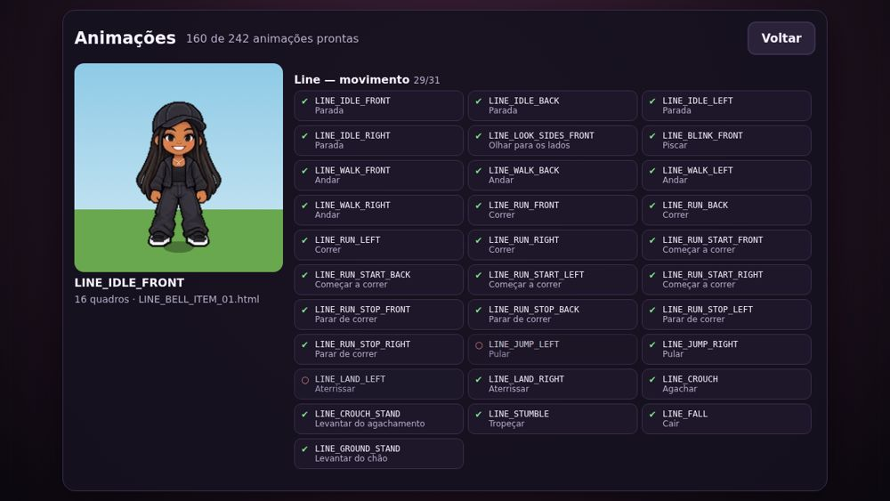
*No jogo, o menu Animações mostra a mesma lista, com prévia de cada uma*

## 16. Parte 2 — O Coração dos Elementos

> A Parte 2 começa quando a jogadora aperta **Continuar** depois do “Fim?” da Parte 1 (o olho do dragão se abrindo). O save continua o mesmo: moedas, itens, documentos e armaduras vão junto.

### 16.1 A história

Na manhã seguinte ao pôr do sol do epílogo, o chão tremeu a noite inteira e o céu amanheceu verde e roxo. O dragão pousa na fazenda — mas desta vez para **pedir ajuda**. Há mil anos, cinco guardiões cuidavam dos elementos: **Pedra** (o Guardião das ruínas), **Fogo** (o próprio dragão), **Terra**, **Água** e **Ar**. Quando a Line venceu os dois primeiros *sem ódio*, as luzes deles ficaram soltas, e uma coisa velha e sem forma bebeu o que sobrou: a **Quimera**.

A Quimera morde os guardiões, envenena, rouba a luz deles e, com o que rouba de dois elementos, faz nascer uma fera nova. Agora ela vai atrás dos três que faltam: o **Colosso** (Terra), a **Serpente** (Água) e o **Grifo** (Ar). Se juntar todos, o mundo esfria de vez.

Quando a Line dividiu a luz com o dragão no covil, uma parte ficou na Bell. Agora ela **atira estrelas** e a **canção dela acalma qualquer fera** — e dessa vez ela não fica esperando em gaiola nenhuma: **a Bell vira jogável**, e as duas partem juntas.

O tema da Parte 1 volta no fim: a Quimera não é má, é **sozinha**. Ela rouba porque acha que só assim deixa de sentir frio. As duas respondem com a frase do jogo: *luz não se rouba, se divide*.

### 16.2 Ordem da aventura

| # | Fase | Chefe | Tipo | Abre |
|---|---|---|---|---|
| 1 | Vale das Raízes | Colosso de Raízes | guardião | estrada da Fenda de Magma |
| 2 | Fenda de Magma | Titã de Magma | junção Pedra + Fogo | estrada do Lago Espelhado |
| 3 | Lago Espelhado | Serpente das Marés | guardião | estrada do Pântano Sombrio |
| 4 | Pântano Sombrio | Hidra de Lama | junção Terra + Água | estrada dos Picos do Vento |
| 5 | Picos do Vento | Grifo da Tempestade | guardião | passagem do Olho da Tempestade |
| 6 | Olho da Tempestade | Tempestade Viva | junção Água + Ar | portal do Coração dos Elementos |
| 7 | Coração dos Elementos | Quimera Primordial | chefe final (todos os elementos) | final da Parte 2 |

Cada fase segue o mesmo ritmo, para ser **longa sem cansar**: chegada com uma conversinha das duas → um morador que conta o que aconteceu → explorar e acender três fontes de luz (cristais, pérolas ou faróis) espalhadas pelo mapa → o chefe da fase → a sombra que sai dele foge para uma arena pequena ao lado → o chefe de **junção** → caminho aberto para a próxima fase. Cada fase grande leva uns **15 a 20 minutos**, e as arenas de junção uns 5.

### 16.3 Roteiro da Parte 2

#### Abertura: o dragão pede ajuda (fazenda)
> ▶ `BELL_IDLE`  
> 🎬 **Título na tela:** Parte 2 — O Coração dos Elementos  
> **Bell** *(surpresa)*: Line... você sentiu isso? O chão tremeu a noite inteira.  
> ▶ `LINE_LOOK_SIDES_FRONT`  
> **Line** *(surpresa)*: E o céu tá de uma cor esquisita. Meio verde, meio roxo...  
> ▶ `DRAGON_FLY`  
> ▶ `DRAGON_LAND`  
> ▶ `DRAGON_TALK`  
> ▶ `LINE_SWORD_DRAW`  
> **Line** *(brava)*: Bell, pra trás de mim!  
> ▶ `BELL_CALL_LINE`  
> **Bell** *(neutro)*: Espera! Olha os olhos dele. Não é o mesmo olhar.  
> **Dragão**: Pequena luz... e a moça que canta. Perdão pelo susto.  
> **Dragão**: Acordei com frio de novo. Mas não é o meu frio. Alguém está roubando o calor do mundo.  
> **Dragão**: Há mil anos, cinco guardiões cuidavam dos elementos. Pedra, Fogo, Terra, Água e Ar. O Guardião de Pedra das ruínas... e eu, o Fogo.  
> **Dragão**: Quando vocês nos venceram sem ódio, as nossas luzes ficaram soltas. E uma coisa velha, sem forma, bebeu o que sobrou: a Quimera.  
> **Line** *(surpresa)*: Uma Quimera... tipo um monstro feito de pedaços?  
> **Dragão**: De pedaços dos outros. Agora ela vai atrás dos três guardiões que faltam: o Colosso, no Vale das Raízes. A Serpente, no Lago Espelhado. O Grifo, nos Picos do Vento.  
> **Dragão**: Ela morde, envenena, e o que rouba de dois elementos vira uma fera nova. Se juntar todos... o mundo esfria de vez.  
> ▶ `LINE_DETERMINED`  
> **Line** *(brava)*: Então eu liberto os guardiões e paro a Quimera.  
> ▶ `BELL_DETERMINED`  
> **Bell** *(marota)*: “Eu”? Dessa vez eu vou junto.  
> **Line** *(surpresa)*: Bell, é perigoso...  
> **Bell** *(brava)*: Line. Eu passei três dias numa gaiola cantando pra um dragão. Eu vou junto.  
> **Dragão**: E ela pode. Quando a pequena luz dividiu a luz comigo, uma parte ficou na moça que canta. Olhe as mãos dela.  
> ▶ `BELL_HAPPY`  
> **Bell** *(rindo)*: Estrelas... Line, eu tô segurando estrelas!  
> **Dragão**: Ela atira estrelas, e a canção dela acalma qualquer fera. Juntas, vocês brilham mais do que qualquer guardião.  
> **Line** *(marota)*: Tá bom. Juntas. Mas quando eu disser “corre”, você corre.  
> **Bell** *(apaixonada)*: Quando você disser “corre”, a gente corre. As duas.  
> **Dragão**: Eu ainda estou fraco para lutar. Fico aqui, cuidando da fazenda. Sigam para o leste do vilarejo: a estrada do vale se abriu.  
> ▶ `DRAGON_SLEEP`  
> ▶ `LINE_IDLE`  
> ▶ `DRAGON_CURL_SLEEP`  

#### Chegadas (primeira vez em cada lugar)

**Vale das Raízes**

> **Bell**: Que lugar lindo... e que raiz enorme saindo do chão!  
> **Line**: Cuidado pra não correr em cima delas. Se tropeçar, cai de cara.  
> **Bell**: Olha, uma casinha com horta. Vamos perguntar pra quem mora ali.  

**Fenda de Magma**

> **Line**: Tá quente aqui... quente igual à montanha.  
> **Bell**: Pedra e fogo, misturados. Line, isso é pedaço do Guardião e do dragão.  
> **Line**: Então é aqui que a Quimera guardou o que roubou deles.  

**Lago Espelhado**

> **Bell**: Um lago de verdade! Com ilha no meio e tudo!  
> **Line**: E com uma coisa enorme nadando embaixo da água...  
> **Bell**: Ah. Isso. Vamos perguntar pro moço do píer primeiro.  

**Pântano Sombrio**

> **Line**: Que cheiro... Terra molhada de água ruim.  
> **Bell**: A lama tá puxando o meu sapato. Line, não para no meio da lama, tá?  

**Picos do Vento**

> **Bell**: A gente tá acima das nuvens, Line! ACIMA DAS NUVENS!  
> **Line**: E o chão acaba do nada. Segura a minha mão.  
> **Bell**: Sempre.  

**Olho da Tempestade**

> **Line**: Chuva subindo, vento chovendo...  
> **Bell**: O lago e o vento viraram uma coisa só. Tá com raiva de tudo.  

**Coração dos Elementos**

> **Bell**: Line... tá frio aqui. Frio de verdade.  
> **Line**: É o coração dela. Todos os elementos roubados batem aqui dentro.  
> **Bell**: Então vamos devolver. Um por um.  

#### Apresentação de cada chefe

Ao entrar na arena, a câmera vai até o chefe, aparece o nome e o título dele e eles falam:

**Colosso de Raízes** — *Guardião da Terra*

> **Colosso**: Grrr... raízes... secas... VÃO... EMBORA...  
> **Bell**: Ele tá doente, Line. Olha as folhas pretas nas costas.  
> **Line**: Então a gente cura ele do único jeito que dá: cansando ele primeiro.  

**Serpente das Marés** — *Guardiã da Água*

> **Serpente**: A água... está... suja... Ninguém... entra... no MEU lago!  
> **Bell**: Quando ela mergulhar, olha as bolhas!  

**Grifo da Tempestade** — *Guardião do Ar*

> **Grifo**: O céu é MEU! Caiam, pequenas, caiam!  
> **Line**: Bell, ele voa alto demais pra espada. Suas estrelas!  
> **Bell**: Deixa comigo.  

**Titã de Magma** — *Junção de Pedra e Fogo*

> **Titã de Magma**: PEDRA... E... FOGO... Eu sou o que sobrou dos seus amigos, pequena luz.  
> **Line**: Você é o que ela ROUBOU deles. Não é a mesma coisa.  

**Hidra de Lama** — *Junção de Terra e Água*

> **Hidra de Lama**: Muitas bocas... muita fome... Terra e água vão afogar vocês duas!  
> **Bell**: Quantas cabeças! Line, eu canto e você bate?  
> **Line**: Combinado.  

**Tempestade Viva** — *Junção de Água e Ar*

> **Tempestade Viva**: Chuva... vento... EU SOU O CÉU INTEIRO!  
> **Bell**: E eu sou a que canta mais alto que trovão!  

**Quimera Primordial** — *O Coração dos Elementos*

> **Quimera**: Então são vocês. A luz que se divide.  
> **Quimera**: Eu não divido. Eu JUNTO. Pedra, fogo, terra, água, ar... tudo em mim.  
> **Bell**: Você não junta nada. Você rouba.  
> **Line**: E luz não se rouba. Se divide.  
> **Quimera**: Então venham dividir... os pedaços de vocês!  

#### Guardiões libertados

Vencido, cada guardião volta às cores verdadeiras (animação `*_FREED`), agradece e dá **+1 coração** (vale para as duas) e uma **escama** — com duas escamas, o Seu Bento forja a Armadura da Aurora da Bell.

**Colosso de Raízes**

> **Colosso**: A névoa... saiu da minha cabeça. Obrigado, meninas.  
> **Colosso**: A Quimera me mordeu e eu esqueci quem eu era. A sombra que saiu de mim fugiu para o leste, para a Fenda de Magma.  
> **Colosso**: Lá ela vai juntar a minha pedra velha com o fogo que roubou do dragão. Tomem cuidado.  
> 💡 *Dica na tela:* A sombra fugiu para a Fenda de Magma, a leste do vale.  

**Serpente das Marés**

> **Serpente**: Aaah... a água ficou limpa. Eu consigo me ver de novo.  
> **Serpente**: Aquela canção... fazia tanto tempo que ninguém cantava pra mim.  
> **Serpente**: A parte suja de mim escorreu para o pântano, no leste. Lá ela vai virar lama com o que roubou da terra.  
> 💡 *Dica na tela:* A sujeira da Serpente escorreu para o Pântano Sombrio, a leste do lago.  

**Grifo da Tempestade**

> **Grifo**: O vento... voltou a soprar do jeito certo. Eu me lembro do céu.  
> **Grifo**: Pequenas corajosas. A tempestade que eu virei está presa no leste, no Olho da Tempestade.  
> **Grifo**: Vençam a tempestade, e o caminho para o Coração dos Elementos se abre, ao norte.  
> 💡 *Dica na tela:* A tempestade que o Grifo virou está no Olho da Tempestade, a leste dos picos.  

#### Junções desfeitas
> **Line** *(sorrindo)*: Obrigada! A gente vai atrás dela.  
> **Bell** *(rindo)*: Os pedaços estão voltando pra casa... olha as luzes indo embora!  
> **Line** *(brava)*: Foi a última junção. Agora só sobrou ela.  
> **Bell** *(brava)*: O Coração dos Elementos, ao norte dos Picos do Vento. Vamos juntas.  
> **Line** *(brava)*: Uma junção a menos. Vamos em frente.  

#### Final da Parte 2
> **Quimera**: Não... não levem... eu só... queria... não ficar sozinha...  
> ▶ `BELL_IDLE`  
> **Bell** *(neutro)*: Ninguém precisa roubar pra não ficar sozinho.  
> **Line** *(apaixonada)*: É só pedir. A gente divide.  
> **Quimera**: ...quente. É... quente.  
> ▶ `DRAGON_SLEEP`  
> **Bell** *(rindo)*: O dragão veio dormir com a gente. Olha o rabo dele enrolado no Theo.  
> **Line** *(apaixonada)*: E lá no céu... cinco luzes. Uma de cada cor.  
> **Bell** *(apaixonada)*: Os guardiões voltaram pra casa. E a gente também.  
> **Line** *(apaixonada)*: Bell... obrigada por vir junto.  
> **Bell** *(marota)*: Da próxima vez, sou eu que salvo você.  
> **Line** *(rindo)*: Combinado. Mas só se for de mãos dadas.  
> ▶ `LINE_BELL_DANCE`  
> 🎬 **Título na tela:** Fim da Parte 2 — O Coração dos Elementos · Obrigada por jogar!  

#### Moradores novos (primeira conversa)

> **Dona Cora**: Duas meninas no meu vale? Faz tempo que ninguém passa por aqui sem correr.  
> **Dona Cora**: Desde que aquela sombra colorida desceu do céu, o Colosso ficou bravo. Ele cuidava das raízes, sabe? Agora elas saem do chão e derrubam quem corre.  
> **Bell**: A gente vai ajudar ele, Dona Cora. Prometo.  
> **Dona Cora**: Os cristais de terra seguram a barreira dele: um na minha horta, um no campo de raízes, um no bosque do leste. Luz neles!  

> **Seu Tião**: Ô de casa! Cuidado com a água, meninas: a Serpente anda brava e o lago virou sopa.  
> **Seu Tião**: Minha vó cantava uma música pra ela dormir. Acho que ainda tenho a letra... deixei num papel lá pro lado do leste.  
> **Line**: A Bell canta. Quem sabe a Serpente escuta.  
> **Seu Tião**: Se ela escutar, ela para. Toda fera para pra ouvir uma canção boa.  

> **Vó Brisa**: Subiram até aqui sem voar? Então são das teimosas. Gosto disso.  
> **Vó Brisa**: O Grifo era o dono do vento bom. Agora ele sopra de lado e quer derrubar todo mundo no abismo.  
> **Vó Brisa**: Os três faróis abrem o ninho dele. E quando o vento empurrar, andem contra ele, devagar.  
> **Bell**: Devagar e de mãos dadas. Sempre funciona.  

Os moradores do vilarejo também ganham uma fala nova na Parte 2 (a Dona Rosa vê as duas juntas, o Seu Bento oferece armaduras para a Bell, o Seu Zé conta que a estrada do leste abriu sozinha e que a irmã dele, a Cora, mora no vale).

### 16.4 Documentos novos

| Documento | Tipo | Onde | Marca no mapa |
|---|---|---|---|
| 🌱 Diário da Dona Cora | Diário | Vale das Raízes, perto da horta | Ninho do Colosso |
| 🎵 Canção das águas | Pergaminho | Lago Espelhado, margem leste | Ilha da Serpente |
| 🪶 Pena de tempestade | Objeto encontrado | Picos do Vento, platô leste | Ninho do Grifo |

**Conclusão nova:** juntando os três, a Line entende: *Todos os guardiões adoeceram do mesmo jeito: a sombra de muitas cores. A Quimera morde, rouba a luz e deixa o resto bravo.* **Efeito:** Os chefes ficam cansados um ataque mais cedo.

## 17. As fases da Parte 2

| Fase | Tamanho | Baús | Inimigos | Chefe | Saídas |
|---|---|---|---|---|---|
| Vale das Raízes | 64 × 42 | 4 | 7 sombras, 4 fogos-fátuos de terra | Colosso de Raízes | Vilarejo do Riacho, Lago Espelhado (depois de `fusaoMagma`), Fenda de Magma (depois de `chefeTerra`) |
| Fenda de Magma | 36 × 28 | 0 | só o chefe | Titã de Magma | Vale das Raízes |
| Lago Espelhado | 64 × 42 | 3 | 5 fogos-fátuos de água, 5 sombras | Serpente das Marés | Vale das Raízes, Pântano Sombrio (depois de `chefeAgua`), Picos do Vento (depois de `fusaoLama`) |
| Pântano Sombrio | 38 × 28 | 1 | só o chefe | Hidra de Lama | Lago Espelhado |
| Picos do Vento | 64 × 42 | 3 | 5 fogos-fátuos de ar, 4 sombras | Grifo da Tempestade | Lago Espelhado, Olho da Tempestade (depois de `chefeAr`), Coração dos Elementos (depois de `portalCoracao`) |
| Olho da Tempestade | 36 × 28 | 0 | só o chefe | Tempestade Viva | Picos do Vento |
| Coração dos Elementos | 40 × 32 | 0 | só o chefe | Quimera Primordial | Picos do Vento |

A estrada nova sai do **leste do Vilarejo do Riacho** e só abre na Parte 2. O mapa do mundo ganhou sete regiões, que só aparecem depois que o dragão acorda.

### Vale das Raízes (Terra)
Grama dourada-esverdeada de fim de verão, caminhos de terra batida, bosque de árvores largas.

- **Casa da Dona Cora (noroeste):** a jardineira, a horta e o primeiro cristal de terra.
- **Campo de raízes (sudoeste):** raízes que derrubam quem corre, o segundo cristal e um baú.
- **Lamaçal (centro-sul):** lama que deixa lenta e um baú no meio.
- **Bosque do leste:** o terceiro cristal e o **recanto de pedra rachada** (bomba) com um baú escondido.
- **Ninho do Colosso (nordeste):** anel de pedras fechado pela barreira de raízes; abre com os três cristais acesos.
- **Saídas:** oeste → vilarejo; leste → Fenda de Magma (depois do Colosso); norte → Lago Espelhado (depois do Titã de Magma).

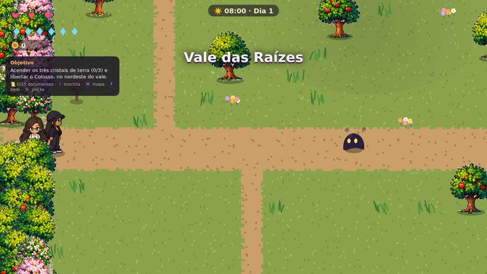
*Vale das Raízes*

### Fenda de Magma (Pedra + Fogo)
Caverna vulcânica: rocha escura avermelhada, rios de lava nas bordas.


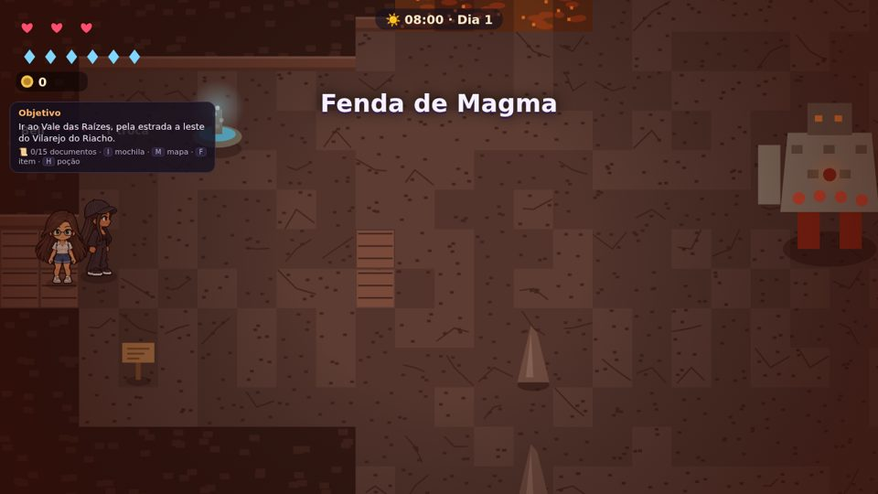
*Fenda de Magma*

### Lago Espelhado (Água)
Margens verdes, água azul muito limpa (depois da vitória) ou turva (antes), uma ilha no meio.

- **O grande lago** com a **ilha da Serpente** no meio, ligada por uma ponte fechada por uma parede de água.
- **Três pérolas-cristal:** no píer do Seu Tião (sudoeste), na margem oeste (norte) e no bosque do leste.
- **Riachos para pular** e a estrada que contorna o lago pela margem oeste até o norte.
- **Saídas:** sul → vale; leste → Pântano Sombrio (depois da Serpente); norte → Picos do Vento (depois da Hidra).

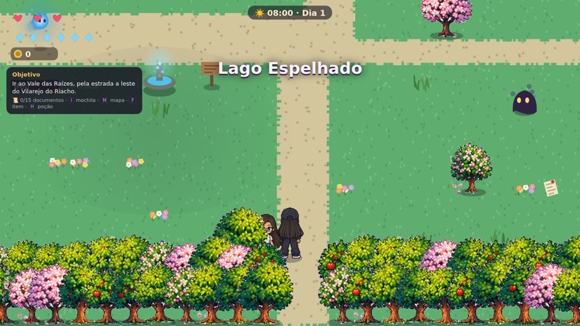
*Lago Espelhado*

### Pântano Sombrio (Terra + Água)
Charco verde-escuro, árvores mortas, névoa baixa.


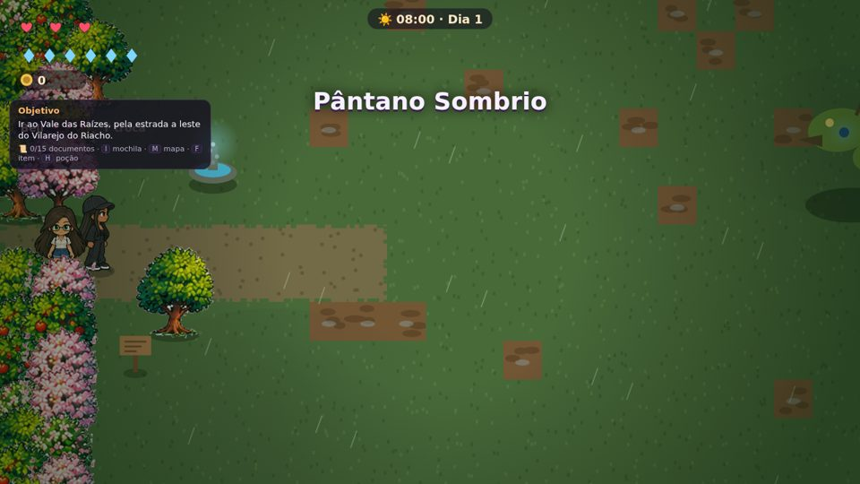
*Pântano Sombrio*

### Picos do Vento (Ar)
Platôs de pedra clara acima das nuvens, abismo de céu entre eles.

- **Platôs separados por abismos de céu** (pulando até 3 tiles) e **pontes de vento**: o vento empurra para o lado enquanto se atravessa, com abismo dos dois lados.
- **Platô oeste:** a Vó Brisa, um farol e a ponte de vento que sobe até o ninho do Grifo.
- **Platô leste:** outro farol, a pena de tempestade e a ponte de vento para o pico nordeste (terceiro farol e saída da Tempestade).
- **Centro:** uma ponte de vento vinda da chegada, baú e a passagem norte para o Coração dos Elementos (abre depois das três junções).

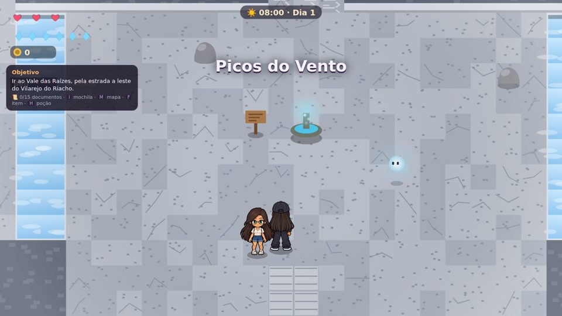
*Picos do Vento*

### Olho da Tempestade (Água + Ar)
Ilha de pedra escura cercada de céu de tempestade.


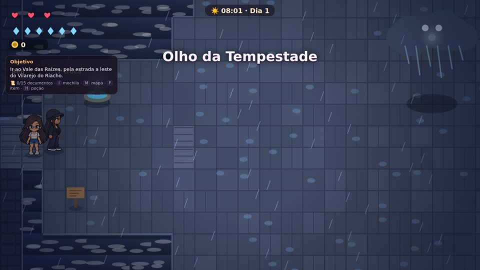
*Olho da Tempestade*

### Coração dos Elementos (todos)
Salão de cristal roxo no alto dos picos, com cinco pilares, um por elemento.


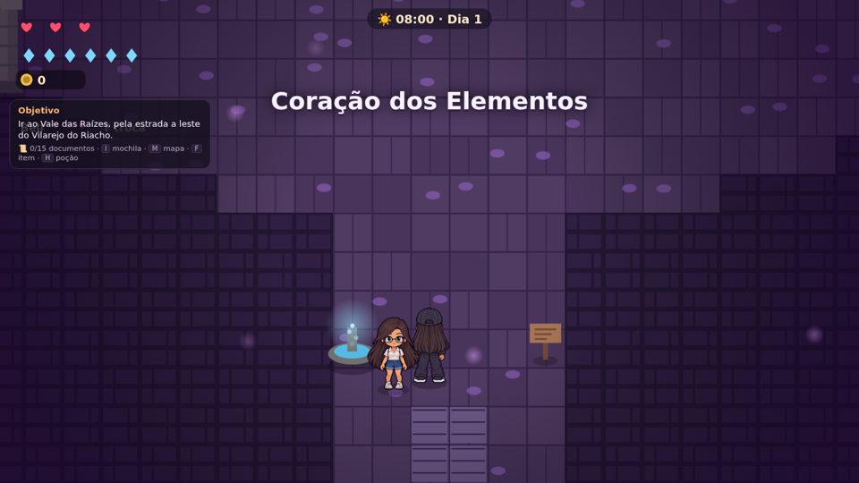
*Coração dos Elementos*

**Chão novo:** lama (`u`) deixa as duas mais lentas (a Armadura da Aurora da Bell ignora); as correntes de vento (`>` e `<`) empurram mesmo parada; o abismo de céu (`j` nos picos) derruba e devolve para a beirada com um tombo.

**Ambientação:** chuva no Olho da Tempestade (forte, com relâmpagos que clareiam a tela) e garoa no pântano; brasas na fenda; vaga-lumes verdes no pântano e roxos no Coração; nuvens, pássaros e folhas nas áreas abertas; cada fase tem uma vinheta de cor própria.

## 18. Relógio: dia e noite

- **1 segundo de jogo = 1 minuto no relógio**, ou seja, **1 minuto real = 1 hora**, e um dia inteiro passa em **24 minutos**.
- O relógio aparece no topo da tela (☀️ de dia, 🌅 ao amanhecer e ao entardecer, 🌙 à noite) com a hora e o **dia** da aventura.
- Só anda durante o jogo: para na pausa, na mochila, na loja e nas cenas.
- A aventura começa às **19h30** do dia 1, logo depois do rapto. Saves antigos começam às 8h.
- **Amanhecer** das 5h às 7h (tom rosado), **dia** das 7h às 17h, **entardecer** das 17h às 20h (tom laranja) e **noite** das 20h às 5h (azul-escuro, com um círculo de luz em volta da heroína; a lanterna aumenta o círculo).
- Cada lugar escurece de um jeito: áreas abertas escurecem tudo, a montanha e as ruínas só um pouco, e as cavernas (gruta, covil, fenda, Coração) não mudam.
- À noite aparecem **vaga-lumes** nas áreas abertas e os **moradores do vilarejo vão dormir** (a loja e a ferraria fecham: “Loja fechada, volte de manhã”).
- Em qualquer **fonte**, à noite, dá para **descansar até de manhã**: pula para as 7h do dia seguinte com a vida e a magia cheias (das duas, na Parte 2).

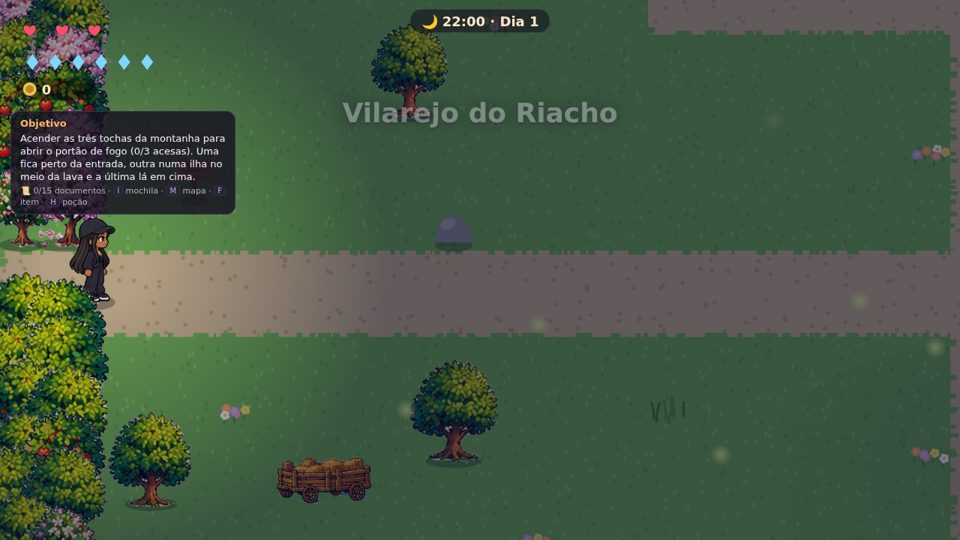
*O vilarejo às 22h: céu escuro, vaga-lumes e os moradores dormindo*

## 19. Bell jogável e as armaduras das duas

### 19.1 Trocando de heroína
- **T** no teclado, **L3** no controle ou o botão **🔄** no celular troca entre a Line e a Bell a qualquer momento fora das cenas.
- A outra heroína anda junto, logo atrás.
- **Cada uma tem a própria vida e magia.** Um mini-painel embaixo das moedas mostra a vida de quem está descansando.
- Quando a heroína ativa **cai**, a outra **assume na hora**. Só é derrota quando as duas caem. Quem caiu só volta depois de beber numa fonte (ou descansar).
- A heroína que está descansando recupera magia devagar.

### 19.2 Como a Bell luta

| Botão | Bell | Line |
|---|---|---|
| ⚔ Atacar (J) | **Estrela**: atira uma estrela rosa à distância (1 de dano). Apertando de novo, atira em sequência | combo de espada |
| Especial (K; no celular, segurar ⚔) | **Leque de estrelas**: três estrelas de luz em leque (1 de magia). Acendem cristais, faróis e pérolas e **abrem a guarda dos chefes** | giro |
| ✨ Magia (Q) | **Canção** (2 de magia): acalma todos os inimigos em volta por uns 2 s (eles param e ficam ouvindo, com notinhas), cura 1 de vida das duas; nos chefes, segura o ataque por 1,4 s, ou deixa o núcleo exposto por mais tempo se ele estiver cansado | Raio de Luz / Chuva de Estrelas |
| 🛡 Defender (V) | escudo de luz rosa | defesa com a espada |
| 💨 Esquivar, ⤴ Pular | iguais às da Line | |

A Bell é um pouco mais rápida e luta **de longe**; a Line bate mais forte **de perto**. Contra os chefes, o jeito mais fácil é a Bell abrir a guarda com o leque e a Line entrar com a espada.

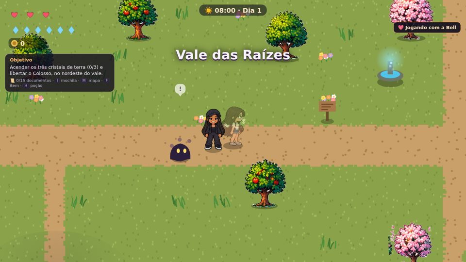
*Jogando com a Bell: a Line vem atrás*

### 19.3 Armaduras

A ferraria do Seu Bento passa a vender três armaduras **da Bell** na Parte 2. Cada heroína veste a sua: comprar uma armadura da Bell jogando com a Line guarda para ela.

| Heroína | Armadura | Escudos e efeito | Como é (para a arte) |
|---|---|---|---|
| Line | **Túnica Acolchoada** | 1 escudo · 40 moedas | Túnica de linho bege acolchoada (costuras em losango marrom-claro) por cima da roupa de sempre, cinto de couro com fivela de latão, ombreiras macias de tecido. Mantém o cabelo, o rosto e as botas da Line. Deve parecer caseira, feita no vilarejo. |
| Line | **Cota de Malha** | 2 escudos · 90 moedas | Camisa de anéis de ferro até o meio da coxa, gola alta, cinto largo de couro escuro, braçadeiras de couro. Brilho metálico prateado frio (2 tons de cinza-azulado + 1 reflexo branco). Os anéis podem ser sugeridos por um padrão de pontinhos, não precisa desenhar anel por anel. |
| Line | **Armadura de Brasa** | 3 escudos · 160 moedas · atravessa chão em brasa | Placas de cobre avermelhado sobre malha temperada, com frestas nas juntas mostrando brasa laranja por dentro (pode pulsar devagar, 2 quadros de brilho). Uma ombreira feita com uma escama vermelha do dragão. Bota com biqueira de cobre. É a armadura mais pesada: postura um pouco mais firme, mas a mesma silhueta da Line. |
| Bell | **Vestido Reforçado** | 1 escudo · 60 moedas | O vestido de sempre da Bell em duas camadas, com bordado de fio de prata na barra e no decote, corpete acolchoado e mangas bufantes curtas. Saia até o joelho, para correr. Mantém os óculos e o cabelo. Costurado pela Dona Rosa. |
| Bell | **Manto Estelar** | 2 escudos · 130 moedas | Capa azul-noite até os tornozelos, presa por um broche de estrela dourada, com estrelinhas bordadas que brilham (1 quadro extra de brilho quando ela canta ou atira). Capuz abaixado nas costas. Por baixo, o vestido reforçado. |
| Bell | **Armadura da Aurora** | 3 escudos · 220 moedas · atravessa brasa e lama | Armadura leve de placas iridescentes feitas com as escamas dos guardiões: verde-musgo (terra) no peito, azul-água nos braços, branco-perolado (ar) nos ombros, com reflexo de arco-íris que muda devagar. Saia de placas curtas por cima de uma calça justa, botas altas que não afundam na lama, tiara com uma pedrinha de cada cor. Brilho suave, não metálico. |

A **Armadura da Aurora** só aparece depois de libertar **dois guardiões** (as escamas deles viram as placas).

**Como a arte da armadura entra no jogo:** o jogo procura primeiro a animação com o nome da armadura no meio do código e, se ela não existir, usa a normal. Exemplo: com a Cota de Malha, `LINE_WALK_RIGHT` vira `LINE_MALHA_WALK_RIGHT`; com o Manto Estelar, `BELL_ATTACK_STAR` vira `BELL_ESTELAR_ATTACK_STAR`. Assim dá para mandar a arte aos poucos, animação por animação. A lista de códigos está na seção 22.2.

## 20. Chefes elementais

**Regra comum:** todo ataque tem aviso antes (círculo no chão, anel para pular, bolhas, sombra). Depois de alguns ataques o chefe **se cansa**: o núcleo fica exposto (barra ciano) e aí a espada e as estrelas machucam de verdade. Fora disso, a espada só faz “clang”. A **luz** (Raio de Luz da Line ou leque da Bell) abre a guarda na hora, e a **canção** da Bell segura os ataques. No Fácil, o chefe cansa um ataque mais cedo, e a espada ainda arranha um pouco.

### Colosso de Raízes — Guardião da Terra
- **Elementos:** 🌱 Terra · **Vida:** 16 no Normal · **Cansa depois de:** 3 ataques · **Onde:** Vale das Raízes
- **Ataques:** raízes saindo do chão em linha; anel de espinhos (pular); cuspe de lama que deixa lenta; chama duas sombras.
- **Dicas do Fácil:** As raízes saem do chão em linha, na sua direção: ande para o lado, não para trás. / Depois de três ataques ele se cansa e a flor do peito abre. É a hora de atacar! / A magia de luz abre a guarda dele na hora.
- **Aparência:** Gigante de terra e madeira do tamanho de uma casa: tronco de árvore como corpo, braços de raízes grossas, musgo nos ombros e uma **flor no peito** (o núcleo) que se abre quando ele cansa. **Corrompido:** folhas pretas nas costas, olhos roxos e fumaça colorida saindo das rachaduras. **Libertado (`COLOSSO_FREED`):** folhas verdes, flores brancas brotando, olhos âmbar, sorriso tranquilo.

### Serpente das Marés — Guardiã da Água
- **Elementos:** 💧 Água · **Vida:** 16 no Normal · **Cansa depois de:** 3 ataques · **Onde:** Lago Espelhado
- **Ataques:** mergulha (fica intocável) e sai embaixo das bolhas; jatos de água em leque; onda que precisa ser pulada.
- **Dicas do Fácil:** Quando ela mergulha, fique de olho nas bolhas: ela sai embaixo delas. / Pule a onda na hora que ela chegar em você. / Depois de três ataques ela boia cansada: ataque a cabeça!
- **Aparência:** Serpente-marinha longa, azul com barriga turquesa, barbatanas translúcidas nas costas e uma crista de coral. Mergulha e só a cabeça e parte do corpo aparecem. **Corrompida:** água turva marrom escorrendo, manchas escuras nas escamas, olhos brancos sem pupila. **Libertada:** escamas brilhando como espelho, olhos azul-claro.

### Grifo da Tempestade — Guardião do Ar
- **Elementos:** 🌪️ Ar · **Vida:** 16 no Normal · **Cansa depois de:** 3 ataques · **Onde:** Picos do Vento
- **Ataques:** rajada de vento que empurra para longe; leque de penas afiadas; raios caindo em círculos brancos.
- **Dicas do Fácil:** A rajada empurra para longe dele: ande contra o vento (ou defenda) para não cair. / Os raios caem onde aparece o círculo branco: saia de dentro. / Cansado, ele pousa no chão. Aproveite!
- **Aparência:** Águia-leão cinza e branca com asas enormes (abertas ocupam 2× o corpo), penas das asas com faíscas elétricas nas pontas, garras douradas. Voa a maior parte da luta e pousa quando cansa. **Corrompido:** penas eriçadas cinza-chumbo, olhos vermelhos, raios roxos. **Libertado:** penas brancas, olhos dourados, brisa suave em volta.

### Titã de Magma — Junção de Pedra e Fogo
- **Elementos:** 🪨 Pedra + 🔥 Fogo · **Vida:** 24 no Normal · **Cansa depois de:** 3 ataques · **Onde:** Fenda de Magma
- **Ataques:** pisão com onda no chão (pular); chuva de fogo que deixa poças de lava; arremessa rochas; leque de bolas de fogo.
- **Poças:** deixa poças de lava pelo chão por alguns segundos.
- **Dicas do Fácil:** A chuva de fogo deixa poças de lava por alguns segundos: não pise nelas. / Pule a onda do pisão. / A luz racha a casca de pedra e deixa o coração de fogo exposto.
- **Aparência:** Titã de pedra do Guardião (mesmo estilo das ruínas) todo rachado, com **lava escorrendo pelas rachaduras** e um **coração de fogo** no peito (o núcleo). Braços de rocha que batem no chão, pedaços de pedra flutuando nos ombros. Cheio de brasas subindo. Quando cansa, a casca se abre e o coração fica exposto, pulsando.

### Hidra de Lama — Junção de Terra e Água
- **Elementos:** 🌱 Terra + 💧 Água · **Vida:** 24 no Normal · **Cansa depois de:** 3 ataques · **Onde:** Pântano Sombrio
- **Ataques:** raízes saindo do chão em linha; jatos de água em leque; onda que precisa ser pulada; mergulha (fica intocável) e sai embaixo das bolhas; cuspe de lama que deixa lenta.
- **Poças:** deixa poças de lama pelo chão por alguns segundos.
- **Dicas do Fácil:** As poças de lama deixam você lenta: fuja delas. / Ela mergulha na lama e sai embaixo das bolhas. / Cansada, ela afunda a cabeça no chão: ataque!
- **Aparência:** Três cabeças de serpente feitas de lama e raízes saindo de um charco. O corpo fica afundado; as cabeças se mexem separadas (uma cospe lama, outra água, a do meio morde). Olhos amarelos, bocas escorrendo lama. Quando cansa, as três cabeças afundam e só o núcleo (uma bolha de lama brilhante) aparece.

### Tempestade Viva — Junção de Água e Ar
- **Elementos:** 💧 Água + 🌪️ Ar · **Vida:** 24 no Normal · **Cansa depois de:** 3 ataques · **Onde:** Olho da Tempestade
- **Ataques:** raios caindo em círculos brancos; rajada de vento que empurra para longe; jatos de água em leque; onda que precisa ser pulada; leque de penas afiadas.
- **Dicas do Fácil:** Os raios agora caem em sequência: continue andando. / Quando ela chove forte, a rajada vem logo depois: prepare-se para andar contra o vento. / Cansada, ela desce e o olho da tempestade fica exposto.
- **Aparência:** Uma nuvem escura com rosto (olhos brancos brilhantes e boca de trovão), braços de vento em espiral, chuva caindo por baixo e raios entre as nuvens. Paira no ar. No centro fica o **olho da tempestade**, um redemoinho claro que é o núcleo. Quando cansa, desce ao chão e o olho abre.

### Quimera Primordial — O Coração dos Elementos
- **Elementos:** 🪨 Pedra + 🔥 Fogo + 🌱 Terra + 💧 Água + 🌪️ Ar · **Vida:** 48 no Normal · **Cansa depois de:** 4 ataques · **Onde:** Coração dos Elementos
- **Três fases:** Pedra + Fogo → Terra + Água → Ar + Fogo + Água + Terra + Pedra. Na última, bate 2 de uma vez (menos no Fácil).
- **Ataques:** todos os dos elementos da fase.
- **Dicas do Fácil:** A Quimera muda de elemento a cada fase: veja a cor do núcleo para saber o que vem. / Na última fase ela usa todos os ataques e bate mais forte. Troque de heroína quando a vida baixar. / A luz sempre abre a guarda. Guarde magia para isso.
- **Aparência:** A fera final, feita de pedaços roubados de todos os guardiões: corpo de pedra com rachaduras de lava (pedra + fogo), juba de raízes e folhas pretas (terra), cauda de serpente d’água (água), asas de grifo (ar) e um **núcleo no peito que muda de cor** a cada fase — cinza/laranja (pedra e fogo), verde/azul (terra e água) e arco-íris pulsando (todos). Maior que o dragão. No final, acalmada (`QUIMERA_CALM`), encolhe e fica parecendo um filhote triste, quase fofo.

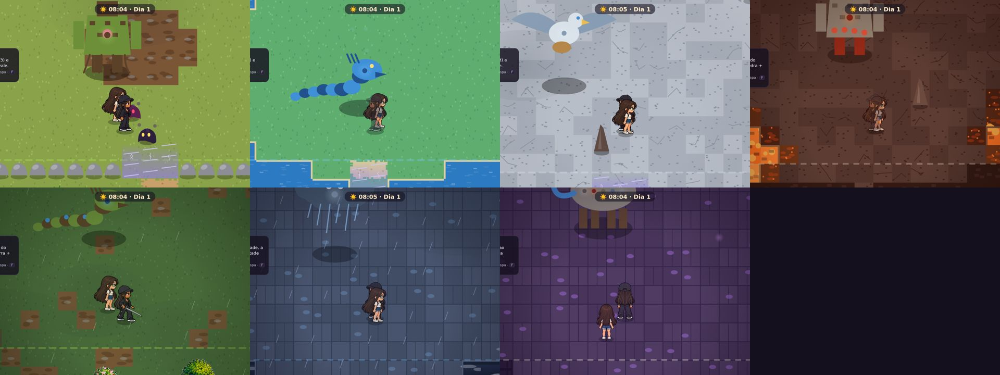
*Os sete chefes na versão provisória (desenhados no código até a arte chegar)*

## 21. Dicas do modo Fácil

No **Fácil**, além de chefes mais fracos, o jogo ajuda a jogadora a não se perder:

Tudo é **bem discreto**, em branco-creme transparente, para ajudar sem poluir a tela:

- **Trilha no chão:** pontinhos claros e fracos só nos próximos passos, com um brilho suave que corre na direção certa. Eles seguem **o caminho de verdade**, contornando paredes, água e árvores (contam pulos, espinhos para cortar e o gancho).
- **Setinha nos pés:** um “›” transparente perto da heroína mostra para onde a trilha segue.
- **No objetivo:** uma estrelinha piscando devagar e um anel fino no chão. O nome (“Cristal apagado (1/3 acesos)”, “Ovo escondido”…) só aparece quando a heroína está perto.
- **Legenda embaixo da tela:** texto pequeno e transparente com o que procurar, quantos passos faltam e, se for o caso, “pule por cima”, “corte os espinhos” ou “use o gancho no poste”.
- **Outra área:** a trilha leva até a saída certa pelo caminho mais curto entre as saídas já abertas.
- **Caminho fechado:** se uma barreira de luz está no meio, a trilha leva primeiro até a tocha ou o cristal que abre a passagem.
- **Tarefas da fazenda:** a trilha leva à tarefa mais perto (ovo escondido, regador, horta, ração do Theo, tigela ou o bichinho que ainda não ganhou carinho).
- **Coisas para achar:** baús fechados e documentos por perto têm uma estrelinha clara bem fraca.
- **Mapa (M):** tracejado claro com o caminho e uma estrela no objetivo, e todos os baús aparecem (como a Bússola do Mago). No mapa do mundo, a região do objetivo ganha um anel e 🧭.
- **Dicas de chefe:** ao acordar, quando cansa pela primeira vez e quando muda de fase, aparece um balão com a dica daquele chefe (seção 20).
- **Vida baixa:** com 1 coração ou menos, lembra de usar poção, trocar de heroína ou voltar a uma fonte (uma vez por área).
- **Tela de derrota:** mostra uma dica do que fazer diferente, conforme onde a heroína caiu (o chefe da luta, o dragão, o Guardião ou uma dica geral).

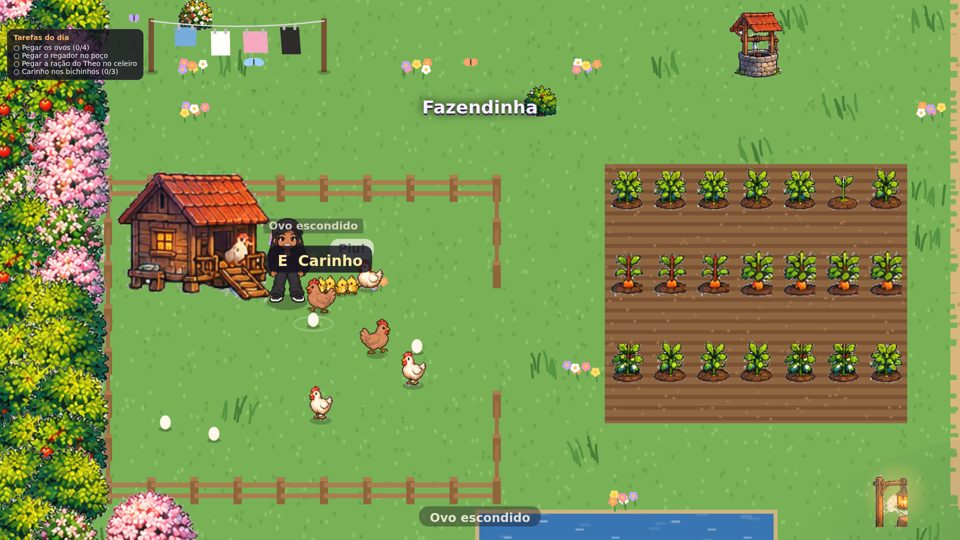
*A seta do Fácil apontando o caminho*

## 22. Arte necessária — lista completa

> Esta é a lista de **tudo o que precisa de arte** no jogo, das duas partes: personagens, armaduras, moradores, inimigos, chefes, cenário de cada fase, objetos, itens, interface, efeitos e dia/noite. Tudo que está hoje no jogo é **temporário** (emojis, desenhos no código ou arte provisória) e é trocado sozinho quando a arte com o código certo chega.

### 22.0 Tamanho de cada imagem (pensando na tela cheia)

O jogo sempre mostra **400 unidades de altura** do mundo na tela e aumenta tudo para caber. Por isso o tamanho de cada coisa depende da tela: em **tela cheia num monitor 1080p** tudo aparece **2,7×** maior que no mundo; num monitor **4K** ou num notebook **retina** em tela cheia, **5,4×**. Uma imagem menor que isso é esticada e fica borrada.

- **Recomendado:** nítido até em 4K ou retina em tela cheia.
- **Mínimo:** nítido em tela cheia 1080p (o caso mais comum no PC).
- No celular deitado o jogo usa uns 780 px de altura (escala ≈ 2×), então o mínimo já basta.
- Uma unidade do mundo equivale a 1 pixel do tile de 32×32: um tile tem 32 unidades.

| Grupo | Imagem | No mundo (L×A) | Janela 1280×720 | Tela cheia 1080p | Tela cheia 1440p | 4K ou retina | **Recomendado** | Mínimo | Observação |
|---|---|---|---|---|---|---|---|---|---|
| Personagens | Line, Bell e as duas juntas (cada quadro) | 74×74 | 133×133 | 200×200 | 266×266 | 400×400 | **512×512** | 400×400 | corpo de pé com uns 62 de altura (≈ 85% do quadro), pés sempre na mesma linha. Os 1254×1254 que chegam hoje estão ótimos |
| Personagens | Line e Bell com armadura | 74×74 | 133×133 | 200×200 | 266×266 | 400×400 | **512×512** | 400×400 | mesmo quadro e mesma posição dos pés da versão sem armadura |
| Personagens | Moradores (Rosa, Bento, Zé, Lurdes, Tobias, Cora, Tião, Brisa) e Mago | 74×74 | 133×133 | 200×200 | 266×266 | 400×400 | **512×512** | 400×400 | adulto uns 56 de altura, o Pedrinho uns 42: no mesmo quadro da Line, para ficarem na proporção certa |
| Personagens | Espírito das Ruínas | 90×110 | 162×198 | 243×297 | 324×396 | 486×594 | **512×640** | 400×500 | flutua; deixe espaço embaixo para o brilho |
| Chefes | Dragão Vermelho (cada quadro) | 215×215 | 387×387 | 580×580 | 774×774 | 1161×1161 | **1024×1024** | 640×640 | o maior desenho do jogo; asas abertas cabem no quadro |
| Chefes | Colosso, Serpente, Grifo, Titã de Magma, Hidra, Tempestade | 200×200 | 360×360 | 540×540 | 720×720 | 1080×1080 | **1024×1024** | 640×640 | um quadro por pose; o Grifo de asas abertas usa o quadro todo |
| Chefes | Quimera Primordial | 200×200 | 360×360 | 540×540 | 720×720 | 1080×1080 | **1280×1280** | 800×800 | maior e mais detalhada: pode passar da borda do quadro nos golpes |
| Chefes | Guardião de Pedra | 110×110 | 198×198 | 297×297 | 396×396 | 594×594 | **640×640** | 384×384 |  |
| Inimigos | Sombra, fogos-fátuos (todos os elementos), morcego | 64×64 | 115×115 | 173×173 | 230×230 | 346×346 | **384×384** | 256×256 | o bicho ocupa uns 60% do quadro; o resto é brilho |
| Bichos | Vaca, cavalo | 150×150 | 270×270 | 405×405 | 540×540 | 810×810 | **640×640** | 384×384 | vaca uns 71 de altura e cavalo uns 90 (a Line tem 62) |
| Bichos | Theo, porco, ovelha, gato, pato, galinhas | 72×72 | 130×130 | 194×194 | 259×259 | 389×389 | **384×384** | 256×256 | galinha uns 47 de altura, porco e ovelha uns 48, Theo uns 36, pato uns 34, gato uns 31. Andar e correr com as pernas alternando, uma depois da outra |
| Bichos | Pintinho | 62×62 | 112×112 | 167×167 | 223×223 | 335×335 | **384×384** | 256×256 | uns 27 de altura: pode vir no mesmo quadro da galinha, bem menor |
| Cenário | Tile de chão, parede, água, lama, vento, abismo | 32×32 | 58×58 | 86×86 | 115×115 | 173×173 | **128×128** | 96×96 | tem que emendar sem costura dos 4 lados; faça 3 ou 4 variações de cada |
| Cenário | Árvores (normal, frutífera, cerejeira, pinheiro, árvore morta do pântano) | 62×75 | 112×135 | 167×202 | 223×270 | 335×405 | **384×448** | 256×300 | hoje são 97×115: ficam borradas em tela cheia |
| Cenário | Arbustos, pedras, mato alto, flores | 33×33 | 59×59 | 89×89 | 119×119 | 178×178 | **192×192** | 128×128 | hoje uns 55×55 |
| Cenário | Casa da fazenda | 264×150 | 475×270 | 713×405 | 950×540 | 1426×810 | **1440×816** | 720×408 | hoje 501×280: a arte que mais precisa de resolução |
| Cenário | Celeiro, casas do vilarejo, casa da Cora e do Tião | 244×150 | 439×270 | 659×405 | 878×540 | 1318×810 | **1280×800** | 660×400 | a casa ocupa um bloco de 7×5 tiles |
| Cenário | Galinheiro, carroça, barco, píer | 114×70 | 205×126 | 308×189 | 410×252 | 616×378 | **640×384** | 320×192 |  |
| Cenário | Poço, moinho, fonte, bigorna, estação do carrinho | 54×70 | 97×126 | 146×189 | 194×252 | 292×378 | **320×384** | 160×192 |  |
| Cenário | Baú, placa, barril, lampião, caixa, poste do gancho | 32×40 | 58×72 | 86×108 | 115×144 | 173×216 | **192×224** | 96×112 | o baú precisa de 2 poses: fechado e aberto |
| Cenário | Cristal, tocha, farol do vento, pérola-cristal (apagado e aceso) | 32×64 | 58×115 | 86×173 | 115×230 | 173×346 | **192×384** | 96×192 | o aceso pode ter 4 a 6 quadros de brilho |
| Cenário | Pilar, altar, pilares dos elementos | 32×80 | 58×144 | 86×216 | 115×288 | 173×432 | **192×448** | 96×224 |  |
| Cenário | Barreira de luz, de raízes, parede de água, muro de vento (por tile) | 32×48 | 58×86 | 86×130 | 115×173 | 173×259 | **192×256** | 96×128 | emenda lado a lado |
| Cenário | Jaula da Bell | 70×90 | 126×162 | 189×243 | 252×324 | 378×486 | **384×512** | 192×256 |  |
| Efeitos | Impacto, faíscas, poeira, fumaça, brasas, lágrimas | 140×140 | 252×252 | 378×378 | 504×504 | 756×756 | **768×768** | 384×384 | o desenho fica no meio; o resto do quadro é transparente |
| Efeitos | Explosão, ponto fraco do dragão, corações | 300×300 | 540×540 | 810×810 | 1080×1080 | 1620×1620 | **1024×1024** | 640×640 | explosão é o maior efeito |
| Efeitos | Projéteis (estrela da Bell, luz, fogo, água, lama, pena, rocha) | 24×24 | 43×43 | 65×65 | 86×86 | 130×130 | **128×128** | 64×64 | com o brilho em volta |
| Efeitos | Aviso no chão (círculo de raiz, raio, bolha, poça de lava, poça de lama) | 96×96 | 173×173 | 259×259 | 346×346 | 518×518 | **512×512** | 256×256 | visto de cima, achatado |

**Interface** (estes não crescem com o mundo, crescem com a tela e com a densidade de pixels):

| Imagem | Tamanho na tela | **Recomendado** | Mínimo |
|---|---|---|---|
| Retratos dos diálogos (cada expressão) | 108×108 na tela (76×76 no celular) | **512×512** | 256×256 |
| Ícones dos itens, documentos e armaduras | 30×30 na mochila, 24×24 no HUD | **128×128** | 64×64 |
| Corações, escudos, gotas de magia, moeda | de 18 a 50 px, conforme a tela | **128×128** | 64×64 |
| Botões de toque (atacar, pular, 🔄…) | 62×62 (celular) | **192×192** | 128×128 |
| Relógio e moldura do HUD, barra de chefe | a barra tem até metade da largura da tela | **1600×64 (barra) · 256×64 (relógio)** | 800×32 · 128×32 |
| Fundos de tela cheia (título, Parte 2, capítulos, fundos do prólogo) | a tela inteira | **3840×2160** | 1920×1080 |
| Fundos do prólogo com close | a câmera aproxima até 1,6× | **3840×2160, sem nada importante a menos de 10% da borda** | 2560×1440 |
| Mapa do mundo (pergaminho) | até 900 px de largura na janela da mochila | **2400×1500** | 1600×1000 |

**Regras que valem para todas:** fundo transparente de verdade (PNG), sem sombra no chão (o jogo desenha), todos os quadros de uma animação do mesmo tamanho, com os pés na mesma linha, e as animações de lado viradas para a direita.

> ⚙️ **Observação técnica:** hoje o jogo guarda cada quadro dos personagens em 256×256 e cada quadro do dragão em 448×448. Isso fica nítido até 1440p. Para aproveitar a arte em 4K e retina, dá para subir esses tamanhos (pede só gerar as folhas de novo), com o custo de o jogo carregar um pouco mais devagar.

### 22.1 Resumo das animações

| Grupo | Animações | Com arte | Usando substituta | Faltando |
|---|---|---|---|---|
| Primeiro encontro (prólogo) | 9 | 9 | 0 | 0 |
| Line — movimento | 31 | 31 | 0 | 0 |
| Line — combate | 27 | 27 | 0 | 0 |
| Line — emoções | 10 | 9 | 1 | 0 |
| Bell | 34 | 34 | 0 | 0 |
| Line e Bell juntas | 26 | 18 | 8 | 0 |
| Dragão | 27 | 26 | 1 | 0 |
| Magia e criaturas (novo) | 13 | 13 | 0 | 0 |
| Inimigos (novo) | 5 | 5 | 0 | 0 |
| Efeitos | 13 | 13 | 0 | 0 |
| Bichos da fazenda | 67 | 67 | 0 | 0 |
| Personagens de apoio (novo) | 6 | 6 | 0 | 0 |
| Bell jogável (Parte 2) | 18 | 0 | 18 | 0 |
| Chefe: Colosso de Raízes (Parte 2) | 12 | 0 | 0 | 12 |
| Chefe: Serpente das Marés (Parte 2) | 11 | 0 | 0 | 11 |
| Chefe: Grifo da Tempestade (Parte 2) | 11 | 0 | 0 | 11 |
| Chefe: Titã de Magma (Parte 2) | 11 | 0 | 0 | 11 |
| Chefe: Hidra de Lama (Parte 2) | 12 | 0 | 0 | 12 |
| Chefe: Tempestade Viva (Parte 2) | 12 | 0 | 0 | 12 |
| Chefe: Quimera Primordial (Parte 2) | 22 | 0 | 0 | 22 |
| Fogos-fátuos dos elementos (Parte 2) | 9 | 0 | 9 | 0 |
| Moradores (todos, incluindo os da Parte 2) | 30 | 0 | 0 | 30 |
| Dragão amigo (Parte 2) | 3 | 0 | 3 | 0 |
| Line com armadura: Túnica Acolchoada | 23 | 0 | 23 | 0 |
| Line com armadura: Cota de Malha | 23 | 0 | 23 | 0 |
| Line com armadura: Armadura de Brasa | 23 | 0 | 23 | 0 |
| Bell com armadura: Vestido Reforçado | 21 | 0 | 21 | 0 |
| Bell com armadura: Manto Estelar | 21 | 0 | 21 | 0 |
| Bell com armadura: Armadura da Aurora | 21 | 0 | 21 | 0 |
| Outras animações recebidas | 3 | 3 | 0 | 0 |
| **Total** | **554** | **261** | **172** | **121** |

A lista com cada código está na seção 10 e, só com o que falta, na seção 23.

### 22.2 Line e Bell (personagens principais)

- **Line:** todas as animações `LINE_*` da seção 10 (andar, correr, combate, magia, emoções, cenas).
- **Bell:** as animações `BELL_*` de antes (cenas, jaula, emoções) **e as novas da Bell jogável**: guarda, estrela, leque, estrela no ar, canção, escudo de luz, esquiva, arrancada, dano, queda, cansada, agachar, decidida, comemoração e falando (grupo *Bell jogável (Parte 2)*). Enquanto não chegam, o jogo usa outras poses dela (ex.: o “toca aqui” para atirar a estrela, a dança para o leque).
- **Retratos dos diálogos:** as 9 expressões de cada uma (seção 11) — faltam Bell brava, Bell chorando e Line envergonhada. **Opcional:** um retrato de cada com armadura.

**Com armadura** — cada armadura precisa do mesmo conjunto de animações principais, com o nome da armadura no código (ex.: `LINE_MALHA_WALK_RIGHT`). Primeiro as de andar/correr/parada nas 4 direções, depois as de combate:

| Heroína | Armadura | Prefixo | Animações pedidas |
|---|---|---|---|
| Line | Túnica Acolchoada | `LINE_TUNICA_…` | 23: `ATTACK_COMBO`, `ATTACK_HORIZONTAL`, `ATTACK_SPIN`, `ATTACK_VERTICAL`, `BLOCK`, `CAST_SPELL`, `COMBAT_IDLE`, `DODGE`, `HIT_LIGHT`, `IDLE`, `JUMP`, `KNOCKDOWN`, `RUN`, `WALK` |
| Line | Cota de Malha | `LINE_MALHA_…` | 23: `ATTACK_COMBO`, `ATTACK_HORIZONTAL`, `ATTACK_SPIN`, `ATTACK_VERTICAL`, `BLOCK`, `CAST_SPELL`, `COMBAT_IDLE`, `DODGE`, `HIT_LIGHT`, `IDLE`, `JUMP`, `KNOCKDOWN`, `RUN`, `WALK` |
| Line | Armadura de Brasa | `LINE_BRASA_…` | 23: `ATTACK_COMBO`, `ATTACK_HORIZONTAL`, `ATTACK_SPIN`, `ATTACK_VERTICAL`, `BLOCK`, `CAST_SPELL`, `COMBAT_IDLE`, `DODGE`, `HIT_LIGHT`, `IDLE`, `JUMP`, `KNOCKDOWN`, `RUN`, `WALK` |
| Bell | Vestido Reforçado | `BELL_VESTIDO_…` | 21: `ATTACK_SPREAD`, `ATTACK_STAR`, `BLOCK`, `COMBAT_IDLE`, `DODGE`, `HIT`, `IDLE`, `JUMP`, `KNOCKDOWN`, `RUN`, `SING`, `WALK` |
| Bell | Manto Estelar | `BELL_ESTELAR_…` | 21: `ATTACK_SPREAD`, `ATTACK_STAR`, `BLOCK`, `COMBAT_IDLE`, `DODGE`, `HIT`, `IDLE`, `JUMP`, `KNOCKDOWN`, `RUN`, `SING`, `WALK` |
| Bell | Armadura da Aurora | `BELL_AURORA_…` | 21: `ATTACK_SPREAD`, `ATTACK_STAR`, `BLOCK`, `COMBAT_IDLE`, `DODGE`, `HIT`, `IDLE`, `JUMP`, `KNOCKDOWN`, `RUN`, `SING`, `WALK` |

Descrição visual de cada armadura: seção 19.3. **Ícones** de cada armadura para a loja e o HUD (6 ícones).

### 22.3 Moradores e personagens de apoio

| Personagem | Onde | Como é | Animações |
|---|---|---|---|
| **Dona Cora** | Parte 2 · Vale das Raízes | Jardineira idosa, irmã do Seu Zé. Coque branco, chapéu de palha, vestido marrom com avental cor de trigo sujo de terra, pele morena, sorriso largo. Segura uma pá pequena. | `CORA_IDLE`, `CORA_TALK`, `CORA_SLEEP` (+ extras na seção 10) · retrato |
| **Seu Tião** | Parte 2 · Lago Espelhado | Pescador de barba grisalha, chapéu de palha claro, camisa azul arregaçada, vara de pescar no ombro, balde ao lado. Fala alto e ri fácil. | `TIAO_IDLE`, `TIAO_TALK`, `TIAO_SLEEP` (+ extras na seção 10) · retrato |
| **Vó Brisa** | Parte 2 · Picos do Vento | Pastora bem velhinha e firme, cabelo branco solto voando com o vento, xale lilás-claro, avental branco, cajado de pastor. Ovelhas por perto (pode reaproveitar `SHEEP_*`). | `BRISA_IDLE`, `BRISA_TALK`, `BRISA_SLEEP` (+ extras na seção 10) · retrato |
| **Dona Rosa** | Vilarejo · loja | Mercadora de coque grisalho, vestido rosa com avental creme. Barraca com potes de poção. | `ROSA_IDLE`, `ROSA_TALK`, `ROSA_SLEEP` (+ extras na seção 10) · retrato |
| **Seu Bento** | Vilarejo · ferraria | Ferreiro de barba escura, avental de couro, martelo na mão, braços fortes. | `BENTO_IDLE`, `BENTO_TALK`, `BENTO_SLEEP` (+ extras na seção 10) · retrato |
| **Seu Zé** | Vilarejo | Idoso de cabelo branco, chapéu de palha, bengala, camisa verde. | `ZE_IDLE`, `ZE_TALK`, `ZE_SLEEP` (+ extras na seção 10) · retrato |
| **Dona Lurdes** | Vilarejo | Mulher do caçador, vestido lilás com avental, cabelo castanho preso. | `LURDES_IDLE`, `LURDES_TALK`, `LURDES_SLEEP` (+ extras na seção 10) · retrato |
| **Pedrinho** | Vilarejo | Menino de camiseta amarela, cabelo escuro bagunçado, corre o tempo todo. | `PEDRO_IDLE`, `PEDRO_TALK`, `PEDRO_SLEEP` (+ extras na seção 10) · retrato |
| **Tobias** | Montanha de Brasa | Caçador de barba, chapéu marrom, colete de couro, pé enfaixado. | `TOBIAS_IDLE`, `TOBIAS_TALK`, `TOBIAS_SLEEP` (+ extras na seção 10) · retrato |
| **Mago** | Floresta | (Parte 1) | `MAGO_*` · retrato |
| **Espírito das Ruínas** | Ruínas | (Parte 1) | `SPIRIT_*` · retrato |
| **Dragão amigo** | Fazenda (Parte 2) | O mesmo dragão, com olhar calmo | `DRAGON_TALK`, `DRAGON_BOW`, `DRAGON_CURL_SLEEP` · retrato |
| **Guardiões libertados** | Vale, lago, picos | Colosso, Serpente e Grifo nas cores verdadeiras | `COLOSSO_FREED`, `SERPENTE_FREED`, `GRIFO_FREED` · retratos |

**Retratos que faltam (personagens):** Mago, Espírito, Guardião de Pedra, Dragão, Dona Rosa, Seu Bento, Seu Zé, Dona Lurdes, Pedrinho, Tobias, Dona Cora, Seu Tião, Vó Brisa, Colosso, Serpente, Grifo, Titã de Magma, Hidra, Tempestade Viva e Quimera.

### 22.4 Inimigos

| Inimigo | Onde | Arte |
|---|---|---|
| Sombra | floresta, ruínas, montanha, vale, lago, picos (e as que o Colosso chama) | `SHADOW_*` |
| Fogo-fátuo azul e de fogo | ruínas, gruta, montanha | `WISP_*` |
| **Fogo-fátuo de terra** (verde-musgo, cospe torrão) | Vale das Raízes | `WISP_EARTH_IDLE/ATTACK/DEATH` |
| **Fogo-fátuo de água** (azul, cospe gota) | Lago Espelhado | `WISP_WATER_IDLE/ATTACK/DEATH` |
| **Fogo-fátuo de ar** (branco, atira pena) | Picos do Vento | `WISP_AIR_IDLE/ATTACK/DEATH` |
| Morcego | Minas | desenhado no código (sem código de arte ainda) |

### 22.5 Chefes

Cada chefe tem: dormindo, parado, acordando, um ataque genérico, **uma animação por golpe**, cansado (núcleo exposto), dano, derrota e — nos guardiões — libertado. Tamanho sugerido: quadros de 512×512 com o corpo ocupando uns 400 px (como o dragão); a Quimera pode ser maior. Não precisa desenhar sombra no chão: o jogo desenha (inclusive a dos chefes voadores).

| Chefe | Códigos | Aparência |
|---|---|---|
| **Colosso de Raízes** | `COLOSSO_SLEEP`, `COLOSSO_IDLE`, `COLOSSO_WAKE`, `COLOSSO_ATTACK`, `COLOSSO_ROOTS`, `COLOSSO_THORNS`, `COLOSSO_MUD`, `COLOSSO_SUMMON`, `COLOSSO_STUNNED`, `COLOSSO_HIT`, `COLOSSO_DEATH`, `COLOSSO_FREED` | Gigante de terra e madeira do tamanho de uma casa: tronco de árvore como corpo, braços de raízes grossas, musgo nos ombros e uma **flor no peito** (o núcleo) que se abre quando ele cansa. **Corrompido:** folhas pretas nas costas, olhos roxos e fumaça colorida saindo das rachaduras. **Libertado (`COLOSSO_FREED`):** folhas verdes, flores brancas brotando, olhos âmbar, sorriso tranquilo. |
| **Serpente das Marés** | `SERPENTE_SLEEP`, `SERPENTE_IDLE`, `SERPENTE_WAKE`, `SERPENTE_ATTACK`, `SERPENTE_DIVE`, `SERPENTE_WATER_JET`, `SERPENTE_WAVE`, `SERPENTE_STUNNED`, `SERPENTE_HIT`, `SERPENTE_DEATH`, `SERPENTE_FREED` | Serpente-marinha longa, azul com barriga turquesa, barbatanas translúcidas nas costas e uma crista de coral. Mergulha e só a cabeça e parte do corpo aparecem. **Corrompida:** água turva marrom escorrendo, manchas escuras nas escamas, olhos brancos sem pupila. **Libertada:** escamas brilhando como espelho, olhos azul-claro. |
| **Grifo da Tempestade** | `GRIFO_SLEEP`, `GRIFO_IDLE`, `GRIFO_WAKE`, `GRIFO_ATTACK`, `GRIFO_GUST`, `GRIFO_FEATHERS`, `GRIFO_LIGHTNING`, `GRIFO_STUNNED`, `GRIFO_HIT`, `GRIFO_DEATH`, `GRIFO_FREED` | Águia-leão cinza e branca com asas enormes (abertas ocupam 2× o corpo), penas das asas com faíscas elétricas nas pontas, garras douradas. Voa a maior parte da luta e pousa quando cansa. **Corrompido:** penas eriçadas cinza-chumbo, olhos vermelhos, raios roxos. **Libertado:** penas brancas, olhos dourados, brisa suave em volta. |
| **Titã de Magma** | `MAGMA_SLEEP`, `MAGMA_IDLE`, `MAGMA_WAKE`, `MAGMA_ATTACK`, `MAGMA_SLAM`, `MAGMA_FIRE_RAIN`, `MAGMA_THROW`, `MAGMA_FIRE_FAN`, `MAGMA_STUNNED`, `MAGMA_HIT`, `MAGMA_DEATH` | Titã de pedra do Guardião (mesmo estilo das ruínas) todo rachado, com **lava escorrendo pelas rachaduras** e um **coração de fogo** no peito (o núcleo). Braços de rocha que batem no chão, pedaços de pedra flutuando nos ombros. Cheio de brasas subindo. Quando cansa, a casca se abre e o coração fica exposto, pulsando. |
| **Hidra de Lama** | `HIDRA_SLEEP`, `HIDRA_IDLE`, `HIDRA_WAKE`, `HIDRA_ATTACK`, `HIDRA_ROOTS`, `HIDRA_WATER_JET`, `HIDRA_WAVE`, `HIDRA_DIVE`, `HIDRA_MUD`, `HIDRA_STUNNED`, `HIDRA_HIT`, `HIDRA_DEATH` | Três cabeças de serpente feitas de lama e raízes saindo de um charco. O corpo fica afundado; as cabeças se mexem separadas (uma cospe lama, outra água, a do meio morde). Olhos amarelos, bocas escorrendo lama. Quando cansa, as três cabeças afundam e só o núcleo (uma bolha de lama brilhante) aparece. |
| **Tempestade Viva** | `TEMPESTADE_SLEEP`, `TEMPESTADE_IDLE`, `TEMPESTADE_WAKE`, `TEMPESTADE_ATTACK`, `TEMPESTADE_LIGHTNING`, `TEMPESTADE_GUST`, `TEMPESTADE_WATER_JET`, `TEMPESTADE_WAVE`, `TEMPESTADE_FEATHERS`, `TEMPESTADE_STUNNED`, `TEMPESTADE_HIT`, `TEMPESTADE_DEATH` | Uma nuvem escura com rosto (olhos brancos brilhantes e boca de trovão), braços de vento em espiral, chuva caindo por baixo e raios entre as nuvens. Paira no ar. No centro fica o **olho da tempestade**, um redemoinho claro que é o núcleo. Quando cansa, desce ao chão e o olho abre. |
| **Quimera Primordial** | `QUIMERA_SLEEP`, `QUIMERA_IDLE`, `QUIMERA_WAKE`, `QUIMERA_ATTACK`, `QUIMERA_SLAM`, `QUIMERA_THROW`, `QUIMERA_FIRE_RAIN`, `QUIMERA_FIRE_FAN`, `QUIMERA_ROOTS`, `QUIMERA_THORNS`, `QUIMERA_MUD`, `QUIMERA_DIVE`, `QUIMERA_WATER_JET`, `QUIMERA_WAVE`, `QUIMERA_GUST`, `QUIMERA_FEATHERS`, `QUIMERA_LIGHTNING`, `QUIMERA_STUNNED`, `QUIMERA_HIT`, `QUIMERA_DEATH`, `QUIMERA_PHASE`, `QUIMERA_CALM` | A fera final, feita de pedaços roubados de todos os guardiões: corpo de pedra com rachaduras de lava (pedra + fogo), juba de raízes e folhas pretas (terra), cauda de serpente d’água (água), asas de grifo (ar) e um **núcleo no peito que muda de cor** a cada fase — cinza/laranja (pedra e fogo), verde/azul (terra e água) e arco-íris pulsando (todos). Maior que o dragão. No final, acalmada (`QUIMERA_CALM`), encolhe e fica parecendo um filhote triste, quase fofo. |
| Guardião de Pedra (Parte 1) | `GOLEM_*` | já catalogado |
| Dragão Vermelho (Parte 1) | `DRAGON_*` | arte nova recebida |

### 22.6 Cenário de cada fase

Chão, paredes e objetos. Cada tile é de 32×32 no jogo (pode vir em 64×64). Objetos com altura (casas, árvores, pilares, faróis) vêm como imagem inteira, com a base na linha de baixo.

**Parte 1:**

| Área | Já tem arte (temporária) | Precisa de arte |
|---|---|---|
| Fazendinha | casa, celeiro, galinheiro, moinho, poço, árvores e frutíferas, cerejeiras, horta, feno, carroça, lampiões, píer, barco, girassóis, milho, trigo, arbustos, pedras, placa | chão de grama, caminho, água do lago, cercas, flores pequenas, mato, varal, mesa, casinha do Theo, tigela; **dragão dormindo enrolado perto da casa** (Parte 2) |
| Vilarejo do Riacho | — | chão, casas coloridas, barraca da feira, bigorna, fonte da praça, quadro de avisos, riacho, estação do carrinho, trilhos, **estrada nova para o leste (Parte 2)**, janelas acesas e lampiões à noite |
| Floresta Sussurrante | pinheiros e árvores | chão, raízes, riacho, espinheiros, baú, placas, pedras, cabana do caçador, lago com ilha, postes do gancho, pedra rachada |
| Gruta dos Ecos e Minas | — | chão e paredes azuladas, água funda, estalagmites, cogumelos luminosos, fonte, porta de ferro, baús, trilhos, estação, abismo |
| Ruínas Encantadas | — | chão de lajes, paredes, pilares, cristais (apagado e aceso), altar com orbe, fonte, barreira de luz, lagos, baú |
| Montanha de Brasa | — | chão vulcânico, paredes, fendas, lava, tochas (apagada e acesa), portão de fogo, bigorna da forja, brasa rasa, estação |
| Covil do Dragão | — | chão, paredes, lava, estalagmites, jaula da Bell |

**Parte 2 (tudo novo, tudo desenhado no código hoje):**

| Fase | Visual geral | Tiles e objetos | Ambientação |
|---|---|---|---|
| **Vale das Raízes (Terra)** | Grama dourada-esverdeada de fim de verão, caminhos de terra batida, bosque de árvores largas. | chão de grama do vale (3 variações) e caminho de terra; raízes grossas atravessando o chão (tile `r`, correr derruba); lama (tile `u`, deixa lenta): charco marrom com reflexo; casa da Dona Cora (telhado de sapê, chaminé) e a horta de raízes; 3 **cristais de terra** (apagado: pedra verde opaca; aceso: verde-limão brilhando); anel de pedras do ninho do Colosso e a **barreira de raízes** (raízes entrelaçadas que recolhem ao abrir); fonte do vale; placas; baús; pedra rachada do recanto sudeste (bomba); flores do campo, mato alto, árvores do vale | borboletas, pássaros, folhas caindo; à noite, vaga-lumes e a janela da casa da Cora acesa |
| **Fenda de Magma (Pedra + Fogo)** | Caverna vulcânica: rocha escura avermelhada, rios de lava nas bordas. | chão de rocha vulcânica e paredes; lava (tile `L`) e **brasa rasa** (tile `l`); estalagmites; fonte das brasas; placa | brasas subindo, calor tremendo o ar, vinheta vermelha |
| **Lago Espelhado (Água)** | Margens verdes, água azul muito limpa (depois da vitória) ou turva (antes), uma ilha no meio. | grama da margem e areia da beira d’água; água rasa (riacho `w`, pula) e funda (`~`); ponte de madeira até a ilha; **parede de água** da ponte (barreira que cai como cachoeira ao abrir); 3 **pérolas-cristal** (conchas com pérola; apagada: cinza; acesa: azul brilhando); casa e píer do Seu Tião, barco, redes; fonte do lago; placas, baús, flores | reflexos animados na água, patos (`DUCK_*`), bolhas onde a Serpente nada; à noite, estrelas refletidas no lago |
| **Pântano Sombrio (Terra + Água)** | Charco verde-escuro, árvores mortas, névoa baixa. | grama escura encharcada; lama (tile `u`); água parada verde-escura; árvores retorcidas sem folhas; fonte, placa, baú | garoa constante, vaga-lumes verdes, névoa, sapos (arte opcional) |
| **Picos do Vento (Ar)** | Platôs de pedra clara acima das nuvens, abismo de céu entre eles. | chão de pedra clara e bordas de penhasco; **abismo de céu** (tile `j`): nuvens lá embaixo, céu azul; **corrente de vento** (tiles `>` e `<`): riscos brancos animados no chão; 3 **faróis do vento** (tocha alta; apagado: pedra; aceso: chama branco-azulada); muro do ninho do Grifo e a barreira; pedras, estalagmites, fonte, placas, baús; ninho do Grifo (galhos e penas) | nuvens passando por baixo, pássaros, penas voando; ovelhas da Vó Brisa |
| **Olho da Tempestade (Água + Ar)** | Ilha de pedra escura cercada de céu de tempestade. | chão de lajes azul-escuras molhadas; abismo de céu escuro com nuvens de chuva; fonte, placa | chuva forte inclinada, relâmpagos que clareiam a tela, poças |
| **Coração dos Elementos (todos)** | Salão de cristal roxo no alto dos picos, com cinco pilares, um por elemento. | chão de lajes roxas; paredes de cristal escuro; 5 **pilares dos elementos** (pedra, fogo, terra, água, ar — cada um com o símbolo e a cor); fonte, placa; portal de entrada (abre depois das três junções) | partículas das cinco cores flutuando, vinheta roxa; no final, as cinco luzes subindo ao céu |

**Objetos que aparecem em várias fases:** baú (fechado/aberto), placa, fonte (e o brilho de descanso à noite), barreira de luz (e as variações de raízes, parede de água e muro de vento), porta de ferro, parede/pedra rachada, poste do gancho, trilhos e estação, bigorna, documentos no chão, moedas no chão, coração e cristal de magia caídos.

### 22.7 Itens, moedas e documentos

| Item | Hoje | Precisa |
|---|---|---|
| Poção de Vida | 🧪 (emoji) | ícone 32×32 e 64×64 para a mochila; desenho no chão/na mão |
| Elixir de Luz | 💧 (emoji) | ícone 32×32 e 64×64 para a mochila; desenho no chão/na mão |
| Bomba | 💣 (emoji) | ícone 32×32 e 64×64 para a mochila; desenho no chão/na mão |
| Pena de Fênix | 🪶 (emoji) | ícone 32×32 e 64×64 para a mochila; desenho no chão/na mão |
| Chave antiga | 🗝️ (emoji) | ícone 32×32 e 64×64 para a mochila; ícone na lista |
| Lanterna | 🏮 (emoji) | ícone 32×32 e 64×64 para a mochila; ícone na lista |
| Gancho | 🪝 (emoji) | ícone 32×32 e 64×64 para a mochila; ícone na lista |
| Bússola do Mago | 🧭 (emoji) | ícone 32×32 e 64×64 para a mochila; ícone na lista |
| Botas de Andarilha | 👢 (emoji) | ícone 32×32 e 64×64 para a mochila; ícone na lista |
| Alavanca de Ferro | ⚙️ (emoji) | ícone 32×32 e 64×64 para a mochila; ícone na lista |
| Escama da Terra | 🟢 (emoji) | ícone 32×32 e 64×64 para a mochila; ícone na lista |
| Escama da Água | 🔵 (emoji) | ícone 32×32 e 64×64 para a mochila; ícone na lista |
| Pena-escama do Ar | ⚪ (emoji) | ícone 32×32 e 64×64 para a mochila; ícone na lista |
| Moedas | desenho no código | moeda girando (4 quadros) e o saquinho do HUD |

**Documentos (15):** um ícone para cada (hoje emoji) e, se possível, uma **ilustração do papel** para a tela de leitura (carta dobrada, pergaminho, cartaz, diário, relatório, receita, mapa rasgado, fita, escama, pena…): Marcas de garra no píer, Cartaz do vilarejo, Carta do Mago, Bilhete do caçador, A lenda da Montanha, Mapa rasgado, Relatório do capataz, Diário do Guardião, página 1, Diário do Guardião, página 2, Receita da Armadura de Brasa, Escama vermelha, Fita de cabelo da Bell, Diário da Dona Cora, Canção das águas, Pena de tempestade.

### 22.8 Interface (HUD, menus e telas)

- **Corações** (cheio, meio, vazio), **escudos** (cheio e vazio) e **gotas de magia**.
- **Relógio:** moldura do topo, ícones de sol, sol nascendo/se pondo e lua, e o número do dia.
- **Vida da outra heroína:** mini-retrato da Line e da Bell para o painel pequeno.
- **Botões de toque:** atacar (segurar = giro/leque), esquivar, pular, defender, magia/canção, item do atalho (bomba, poção…), mochila, pausa e **🔄 trocar heroína** (com a cara de quem entra).
- **Seta guia do Fácil** (dourada) e o balão de dica 💡.
- **Barra de chefe** com moldura e o ícone do elemento (pedra, fogo, terra, água, ar e o da Quimera), e a versão “núcleo exposto”.
- **Mapa do mundo:** ilustração em pergaminho com as 14 regiões (7 da Parte 1 e 7 da Parte 2), cada uma com um brasão: 🏡 🏘️ 🌲 🕳️ 🏛️ 🌋 🐉 🌾 🌋 🌊 🐸 🏔️ ⛈️ 💠.
- **Mapa da área:** cores/ícones de baú, fonte, placa, altar, cristal, tocha, farol, pérola, porta, estação, morador e alfinete.
- **Telas:** título do jogo, título “Parte 2 — O Coração dos Elementos”, títulos de capítulo, tela de derrota (“As duas caíram…”), loja e ferraria (fundo de balcão), leitor de documentos, “Fim da Parte 2”.

### 22.9 Efeitos

- **Bell:** estrela rosa (projétil + brilho ao sair), leque de três estrelas de luz, **notas musicais coloridas** da canção, anel rosa da canção, escudo de luz, brilho da troca de heroína.
- **Chefes:** projéteis de lama, água, pena, rocha e bola de fogo; **avisos no chão** de cada estilo (raiz rachando a terra, bolha de água, círculo de raio, anel de espinhos, poça de lava, poça de lama); rajada de vento; relâmpago; poça borbulhando; núcleo exposto brilhando; guardião libertado (luz da cor do elemento); mudança de fase da Quimera; as cinco luzes subindo no final.
- **Fases:** riscos de vento no chão (animado), chuva e respingos, relâmpago na tela, névoa do pântano, brasas da fenda, nuvens passando embaixo dos picos, partículas das cinco cores no Coração.
- **Dia e noite:** vaga-lumes (amarelos, verdes e roxos), estrelas no céu, janelas e lampiões acesos à noite, brilho da fonte ao descansar, tons de amanhecer e entardecer.
- Os efeitos da Parte 1 continuam na seção 13 (`FX_*`).

### 22.11 Cenário do Minas Shopping (item 140) — medidas combinadas

> 🔒 **Trava:** cenário **não** passa pelo recorte de animação (os quadros de 1254×1254 que viram células de 256). O extrator deixa o item 140 de fora de propósito; ele entra à mão, com as medidas abaixo.

**Como o Minas Shopping funciona no jogo:** é **uma ilustração inteira** (não é feita de tiles), em pé, na proporção **9:16**. Tudo no jogo foi posicionado numa **base de 360×640** (a tela do HTML do primeiro encontro): onde a Line começa, onde a Bell espera, a mesa do BK, a saída e os dois closes. Por isso a nova arte precisa manter **exatamente essa proporção**, só que maior.

| Medida | Valor |
|---|---|
| Base de coordenadas | 360×640 (proporção 9:16, em pé) |
| Tamanho no mundo do jogo | 480×853 unidades (mapa de 15×27 tiles de 32) |
| **Entrega recomendada** | **2160×3840** (6× a base): nítido em tela cheia 1440p e nos closes em 1080p |
| Para 4K | 2880×5120 (8× a base) |
| Mínimo | 1440×2560 (4× a base): nítido em tela cheia 1080p sem close |
| Grade de referência | 1 tile do jogo = 24 px da base = **144 px** na entrega de 2160×3840 (15 colunas; a altura não fecha em tiles inteiros, não precisa) |
| Escala das personagens | a Line de pé tem **47 px da base = 281 px** na entrega de 2160×3840; a mesa, as cadeiras e as portas seguem essa medida |
| Área andável (chão livre) | x 28–332, y 130–545 na base (**x 168–1992, y 780–3270** na entrega de 2160×3840): nada alto no chão dentro dela |
| Fundo (vitrines, escada rolante, andar de cima) | faixa de cima, y 0–130 da base |
| Pontos da história (base) | Line começa (48,520) · Bell espera (274,300) · Line na mesa (142,397) · Bell na mesa (218,397) · mesa do BK (180,397) · saída (280,500) |
| Closes (câmera 1,6×) | o encontro, perto de (251,270), e a mesa do BK, perto de (180,367): os lugares com mais detalhe |
| Telas largas | o jogo preenche os lados com a própria imagem borrada: as bordas esquerda e direita devem continuar o cenário naturalmente (sem moldura) |

**Formato da entrega (o “recorte”):**

1. **Fundo:** uma imagem única, PNG ou WebP, **sem transparência**, sem grade e sem textos, na perspectiva de cima em 3/4 como o resto do jogo.
2. **Camada da frente (opcional):** o que deve passar **na frente** das personagens (pilares, vasos, grade do mezanino, encosto das cadeiras) vem num PNG separado, **do mesmo tamanho do fundo**, com transparência em todo o resto. O jogo desenha essa camada por cima das duas.
3. **Partes animadas (opcional):** luzes piscando, escada rolante e fonte vêm como animação separada, só do pedaço que mexe, com a posição (x, y) no fundo.
4. **Não** entregar em sequência de quadros de 1254×1254 nem como prancha de tiles.

O **gabarito** `arte/referencias/gabarito_minas_shopping_2160x3840.png` já está no tamanho certo, com a grade, a área andável, os pontos da história, os closes e a Line e a Bell em escala, por cima da ilustração atual, para desenhar em cima (gerado por `tools/gabarito_cenario.py`).

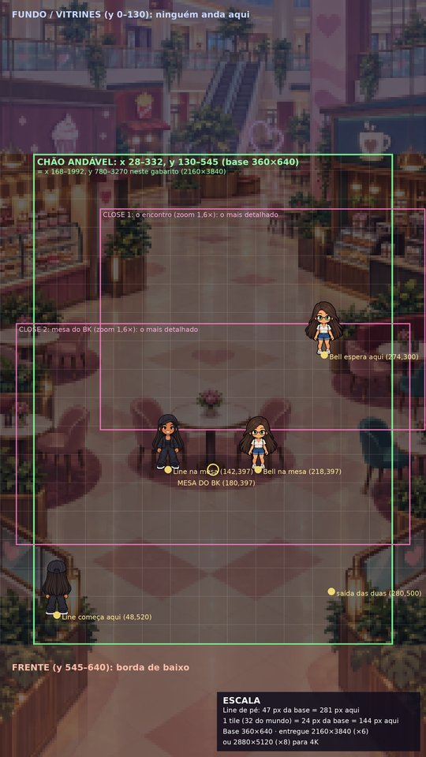
*Gabarito do Minas Shopping: área andável (verde), closes (rosa), pontos da história (amarelo) e a Line e a Bell em escala*

#### 22.11.1 Novo pedido: o shopping em peças (chão e teto + cada item separado)

> 🧩 **Decisão:** o Minas Shopping deixa de ser uma ilustração única. A ilustração atual (item 140) continua no jogo até as peças chegarem, mas tem o problema da mesa desenhada no fundo: as personagens não conseguem passar atrás de nada, e a mesa do BK ficava em cima da mesa redonda (seção 23.5). Com as peças separadas, o jogo monta o shopping como monta a casa da fazenda: a Line e a Bell passam na frente e atrás de cada móvel, e cada coisa pode mudar de lugar.

**1. A base: só o chão e o teto.** Mesmo tamanho e mesma proporção de hoje (entrega de **2160×3840**, 144 px por tile), sem nenhuma loja, móvel, planta ou enfeite:

- o **piso** inteiro (o xadrez de losangos rosa e creme, com os reflexos de luz), cobrindo toda a área andável;
- o **teto** e a estrutura do alto, na faixa de cima (y 0 a 130 da base): vigas, luzes embutidas e o vão do andar de cima, sem as lojas do fundo;
- sem sombras de objetos no chão (cada peça traz a própria sombra).

**2. Cada item em arte individual.** Um PNG por peça, com transparência, recortado no contorno, na mesma escala da base (1 tile = 144 px; a Line de pé = 281 px) e na mesma perspectiva de cima em 3/4. Pode vir num HTML de item com `data-name="SHOP_NOME.png"`, igual aos itens 154 a 187 (o `tools/extrair_objetos.py` já lê o prefixo `SHOP_`).

| # | Código | Peça | Tamanho aproximado (tiles) | Observação |
|---|---|---|---|---|
| 1 | `SHOP_BURGER_KING` | Fachada do Burger King: letreiro, toldo, balcão e cardápio luminoso | 3 × 3 | é para onde as duas olham antes do lanche |
| 2 | `SHOP_CONFEITARIA` | Fachada da confeitaria: placa de cupcake, toldo listrado | 3,5 × 4,5 | sem a vitrine (vem separada) |
| 3 | `SHOP_VITRINE_BOLOS` | Vitrine refrigerada de bolos e doces | 2,5 × 1,5 | com luz por dentro |
| 4 | `SHOP_CAFETERIA` | Fachada da cafeteria: placa da xícara, balcão, máquinas de café | 3 × 5 | — |
| 5 | `SHOP_ESCADA_ROLANTE` | Escada rolante dupla (subindo e descendo) | 2 × 4 | de preferência animada: 4 a 6 quadros dos degraus andando |
| 6 | `SHOP_MEZANINO` | Guarda-corpo de vidro do andar de cima, com corações | peça de 4 × 1 que se repete | vem em pedaços que encaixam lado a lado |
| 7 | `SHOP_PILAR` | Pilar rosa com corações | 1 × 6 | fica na frente das personagens quando elas passam atrás |
| 8 | `SHOP_CORACAO_NEON` | Coração de neon | 1,5 × 1,5 | aceso e apagado (dois PNGs) para piscar |
| 9 | `SHOP_ARVORE_CANTEIRO` | Árvore no canteiro grande de madeira | 2,5 × 3,5 | a do centro do shopping |
| 10 | `SHOP_CANTEIRO_RETANGULAR` | Canteiro de madeira comprido com plantas e flores | 3 × 1,5 | — |
| 11 | `SHOP_CANTEIRO_QUADRADO` | Canteiro de madeira pequeno com flores | 1,5 × 1,5 | — |
| 12 | `SHOP_CANTEIRO_CANTO` | Canteiro de canto (em L) com folhagens | 2 × 2 | — |
| 13 | `SHOP_LANTERNA` | Lanterna de madeira no chão (poste de luz) | 0,5 × 1,3 | acesa |
| 14 | `SHOP_LUMINARIA` | Luminária pendente de globo | 0,5 × 1 | pendurada; o jogo põe no alto |
| 15 | `SHOP_MESA_REDONDA` | Mesa redonda de mármore, sem nada em cima | 1,4 × 1,1 | a mesa do encontro |
| 16 | `SHOP_VASO_MESA` | Vasinho de flores para cima da mesa | 0,4 × 0,4 | — |
| 17 | `SHOP_BANDEJA_BK` | Bandeja do BK: dois lanches, batata e dois refris | 0,7 × 0,4 | vai em cima da mesa redonda no lanche |
| 18 | `SHOP_POLTRONA_ROSA` | Poltrona rosa | 1 × 1,3 | 4 lados: de frente, de costas, virada para a esquerda e para a direita |
| 19 | `SHOP_CADEIRA_VERDE` | Cadeira verde-água | 1 × 1,3 | 4 lados |
| 20 | `SHOP_SOFA_MEIA_LUA` | Sofá vermelho em meia-lua (booth) | 3 × 1,5 | — |
| 21 | `SHOP_PUFE` | Banco/pufe vermelho | 1,5 × 0,8 | — |
| 22 | `SHOP_LIXEIRA` | Lixeira | 0,5 × 0,8 | — |
| 23 | `SHOP_PLACA` | Placa de direção (Saída, Banheiros, Praça de alimentação) | 0,8 × 1,5 | — |
| 24 | `SHOP_BANCO_ESPERA` | Banco de espera | 2 × 1 | — |

**3. O lanche sentadas.** Com a mesa redonda e as poltronas separadas, a cena do BK fica certa com as duas **sentadas nas poltronas**, comendo. Para isso faltam duas animações: `LINE_SIT_CHAIR_EAT` e `BELL_SIT_CHAIR_EAT` (sentada de lado numa poltrona, comendo e rindo, sem mesa e sem poltrona no desenho; a Line virada para a direita e a Bell para a esquerda). Até lá o jogo usa `LINE_BELL_BK`, que já traz a mesa delas.

### 22.12 Dimensão de cada cenário

Cada fase do jogo é uma **grade de tiles** de 32×32 unidades do mundo. A arte do cenário pode chegar de dois jeitos, e as medidas abaixo valem para os dois:

- **Jeito A — tiles e objetos (recomendado para as fases):** cada tile de chão, parede, água e afins em **128×128 px** (mínimo 96×96), emendando dos 4 lados, mais os objetos soltos (árvores, casas, baús…) nos tamanhos da seção 22.0. O jogo monta o mapa sozinho a partir da planta. É o jeito mais leve e o que deixa mudar a fase depois sem redesenhar.
- **Jeito B — cenário pintado inteiro:** uma pintura da fase inteira, na escala de **128 px por tile** (4 px por unidade do mundo). Como fica grande demais para uma imagem só, ela é entregue em **blocos de 2048×2048 px** (16×16 tiles cada), sem sobreposição, com o nome `cenario_<fase>_<coluna>_<linha>.png` contando a partir de 0 no canto de cima à esquerda. Os blocos da última coluna e da última linha ficam menores (o que sobrar). Tudo o que é alto (árvores, casas, pilares) vai numa **camada da frente**, com os mesmos blocos e transparência no resto, para as personagens passarem atrás.

O **gabarito** de cada fase (a planta, em `arte/referencias/gabaritos/<fase>.png`, 32 px por tile) mostra a grade, o que é chão (verde), caminho (bege), parede ou mata (escuro), água (azul), lava (laranja), abismo (preto), lama (marrom), vento (branco) e cada objeto (quadradinho colorido), além das **saídas** (verde) e da divisão dos **blocos** de 2048 px (rosa). É só ampliar 4× para ter a medida da entrega. O ponto rosa é onde a heroína chega. Gerado por `tools/gabaritos_mapas.py`.

| Fase | Parte | Grade (tiles) | Mundo (unidades) | **Pintura inteira (128 px/tile)** | Mínimo (96 px/tile) | Blocos de 2048 px | Gabarito |
|---|---|---|---|---|---|---|---|
| **Fazendinha** | Parte 1 | 46×34 | 1472×1088 | **5888×4352** | 4416×3264 | 3×3 = 9 | `gabaritos/fazenda.png` |
| **Vilarejo do Riacho** | Parte 1 | 60×40 | 1920×1280 | **7680×5120** | 5760×3840 | 4×3 = 12 | `gabaritos/vilarejo.png` |
| **Floresta Sussurrante** | Parte 1 | 76×44 | 2432×1408 | **9728×5632** | 7296×4224 | 5×3 = 15 | `gabaritos/floresta.png` |
| **Gruta dos Ecos** | Parte 1 | 64×44 | 2048×1408 | **8192×5632** | 6144×4224 | 4×3 = 12 | `gabaritos/gruta.png` |
| **Ruínas Encantadas** | Parte 1 | 70×36 | 2240×1152 | **8960×4608** | 6720×3456 | 5×3 = 15 | `gabaritos/ruinas.png` |
| **Montanha de Brasa** | Parte 1 | 72×40 | 2304×1280 | **9216×5120** | 6912×3840 | 5×3 = 15 | `gabaritos/montanha.png` |
| **Covil do Dragão** | Parte 1 | 26×20 | 832×640 | **3328×2560** | 2496×1920 | 2×2 = 4 | `gabaritos/covil.png` |
| **Vale das Raízes** | Parte 2 | 64×42 | 2048×1344 | **8192×5376** | 6144×4032 | 4×3 = 12 | `gabaritos/vale.png` |
| **Fenda de Magma** | Parte 2 | 36×28 | 1152×896 | **4608×3584** | 3456×2688 | 3×2 = 6 | `gabaritos/fenda.png` |
| **Lago Espelhado** | Parte 2 | 64×42 | 2048×1344 | **8192×5376** | 6144×4032 | 4×3 = 12 | `gabaritos/lago.png` |
| **Pântano Sombrio** | Parte 2 | 38×28 | 1216×896 | **4864×3584** | 3648×2688 | 3×2 = 6 | `gabaritos/pantano.png` |
| **Picos do Vento** | Parte 2 | 64×42 | 2048×1344 | **8192×5376** | 6144×4032 | 4×3 = 12 | `gabaritos/picos.png` |
| **Olho da Tempestade** | Parte 2 | 36×28 | 1152×896 | **4608×3584** | 3456×2688 | 3×2 = 6 | `gabaritos/tempestade.png` |
| **Coração dos Elementos** | Parte 2 | 40×32 | 1280×1024 | **5120×4096** | 3840×3072 | 3×2 = 6 | `gabaritos/coracao.png` |

**Cenas do primeiro encontro (prólogo):** não são grades, são **ilustrações únicas** em pé, sempre na base de 360×640 (9:16), porque as posições da história foram marcadas nessa base (veja a seção 22.11):

| Cena | Base | **Entrega recomendada** | 4K | Mínimo | Observação |
|---|---|---|---|---|---|
| Minas Shopping (item 140) | 360×640 | **2160×3840** | 2880×5120 | 1440×2560 | gabarito pronto: `arte/referencias/gabarito_minas_shopping_2160x3840.png` |
| Playground | 360×640 | **2160×3840** | 2880×5120 | 1440×2560 | hoje é desenhado no código; a máquina de soco fica em (204,315) da base e vem à parte (é a da animação `LINE_PUNCH_MACHINE`) |
| Túnel | 360×640 | **2160×3840** | 2880×5120 | 1440×2560 | o beijo acontece perto de (193,520) da base, com câmera 1,6× |

**Telas inteiras** (título, “Parte 2”, capítulos, fim): 3840×2160 (16:9), mínimo 1920×1080, com o importante longe das bordas (em celular a tela corta um pouco dos lados).

**Por que 128 px por tile:** em tela cheia num monitor 1080p um tile aparece com 86 px e em 1440p com 115 px, então 128 fica nítido nos dois; em 4K ou retina (173 px) ainda fica bom. Com 96 px fica nítido em 1080p.

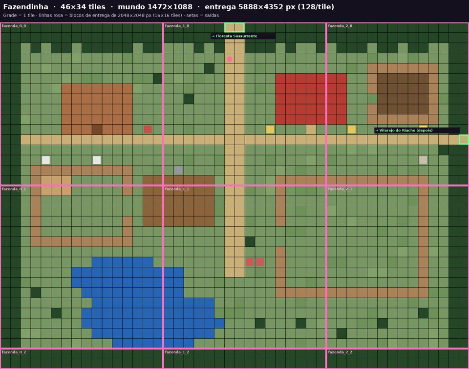
*Gabarito: Fazendinha (46×34 tiles)*

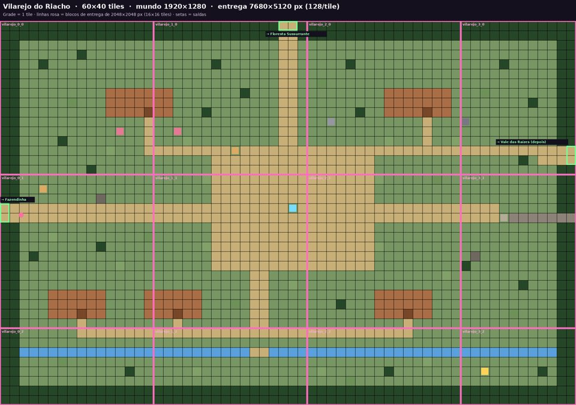
*Gabarito: Vilarejo do Riacho (60×40 tiles)*

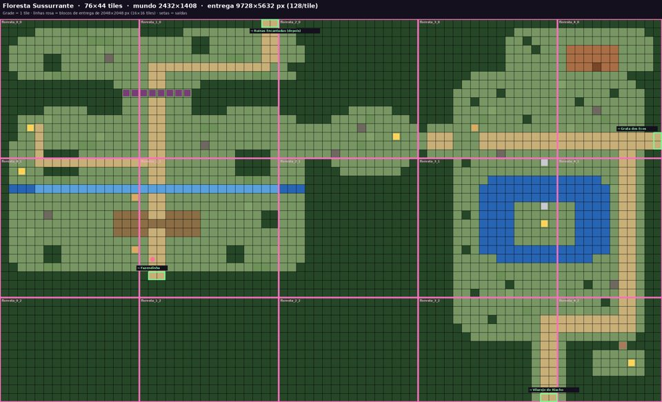
*Gabarito: Floresta Sussurrante (76×44 tiles)*

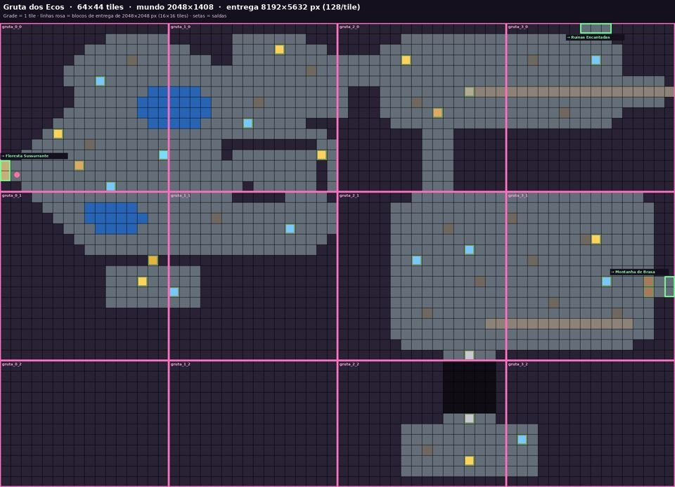
*Gabarito: Gruta dos Ecos (64×44 tiles)*

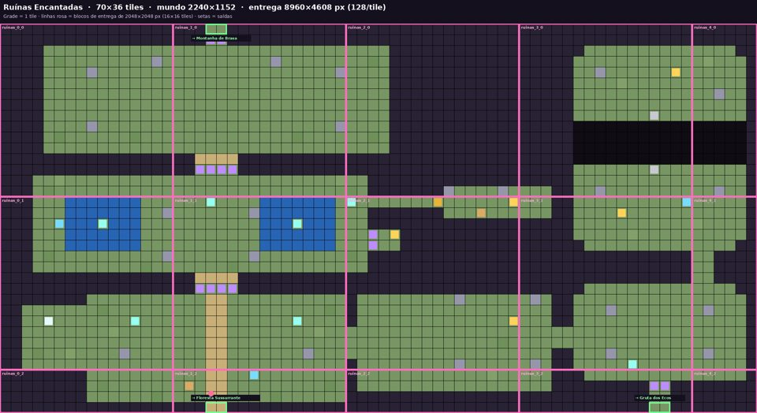
*Gabarito: Ruínas Encantadas (70×36 tiles)*

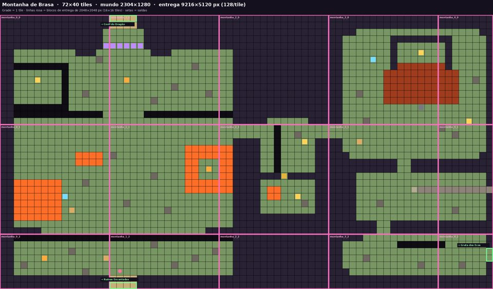
*Gabarito: Montanha de Brasa (72×40 tiles)*

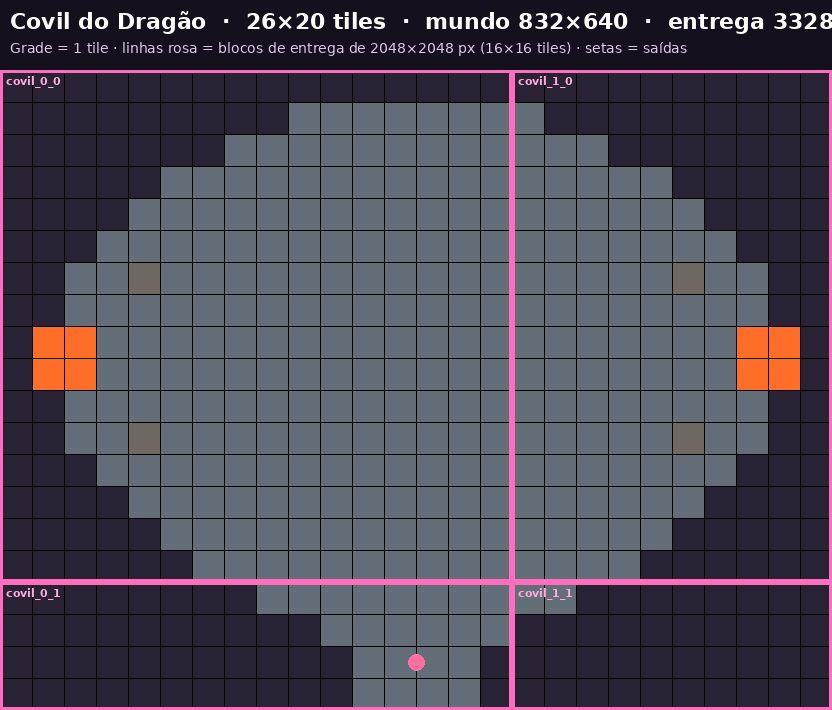
*Gabarito: Covil do Dragão (26×20 tiles)*

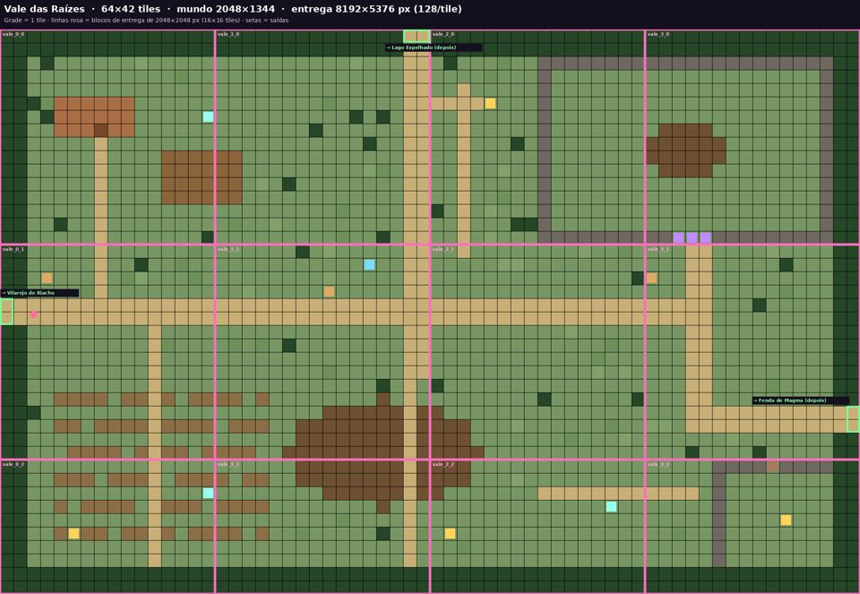
*Gabarito: Vale das Raízes (64×42 tiles)*

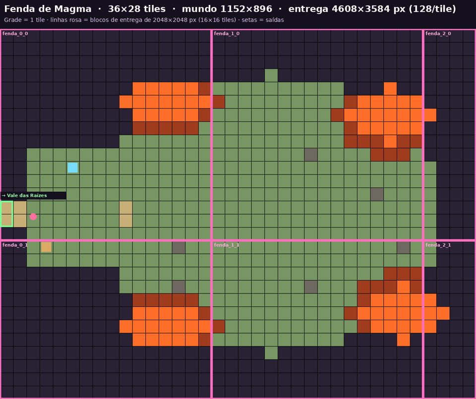
*Gabarito: Fenda de Magma (36×28 tiles)*

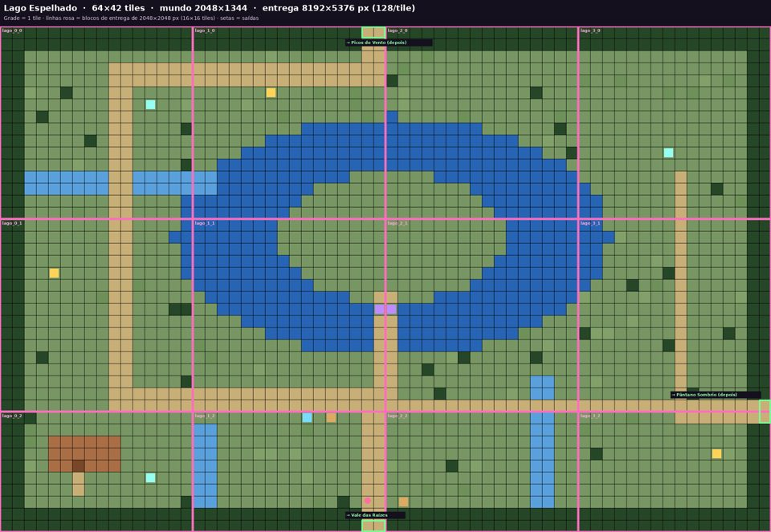
*Gabarito: Lago Espelhado (64×42 tiles)*

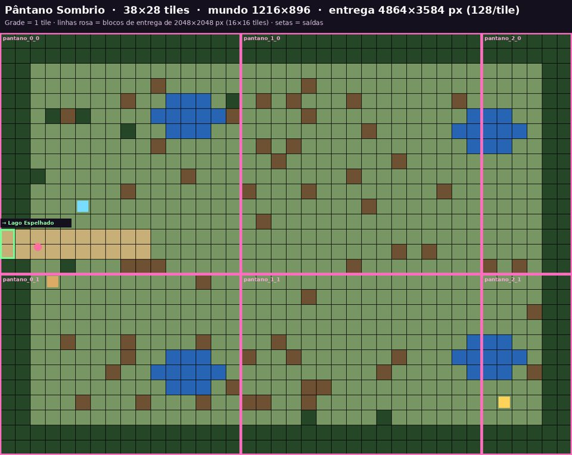
*Gabarito: Pântano Sombrio (38×28 tiles)*

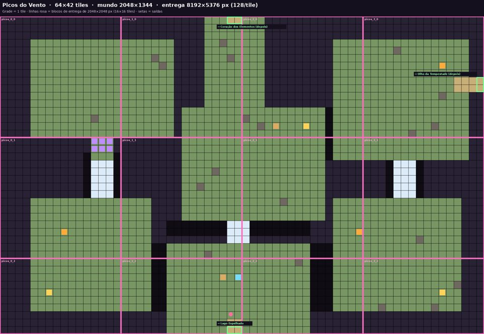
*Gabarito: Picos do Vento (64×42 tiles)*

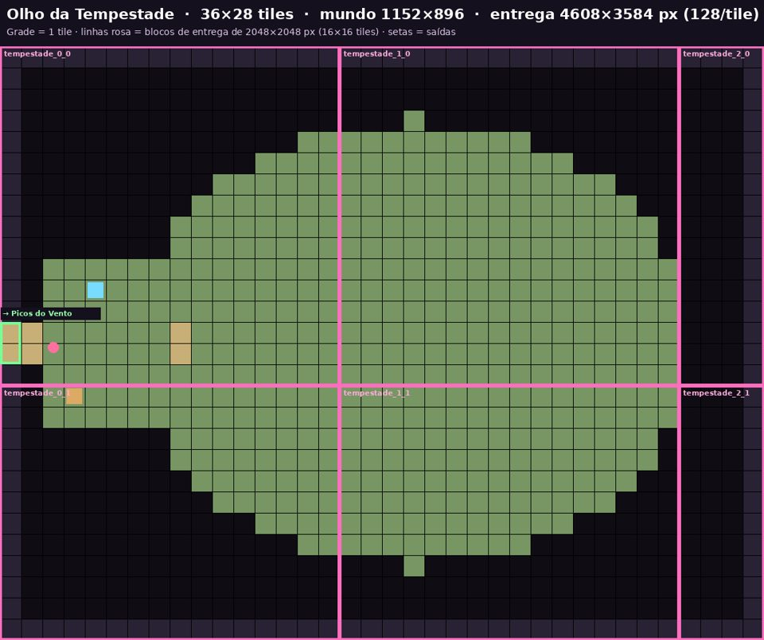
*Gabarito: Olho da Tempestade (36×28 tiles)*

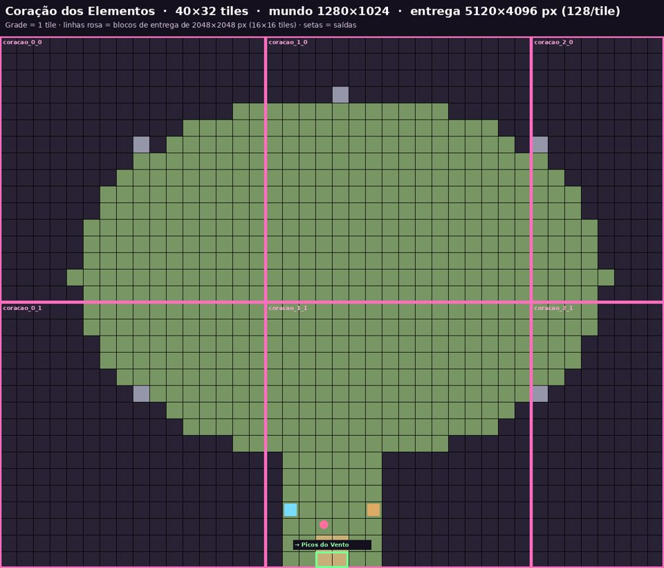
*Gabarito: Coração dos Elementos (40×32 tiles)*

### 22.10 Ordem sugerida para produzir

1. **Bell jogável** (guarda, estrela, leque, canção, dano, queda) — é o que a jogadora mais vê na Parte 2.
2. **Os sete chefes** (parado, ataque genérico, cansado, derrota) — depois os golpes um a um.
3. **Tiles das fases novas** (chão, paredes, lama, vento, abismo de céu) e os objetos de puzzle (cristais de terra, pérolas, faróis).
4. **Moradores** (Cora, Tião, Brisa e os do vilarejo) e o **dragão amigo**.
5. **Armaduras** das duas (parada/andar/correr primeiro).
6. **Retratos** que faltam, ícones de itens e documentos, interface e efeitos.

## 23. O que falta criar

> Esta seção junta o que antes ficava em arquivos soltos (`ANIMACOES_PENDENTES.md`, `LINE_BELL_INDICE_PARTES.md`, `LINE_BELL_PLANO_ANIMACOES_POR_ITEM.md`, `docs/ARTES_NECESSARIAS.md`, `arte/theo/LAYOUT_OFICIAL.md` e `game/README.md`). Agora **tudo fica só neste documento**: o que falta está aqui, o índice dos itens na seção 24, o plano por item na 25, como rodar e editar o jogo na 26, a lista completa de arte na 22 e o layout oficial do Theo na 2.

**Status:** 261 de 554 animações com arte · 172 usando uma substituta · 121 desenhadas no código. A lista com todas, e o status de cada uma, está na seção 10 e no próprio jogo, em **Menu → Animações**. Toda a arte atual é temporária até a criação completa.

### 23.1 Reenviar ou mandar

- **Item 96**: chegou com 2 imagem(ns) vazia(s) em `DRAGON_FALL`, `DRAGON_DEFEATED`. As animações funcionam sem esses quadros, mas ficam incompletas.
- **Item 106**: chegou com 1 imagem(ns) vazia(s) em `BELL_LAUGH_AT_LINE`. As animações funcionam sem esses quadros, mas ficam incompletas.
- **Item 108**: chegou com 3 imagem(ns) vazia(s) em `BELL_LAUGH`, `BELL_HIGH_FIVE`, `BELL_DANCE`. As animações funcionam sem esses quadros, mas ficam incompletas.
- **Item 110**: `LINE_BELL_WALK_TOGETHER_FRONT`, `LINE_BELL_WALK_TOGETHER_LEFT`, `LINE_BELL_WALK_TOGETHER_RIGHT` vieram com todos os quadros iguais (parados) e ficaram de fora. O jogo usa a substituta (seção 23.3) até chegar a arte certa.
- **Item 111**: `LINE_BELL_WALK_HANDS_FRONT`, `LINE_BELL_WALK_HANDS_LEFT`, `LINE_BELL_WALK_HANDS_RIGHT` vieram com todos os quadros iguais (parados) e ficaram de fora. O jogo usa a substituta (seção 23.3) até chegar a arte certa.
- **Item 112**: `LINE_BELL_RUN_TOGETHER_FRONT`, `LINE_BELL_RUN_TOGETHER_LEFT`, `LINE_BELL_RUN_TOGETHER_RIGHT` vieram com todos os quadros iguais (parados) e ficaram de fora. O jogo usa a substituta (seção 23.3) até chegar a arte certa.
- **Item 113**: `LINE_BELL_DANCE` foi recusado: a Line some em alguns quadros. O jogo segue com a versão anterior.
- **Item 114**: `LINE_COMBAT_WALK_FRONT`, `LINE_COMBAT_WALK_BACK` estão no jogo, mas com só 2 quadros diferentes (quase sem movimento). Vale reenviar com o ciclo completo.
- **Item 115**: `LINE_COMBAT_RUN_BACK` está no jogo, mas com só 2 quadros diferentes (quase sem movimento). Vale reenviar com o ciclo completo.
- **Item 118**: `DRAGON_SLEEP` foi recusado: não é o dragão dormindo (poses de voo). O jogo usa a substituta (seção 23.3) até chegar a arte certa.
- **Item 119**: `GOLEM_WALK` está no jogo, mas com só 2 quadros diferentes (quase sem movimento). Vale reenviar com o ciclo completo.
- **Item 137**: `SHEEP_IDLE` foi recusado: reenvio com rascunho simples (bolinhas e patas de palito); fica a ovelha anterior. O jogo segue com a versão anterior.
- **Pernas paradas:** `CHICKEN_RUN`, `CHICKEN_WALK`, `HEN_BROWN_RUN`, `HEN_BROWN_WALK` chegaram com as duas pernas quase na mesma posição em todos os quadros (só o corpo balança), e a galinha parecia deslizar. O jogo refaz as pernas girando no quadril, uma depois da outra, e casa o passo com o chão percorrido. Vale reenviar com o ciclo de passos desenhado.
- **Item 62**: `BELL_DRAGON_CARRIED` traz o dragão vermelho antigo desenhado junto com a Bell; no rapto, com o dragão do jogo, apareciam dois dragões. O jogo não usa mais essa arte (a Bell fica pendurada nas garras com `BELL_ESCAPE_ATTEMPT`). Para reenviar: só a Bell pendurada, de braços para cima, sem dragão.
- `LINE_HAPPY` saiu do jogo: é uma corrida que termina com a Line caída para a frente, e não a Line feliz (no lugar, o jogo usa `LINE_VICTORY`). Para reenviar.
- **Item 140 (Minas Shopping), em peças:** o jogo precisa de uma base **só com o chão e o teto** e de cada móvel, loja e enfeite como **arte individual** (lista completa na seção 22.11.1). Enquanto isso, no lanche do BK o jogo usa uma cópia do fundo sem a mesa redonda do meio.
- `LINE_BELL_WALK_HANDS_FRONT` (as duas de mãos dadas andando de frente) ainda é a arte pequena do laboratório, ampliada: fica borrada perto das outras. Para reenviar no tamanho e no traço dos itens novos.
- **Itens que ainda não chegaram:** 153.

### 23.5 Anotações do teste no celular (1º de outubro)

O que apareceu jogando no celular, o que foi feito e o que ainda depende de arte:

| # | O que aconteceu | O que foi feito | Falta |
|---|---|---|---|
| 1 | Perto do Mago, ao pegar a espada, a Line fazia um movimento estranho e parecia cair. | A arte de “Feliz” (`LINE_HAPPY`, item 41) é, na verdade, uma corrida que termina com a Line caída para a frente. Ela saiu do jogo; no lugar entra a comemoração (`LINE_VICTORY`). | Reenviar `LINE_HAPPY`: a Line parada, feliz, sorrindo, sem sair do lugar. |
| 2 | Andando de mãos dadas até o lago, Line e Bell ficavam minúsculas. | De frente, o par usa a arte antiga do laboratório (`LINE_BELL_WALK_HANDS_FRONT`), muito pequena dentro do quadro: ela foi ampliada para a Line do par ficar da altura da Line sozinha. A dança do pôr do sol (`LINE_BELL_DANCE`) também estava pequena e foi igualada. | Reenviar `LINE_BELL_WALK_HANDS_FRONT` no traço dos itens novos (a ampliada fica borrada). |
| 3 | Andando até a casinha do Theo, a casa da fazenda sumia do terreno. | O jogo deixava de desenhar objetos cujo canto esquerdo saía da tela, e a casa é larga. Agora a folga leva em conta a largura e a altura de cada objeto (casa, celeiro). | — |
| 4 | No shopping, as duas apareciam sentadas numa mesa gigante em cima da mesa. | A animação do BK já traz a mesa delas, e o fundo do shopping (item 140) tem uma mesa redonda desenhada no mesmo lugar. No lanche, o jogo troca para uma cópia do fundo sem a mesa redonda e as cadeiras (`tools/shopping_sem_mesa.py`). | Shopping em peças: base só com chão e teto e cada item em arte individual (seção 22.11.1). |

### 23.6 Revisão geral de design (2 de outubro)

Revisão do jogo inteiro como designer e engenheira: tamanho de cada arte, organização de cada mapa, moradores, botões e biblioteca.

**1. Régua de tamanhos.** Todo objeto e móvel tem uma medida real em `tools/extrair_objetos.py` (`MEDIDAS`): altura em metros ou, para o que fica deitado ou é visto em profundidade (cama, mesa, cocho, tapete), largura. A Line tem 1,60 m e 62 unidades de altura; os objetos usam 15% a mais para ficarem legíveis, e nada fica com menos de 12 unidades de largura. A largura no mundo sai da medida × a proporção da imagem e vai para `LB.LARGURA_OBJETOS` (`game/js/objetos.js`). Nas listas `moveis` dos mapas, largura `0` quer dizer "pela régua". Prédios (casas, celeiro) seguem a escala da arte oficial da fazenda, um pouco compacta, como é comum em jogos de fazenda em pixel art. Ajustes feitos com a régua: postes de lampião, espantalho, treliça, roda de carroça, silo, taboas, sela, mesa da sala, cama, poltronas e pia ficaram no tamanho certo em relação à Line.

**2. Cada mapa organizado por zonas** (nada encosta nos caminhos de terra; objetos grandes ocupam o chão e a Line contorna):

| Mapa | Zonas |
|---|---|
| Fazenda | entrada norte com arco e placa · casa (lenha, caixa de correio, varanda com sapateira, galochas, cadeira de balanço e sino, capacho) · colmeia com mel e fumigador · jardim da frente (bancada de mudas, floreiras, banho e casinha de passarinho) · varal com cesto de prendedores · galinheiro (ninho, ovos, comedouro, bebedouro) · faixa de trabalho da horta (ferramentas, sementes, poço, regador, mangueira, treliça) · horta com espantalho e colheita · celeiro (composteira, barril, roda, ferraduras, latão, silo, cata-vento) · pasto (canto do cavalo, canto das vacas, bebedouro e sal, tosquia) · lago (banco, fogueira, taboas, vitórias-régias, píer) · postes de lampião nos caminhos · dragão da Parte 2 dormindo no gramado ao sul do pasto (antes ficava em cima do celeiro) |
| Vilarejo | praça com fonte, postes nas quatro esquinas, dois bancos virados para a fonte e floreiras · feira na frente da loja (barracas, frutas, abóboras, caixotes, carrinho de flores) · ferraria (lenha, barril, ferradura, balde, bigorna, feno) · casas com caixa de correio e capacho · placa de boas-vindas na entrada oeste · taboas na beira do riacho |
| Interiores | corredor livre da porta até o meio; cada cômodo num canto; móveis encostados nas paredes; luminária sobre a mesa; a loja e a ferraria com balcão no meio |
| Floresta, vale e lago | casas em pixel art; lenha e ferramentas na cabana do caçador; cesto, regador e sementes na horta da Dona Cora; corda e caixote do pescador Tião; pontezinha no riacho do lago |

**3. Moradores.** Quem trabalha numa casa fica **dentro dela**: a Dona Rosa atrás do balcão da loja e o Seu Bento atrás do balcão da ferraria. Para falar com eles, a Line entra e para na frente do balcão. À noite as lojas fecham (a porta mostra "Loja fechada"). No mapa da mochila, o ícone da loja fica na porta. Os outros moradores (Zé, Lurdes, Pedrinho, Cora, Tião, Brisa, Tobias) ficam na rua, longe das portas.

**4. Casas em pixel art.** As casas do vilarejo, a cabana da floresta, a casa da Cora e a do Tião usam a casa da fazenda em pixel art, cada uma com uma cor de telhado (`tools/variantes_casa.py`: roxo na loja, azul na ferraria, verde, mostarda, vermelho e marrom-escuro na cabana). A porta da imagem cai exatamente na porta do mapa, e a colisão de cada casa foi refeita no tamanho da arte.

**5. Botões do celular.** Ficam num arco em volta do ⚔: pular à esquerda, magia na diagonal, esquivar em cima; defender no arco de fora; o item do atalho e a troca de heroína no topo do arco; o botão de interagir acima de todos (seção 8.1).

**6. Biblioteca limpa.** Saíram as pastas de `arte/` cuja arte já veio nos itens (vaca, cavalo, porco, galinhas, Theo, dragão antigo, Bell e casal antigos: 88 pastas), as referências do dragão antigo, 9 imagens de cenário sem uso (arbustos, cachoeira, fases de milho e trigo, pedra) e 11 fotos antigas da documentação. As fotos dos mapas, da fazenda, do vilarejo, das lojas e dos interiores foram refeitas. As regras (pernas, tamanho pela cabeça, ritmo, layout do Theo, medidas do Minas Shopping) continuam.

**7. Arte que ainda falta, mapa por mapa** (hoje desenhada no código):

| Mapa | O que ainda é desenhado no código |
|---|---|
| Todos | os moradores (Rosa, Bento, Zé, Lurdes, Pedrinho, Tobias, Cora, Tião, Brisa) em todas as poses; a fonte da praça e a fonte das fases; placas; baús; corações e moedas no chão |
| Vilarejo | chão em tiles (grama e terra), poço, barracas da feira, bigorna, estação e trilhos do carrinho, riacho |
| Floresta | chão em tiles, raízes, espinhos, riacho, pedra rachada, postes do gancho, lago com ilha |
| Gruta e Minas | paredes e chão, cogumelos luminosos, cristais, portas trancadas, paredes rachadas, abismo |
| Ruínas | paredes, pilares, cristais, barreiras de luz, altar, lagos |
| Montanha e Covil | rocha, lava, brasa, tochas, portão de fogo, jaula |
| Parte 2 (sete fases) | chão de cada fase (lama, vento, abismo de céu, chuva), cristais de terra, pérolas, faróis, ninho do Grifo; os sete chefes |
| Minas Shopping | o pedido em peças (seção 22.11.1) |

### 23.2 Animações com poucos quadros diferentes

O jogo já toca cada animação no ritmo certo (andar e correr no mesmo passo para a Line, a Bell e as duas juntas; cenas e emoções no fps da artista, sem passar de 12 quadros por segundo). Mas estas têm **4 desenhos diferentes ou menos** e repetem quadros, então o movimento fica "picado". Vale reenviar com o ciclo completo (8 a 12 desenhos diferentes):

| Personagem | Animações (desenhos diferentes) |
|---|---|
| Line | `LINE_ATTACK_HORIZONTAL` (4), `LINE_CAST_CHARGE` (4), `LINE_CAST_SPELL` (4), `LINE_CAST_STARS` (4), `LINE_COMBAT_IDLE` (3), `LINE_COMBAT_RUN_BACK` (2), `LINE_COMBAT_RUN_FRONT` (4), `LINE_COMBAT_RUN_LEFT` (4), `LINE_COMBAT_RUN_RIGHT` (4), `LINE_COMBAT_WALK_BACK` (2), `LINE_COMBAT_WALK_FRONT` (2), `LINE_COMBAT_WALK_LEFT` (4), `LINE_COMBAT_WALK_RIGHT` (4), `LINE_CROUCH` (3), `LINE_CROUCH_STAND` (3), `LINE_FALL` (4), `LINE_HIT_HEAVY` (4), `LINE_IDLE_BACK` (2), `LINE_IDLE_LEFT` (3), `LINE_PUNCH_MACHINE` (3), `LINE_RUN_BACK` (4), `LINE_RUN_STOP_RIGHT` (4), `LINE_SAD` (4), `LINE_SCARED` (4), `LINE_STUMBLE` (4), `LINE_SWORD_DRAW` (4), `LINE_THROWN` (4), `LINE_VICTORY` (4), `LINE_WALK_BACK` (4), `LINE_WALK_FRONT` (4) |
| Bell | `BELL_BLINK_FRONT` (2), `BELL_BREAK_FREE` (4), `BELL_CALL_LINE` (4), `BELL_CAPTURED` (4), `BELL_CRY` (3), `BELL_CURTSY` (4), `BELL_DANCE` (3), `BELL_DRAGON_CARRIED` (4), `BELL_ESCAPE_ATTEMPT` (3), `BELL_FALL` (4), `BELL_FLEE` (4), `BELL_GROUND_STAND` (2), `BELL_HAPPY` (2), `BELL_HEAD_ON_LINE` (4), `BELL_HELP_LINE` (4), `BELL_HIGH_FIVE` (2), `BELL_IDLE_BACK` (1), `BELL_IDLE_FRONT` (3), `BELL_IDLE_LEFT` (1), `BELL_IDLE_RIGHT` (1), `BELL_JUMP` (3), `BELL_LAND` (2), `BELL_LAUGH` (2), `BELL_LAUGH_AT_LINE` (2), `BELL_LEAN_ON_LINE` (4), `BELL_LOOK_SIDES_FRONT` (3), `BELL_RELIEVED` (2), `BELL_RUN_BACK` (4), `BELL_RUN_FRONT` (4), `BELL_SCARED` (3), `BELL_TRAPPED` (3), `BELL_WAIT` (4), `BELL_WALK_BACK` (4), `BELL_WALK_FRONT` (4) |
| Line e Bell juntas | `LINE_BELL_CELEBRATE` (4), `LINE_BELL_GREET_HUG` (4), `LINE_BELL_HIGH_FIVE` (3), `LINE_BELL_HOLD_HANDS` (3), `LINE_BELL_HUG_RELEASE` (4), `LINE_BELL_LAUGH` (3), `LINE_BELL_MEET` (3), `LINE_BELL_RESCUE_HUG` (4), `LINE_BELL_RUN_TOGETHER_BACK` (4), `LINE_BELL_SIT_DOWN` (4), `LINE_BELL_SIT_IDLE` (4), `LINE_BELL_TALK` (3), `LINE_BELL_WALK_HANDS` (4), `LINE_BELL_WALK_HANDS_BACK` (4), `LINE_BELL_WALK_TOGETHER` (4), `LINE_BELL_WALK_TOGETHER_BACK` (4) |

### 23.3 Animações ainda sem arte

| Grupo | Código | O que é | Hoje usa |
|---|---|---|---|
| Line — emoções | `LINE_HAPPY` | Feliz | `LINE_VICTORY` |
| Line e Bell juntas | `LINE_BELL_WALK_TOGETHER_FRONT` | Andando lado a lado | `LINE_BELL_WALK_TOGETHER` |
| Line e Bell juntas | `LINE_BELL_WALK_TOGETHER_LEFT` | Andando lado a lado | `LINE_BELL_WALK_TOGETHER` |
| Line e Bell juntas | `LINE_BELL_WALK_TOGETHER_RIGHT` | Andando lado a lado | `LINE_BELL_WALK_TOGETHER` |
| Line e Bell juntas | `LINE_BELL_WALK_HANDS_LEFT` | Andando de mãos dadas | `LINE_BELL_WALK_HANDS` |
| Line e Bell juntas | `LINE_BELL_WALK_HANDS_RIGHT` | Andando de mãos dadas | `LINE_BELL_WALK_HANDS` |
| Line e Bell juntas | `LINE_BELL_RUN_TOGETHER_FRONT` | Correndo juntas | `LINE_BELL_RUN_TOGETHER` |
| Line e Bell juntas | `LINE_BELL_RUN_TOGETHER_LEFT` | Correndo juntas | `LINE_BELL_RUN_TOGETHER` |
| Line e Bell juntas | `LINE_BELL_RUN_TOGETHER_RIGHT` | Correndo juntas | `LINE_BELL_RUN_TOGETHER` |
| Dragão | `DRAGON_SLEEP` | Dormir | `DRAGON_DEFEATED` |
| Bell jogável (Parte 2) | `BELL_COMBAT_IDLE_FRONT` | Bell em guarda, estrelas girando na mão | `BELL_IDLE_FRONT` |
| Bell jogável (Parte 2) | `BELL_COMBAT_IDLE_BACK` | Bell em guarda, estrelas girando na mão | `BELL_IDLE_BACK` |
| Bell jogável (Parte 2) | `BELL_COMBAT_IDLE_LEFT` | Bell em guarda, estrelas girando na mão | `BELL_IDLE_LEFT` |
| Bell jogável (Parte 2) | `BELL_COMBAT_IDLE_RIGHT` | Bell em guarda, estrelas girando na mão | `BELL_IDLE_RIGHT` |
| Bell jogável (Parte 2) | `BELL_ATTACK_STAR` | Bell atira uma estrela (braço à frente) | `BELL_HIGH_FIVE` |
| Bell jogável (Parte 2) | `BELL_ATTACK_SPREAD` | Bell gira e solta o leque de 3 estrelas de luz | `BELL_DANCE` |
| Bell jogável (Parte 2) | `BELL_ATTACK_AIR` | Bell atira estrela no ar (pulando) | `BELL_JUMP` |
| Bell jogável (Parte 2) | `BELL_SING` | Bell canta a Canção (notas coloridas saindo) | `BELL_HAPPY` |
| Bell jogável (Parte 2) | `BELL_BLOCK` | Bell se protege com um escudo de luz rosa | `BELL_IDLE_RIGHT` |
| Bell jogável (Parte 2) | `BELL_DODGE` | Bell esquiva (pulinho de lado) | `BELL_JUMP` |
| Bell jogável (Parte 2) | `BELL_DASH` | Bell arrancada | `BELL_RUN_RIGHT` |
| Bell jogável (Parte 2) | `BELL_HIT` | Bell recebe dano | `BELL_SCARED` |
| Bell jogável (Parte 2) | `BELL_KNOCKDOWN` | Bell cai no chão (golpe forte) | `BELL_FALL` |
| Bell jogável (Parte 2) | `BELL_EXHAUSTED_IDLE` | Bell cansada, ofegante (pouca vida) | `BELL_IDLE_RIGHT` |
| Bell jogável (Parte 2) | `BELL_CROUCH` | Bell agachada (beber na fonte / pegar item) | `BELL_IDLE_FRONT` |
| Bell jogável (Parte 2) | `BELL_DETERMINED` | Bell decidida (punhos fechados) | `BELL_IDLE_FRONT` |
| Bell jogável (Parte 2) | `BELL_CELEBRATE` | Bell comemora vitória | `BELL_HAPPY` |
| Bell jogável (Parte 2) | `BELL_TALK` | Bell falando (cenas) | `BELL_IDLE_FRONT` |
| Chefe: Colosso de Raízes (Parte 2) | `COLOSSO_SLEEP` | Colosso de Raízes — dormindo (antes da luta) | desenho no código |
| Chefe: Colosso de Raízes (Parte 2) | `COLOSSO_IDLE` | Colosso de Raízes — parado, respirando | desenho no código |
| Chefe: Colosso de Raízes (Parte 2) | `COLOSSO_WAKE` | Colosso de Raízes — acordando / rugido de apresentação | desenho no código |
| Chefe: Colosso de Raízes (Parte 2) | `COLOSSO_ATTACK` | Colosso de Raízes — ataque genérico (usado quando o golpe não tem arte própria) | desenho no código |
| Chefe: Colosso de Raízes (Parte 2) | `COLOSSO_ROOTS` | Colosso de Raízes — raízes saindo do chão em linha | desenho no código |
| Chefe: Colosso de Raízes (Parte 2) | `COLOSSO_THORNS` | Colosso de Raízes — anel de espinhos | desenho no código |
| Chefe: Colosso de Raízes (Parte 2) | `COLOSSO_MUD` | Colosso de Raízes — cuspe de lama | desenho no código |
| Chefe: Colosso de Raízes (Parte 2) | `COLOSSO_SUMMON` | Colosso de Raízes — chama sombras | desenho no código |
| Chefe: Colosso de Raízes (Parte 2) | `COLOSSO_STUNNED` | Colosso de Raízes — cansado, núcleo exposto (hora de atacar) | desenho no código |
| Chefe: Colosso de Raízes (Parte 2) | `COLOSSO_HIT` | Colosso de Raízes — recebe dano | desenho no código |
| Chefe: Colosso de Raízes (Parte 2) | `COLOSSO_DEATH` | Colosso de Raízes — derrotado (se desfaz em luz) | desenho no código |
| Chefe: Colosso de Raízes (Parte 2) | `COLOSSO_FREED` | Colosso de Raízes — libertado, volta às cores verdadeiras e agradece | desenho no código |
| Chefe: Serpente das Marés (Parte 2) | `SERPENTE_SLEEP` | Serpente das Marés — dormindo (antes da luta) | desenho no código |
| Chefe: Serpente das Marés (Parte 2) | `SERPENTE_IDLE` | Serpente das Marés — parado, respirando | desenho no código |
| Chefe: Serpente das Marés (Parte 2) | `SERPENTE_WAKE` | Serpente das Marés — acordando / rugido de apresentação | desenho no código |
| Chefe: Serpente das Marés (Parte 2) | `SERPENTE_ATTACK` | Serpente das Marés — ataque genérico (usado quando o golpe não tem arte própria) | desenho no código |
| Chefe: Serpente das Marés (Parte 2) | `SERPENTE_DIVE` | Serpente das Marés — mergulho (some e reaparece) | desenho no código |
| Chefe: Serpente das Marés (Parte 2) | `SERPENTE_WATER_JET` | Serpente das Marés — jatos de água | desenho no código |
| Chefe: Serpente das Marés (Parte 2) | `SERPENTE_WAVE` | Serpente das Marés — onda | desenho no código |
| Chefe: Serpente das Marés (Parte 2) | `SERPENTE_STUNNED` | Serpente das Marés — cansado, núcleo exposto (hora de atacar) | desenho no código |
| Chefe: Serpente das Marés (Parte 2) | `SERPENTE_HIT` | Serpente das Marés — recebe dano | desenho no código |
| Chefe: Serpente das Marés (Parte 2) | `SERPENTE_DEATH` | Serpente das Marés — derrotado (se desfaz em luz) | desenho no código |
| Chefe: Serpente das Marés (Parte 2) | `SERPENTE_FREED` | Serpente das Marés — libertado, volta às cores verdadeiras e agradece | desenho no código |
| Chefe: Grifo da Tempestade (Parte 2) | `GRIFO_SLEEP` | Grifo da Tempestade — dormindo (antes da luta) | desenho no código |
| Chefe: Grifo da Tempestade (Parte 2) | `GRIFO_IDLE` | Grifo da Tempestade — parado, respirando | desenho no código |
| Chefe: Grifo da Tempestade (Parte 2) | `GRIFO_WAKE` | Grifo da Tempestade — acordando / rugido de apresentação | desenho no código |
| Chefe: Grifo da Tempestade (Parte 2) | `GRIFO_ATTACK` | Grifo da Tempestade — ataque genérico (usado quando o golpe não tem arte própria) | desenho no código |
| Chefe: Grifo da Tempestade (Parte 2) | `GRIFO_GUST` | Grifo da Tempestade — rajada de vento | desenho no código |
| Chefe: Grifo da Tempestade (Parte 2) | `GRIFO_FEATHERS` | Grifo da Tempestade — leque de penas | desenho no código |
| Chefe: Grifo da Tempestade (Parte 2) | `GRIFO_LIGHTNING` | Grifo da Tempestade — chama raios | desenho no código |
| Chefe: Grifo da Tempestade (Parte 2) | `GRIFO_STUNNED` | Grifo da Tempestade — cansado, núcleo exposto (hora de atacar) | desenho no código |
| Chefe: Grifo da Tempestade (Parte 2) | `GRIFO_HIT` | Grifo da Tempestade — recebe dano | desenho no código |
| Chefe: Grifo da Tempestade (Parte 2) | `GRIFO_DEATH` | Grifo da Tempestade — derrotado (se desfaz em luz) | desenho no código |
| Chefe: Grifo da Tempestade (Parte 2) | `GRIFO_FREED` | Grifo da Tempestade — libertado, volta às cores verdadeiras e agradece | desenho no código |
| Chefe: Titã de Magma (Parte 2) | `MAGMA_SLEEP` | Titã de Magma — dormindo (antes da luta) | desenho no código |
| Chefe: Titã de Magma (Parte 2) | `MAGMA_IDLE` | Titã de Magma — parado, respirando | desenho no código |
| Chefe: Titã de Magma (Parte 2) | `MAGMA_WAKE` | Titã de Magma — acordando / rugido de apresentação | desenho no código |
| Chefe: Titã de Magma (Parte 2) | `MAGMA_ATTACK` | Titã de Magma — ataque genérico (usado quando o golpe não tem arte própria) | desenho no código |
| Chefe: Titã de Magma (Parte 2) | `MAGMA_SLAM` | Titã de Magma — pisão (onda no chão) | desenho no código |
| Chefe: Titã de Magma (Parte 2) | `MAGMA_FIRE_RAIN` | Titã de Magma — chuva de fogo | desenho no código |
| Chefe: Titã de Magma (Parte 2) | `MAGMA_THROW` | Titã de Magma — arremesso de rocha | desenho no código |
| Chefe: Titã de Magma (Parte 2) | `MAGMA_FIRE_FAN` | Titã de Magma — leque de fogo | desenho no código |
| Chefe: Titã de Magma (Parte 2) | `MAGMA_STUNNED` | Titã de Magma — cansado, núcleo exposto (hora de atacar) | desenho no código |
| Chefe: Titã de Magma (Parte 2) | `MAGMA_HIT` | Titã de Magma — recebe dano | desenho no código |
| Chefe: Titã de Magma (Parte 2) | `MAGMA_DEATH` | Titã de Magma — derrotado (se desfaz em luz) | desenho no código |
| Chefe: Hidra de Lama (Parte 2) | `HIDRA_SLEEP` | Hidra de Lama — dormindo (antes da luta) | desenho no código |
| Chefe: Hidra de Lama (Parte 2) | `HIDRA_IDLE` | Hidra de Lama — parado, respirando | desenho no código |
| Chefe: Hidra de Lama (Parte 2) | `HIDRA_WAKE` | Hidra de Lama — acordando / rugido de apresentação | desenho no código |
| Chefe: Hidra de Lama (Parte 2) | `HIDRA_ATTACK` | Hidra de Lama — ataque genérico (usado quando o golpe não tem arte própria) | desenho no código |
| Chefe: Hidra de Lama (Parte 2) | `HIDRA_ROOTS` | Hidra de Lama — raízes saindo do chão em linha | desenho no código |
| Chefe: Hidra de Lama (Parte 2) | `HIDRA_WATER_JET` | Hidra de Lama — jatos de água | desenho no código |
| Chefe: Hidra de Lama (Parte 2) | `HIDRA_WAVE` | Hidra de Lama — onda | desenho no código |
| Chefe: Hidra de Lama (Parte 2) | `HIDRA_DIVE` | Hidra de Lama — mergulho (some e reaparece) | desenho no código |
| Chefe: Hidra de Lama (Parte 2) | `HIDRA_MUD` | Hidra de Lama — cuspe de lama | desenho no código |
| Chefe: Hidra de Lama (Parte 2) | `HIDRA_STUNNED` | Hidra de Lama — cansado, núcleo exposto (hora de atacar) | desenho no código |
| Chefe: Hidra de Lama (Parte 2) | `HIDRA_HIT` | Hidra de Lama — recebe dano | desenho no código |
| Chefe: Hidra de Lama (Parte 2) | `HIDRA_DEATH` | Hidra de Lama — derrotado (se desfaz em luz) | desenho no código |
| Chefe: Tempestade Viva (Parte 2) | `TEMPESTADE_SLEEP` | Tempestade Viva — dormindo (antes da luta) | desenho no código |
| Chefe: Tempestade Viva (Parte 2) | `TEMPESTADE_IDLE` | Tempestade Viva — parado, respirando | desenho no código |
| Chefe: Tempestade Viva (Parte 2) | `TEMPESTADE_WAKE` | Tempestade Viva — acordando / rugido de apresentação | desenho no código |
| Chefe: Tempestade Viva (Parte 2) | `TEMPESTADE_ATTACK` | Tempestade Viva — ataque genérico (usado quando o golpe não tem arte própria) | desenho no código |
| Chefe: Tempestade Viva (Parte 2) | `TEMPESTADE_LIGHTNING` | Tempestade Viva — chama raios | desenho no código |
| Chefe: Tempestade Viva (Parte 2) | `TEMPESTADE_GUST` | Tempestade Viva — rajada de vento | desenho no código |
| Chefe: Tempestade Viva (Parte 2) | `TEMPESTADE_WATER_JET` | Tempestade Viva — jatos de água | desenho no código |
| Chefe: Tempestade Viva (Parte 2) | `TEMPESTADE_WAVE` | Tempestade Viva — onda | desenho no código |
| Chefe: Tempestade Viva (Parte 2) | `TEMPESTADE_FEATHERS` | Tempestade Viva — leque de penas | desenho no código |
| Chefe: Tempestade Viva (Parte 2) | `TEMPESTADE_STUNNED` | Tempestade Viva — cansado, núcleo exposto (hora de atacar) | desenho no código |
| Chefe: Tempestade Viva (Parte 2) | `TEMPESTADE_HIT` | Tempestade Viva — recebe dano | desenho no código |
| Chefe: Tempestade Viva (Parte 2) | `TEMPESTADE_DEATH` | Tempestade Viva — derrotado (se desfaz em luz) | desenho no código |
| Chefe: Quimera Primordial (Parte 2) | `QUIMERA_SLEEP` | Quimera Primordial — dormindo (antes da luta) | desenho no código |
| Chefe: Quimera Primordial (Parte 2) | `QUIMERA_IDLE` | Quimera Primordial — parado, respirando | desenho no código |
| Chefe: Quimera Primordial (Parte 2) | `QUIMERA_WAKE` | Quimera Primordial — acordando / rugido de apresentação | desenho no código |
| Chefe: Quimera Primordial (Parte 2) | `QUIMERA_ATTACK` | Quimera Primordial — ataque genérico (usado quando o golpe não tem arte própria) | desenho no código |
| Chefe: Quimera Primordial (Parte 2) | `QUIMERA_SLAM` | Quimera Primordial — pisão (onda no chão) | desenho no código |
| Chefe: Quimera Primordial (Parte 2) | `QUIMERA_THROW` | Quimera Primordial — arremesso de rocha | desenho no código |
| Chefe: Quimera Primordial (Parte 2) | `QUIMERA_FIRE_RAIN` | Quimera Primordial — chuva de fogo | desenho no código |
| Chefe: Quimera Primordial (Parte 2) | `QUIMERA_FIRE_FAN` | Quimera Primordial — leque de fogo | desenho no código |
| Chefe: Quimera Primordial (Parte 2) | `QUIMERA_ROOTS` | Quimera Primordial — raízes saindo do chão em linha | desenho no código |
| Chefe: Quimera Primordial (Parte 2) | `QUIMERA_THORNS` | Quimera Primordial — anel de espinhos | desenho no código |
| Chefe: Quimera Primordial (Parte 2) | `QUIMERA_MUD` | Quimera Primordial — cuspe de lama | desenho no código |
| Chefe: Quimera Primordial (Parte 2) | `QUIMERA_DIVE` | Quimera Primordial — mergulho (some e reaparece) | desenho no código |
| Chefe: Quimera Primordial (Parte 2) | `QUIMERA_WATER_JET` | Quimera Primordial — jatos de água | desenho no código |
| Chefe: Quimera Primordial (Parte 2) | `QUIMERA_WAVE` | Quimera Primordial — onda | desenho no código |
| Chefe: Quimera Primordial (Parte 2) | `QUIMERA_GUST` | Quimera Primordial — rajada de vento | desenho no código |
| Chefe: Quimera Primordial (Parte 2) | `QUIMERA_FEATHERS` | Quimera Primordial — leque de penas | desenho no código |
| Chefe: Quimera Primordial (Parte 2) | `QUIMERA_LIGHTNING` | Quimera Primordial — chama raios | desenho no código |
| Chefe: Quimera Primordial (Parte 2) | `QUIMERA_STUNNED` | Quimera Primordial — cansado, núcleo exposto (hora de atacar) | desenho no código |
| Chefe: Quimera Primordial (Parte 2) | `QUIMERA_HIT` | Quimera Primordial — recebe dano | desenho no código |
| Chefe: Quimera Primordial (Parte 2) | `QUIMERA_DEATH` | Quimera Primordial — derrotado (se desfaz em luz) | desenho no código |
| Chefe: Quimera Primordial (Parte 2) | `QUIMERA_PHASE` | Quimera — muda de fase (troca a cor do núcleo e o elemento) | desenho no código |
| Chefe: Quimera Primordial (Parte 2) | `QUIMERA_CALM` | Quimera — acalmada no final (“é... quente”) | desenho no código |
| Fogos-fátuos dos elementos (Parte 2) | `WISP_EARTH_IDLE` | Fogo-fátuo de terra (verde-musgo) — flutuando | `WISP_IDLE` |
| Fogos-fátuos dos elementos (Parte 2) | `WISP_EARTH_ATTACK` | Fogo-fátuo de terra (verde-musgo) — atirando | `WISP_ATTACK` |
| Fogos-fátuos dos elementos (Parte 2) | `WISP_EARTH_DEATH` | Fogo-fátuo de terra (verde-musgo) — apagando | `WISP_DEATH` |
| Fogos-fátuos dos elementos (Parte 2) | `WISP_WATER_IDLE` | Fogo-fátuo de água (azul) — flutuando | `WISP_IDLE` |
| Fogos-fátuos dos elementos (Parte 2) | `WISP_WATER_ATTACK` | Fogo-fátuo de água (azul) — atirando | `WISP_ATTACK` |
| Fogos-fátuos dos elementos (Parte 2) | `WISP_WATER_DEATH` | Fogo-fátuo de água (azul) — apagando | `WISP_DEATH` |
| Fogos-fátuos dos elementos (Parte 2) | `WISP_AIR_IDLE` | Fogo-fátuo de ar (branco) — flutuando | `WISP_IDLE` |
| Fogos-fátuos dos elementos (Parte 2) | `WISP_AIR_ATTACK` | Fogo-fátuo de ar (branco) — atirando | `WISP_ATTACK` |
| Fogos-fátuos dos elementos (Parte 2) | `WISP_AIR_DEATH` | Fogo-fátuo de ar (branco) — apagando | `WISP_DEATH` |
| Moradores (todos, incluindo os da Parte 2) | `CORA_IDLE` | Dona Cora (jardineira do vale) — parado | desenho no código |
| Moradores (todos, incluindo os da Parte 2) | `CORA_TALK` | Dona Cora (jardineira do vale) — falando | desenho no código |
| Moradores (todos, incluindo os da Parte 2) | `CORA_SLEEP` | Dona Cora (jardineira do vale) — dormindo (noite) | desenho no código |
| Moradores (todos, incluindo os da Parte 2) | `TIAO_IDLE` | Seu Tião (pescador do lago) — parado | desenho no código |
| Moradores (todos, incluindo os da Parte 2) | `TIAO_TALK` | Seu Tião (pescador do lago) — falando | desenho no código |
| Moradores (todos, incluindo os da Parte 2) | `TIAO_SLEEP` | Seu Tião (pescador do lago) — dormindo (noite) | desenho no código |
| Moradores (todos, incluindo os da Parte 2) | `BRISA_IDLE` | Vó Brisa (pastora dos picos) — parado | desenho no código |
| Moradores (todos, incluindo os da Parte 2) | `BRISA_TALK` | Vó Brisa (pastora dos picos) — falando | desenho no código |
| Moradores (todos, incluindo os da Parte 2) | `BRISA_SLEEP` | Vó Brisa (pastora dos picos) — dormindo (noite) | desenho no código |
| Moradores (todos, incluindo os da Parte 2) | `ROSA_IDLE` | Dona Rosa (loja) — parado | desenho no código |
| Moradores (todos, incluindo os da Parte 2) | `ROSA_TALK` | Dona Rosa (loja) — falando | desenho no código |
| Moradores (todos, incluindo os da Parte 2) | `ROSA_SLEEP` | Dona Rosa (loja) — dormindo (noite) | desenho no código |
| Moradores (todos, incluindo os da Parte 2) | `BENTO_IDLE` | Seu Bento (ferraria) — parado | desenho no código |
| Moradores (todos, incluindo os da Parte 2) | `BENTO_TALK` | Seu Bento (ferraria) — falando | desenho no código |
| Moradores (todos, incluindo os da Parte 2) | `BENTO_SLEEP` | Seu Bento (ferraria) — dormindo (noite) | desenho no código |
| Moradores (todos, incluindo os da Parte 2) | `ZE_IDLE` | Seu Zé — parado | desenho no código |
| Moradores (todos, incluindo os da Parte 2) | `ZE_TALK` | Seu Zé — falando | desenho no código |
| Moradores (todos, incluindo os da Parte 2) | `ZE_SLEEP` | Seu Zé — dormindo (noite) | desenho no código |
| Moradores (todos, incluindo os da Parte 2) | `LURDES_IDLE` | Dona Lurdes — parado | desenho no código |
| Moradores (todos, incluindo os da Parte 2) | `LURDES_TALK` | Dona Lurdes — falando | desenho no código |
| Moradores (todos, incluindo os da Parte 2) | `LURDES_SLEEP` | Dona Lurdes — dormindo (noite) | desenho no código |
| Moradores (todos, incluindo os da Parte 2) | `PEDRO_IDLE` | Pedrinho — parado | desenho no código |
| Moradores (todos, incluindo os da Parte 2) | `PEDRO_TALK` | Pedrinho — falando | desenho no código |
| Moradores (todos, incluindo os da Parte 2) | `PEDRO_SLEEP` | Pedrinho — dormindo (noite) | desenho no código |
| Moradores (todos, incluindo os da Parte 2) | `TOBIAS_IDLE` | Tobias (caçador) — parado | desenho no código |
| Moradores (todos, incluindo os da Parte 2) | `TOBIAS_TALK` | Tobias (caçador) — falando | desenho no código |
| Moradores (todos, incluindo os da Parte 2) | `TOBIAS_SLEEP` | Tobias (caçador) — dormindo (noite) | desenho no código |
| Moradores (todos, incluindo os da Parte 2) | `TIAO_FISH` | Seu Tião — pescando no píer | desenho no código |
| Moradores (todos, incluindo os da Parte 2) | `BENTO_FORGE` | Seu Bento — martelando na bigorna | desenho no código |
| Moradores (todos, incluindo os da Parte 2) | `PEDRO_RUN` | Pedrinho — correndo pra lá e pra cá | desenho no código |
| Dragão amigo (Parte 2) | `DRAGON_TALK` | Dragão falando calmo (abertura da Parte 2) | `DRAGON_IDLE` |
| Dragão amigo (Parte 2) | `DRAGON_BOW` | Dragão abaixa a cabeça (pede ajuda / agradece) | `DRAGON_IDLE` |
| Dragão amigo (Parte 2) | `DRAGON_CURL_SLEEP` | Dragão dormindo enrolado perto da casa (fazenda) | `DRAGON_DEFEATED` |
| Line com armadura: Túnica Acolchoada | `LINE_TUNICA_IDLE_FRONT` | Line com Túnica Acolchoada — parada | `LINE_IDLE_FRONT` |
| Line com armadura: Túnica Acolchoada | `LINE_TUNICA_IDLE_BACK` | Line com Túnica Acolchoada — parada | `LINE_IDLE_BACK` |
| Line com armadura: Túnica Acolchoada | `LINE_TUNICA_IDLE_LEFT` | Line com Túnica Acolchoada — parada | `LINE_IDLE_LEFT` |
| Line com armadura: Túnica Acolchoada | `LINE_TUNICA_IDLE_RIGHT` | Line com Túnica Acolchoada — parada | `LINE_IDLE_RIGHT` |
| Line com armadura: Túnica Acolchoada | `LINE_TUNICA_WALK_FRONT` | Line com Túnica Acolchoada — andando | `LINE_WALK_FRONT` |
| Line com armadura: Túnica Acolchoada | `LINE_TUNICA_WALK_BACK` | Line com Túnica Acolchoada — andando | `LINE_WALK_BACK` |
| Line com armadura: Túnica Acolchoada | `LINE_TUNICA_WALK_LEFT` | Line com Túnica Acolchoada — andando | `LINE_WALK_LEFT` |
| Line com armadura: Túnica Acolchoada | `LINE_TUNICA_WALK_RIGHT` | Line com Túnica Acolchoada — andando | `LINE_WALK_RIGHT` |
| Line com armadura: Túnica Acolchoada | `LINE_TUNICA_RUN_FRONT` | Line com Túnica Acolchoada — correndo | `LINE_RUN_FRONT` |
| Line com armadura: Túnica Acolchoada | `LINE_TUNICA_RUN_BACK` | Line com Túnica Acolchoada — correndo | `LINE_RUN_BACK` |
| Line com armadura: Túnica Acolchoada | `LINE_TUNICA_RUN_LEFT` | Line com Túnica Acolchoada — correndo | `LINE_RUN_LEFT` |
| Line com armadura: Túnica Acolchoada | `LINE_TUNICA_RUN_RIGHT` | Line com Túnica Acolchoada — correndo | `LINE_RUN_RIGHT` |
| Line com armadura: Túnica Acolchoada | `LINE_TUNICA_COMBAT_IDLE` | Line com Túnica Acolchoada — em guarda | `LINE_COMBAT_IDLE` |
| Line com armadura: Túnica Acolchoada | `LINE_TUNICA_ATTACK_HORIZONTAL` | Line com Túnica Acolchoada — golpe horizontal | `LINE_ATTACK_HORIZONTAL` |
| Line com armadura: Túnica Acolchoada | `LINE_TUNICA_ATTACK_VERTICAL` | Line com Túnica Acolchoada — golpe vertical | `LINE_ATTACK_VERTICAL` |
| Line com armadura: Túnica Acolchoada | `LINE_TUNICA_ATTACK_COMBO` | Line com Túnica Acolchoada — golpe final do combo | `LINE_ATTACK_COMBO` |
| Line com armadura: Túnica Acolchoada | `LINE_TUNICA_ATTACK_SPIN` | Line com Túnica Acolchoada — giro | `LINE_ATTACK_SPIN` |
| Line com armadura: Túnica Acolchoada | `LINE_TUNICA_CAST_SPELL` | Line com Túnica Acolchoada — Raio de Luz | `LINE_CAST_SPELL` |
| Line com armadura: Túnica Acolchoada | `LINE_TUNICA_BLOCK` | Line com Túnica Acolchoada — defesa | `LINE_BLOCK` |
| Line com armadura: Túnica Acolchoada | `LINE_TUNICA_DODGE` | Line com Túnica Acolchoada — esquiva | `LINE_DODGE` |
| Line com armadura: Túnica Acolchoada | `LINE_TUNICA_JUMP` | Line com Túnica Acolchoada — pulo | `LINE_JUMP_RIGHT` |
| Line com armadura: Túnica Acolchoada | `LINE_TUNICA_HIT_LIGHT` | Line com Túnica Acolchoada — recebe dano | `LINE_HIT_LIGHT` |
| Line com armadura: Túnica Acolchoada | `LINE_TUNICA_KNOCKDOWN` | Line com Túnica Acolchoada — cai no chão | `LINE_KNOCKDOWN` |
| Line com armadura: Cota de Malha | `LINE_MALHA_IDLE_FRONT` | Line com Cota de Malha — parada | `LINE_IDLE_FRONT` |
| Line com armadura: Cota de Malha | `LINE_MALHA_IDLE_BACK` | Line com Cota de Malha — parada | `LINE_IDLE_BACK` |
| Line com armadura: Cota de Malha | `LINE_MALHA_IDLE_LEFT` | Line com Cota de Malha — parada | `LINE_IDLE_LEFT` |
| Line com armadura: Cota de Malha | `LINE_MALHA_IDLE_RIGHT` | Line com Cota de Malha — parada | `LINE_IDLE_RIGHT` |
| Line com armadura: Cota de Malha | `LINE_MALHA_WALK_FRONT` | Line com Cota de Malha — andando | `LINE_WALK_FRONT` |
| Line com armadura: Cota de Malha | `LINE_MALHA_WALK_BACK` | Line com Cota de Malha — andando | `LINE_WALK_BACK` |
| Line com armadura: Cota de Malha | `LINE_MALHA_WALK_LEFT` | Line com Cota de Malha — andando | `LINE_WALK_LEFT` |
| Line com armadura: Cota de Malha | `LINE_MALHA_WALK_RIGHT` | Line com Cota de Malha — andando | `LINE_WALK_RIGHT` |
| Line com armadura: Cota de Malha | `LINE_MALHA_RUN_FRONT` | Line com Cota de Malha — correndo | `LINE_RUN_FRONT` |
| Line com armadura: Cota de Malha | `LINE_MALHA_RUN_BACK` | Line com Cota de Malha — correndo | `LINE_RUN_BACK` |
| Line com armadura: Cota de Malha | `LINE_MALHA_RUN_LEFT` | Line com Cota de Malha — correndo | `LINE_RUN_LEFT` |
| Line com armadura: Cota de Malha | `LINE_MALHA_RUN_RIGHT` | Line com Cota de Malha — correndo | `LINE_RUN_RIGHT` |
| Line com armadura: Cota de Malha | `LINE_MALHA_COMBAT_IDLE` | Line com Cota de Malha — em guarda | `LINE_COMBAT_IDLE` |
| Line com armadura: Cota de Malha | `LINE_MALHA_ATTACK_HORIZONTAL` | Line com Cota de Malha — golpe horizontal | `LINE_ATTACK_HORIZONTAL` |
| Line com armadura: Cota de Malha | `LINE_MALHA_ATTACK_VERTICAL` | Line com Cota de Malha — golpe vertical | `LINE_ATTACK_VERTICAL` |
| Line com armadura: Cota de Malha | `LINE_MALHA_ATTACK_COMBO` | Line com Cota de Malha — golpe final do combo | `LINE_ATTACK_COMBO` |
| Line com armadura: Cota de Malha | `LINE_MALHA_ATTACK_SPIN` | Line com Cota de Malha — giro | `LINE_ATTACK_SPIN` |
| Line com armadura: Cota de Malha | `LINE_MALHA_CAST_SPELL` | Line com Cota de Malha — Raio de Luz | `LINE_CAST_SPELL` |
| Line com armadura: Cota de Malha | `LINE_MALHA_BLOCK` | Line com Cota de Malha — defesa | `LINE_BLOCK` |
| Line com armadura: Cota de Malha | `LINE_MALHA_DODGE` | Line com Cota de Malha — esquiva | `LINE_DODGE` |
| Line com armadura: Cota de Malha | `LINE_MALHA_JUMP` | Line com Cota de Malha — pulo | `LINE_JUMP_RIGHT` |
| Line com armadura: Cota de Malha | `LINE_MALHA_HIT_LIGHT` | Line com Cota de Malha — recebe dano | `LINE_HIT_LIGHT` |
| Line com armadura: Cota de Malha | `LINE_MALHA_KNOCKDOWN` | Line com Cota de Malha — cai no chão | `LINE_KNOCKDOWN` |
| Line com armadura: Armadura de Brasa | `LINE_BRASA_IDLE_FRONT` | Line com Armadura de Brasa — parada | `LINE_IDLE_FRONT` |
| Line com armadura: Armadura de Brasa | `LINE_BRASA_IDLE_BACK` | Line com Armadura de Brasa — parada | `LINE_IDLE_BACK` |
| Line com armadura: Armadura de Brasa | `LINE_BRASA_IDLE_LEFT` | Line com Armadura de Brasa — parada | `LINE_IDLE_LEFT` |
| Line com armadura: Armadura de Brasa | `LINE_BRASA_IDLE_RIGHT` | Line com Armadura de Brasa — parada | `LINE_IDLE_RIGHT` |
| Line com armadura: Armadura de Brasa | `LINE_BRASA_WALK_FRONT` | Line com Armadura de Brasa — andando | `LINE_WALK_FRONT` |
| Line com armadura: Armadura de Brasa | `LINE_BRASA_WALK_BACK` | Line com Armadura de Brasa — andando | `LINE_WALK_BACK` |
| Line com armadura: Armadura de Brasa | `LINE_BRASA_WALK_LEFT` | Line com Armadura de Brasa — andando | `LINE_WALK_LEFT` |
| Line com armadura: Armadura de Brasa | `LINE_BRASA_WALK_RIGHT` | Line com Armadura de Brasa — andando | `LINE_WALK_RIGHT` |
| Line com armadura: Armadura de Brasa | `LINE_BRASA_RUN_FRONT` | Line com Armadura de Brasa — correndo | `LINE_RUN_FRONT` |
| Line com armadura: Armadura de Brasa | `LINE_BRASA_RUN_BACK` | Line com Armadura de Brasa — correndo | `LINE_RUN_BACK` |
| Line com armadura: Armadura de Brasa | `LINE_BRASA_RUN_LEFT` | Line com Armadura de Brasa — correndo | `LINE_RUN_LEFT` |
| Line com armadura: Armadura de Brasa | `LINE_BRASA_RUN_RIGHT` | Line com Armadura de Brasa — correndo | `LINE_RUN_RIGHT` |
| Line com armadura: Armadura de Brasa | `LINE_BRASA_COMBAT_IDLE` | Line com Armadura de Brasa — em guarda | `LINE_COMBAT_IDLE` |
| Line com armadura: Armadura de Brasa | `LINE_BRASA_ATTACK_HORIZONTAL` | Line com Armadura de Brasa — golpe horizontal | `LINE_ATTACK_HORIZONTAL` |
| Line com armadura: Armadura de Brasa | `LINE_BRASA_ATTACK_VERTICAL` | Line com Armadura de Brasa — golpe vertical | `LINE_ATTACK_VERTICAL` |
| Line com armadura: Armadura de Brasa | `LINE_BRASA_ATTACK_COMBO` | Line com Armadura de Brasa — golpe final do combo | `LINE_ATTACK_COMBO` |
| Line com armadura: Armadura de Brasa | `LINE_BRASA_ATTACK_SPIN` | Line com Armadura de Brasa — giro | `LINE_ATTACK_SPIN` |
| Line com armadura: Armadura de Brasa | `LINE_BRASA_CAST_SPELL` | Line com Armadura de Brasa — Raio de Luz | `LINE_CAST_SPELL` |
| Line com armadura: Armadura de Brasa | `LINE_BRASA_BLOCK` | Line com Armadura de Brasa — defesa | `LINE_BLOCK` |
| Line com armadura: Armadura de Brasa | `LINE_BRASA_DODGE` | Line com Armadura de Brasa — esquiva | `LINE_DODGE` |
| Line com armadura: Armadura de Brasa | `LINE_BRASA_JUMP` | Line com Armadura de Brasa — pulo | `LINE_JUMP_RIGHT` |
| Line com armadura: Armadura de Brasa | `LINE_BRASA_HIT_LIGHT` | Line com Armadura de Brasa — recebe dano | `LINE_HIT_LIGHT` |
| Line com armadura: Armadura de Brasa | `LINE_BRASA_KNOCKDOWN` | Line com Armadura de Brasa — cai no chão | `LINE_KNOCKDOWN` |
| Bell com armadura: Vestido Reforçado | `BELL_VESTIDO_IDLE_FRONT` | Bell com Vestido Reforçado — parada | `BELL_IDLE_FRONT` |
| Bell com armadura: Vestido Reforçado | `BELL_VESTIDO_IDLE_BACK` | Bell com Vestido Reforçado — parada | `BELL_IDLE_BACK` |
| Bell com armadura: Vestido Reforçado | `BELL_VESTIDO_IDLE_LEFT` | Bell com Vestido Reforçado — parada | `BELL_IDLE_LEFT` |
| Bell com armadura: Vestido Reforçado | `BELL_VESTIDO_IDLE_RIGHT` | Bell com Vestido Reforçado — parada | `BELL_IDLE_RIGHT` |
| Bell com armadura: Vestido Reforçado | `BELL_VESTIDO_WALK_FRONT` | Bell com Vestido Reforçado — andando | `BELL_WALK_FRONT` |
| Bell com armadura: Vestido Reforçado | `BELL_VESTIDO_WALK_BACK` | Bell com Vestido Reforçado — andando | `BELL_WALK_BACK` |
| Bell com armadura: Vestido Reforçado | `BELL_VESTIDO_WALK_LEFT` | Bell com Vestido Reforçado — andando | `BELL_WALK_LEFT` |
| Bell com armadura: Vestido Reforçado | `BELL_VESTIDO_WALK_RIGHT` | Bell com Vestido Reforçado — andando | `BELL_WALK_RIGHT` |
| Bell com armadura: Vestido Reforçado | `BELL_VESTIDO_RUN_FRONT` | Bell com Vestido Reforçado — correndo | `BELL_RUN_FRONT` |
| Bell com armadura: Vestido Reforçado | `BELL_VESTIDO_RUN_BACK` | Bell com Vestido Reforçado — correndo | `BELL_RUN_BACK` |
| Bell com armadura: Vestido Reforçado | `BELL_VESTIDO_RUN_LEFT` | Bell com Vestido Reforçado — correndo | `BELL_RUN_LEFT` |
| Bell com armadura: Vestido Reforçado | `BELL_VESTIDO_RUN_RIGHT` | Bell com Vestido Reforçado — correndo | `BELL_RUN_RIGHT` |
| Bell com armadura: Vestido Reforçado | `BELL_VESTIDO_COMBAT_IDLE` | Bell com Vestido Reforçado — em guarda | `BELL_IDLE_RIGHT` |
| Bell com armadura: Vestido Reforçado | `BELL_VESTIDO_ATTACK_STAR` | Bell com Vestido Reforçado — atira estrela | `BELL_HIGH_FIVE` |
| Bell com armadura: Vestido Reforçado | `BELL_VESTIDO_ATTACK_SPREAD` | Bell com Vestido Reforçado — leque de estrelas | `BELL_DANCE` |
| Bell com armadura: Vestido Reforçado | `BELL_VESTIDO_SING` | Bell com Vestido Reforçado — canção | `BELL_HAPPY` |
| Bell com armadura: Vestido Reforçado | `BELL_VESTIDO_BLOCK` | Bell com Vestido Reforçado — escudo de luz | `BELL_IDLE_RIGHT` |
| Bell com armadura: Vestido Reforçado | `BELL_VESTIDO_DODGE` | Bell com Vestido Reforçado — esquiva | `BELL_JUMP` |
| Bell com armadura: Vestido Reforçado | `BELL_VESTIDO_JUMP` | Bell com Vestido Reforçado — pulo | `BELL_JUMP` |
| Bell com armadura: Vestido Reforçado | `BELL_VESTIDO_HIT` | Bell com Vestido Reforçado — recebe dano | `BELL_SCARED` |
| Bell com armadura: Vestido Reforçado | `BELL_VESTIDO_KNOCKDOWN` | Bell com Vestido Reforçado — cai no chão | `BELL_FALL` |
| Bell com armadura: Manto Estelar | `BELL_ESTELAR_IDLE_FRONT` | Bell com Manto Estelar — parada | `BELL_IDLE_FRONT` |
| Bell com armadura: Manto Estelar | `BELL_ESTELAR_IDLE_BACK` | Bell com Manto Estelar — parada | `BELL_IDLE_BACK` |
| Bell com armadura: Manto Estelar | `BELL_ESTELAR_IDLE_LEFT` | Bell com Manto Estelar — parada | `BELL_IDLE_LEFT` |
| Bell com armadura: Manto Estelar | `BELL_ESTELAR_IDLE_RIGHT` | Bell com Manto Estelar — parada | `BELL_IDLE_RIGHT` |
| Bell com armadura: Manto Estelar | `BELL_ESTELAR_WALK_FRONT` | Bell com Manto Estelar — andando | `BELL_WALK_FRONT` |
| Bell com armadura: Manto Estelar | `BELL_ESTELAR_WALK_BACK` | Bell com Manto Estelar — andando | `BELL_WALK_BACK` |
| Bell com armadura: Manto Estelar | `BELL_ESTELAR_WALK_LEFT` | Bell com Manto Estelar — andando | `BELL_WALK_LEFT` |
| Bell com armadura: Manto Estelar | `BELL_ESTELAR_WALK_RIGHT` | Bell com Manto Estelar — andando | `BELL_WALK_RIGHT` |
| Bell com armadura: Manto Estelar | `BELL_ESTELAR_RUN_FRONT` | Bell com Manto Estelar — correndo | `BELL_RUN_FRONT` |
| Bell com armadura: Manto Estelar | `BELL_ESTELAR_RUN_BACK` | Bell com Manto Estelar — correndo | `BELL_RUN_BACK` |
| Bell com armadura: Manto Estelar | `BELL_ESTELAR_RUN_LEFT` | Bell com Manto Estelar — correndo | `BELL_RUN_LEFT` |
| Bell com armadura: Manto Estelar | `BELL_ESTELAR_RUN_RIGHT` | Bell com Manto Estelar — correndo | `BELL_RUN_RIGHT` |
| Bell com armadura: Manto Estelar | `BELL_ESTELAR_COMBAT_IDLE` | Bell com Manto Estelar — em guarda | `BELL_IDLE_RIGHT` |
| Bell com armadura: Manto Estelar | `BELL_ESTELAR_ATTACK_STAR` | Bell com Manto Estelar — atira estrela | `BELL_HIGH_FIVE` |
| Bell com armadura: Manto Estelar | `BELL_ESTELAR_ATTACK_SPREAD` | Bell com Manto Estelar — leque de estrelas | `BELL_DANCE` |
| Bell com armadura: Manto Estelar | `BELL_ESTELAR_SING` | Bell com Manto Estelar — canção | `BELL_HAPPY` |
| Bell com armadura: Manto Estelar | `BELL_ESTELAR_BLOCK` | Bell com Manto Estelar — escudo de luz | `BELL_IDLE_RIGHT` |
| Bell com armadura: Manto Estelar | `BELL_ESTELAR_DODGE` | Bell com Manto Estelar — esquiva | `BELL_JUMP` |
| Bell com armadura: Manto Estelar | `BELL_ESTELAR_JUMP` | Bell com Manto Estelar — pulo | `BELL_JUMP` |
| Bell com armadura: Manto Estelar | `BELL_ESTELAR_HIT` | Bell com Manto Estelar — recebe dano | `BELL_SCARED` |
| Bell com armadura: Manto Estelar | `BELL_ESTELAR_KNOCKDOWN` | Bell com Manto Estelar — cai no chão | `BELL_FALL` |
| Bell com armadura: Armadura da Aurora | `BELL_AURORA_IDLE_FRONT` | Bell com Armadura da Aurora — parada | `BELL_IDLE_FRONT` |
| Bell com armadura: Armadura da Aurora | `BELL_AURORA_IDLE_BACK` | Bell com Armadura da Aurora — parada | `BELL_IDLE_BACK` |
| Bell com armadura: Armadura da Aurora | `BELL_AURORA_IDLE_LEFT` | Bell com Armadura da Aurora — parada | `BELL_IDLE_LEFT` |
| Bell com armadura: Armadura da Aurora | `BELL_AURORA_IDLE_RIGHT` | Bell com Armadura da Aurora — parada | `BELL_IDLE_RIGHT` |
| Bell com armadura: Armadura da Aurora | `BELL_AURORA_WALK_FRONT` | Bell com Armadura da Aurora — andando | `BELL_WALK_FRONT` |
| Bell com armadura: Armadura da Aurora | `BELL_AURORA_WALK_BACK` | Bell com Armadura da Aurora — andando | `BELL_WALK_BACK` |
| Bell com armadura: Armadura da Aurora | `BELL_AURORA_WALK_LEFT` | Bell com Armadura da Aurora — andando | `BELL_WALK_LEFT` |
| Bell com armadura: Armadura da Aurora | `BELL_AURORA_WALK_RIGHT` | Bell com Armadura da Aurora — andando | `BELL_WALK_RIGHT` |
| Bell com armadura: Armadura da Aurora | `BELL_AURORA_RUN_FRONT` | Bell com Armadura da Aurora — correndo | `BELL_RUN_FRONT` |
| Bell com armadura: Armadura da Aurora | `BELL_AURORA_RUN_BACK` | Bell com Armadura da Aurora — correndo | `BELL_RUN_BACK` |
| Bell com armadura: Armadura da Aurora | `BELL_AURORA_RUN_LEFT` | Bell com Armadura da Aurora — correndo | `BELL_RUN_LEFT` |
| Bell com armadura: Armadura da Aurora | `BELL_AURORA_RUN_RIGHT` | Bell com Armadura da Aurora — correndo | `BELL_RUN_RIGHT` |
| Bell com armadura: Armadura da Aurora | `BELL_AURORA_COMBAT_IDLE` | Bell com Armadura da Aurora — em guarda | `BELL_IDLE_RIGHT` |
| Bell com armadura: Armadura da Aurora | `BELL_AURORA_ATTACK_STAR` | Bell com Armadura da Aurora — atira estrela | `BELL_HIGH_FIVE` |
| Bell com armadura: Armadura da Aurora | `BELL_AURORA_ATTACK_SPREAD` | Bell com Armadura da Aurora — leque de estrelas | `BELL_DANCE` |
| Bell com armadura: Armadura da Aurora | `BELL_AURORA_SING` | Bell com Armadura da Aurora — canção | `BELL_HAPPY` |
| Bell com armadura: Armadura da Aurora | `BELL_AURORA_BLOCK` | Bell com Armadura da Aurora — escudo de luz | `BELL_IDLE_RIGHT` |
| Bell com armadura: Armadura da Aurora | `BELL_AURORA_DODGE` | Bell com Armadura da Aurora — esquiva | `BELL_JUMP` |
| Bell com armadura: Armadura da Aurora | `BELL_AURORA_JUMP` | Bell com Armadura da Aurora — pulo | `BELL_JUMP` |
| Bell com armadura: Armadura da Aurora | `BELL_AURORA_HIT` | Bell com Armadura da Aurora — recebe dano | `BELL_SCARED` |
| Bell com armadura: Armadura da Aurora | `BELL_AURORA_KNOCKDOWN` | Bell com Armadura da Aurora — cai no chão | `BELL_FALL` |

### 23.4 Como mandar arte nova

Qualquer um destes formatos funciona (detalhes e regras de desenho na seção 14; tamanhos na seção 22.0):

1. **HTML de item** (`LINE_BELL_ITEM_NN.html`), nos formatos já usados: `const animations` (PNG por quadro, em JSON ou com aspas simples) ou `const payload` (lista de imagens e, para cada animação, a ordem dos quadros, o fps e uma descrição). Quadros 1254×1254 com fundo transparente.
2. **HTML de laboratório** (`*LABORATORIO*.html`).
3. **Pasta em `arte/`**: `arte/<grupo>/<CODIGO>/00.png, 01.png…` com um `config.json` (`{"unidades_por_px": 0.62}`).

Depois, `python3 tools/extrair_sprites.py` (ou `--apenas 138,139` para só alguns itens) gera as folhas e registra tudo no jogo. O código de cada animação precisa ser **exatamente** o da lista. Animações de lado podem vir só viradas para a **direita**: o jogo espelha. O tamanho de cada personagem é igualado sozinho entre as animações. Animações de andar e correr com menos de 3 quadros diferentes são recusadas sozinhas, e a anterior fica.

**Theo:** a arte que está no jogo é o **layout oficial** para a arte final: só melhorar, sem perder os traços (lista completa na seção 2).

## 24. Índice dos itens de arte recebidos

Cada item é um HTML autossuficiente na raiz do repositório, com menos de 25 MB e com animações completas: nenhuma animação é dividida entre arquivos. A tabela é gerada lendo os próprios arquivos.

| Item | Arquivo | Tamanho | Animações incluídas |
|---:|---|---:|---|
| 1 | `LINE_BELL_ITEM_01.html` | 11,75 MB | `LINE_IDLE_FRONT` |
| 2 | `LINE_BELL_ITEM_02.html` | 20,07 MB | `LINE_LOOK_SIDES_FRONT` |
| 3 | `LINE_BELL_ITEM_03.html` | 17,01 MB | `LINE_BLINK_FRONT`, `LINE_IDLE_LEFT` |
| 4 | `LINE_BELL_ITEM_04.html` | 17,98 MB | `LINE_IDLE_RIGHT`, `LINE_IDLE_BACK` |
| 5 | `LINE_BELL_ITEM_05.html` | 14,75 MB | `LINE_WALK_RIGHT` |
| 6 | `LINE_BELL_ITEM_06.html` | 14,76 MB | `LINE_WALK_LEFT` |
| 7 | `LINE_BELL_ITEM_07.html` | 20,72 MB | `LINE_WALK_FRONT`, `LINE_WALK_BACK` |
| 8 | `LINE_BELL_ITEM_08.html` | 4,61 MB | `LINE_RUN_START_RIGHT` |
| 9 | `LINE_BELL_ITEM_09.html` | 21,49 MB | `LINE_RUN_RIGHT` |
| 10 | `LINE_BELL_ITEM_10.html` | 21,20 MB | `LINE_RUN_LEFT` |
| 11 | `LINE_BELL_ITEM_11.html` | 21,78 MB | `LINE_RUN_FRONT`, `LINE_RUN_BACK` |
| 12 | `LINE_BELL_ITEM_12.html` | 9,74 MB | `LINE_RUN_STOP_RIGHT`, `LINE_RUN_STOP_LEFT` |
| 13 | `LINE_BELL_ITEM_13.html` | 20,89 MB | `LINE_RUN_START_LEFT`, `LINE_RUN_START_FRONT`, `LINE_RUN_START_BACK`, `LINE_RUN_STOP_FRONT` |
| 14 | `LINE_BELL_ITEM_14.html` | 5,01 MB | `LINE_RUN_STOP_BACK` |
| 15 | `LINE_BELL_ITEM_15.html` | 6,00 MB | `LINE_JUMP_RIGHT` |
| 16 | `LINE_BELL_ITEM_16.html` | 4,81 MB | `LINE_LAND_RIGHT` |
| 17 | `LINE_BELL_ITEM_17.html` | 4,90 MB | `LINE_CROUCH` |
| 18 | `LINE_BELL_ITEM_18.html` | 4,97 MB | `LINE_CROUCH_STAND` |
| 19 | `LINE_BELL_ITEM_19.html` | 8,73 MB | `LINE_STUMBLE` |
| 20 | `LINE_BELL_ITEM_20.html` | 7,87 MB | `LINE_FALL` |
| 21 | `LINE_BELL_ITEM_21.html` | 7,84 MB | `LINE_GROUND_STAND` |
| 22 | `LINE_BELL_ITEM_22.html` | 7,81 MB | `LINE_SWORD_DRAW` |
| 23 | `LINE_BELL_ITEM_23.html` | 8,72 MB | `LINE_SWORD_SHEATHE` |
| 24 | `LINE_BELL_ITEM_24.html` | 12,02 MB | `LINE_COMBAT_IDLE` |
| 25 | `LINE_BELL_ITEM_25.html` | 12,16 MB | `LINE_ATTACK_HORIZONTAL` |
| 26 | `LINE_BELL_ITEM_26.html` | 13,19 MB | `LINE_ATTACK_VERTICAL` |
| 27 | `LINE_BELL_ITEM_27.html` | 19,06 MB | `LINE_ATTACK_DIAGONAL` |
| 28 | `LINE_BELL_ITEM_28.html` | 17,28 MB | `LINE_ATTACK_COMBO` |
| 29 | `LINE_BELL_ITEM_29.html` | 15,30 MB | `LINE_ATTACK_SPIN` |
| 30 | `LINE_BELL_ITEM_30.html` | 13,96 MB | `LINE_ATTACK_AIR` |
| 31 | `LINE_BELL_ITEM_31.html` | 13,26 MB | `LINE_BLOCK` |
| 32 | `LINE_BELL_ITEM_32.html` | 13,03 MB | `LINE_DODGE` |
| 33 | `LINE_BELL_ITEM_33.html` | 13,57 MB | `LINE_DASH` |
| 34 | `LINE_BELL_ITEM_34.html` | 13,13 MB | `LINE_HIT_LIGHT` |
| 35 | `LINE_BELL_ITEM_35.html` | 1,27 MB | `LINE_HIT_HEAVY` |
| 36 | `LINE_BELL_ITEM_36.html` | 1,25 MB | `LINE_THROWN` |
| 37 | `LINE_BELL_ITEM_37.html` | 1,99 MB | `LINE_KNOCKDOWN` |
| 38 | `LINE_BELL_ITEM_38.html` | 2,27 MB | `LINE_INJURED_STAND` |
| 39 | `LINE_BELL_ITEM_39.html` | 2,09 MB | `LINE_EXHAUSTED_IDLE` |
| 40 | `LINE_BELL_ITEM_40.html` | 3,42 MB | `LINE_DRAGON_FINAL_ATTACK` |
| 41 | `LINE_BELL_ITEM_41.html` | 1,69 MB | `LINE_HAPPY` |
| 42 | `LINE_BELL_ITEM_42.html` | 2,10 MB | `LINE_LAUGH` |
| 43 | `LINE_BELL_ITEM_43.html` | 1,74 MB | `LINE_DETERMINED` |
| 44 | `LINE_BELL_ITEM_44.html` | 1,79 MB | `LINE_ANGRY` |
| 45 | `LINE_BELL_ITEM_45.html` | 2,19 MB | `LINE_SCARED` |
| 46 | `LINE_BELL_ITEM_46.html` | 1,64 MB | `LINE_SAD` |
| 47 | `LINE_BELL_ITEM_47.html` | 2,10 MB | `LINE_CRY` |
| 48 | `LINE_BELL_ITEM_48.html` | 2,42 MB | `LINE_CALL_BELL` |
| 49 | `LINE_BELL_ITEM_49.html` | 1,67 MB | `LINE_RELIEVED` |
| 50 | `LINE_BELL_ITEM_50.html` | 2,63 MB | `BELL_IDLE_FRONT`, `BELL_BLINK_FRONT`, `BELL_LOOK_SIDES_FRONT` |
| 51 | `LINE_BELL_ITEM_51.html` | 2,19 MB | `BELL_IDLE_LEFT`, `BELL_IDLE_RIGHT`, `BELL_IDLE_BACK` |
| 52 | `LINE_BELL_ITEM_52.html` | 1,89 MB | `BELL_WALK_RIGHT` |
| 53 | `LINE_BELL_ITEM_53.html` | 1,88 MB | `BELL_WALK_LEFT` |
| 54 | `LINE_BELL_ITEM_54.html` | 2,91 MB | `BELL_WALK_FRONT`, `BELL_WALK_BACK` |
| 55 | `LINE_BELL_ITEM_55.html` | 2,37 MB | `BELL_RUN_RIGHT` |
| 56 | `LINE_BELL_ITEM_56.html` | 2,34 MB | `BELL_RUN_LEFT` |
| 57 | `LINE_BELL_ITEM_57.html` | 3,44 MB | `BELL_RUN_FRONT`, `BELL_RUN_BACK` |
| 58 | `LINE_BELL_ITEM_58.html` | 2,99 MB | `BELL_JUMP`, `BELL_LAND`, `BELL_GROUND_STAND` |
| 59 | `LINE_BELL_ITEM_59.html` | 3,50 MB | `BELL_SCARED`, `BELL_FLEE` |
| 60 | `LINE_BELL_ITEM_60.html` | 1,97 MB | `BELL_FALL` |
| 61 | `LINE_BELL_ITEM_61.html` | 2,11 MB | `BELL_CAPTURED` |
| 62 | `LINE_BELL_ITEM_62.html` | 22,44 MB | `BELL_DRAGON_CARRIED` |
| 63 | `LINE_BELL_ITEM_63.html` | 3,25 MB | `BELL_TRAPPED`, `BELL_ESCAPE_ATTEMPT` |
| 64 | `LINE_BELL_ITEM_64.html` | 1,94 MB | `BELL_BREAK_FREE` |
| 65 | `LINE_BELL_ITEM_65.html` | 1,78 MB | `BELL_CALL_LINE` |
| 66 | `LINE_BELL_ITEM_66.html` | 2,42 MB | `BELL_HELP_LINE` |
| 67 | `LINE_BELL_ITEM_67.html` | 2,87 MB | `BELL_HAPPY`, `BELL_RELIEVED`, `BELL_CRY` |
| 68 | `LINE_BELL_ITEM_68.html` | 2,64 MB | `LINE_BELL_WALK_TOGETHER` |
| 69 | `LINE_BELL_ITEM_69.html` | 2,48 MB | `LINE_BELL_WALK_HANDS` |
| 70 | `LINE_BELL_ITEM_70.html` | 2,99 MB | `LINE_BELL_RUN_TOGETHER` |
| 71 | `LINE_BELL_ITEM_71.html` | 3,67 MB | `LINE_BELL_TALK`, `LINE_BELL_LAUGH` |
| 72 | `LINE_BELL_ITEM_72.html` | 1,97 MB | `BELL_LEAN_ON_LINE` |
| 73 | `LINE_BELL_ITEM_73.html` | 2,37 MB | `LINE_BELL_HOLD_HANDS` |
| 74 | `LINE_BELL_ITEM_74.html` | 1,99 MB | `LINE_BELL_RESCUE_HUG` |
| 75 | `LINE_BELL_ITEM_75.html` | 2,29 MB | `LINE_BELL_HUG_RELEASE` |
| 76 | `LINE_BELL_ITEM_76.html` | 2,65 MB | `LINE_BELL_CELEBRATE` |
| 77 | `LINE_BELL_ITEM_77.html` | 2,19 MB | `LINE_BELL_SIT_DOWN` |
| 78 | `LINE_BELL_ITEM_78.html` | 1,96 MB | `BELL_HEAD_ON_LINE` |
| 79 | `LINE_BELL_ITEM_79.html` | 2,30 MB | `LINE_BELL_SIT_IDLE` |
| 80 | `LINE_BELL_ITEM_80.html` | 3,32 MB | `DRAGON_IDLE`, `DRAGON_BLINK` |
| 81 | `LINE_BELL_ITEM_81.html` | 3,93 MB | `DRAGON_WALK`, `DRAGON_TURN` |
| 82 | `LINE_BELL_ITEM_82.html` | 3,72 MB | `DRAGON_WINGS_OPEN`, `DRAGON_TAKEOFF` |
| 83 | `LINE_BELL_ITEM_83.html` | 3,38 MB | `DRAGON_FLY`, `DRAGON_GLIDE` |
| 84 | `LINE_BELL_ITEM_84.html` | 3,64 MB | `DRAGON_LAND` |
| 85 | `LINE_BELL_ITEM_85.html` | 3,93 MB | `DRAGON_ROAR` |
| 86 | `LINE_BELL_ITEM_86.html` | 3,50 MB | `DRAGON_BITE` |
| 87 | `LINE_BELL_ITEM_87.html` | 3,94 MB | `DRAGON_CLAW_ATTACK` |
| 88 | `LINE_BELL_ITEM_88.html` | 4,03 MB | `DRAGON_TAIL_ATTACK` |
| 89 | `LINE_BELL_ITEM_89.html` | 10,63 MB | `DRAGON_FIRE_CHARGE`, `DRAGON_FIRE_BREATH` |
| 90 | `LINE_BELL_ITEM_90.html` | 7,52 MB | `DRAGON_FIRE_STREAM` |
| 91 | `LINE_BELL_ITEM_91.html` | 4,37 MB | `DRAGON_AIR_ATTACK` |
| 92 | `LINE_BELL_ITEM_92.html` | 8,34 MB | `DRAGON_HIT`, `DRAGON_WEAK_POINT_HIT` |
| 93 | `LINE_BELL_ITEM_93.html` | 4,72 MB | `DRAGON_STUNNED` |
| 94 | `LINE_BELL_ITEM_94.html` | 6,56 MB | `DRAGON_DESPERATE_ATTACK` |
| 95 | `LINE_BELL_ITEM_95.html` | 6,26 MB | `DRAGON_FINAL_HIT` |
| 96 | `LINE_BELL_ITEM_96.html` | 5,14 MB | `DRAGON_FALL`, `DRAGON_DEFEATED` ⚠️ 2 imagem(ns) vazia(s): reenviar |
| 97 | `LINE_BELL_ITEM_97.html` | 1,65 MB | `DRAGON_EYE_OPEN_END` |
| 98 | `LINE_BELL_ITEM_98.html` | 0,31 MB | `FX_FIRE`, `FX_EMBERS`, `FX_FIRE_LIGHT` |
| 99 | `LINE_BELL_ITEM_99.html` | 0,01 MB | `FX_SMOKE`, `FX_DUST` |
| 100 | `LINE_BELL_ITEM_100.html` | 0,05 MB | `FX_IMPACT`, `FX_SPARKS`, `FX_EXPLOSION` |
| 101 | `LINE_BELL_ITEM_101.html` | 0,05 MB | `FX_SWORD_TRAIL`, `FX_DRAGON_WEAK_POINT` |
| 102 | `LINE_BELL_ITEM_102.html` | 0,04 MB | `FX_TEARS`, `FX_HEARTS`, `FX_AMBIENT_PARTICLES` |
| 103 | `LINE_BELL_ITEM_103.html` | 2,98 MB | `LINE_ADMIRE`, `BELL_WAIT` |
| 104 | `LINE_BELL_ITEM_104.html` | 4,47 MB | `LINE_BELL_MEET`, `LINE_BELL_GREET_HUG` |
| 105 | `LINE_BELL_ITEM_105.html` | 3,49 MB | `LINE_BELL_BK` |
| 106 | `LINE_BELL_ITEM_106.html` | 2,25 MB | `LINE_PUNCH_MACHINE`, `BELL_LAUGH_AT_LINE` ⚠️ 1 imagem(ns) vazia(s): reenviar |
| 107 | `LINE_BELL_ITEM_107.html` | 4,28 MB | `LINE_BELL_TUNNEL_KISS` |
| 108 | `LINE_BELL_ITEM_108.html` | 5,07 MB | `BELL_LAUGH`, `BELL_CURTSY`, `BELL_HIGH_FIVE`, `BELL_DANCE` ⚠️ 3 imagem(ns) vazia(s): reenviar |
| 109 | `LINE_BELL_ITEM_109.html` | 0,34 MB | `LINE_VICTORY` |
| 110 | `LINE_BELL_ITEM_110.html` | 7,50 MB | `LINE_BELL_WALK_TOGETHER_FRONT`, `LINE_BELL_WALK_TOGETHER_BACK`, `LINE_BELL_WALK_TOGETHER_LEFT`, `LINE_BELL_WALK_TOGETHER_RIGHT` ⚠️ `LINE_BELL_WALK_TOGETHER_FRONT`, `LINE_BELL_WALK_TOGETHER_LEFT`, `LINE_BELL_WALK_TOGETHER_RIGHT` parado(s): reenviar |
| 111 | `LINE_BELL_ITEM_111.html` | 7,31 MB | `LINE_BELL_WALK_HANDS_FRONT`, `LINE_BELL_WALK_HANDS_BACK`, `LINE_BELL_WALK_HANDS_LEFT`, `LINE_BELL_WALK_HANDS_RIGHT` ⚠️ `LINE_BELL_WALK_HANDS_FRONT`, `LINE_BELL_WALK_HANDS_LEFT`, `LINE_BELL_WALK_HANDS_RIGHT` parado(s): reenviar |
| 112 | `LINE_BELL_ITEM_112.html` | 7,30 MB | `LINE_BELL_RUN_TOGETHER_FRONT`, `LINE_BELL_RUN_TOGETHER_BACK`, `LINE_BELL_RUN_TOGETHER_LEFT`, `LINE_BELL_RUN_TOGETHER_RIGHT` ⚠️ `LINE_BELL_RUN_TOGETHER_FRONT`, `LINE_BELL_RUN_TOGETHER_LEFT`, `LINE_BELL_RUN_TOGETHER_RIGHT` parado(s): reenviar |
| 113 | `LINE_BELL_ITEM_113.html` | 10,71 MB | `LINE_BELL_EAT`, `LINE_BELL_KISS`, `LINE_BELL_HIGH_FIVE`, `LINE_BELL_DANCE` ⚠️ `LINE_BELL_DANCE` recusado: reenviar |
| 114 | `LINE_BELL_ITEM_114.html` | 6,35 MB | `LINE_COMBAT_WALK_FRONT`, `LINE_COMBAT_WALK_BACK`, `LINE_COMBAT_WALK_LEFT`, `LINE_COMBAT_WALK_RIGHT` ↻ `LINE_COMBAT_WALK_FRONT`, `LINE_COMBAT_WALK_BACK` com pouco movimento |
| 115 | `LINE_BELL_ITEM_115.html` | 7,87 MB | `LINE_COMBAT_RUN_FRONT`, `LINE_COMBAT_RUN_BACK`, `LINE_COMBAT_RUN_LEFT`, `LINE_COMBAT_RUN_RIGHT` ↻ `LINE_COMBAT_RUN_BACK` com pouco movimento |
| 116 | `LINE_BELL_ITEM_116.html` | 1,36 MB | `LINE_CAST_CHARGE`, `LINE_CAST_SPELL`, `LINE_CAST_STARS` |
| 117 | `LINE_BELL_ITEM_117.html` | 7,02 MB | `LINE_JUMP_LEFT`, `LINE_LAND_LEFT` |
| 118 | `LINE_BELL_ITEM_118.html` | 2,76 MB | `DRAGON_RUN`, `DRAGON_SLEEP` ⚠️ `DRAGON_SLEEP` recusado: reenviar |
| 119 | `LINE_BELL_ITEM_119.html` | 5,38 MB | `GOLEM_SLEEP`, `GOLEM_IDLE`, `GOLEM_WALK` ↻ `GOLEM_WALK` com pouco movimento |
| 120 | `LINE_BELL_ITEM_120.html` | 5,51 MB | `GOLEM_SLAM`, `GOLEM_THROW` |
| 121 | `LINE_BELL_ITEM_121.html` | 3,97 MB | `GOLEM_STUNNED`, `GOLEM_DEATH` |
| 122 | `LINE_BELL_ITEM_122.html` | 14,87 MB | `WISP_IDLE`, `WISP_ATTACK`, `WISP_DEATH` |
| 123 | `LINE_BELL_ITEM_123.html` | 12,14 MB | `SHADOW_IDLE`, `SHADOW_ATTACK`, `SHADOW_HIT`, `SHADOW_DEATH`, `SHADOW_MOVE` |
| 124 | `LINE_BELL_ITEM_124.html` | 7,03 MB | `MAGE_IDLE`, `MAGE_CAST`, `MAGE_TALK` |
| 125 | `LINE_BELL_ITEM_125.html` | 5,85 MB | `SPIRIT_APPEAR`, `SPIRIT_POSE_A`, `SPIRIT_POSE_B` |
| 126 | `LINE_BELL_ITEM_126.html` | 11,33 MB | `THEO_IDLE_FRONT`, `THEO_IDLE_BACK`, `THEO_IDLE_LEFT`, `THEO_IDLE_RIGHT`, `THEO_ALERT`, `THEO_QUESTION` |
| 127 | `LINE_BELL_ITEM_127.html` | 7,43 MB | `THEO_WALK_FRONT`, `THEO_WALK_BACK`, `THEO_WALK_LEFT`, `THEO_WALK_RIGHT` |
| 128 | `LINE_BELL_ITEM_128.html` | 7,80 MB | `THEO_RUN`, `THEO_PLAY`, `THEO_BALL`, `THEO_BONE` |
| 129 | `LINE_BELL_ITEM_129.html` | 8,32 MB | `THEO_SIT`, `THEO_SIT_FRONT`, `THEO_SIT_IDLE`, `THEO_LIE`, `THEO_SLEEP` |
| 130 | `LINE_BELL_ITEM_130.html` | 4,03 MB | `THEO_BATH`, `THEO_ROLL` |
| 131 | `LINE_BELL_ITEM_131.html` | 6,90 MB | `CHICKEN_IDLE`, `CHICKEN_WALK`, `CHICKEN_RUN`, `CHICKEN_EAT`, `CHICKEN_PECK`, `CHICKEN_SCRATCH`, `CHICKEN_LAY_EGG`, `CHICKEN_SCARED`, `CHICKEN_SLEEP` |
| 132 | `LINE_BELL_ITEM_132.html` | 4,45 MB | `HEN_BROWN_IDLE`, `HEN_BROWN_WALK`, `HEN_BROWN_RUN`, `HEN_BROWN_EAT`, `HEN_BROWN_PECK`, `HEN_BROWN_SCRATCH`, `HEN_BROWN_LAY_EGG`, `HEN_BROWN_SCARED`, `HEN_BROWN_SLEEP` |
| 133 | `LINE_BELL_ITEM_133.html` | 1,07 MB | `CHICK_IDLE`, `CHICK_WALK`, `CHICK_RUN` |
| 134 | `LINE_BELL_ITEM_134.html` | 3,04 MB | `COW_IDLE`, `COW_WALK`, `COW_RUN`, `COW_EAT` |
| 135 | `LINE_BELL_ITEM_135.html` | 3,64 MB | `PIG_FRONT`, `PIG_IDLE`, `PIG_WALK`, `PIG_LIE`, `PIG_MUD` |
| 136 | `LINE_BELL_ITEM_136.html` | 3,83 MB | `HORSE_IDLE`, `HORSE_WALK`, `HORSE_RUN`, `HORSE_EAT` |
| 137 | `LINE_BELL_ITEM_137.html` | 4,11 MB | `SHEEP_IDLE`, `SHEEP_WALK`, `SHEEP_RUN`, `SHEEP_EAT` ⚠️ `SHEEP_IDLE` recusado: reenviar |
| 138 | `LINE_BELL_ITEM_138.html` | 17,35 MB | `DUCK_IDLE`, `DUCK_WALK`, `DUCK_RUN`, `DUCK_SWIM` |
| 139 | `LINE_BELL_ITEM_139.html` | 19,60 MB | `CAT_IDLE`, `CAT_WALK`, `CAT_SLEEP`, `CAT_PURR` |
| 140 | `LINE_BELL_ITEM_140.html` | 4,55 MB |  🏙️ cenário (Minas Shopping), fora do recorte de animação |
| 141 | `LINE_BELL_ITEM_141.html` | 2,48 MB |  🏙️ cenário (Playground), fora do recorte de animação |
| 142 | `LINE_BELL_ITEM_142.html` | 2,32 MB |  🏙️ cenário (máquina de soco), fora do recorte de animação |
| 143 | `LINE_BELL_ITEM_143.html` | 3,98 MB |  🏙️ cenário (Túnel), fora do recorte de animação |
| 144 | `LINE_BELL_ITEM_144.html` | 5,30 MB |  🏙️ cenário (terreno da Fazendinha), fora do recorte de animação |
| 145 | `LINE_BELL_ITEM_145.html` | 3,25 MB |  🏙️ cenário (casa da fazenda por dentro), fora do recorte de animação |
| 146 | `LINE_BELL_ITEM_146.html` | 0,66 MB | `FARM_DOG_HOUSE`, `FARM_THEO_BOWL`, `FARM_CLOTHESLINE`, `FARM_PICNIC_TABLE` 🏙️ cenário (objetos da Fazendinha), fora do recorte de animação |
| 147 | `LINE_BELL_ITEM_147.html` | 0,25 MB | `FARM_FENCE`, `FARM_GATE`, `FARM_SMALL_FLOWERS`, `FARM_WILD_GRASS` 🏙️ cenário (cercas, porteira, flores e mato), fora do recorte de animação |
| 148 | `LINE_BELL_ITEM_148.html` | 0,66 MB | `FARMHOUSE_FRIDGE`, `FARMHOUSE_STOVE`, `FARMHOUSE_SINK_COUNTER`, `FARMHOUSE_DINING_TABLE` 🏙️ cenário (cozinha), fora do recorte de animação |
| 149 | `LINE_BELL_ITEM_149.html` | 0,80 MB | `FARMHOUSE_SOFA`, `FARMHOUSE_BED`, `FARMHOUSE_THEO_BED`, `FARMHOUSE_BATHROOM_VANITY`, `FARMHOUSE_TOILET` 🏙️ cenário (sala, quarto e banheiro), fora do recorte de animação |
| 150 | `LINE_BELL_ITEM_150.html` | 0,84 MB | `FARMHOUSE_FIREPLACE_OFF`, `FARMHOUSE_FIREPLACE_ON`, `FARMHOUSE_ARMCHAIR`, `FARMHOUSE_COFFEE_TABLE` 🏙️ cenário (lareira e sala), fora do recorte de animação |
| 151 | `LINE_BELL_ITEM_151.html` | 0,81 MB | `FARMHOUSE_DRESSER`, `FARMHOUSE_WARDROBE`, `FARMHOUSE_NIGHTSTAND`, `FARMHOUSE_BOOKSHELF` 🏙️ cenário (quarto), fora do recorte de animação |
| 152 | `LINE_BELL_ITEM_152.html` | 0,53 MB | `FARMHOUSE_SHOWER`, `FARMHOUSE_BATHROOM_MIRROR`, `FARMHOUSE_TOWEL_RACK`, `FARMHOUSE_LAUNDRY_BASKET` 🏙️ cenário (banheiro), fora do recorte de animação |
| 154 | `LINE_BELL_ITEM_154.html` | 0,68 MB | `FARMHOUSE_KITCHEN_ISLAND`, `FARMHOUSE_PANTRY_CABINET`, `FARMHOUSE_SPICE_SHELF`, `FARMHOUSE_BAR_STOOL` 🏙️ cenário (cozinha: ilha, despensa, prateleira de temperos e banqueta), fora do recorte de animação |
| 155 | `LINE_BELL_ITEM_155.html` | 0,46 MB | `FARMHOUSE_POTTED_PLANT`, `FARMHOUSE_BOTANICAL_FRAME`, `FARMHOUSE_FLOWER_VASE`, `FARMHOUSE_WALL_CLOCK` 🏙️ cenário (vaso de planta, quadro, vaso de flores e relógio), fora do recorte de animação |
| 156 | `LINE_BELL_ITEM_156.html` | 0,97 MB | `FARMHOUSE_DOOR_CLOSED`, `FARMHOUSE_DOOR_OPEN`, `FARMHOUSE_WINDOW_DAY`, `FARMHOUSE_WINDOW_NIGHT` 🏙️ cenário (porta e janela), fora do recorte de animação |
| 157 | `LINE_BELL_ITEM_157.html` | 0,30 MB | `FARMHOUSE_WALL_SCONCE_OFF`, `FARMHOUSE_WALL_SCONCE_ON`, `FARMHOUSE_HANGING_LAMP_OFF`, `FARMHOUSE_HANGING_LAMP_ON` 🏙️ cenário (arandela e luminária pendente), fora do recorte de animação |
| 158 | `LINE_BELL_ITEM_158.html` | 0,10 MB | `FARM_MAILBOX` 🏙️ cenário (objeto da fazenda), fora do recorte de animação |
| 159 | `LINE_BELL_ITEM_159.html` | 0,20 MB | `FARM_SCARECROW` 🏙️ cenário (objeto da fazenda), fora do recorte de animação |
| 160 | `LINE_BELL_ITEM_160.html` | 0,20 MB | `FARM_GARDEN_BENCH` 🏙️ cenário (objeto da fazenda), fora do recorte de animação |
| 161 | `LINE_BELL_ITEM_161.html` | 0,10 MB | `FARM_BIRDHOUSE` 🏙️ cenário (objeto da fazenda), fora do recorte de animação |
| 162 | `LINE_BELL_ITEM_162.html` | 0,11 MB | `FARM_WATERING_CAN` 🏙️ cenário (objeto da fazenda), fora do recorte de animação |
| 163 | `LINE_BELL_ITEM_163.html` | 0,13 MB | `FARM_WHEELBARROW` 🏙️ cenário (objeto da fazenda), fora do recorte de animação |
| 164 | `LINE_BELL_ITEM_164.html` | 0,03 MB | `FARM_SHOVEL` 🏙️ cenário (objeto da fazenda), fora do recorte de animação |
| 165 | `LINE_BELL_ITEM_165.html` | 0,02 MB | `FARM_HOE` 🏙️ cenário (objeto da fazenda), fora do recorte de animação |
| 166 | `LINE_BELL_ITEM_166.html` | 0,09 MB | `FARM_REEDS` 🏙️ cenário (objeto da fazenda), fora do recorte de animação |
| 167 | `LINE_BELL_ITEM_167.html` | 0,09 MB | `FARM_LILY_PADS` 🏙️ cenário (objeto da fazenda), fora do recorte de animação |
| 168 | `LINE_BELL_ITEM_168.html` | 0,17 MB | `FARM_SMALL_BRIDGE` 🏙️ cenário (objeto da fazenda), fora do recorte de animação |
| 169 | `LINE_BELL_ITEM_169.html` | 0,20 MB | `FARM_ROCKING_CHAIR` 🏙️ cenário (objeto da fazenda), fora do recorte de animação |
| 170 | `LINE_BELL_ITEM_170.html` | 0,32 MB | `FARM_DOORMAT` 🏙️ cenário (objeto da fazenda), fora do recorte de animação |
| 171 | `LINE_BELL_ITEM_171.html` | 0,11 MB | `FARM_MILK_CAN` 🏙️ cenário (objeto da fazenda), fora do recorte de animação |
| 172 | `LINE_BELL_ITEM_172.html` | 0,16 MB | `FARM_FEED_TROUGH` 🏙️ cenário (objeto da fazenda), fora do recorte de animação |
| 173 | `LINE_BELL_ITEM_173.html` | 0,18 MB | `FARM_EGG_BASKET` 🏙️ cenário (objeto da fazenda), fora do recorte de animação |
| 174 | `LINE_BELL_ITEM_174.html` | 0,23 MB | `FARM_CHICKEN_NEST` 🏙️ cenário (objeto da fazenda), fora do recorte de animação |
| 175 | `LINE_BELL_ITEM_175.html` | 0,16 MB | `FARM_SEED_SACKS` 🏙️ cenário (objeto da fazenda), fora do recorte de animação |
| 176 | `LINE_BELL_ITEM_176.html` | 0,18 MB | `FARM_COMPOST_BIN` 🏙️ cenário (objeto da fazenda), fora do recorte de animação |
| 177 | `LINE_BELL_ITEM_177.html` | 0,18 MB | `FARM_TOOL_RACK` 🏙️ cenário (objeto da fazenda), fora do recorte de animação |
| 178 | `LINE_BELL_ITEM_178.html` | 0,16 MB | `FARM_WOODEN_BUCKET` 🏙️ cenário (objeto da fazenda), fora do recorte de animação |
| 179 | `LINE_BELL_ITEM_179.html` | 0,18 MB | `FARM_RAIN_BARREL` 🏙️ cenário (objeto da fazenda), fora do recorte de animação |
| 180 | `LINE_BELL_ITEM_180.html` | 0,23 MB | `FARM_CRATE` 🏙️ cenário (objeto da fazenda), fora do recorte de animação |
| 181 | `LINE_BELL_ITEM_181.html` | 0,20 MB | `FARM_HARVEST_BASKET` 🏙️ cenário (objeto da fazenda), fora do recorte de animação |
| 182 | `LINE_BELL_ITEM_182.html` | 0,11 MB | `FARM_MUSHROOM_CLUSTER` 🏙️ cenário (objeto da fazenda), fora do recorte de animação |
| 183 | `LINE_BELL_ITEM_183.html` | 0,20 MB | `FARM_BEEHIVE_BOX` 🏙️ cenário (objeto da fazenda), fora do recorte de animação |
| 184 | `LINE_BELL_ITEM_184.html` | 0,16 MB | `FARM_HORSESHOE_SIGN` 🏙️ cenário (objeto da fazenda), fora do recorte de animação |
| 185 | `LINE_BELL_ITEM_185.html` | 0,21 MB | `FARM_WOODPILE` 🏙️ cenário (objeto da fazenda), fora do recorte de animação |
| 186 | `LINE_BELL_ITEM_186.html` | 0,19 MB | `FARM_CAMPFIRE_OFF` 🏙️ cenário (objeto da fazenda), fora do recorte de animação |
| 187 | `LINE_BELL_ITEM_187.html` | 0,19 MB | `FARM_CAMPFIRE_ON` 🏙️ cenário (objeto da fazenda), fora do recorte de animação |
| 188 | `LINE_BELL_ITEM_188.html` | 0,23 MB | `FARM_HAY_RACK` 🏙️ cenário (objeto da fazenda), fora do recorte de animação |
| 189 | `LINE_BELL_ITEM_189.html` | 0,14 MB | `FARM_SALT_LICK` 🏙️ cenário (objeto da fazenda), fora do recorte de animação |
| 190 | `LINE_BELL_ITEM_190.html` | 0,21 MB | `FARM_CHICKEN_FEEDER` 🏙️ cenário (objeto da fazenda), fora do recorte de animação |
| 191 | `LINE_BELL_ITEM_191.html` | 0,16 MB | `FARM_WATER_TROUGH` 🏙️ cenário (objeto da fazenda), fora do recorte de animação |
| 192 | `LINE_BELL_ITEM_192.html` | 0,20 MB | `FARM_GARDEN_ARCH` 🏙️ cenário (objeto da fazenda), fora do recorte de animação |
| 193 | `LINE_BELL_ITEM_193.html` | 0,18 MB | `FARM_PLANTER_BOX` 🏙️ cenário (objeto da fazenda), fora do recorte de animação |
| 194 | `LINE_BELL_ITEM_194.html` | 0,19 MB | `FARM_POTTING_BENCH` 🏙️ cenário (objeto da fazenda), fora do recorte de animação |
| 195 | `LINE_BELL_ITEM_195.html` | 0,16 MB | `FARM_GARDEN_GLOVES` 🏙️ cenário (objeto da fazenda), fora do recorte de animação |
| 196 | `LINE_BELL_ITEM_196.html` | 0,19 MB | `FARM_SEEDLING_TRAY` 🏙️ cenário (objeto da fazenda), fora do recorte de animação |
| 197 | `LINE_BELL_ITEM_197.html` | 0,20 MB | `FARM_BEE_SMOKER` 🏙️ cenário (objeto da fazenda), fora do recorte de animação |
| 198 | `LINE_BELL_ITEM_198.html` | 0,13 MB | `FARM_HONEY_JAR` 🏙️ cenário (objeto da fazenda), fora do recorte de animação |
| 199 | `LINE_BELL_ITEM_199.html` | 0,19 MB | `FARM_ROPE_COIL` 🏙️ cenário (objeto da fazenda), fora do recorte de animação |
| 200 | `LINE_BELL_ITEM_200.html` | 0,10 MB | `FARM_HAND_BELL` 🏙️ cenário (objeto da fazenda), fora do recorte de animação |
| 201 | `LINE_BELL_ITEM_201.html` | 0,18 MB | `FARM_WEATHER_VANE` 🏙️ cenário (objeto da fazenda), fora do recorte de animação |
| 202 | `LINE_BELL_ITEM_202.html` | 0,18 MB | `FARM_WELCOME_SIGN` 🏙️ cenário (objeto da fazenda), fora do recorte de animação |
| 203 | `LINE_BELL_ITEM_203.html` | 0,35 MB | `FARM_BIRDBATH` 🏙️ cenário (objeto da fazenda), fora do recorte de animação |
| 204 | `LINE_BELL_ITEM_204.html` | 0,24 MB | `FARM_LANTERN_POST` 🏙️ cenário (objeto da fazenda), fora do recorte de animação |
| 205 | `LINE_BELL_ITEM_205.html` | 0,35 MB | `FARM_WAGON_WHEEL` 🏙️ cenário (objeto da fazenda), fora do recorte de animação |
| 206 | `LINE_BELL_ITEM_206.html` | 0,28 MB | `FARM_FLOWER_CART` 🏙️ cenário (objeto da fazenda), fora do recorte de animação |
| 207 | `LINE_BELL_ITEM_207.html` | 0,25 MB | `FARM_WOODEN_TRELLIS` 🏙️ cenário (objeto da fazenda), fora do recorte de animação |
| 208 | `LINE_BELL_ITEM_208.html` | 0,26 MB | `FARM_GARDEN_HOSE` 🏙️ cenário (objeto da fazenda), fora do recorte de animação |
| 209 | `LINE_BELL_ITEM_209.html` | 0,10 MB | `FARM_PRUNING_SHEARS` 🏙️ cenário (objeto da fazenda), fora do recorte de animação |
| 210 | `LINE_BELL_ITEM_210.html` | 0,31 MB | `FARM_APPLE_BASKET` 🏙️ cenário (objeto da fazenda), fora do recorte de animação |
| 211 | `LINE_BELL_ITEM_211.html` | 0,24 MB | `FARM_PUMPKIN_CLUSTER` 🏙️ cenário (objeto da fazenda), fora do recorte de animação |
| 212 | `LINE_BELL_ITEM_212.html` | 0,14 MB | `FARM_MILKING_STOOL` 🏙️ cenário (objeto da fazenda), fora do recorte de animação |
| 213 | `LINE_BELL_ITEM_213.html` | 0,19 MB | `FARM_MILKING_PAIL` 🏙️ cenário (objeto da fazenda), fora do recorte de animação |
| 214 | `LINE_BELL_ITEM_214.html` | 0,26 MB | `FARM_BOOT_RACK` 🏙️ cenário (objeto da fazenda), fora do recorte de animação |
| 215 | `LINE_BELL_ITEM_215.html` | 0,17 MB | `FARM_RAIN_BOOTS` 🏙️ cenário (objeto da fazenda), fora do recorte de animação |
| 216 | `LINE_BELL_ITEM_216.html` | 0,33 MB | `FARM_CLOTHESPIN_BASKET` 🏙️ cenário (objeto da fazenda), fora do recorte de animação |
| 217 | `LINE_BELL_ITEM_217.html` | 0,29 MB | `FARM_GRAIN_BIN` 🏙️ cenário (objeto da fazenda), fora do recorte de animação |
| 218 | `LINE_BELL_ITEM_218.html` | 0,15 MB | `FARM_GRAIN_SCOOP` 🏙️ cenário (objeto da fazenda), fora do recorte de animação |
| 219 | `LINE_BELL_ITEM_219.html` | 0,27 MB | `FARM_WOOL_BASKET` 🏙️ cenário (objeto da fazenda), fora do recorte de animação |
| 220 | `LINE_BELL_ITEM_220.html` | 0,10 MB | `FARM_SHEARING_SCISSORS` 🏙️ cenário (objeto da fazenda), fora do recorte de animação |
| 221 | `LINE_BELL_ITEM_221.html` | 0,27 MB | `FARM_HORSE_BRUSH` 🏙️ cenário (objeto da fazenda), fora do recorte de animação |
| 222 | `LINE_BELL_ITEM_222.html` | 0,19 MB | `FARM_SADDLE_STAND` 🏙️ cenário (objeto da fazenda), fora do recorte de animação |
| 223 | `LINE_BELL_ITEM_223.html` | 0,31 MB | `FARM_SADDLE` 🏙️ cenário (objeto da fazenda), fora do recorte de animação |
| 224 | `LINE_BELL_ITEM_224.html` | 0,24 MB | `FARM_BRIDLE` 🏙️ cenário (objeto da fazenda), fora do recorte de animação |
| 225 | `LINE_BELL_ITEM_225.html` | 0,24 MB | `FARM_HORSESHOE_SET` 🏙️ cenário (objeto da fazenda), fora do recorte de animação |
| 226 | `LINE_BELL_ITEM_226.html` | 0,18 MB | `FARM_CHICKEN_WATERER` 🏙️ cenário (objeto da fazenda), fora do recorte de animação |
| 227 | `LINE_BELL_ITEM_227.html` | 0,26 MB | `FARM_ANIMAL_FEED_BUCKET` 🏙️ cenário (objeto da fazenda), fora do recorte de animação |

Itens que ainda não chegaram: 153.

Os itens 140 a 227 são cenário, móveis e objetos: não passam pelo recorte de animação e entram no jogo pelas ferramentas da seção 26.6. O item 137 reenviado (ovelha) foi recusado e o jogo segue com a ovelha anterior. O item 153 não veio (os lotes foram de 154 a 187, 188 a 202, 203 a 217 e 218 a 227).

**Regra de continuidade das pernas:** nas caminhadas e corridas laterais para a direita e para a esquerda, a perna que está atrás deve iniciar o avanço, passar pela posição intermediária e terminar esticada à frente, enquanto a outra perna dobra para trás. Essa alternância deve permanecer contínua entre os frames, sem travar a perna traseira (ciclo completo na seção 25.2).

## 25. Plano de criação das animações por item

> Plano original de produção, quadro a quadro. Os números dos itens depois do 102 (Parte 2, bichos, Mago, Espírito, Theo e cenários) seguem a lista da seção 22 e o índice da seção 24.

### 25.1 Como os itens funcionarão

- Cada item corresponde a um arquivo HTML autossuficiente.
- Cada HTML deve ter no máximo 25 MB.
- Nenhuma animação pode ser dividida no meio apenas para caber no arquivo.
- Animações grandes ficam sozinhas em um item.
- Animações curtas só podem compartilhar um item quando pertencem ao mesmo bloco de movimento.
- Cada frame continua sendo produzido como PNG independente.
- A produção deve seguir uma animação por vez e um frame por vez.
- Só avançamos após assistir à animação lentamente, na velocidade normal, frame a frame e em loop.

### 25.2 Regra obrigatória para caminhada e corrida

Nas caminhadas e corridas laterais, a perna que está atrás deve iniciar o avanço, passar pela posição intermediária e terminar esticada à frente. Ao mesmo tempo, a outra perna transfere o peso, impulsiona o corpo e dobra para trás.

O ciclo precisa conter:

1. contato;
2. absorção do peso;
3. apoio;
4. passagem da perna traseira;
5. impulso;
6. elevação do pé;
7. avanço completo;
8. novo contato;
9. repetição equivalente com a outra perna.

Os braços trabalham de forma cruzada com as pernas. Cabelo, roupa, colar e tronco acompanham o movimento sem mudar a identidade da personagem.

### 25.3 Itens 1 a 14 — pacote básico da Line

| Item | Arquivo | Animações | Situação |
|---:|---|---|---|
| 1 | `LINE_BELL_ITEM_01.html` | `LINE_IDLE_FRONT` | Criado; revisar loop e estabilidade |
| 2 | `LINE_BELL_ITEM_02.html` | `LINE_LOOK_SIDES_FRONT` | Criado; revisar sutileza do rosto |
| 3 | `LINE_BELL_ITEM_03.html` | `LINE_BLINK_FRONT`, `LINE_IDLE_LEFT` | Criado; revisar rosto e perfil |
| 4 | `LINE_BELL_ITEM_04.html` | `LINE_IDLE_RIGHT`, `LINE_IDLE_BACK` | Criado; revisar perfis e costas |
| 5 | `LINE_BELL_ITEM_05.html` | `LINE_WALK_RIGHT` | Criado; aplicar e revisar regra das pernas |
| 6 | `LINE_BELL_ITEM_06.html` | `LINE_WALK_LEFT` | Criado; aplicar e revisar regra das pernas |
| 7 | `LINE_BELL_ITEM_07.html` | `LINE_WALK_FRONT`, `LINE_WALK_BACK` | Criado; revisar alternância e pés |
| 8 | `LINE_BELL_ITEM_08.html` | `LINE_RUN_START_RIGHT` | Criado; revisar transferência de peso |
| 9 | `LINE_BELL_ITEM_09.html` | `LINE_RUN_RIGHT` | Criado; aplicar e revisar regra das pernas |
| 10 | `LINE_BELL_ITEM_10.html` | `LINE_RUN_LEFT` | Criado; aplicar e revisar regra das pernas |
| 11 | `LINE_BELL_ITEM_11.html` | `LINE_RUN_FRONT`, `LINE_RUN_BACK` | Criado; revisar alternância e fase aérea |
| 12 | `LINE_BELL_ITEM_12.html` | `LINE_RUN_STOP_RIGHT`, `LINE_RUN_STOP_LEFT` | Criado; revisar frenagem e inércia |
| 13 | `LINE_BELL_ITEM_13.html` | `LINE_RUN_START_LEFT`, `LINE_RUN_START_FRONT`, `LINE_RUN_START_BACK`, `LINE_RUN_STOP_FRONT` | Criado; revisar transições |
| 14 | `LINE_BELL_ITEM_14.html` | `LINE_RUN_STOP_BACK` | Criado; revisar transição para idle |

### 25.4 Próximos itens — movimentos da Line

| Item | Animação | Código planejado | Observação principal |
|---:|---|---|---|
| 15 | Pular para a direita | `LINE_JUMP_RIGHT` | Criado: 12 frames com preparação, impulso, subida, ápice, descida, aterrissagem e recuperação |
| 16 | Aterrissar para a direita | `LINE_LAND_RIGHT` | Criado: 10 frames com descida, aproximação, contato, compressão e recuperação |
| 17 | Agachar | `LINE_CROUCH` | Criado: 10 frames com transferência gradual de peso e sustentação no agachamento profundo |
| 18 | Levantar do agachamento | `LINE_CROUCH_STAND` | Criado: 10 frames com retorno contínuo do agachamento profundo ao idle |
| 19 | Tropeçar | `LINE_STUMBLE` | Criado: 12 frames com perda gradual de equilíbrio e mãos buscando o chão |
| 20 | Cair | `LINE_FALL` | Criado: 12 frames conectados ao tropeço, com contato das mãos, descida aos antebraços e posição final no chão |
| 21 | Levantar do chão | `LINE_GROUND_STAND` | Criado: 14 frames com apoio nos antebraços, mãos e joelhos, agachamento e recuperação até o idle |

### 25.5 Combate da Line

| Item | Animação | Código planejado | Observação principal |
|---:|---|---|---|
| 22 | Sacar espada | `LINE_SWORD_DRAW` | Criado: 12 frames com mão no cabo, saque parcial, retirada completa e postura pronta |
| 23 | Guardar espada | `LINE_SWORD_SHEATHE` | Revisado: 14 frames com duas etapas adicionais da lâmina ainda visivelmente para fora do coldre |
| 24 | Postura de combate | `LINE_COMBAT_IDLE` | Criado: 16 frames em loop com respiração discreta, ajuste de peso e pés fixos |
| 25 | Ataque horizontal | `LINE_ATTACK_HORIZONTAL` | Criado: 16 frames com guarda, preparação, corte horizontal, extensão e recuperação |
| 26 | Ataque vertical | `LINE_ATTACK_VERTICAL` | Revisado: 18 frames com elevação, início, meio e fim do golpe descendente e recuperação gradual |
| 27 | Ataque diagonal | `LINE_ATTACK_DIAGONAL` | Revisado: 22 frames; as duas mãos permanecem fechadas no mesmo cabo e o arco diagonal recebeu novos intermediários |
| 28 | Combo | `LINE_ATTACK_COMBO` | Revisado: 22 frames com novos intermediários na preparação, no corte horizontal, no redirecionamento e no final descendente |
| 29 | Ataque giratório | `LINE_ATTACK_SPIN` | Criado: 18 frames com preparação, pivô, rotação corporal, corte circular e recuperação; espada e cabelo contínuos |
| 30 | Ataque aéreo | `LINE_ATTACK_AIR` | Criado: 20 frames com preparação, impulso, subida, ápice, golpe descendente, queda e aterrissagem |
| 31 | Bloquear | `LINE_BLOCK` | Criado: 16 frames com entrada da guarda, firmeza, impacto comprimido, recuo e saída |
| 32 | Esquivar | `LINE_DODGE` | Criado: 16 frames com antecipação, impulso lateral, evasão aérea, aterrissagem e recuperação |
| 33 | Dash | `LINE_DASH` | Corrigido: 16 frames; anatomia esquerda/direita revisada na guarda, arrancada e frenagem, com calçados espelhados corretamente |
| 34 | Receber dano leve | `LINE_HIT_LIGHT` | Corrigido: 16 frames; pernas e calçados diferenciados no contato, recuo, recuperação e retorno à guarda |
| 35 | Receber golpe forte | `LINE_HIT_HEAVY` | Refeito: 14 frames no pixel art dos itens 1–20, com impacto maior, recuo amplo, perda progressiva do apoio e ponte direta ao arremesso |
| 36 | Ser arremessada | `LINE_THROWN` | Refeito: 14 frames no pixel art dos itens 1–20, com saída do último apoio, subida, ápice, rotação e descida antes do impacto no chão |
| 37 | Cair após golpe | `LINE_KNOCKDOWN` | Refeito: 24 frames no pixel art dos itens 1–20, com descida, compressão do impacto, rebote, rotação e acomodação dolorida no chão |
| 38 | Levantar machucada | `LINE_INJURED_STAND` | Refeito: 28 frames no pixel art dos itens 1–20, com apoio dos braços, transferência de peso, ajoelhamento, subida e estabilização dolorida |
| 39 | Exausta | `LINE_EXHAUSTED_IDLE` | Refeito: 20 frames no pixel art dos itens 1–20, em loop com respiração, perda breve de força, recuperação, espada rígida e dedão para dentro |
| 40 | Ataque final contra o dragão | `LINE_DRAGON_FINAL_ATTACK` | Refeito: 32 frames no pixel art dos itens 1–20, com foco, arrancada, salto, golpe, passagem, aterrissagem, espada rígida e pegada corrigida |

### 25.6 Emoções da Line

| Item | Animação | Código planejado | Observação principal |
|---:|---|---|---|
| 41 | Feliz | `LINE_HAPPY` | Refeito: 20 frames no pixel art dos itens 1–20, com sorriso progressivo, gesto, impulso leve e retorno suave |
| 42 | Rindo | `LINE_LAUGH` | Refeito: 24 frames no pixel art dos itens 1–20, com início, dois pulsos de risada, pico, alívio e retorno sorrindo |
| 43 | Determinada | `LINE_DETERMINED` | Refeito: 20 frames no pixel art dos itens 1–20, com foco crescente, postura firme, avanço curto e retorno controlado |
| 44 | Brava | `LINE_ANGRY` | Refeito: 20 frames no pixel art dos itens 1–20, com irritação crescente, punhos fechados, explosão curta e retorno tenso |
| 45 | Assustada | `LINE_SCARED` | Concluída: 20 frames em pixel art alinhada aos itens 1–20 |
| 46 | Triste | `LINE_SAD` | Concluída: 20 frames em pixel art alinhada aos itens 1–20 |
| 47 | Chorando | `LINE_CRY` | |
| 48 | Gritando por Bell | `LINE_CALL_BELL` | |
| 49 | Aliviada | `LINE_RELIEVED` | |

### 25.7 Pacote da Bell

| Item | Animações | Códigos planejados |
|---:|---|---|
| 50 | Idle frontal, piscar e olhar para os lados | `BELL_IDLE_FRONT`, `BELL_BLINK_FRONT`, `BELL_LOOK_SIDES_FRONT` |
| 51 | Idle esquerda, direita e costas | `BELL_IDLE_LEFT`, `BELL_IDLE_RIGHT`, `BELL_IDLE_BACK` |
| 52 | Caminhar para a direita | `BELL_WALK_RIGHT` |
| 53 | Caminhar para a esquerda | `BELL_WALK_LEFT` |
| 54 | Caminhar para frente e costas | `BELL_WALK_FRONT`, `BELL_WALK_BACK` |
| 55 | Correr para a direita | `BELL_RUN_RIGHT` |
| 56 | Correr para a esquerda | `BELL_RUN_LEFT` |
| 57 | Correr para frente e costas | `BELL_RUN_FRONT`, `BELL_RUN_BACK` |
| 58 | Pular, aterrissar e levantar | `BELL_JUMP`, `BELL_LAND`, `BELL_GROUND_STAND` |
| 59 | Assustada e fugir | `BELL_SCARED`, `BELL_FLEE` |
| 60 | Cair | `BELL_FALL` |
| 61 | Ser capturada | `BELL_CAPTURED` |
| 62 | Ser carregada pelo dragão | `BELL_DRAGON_CARRIED` |
| 63 | Presa e tentar escapar | `BELL_TRAPPED`, `BELL_ESCAPE_ATTEMPT` |
| 64 | Conseguir se libertar | `BELL_BREAK_FREE` |
| 65 | Chamar Line | `BELL_CALL_LINE` |
| 66 | Ajudar Line | `BELL_HELP_LINE` |
| 67 | Feliz, aliviada e chorando | `BELL_HAPPY`, `BELL_RELIEVED`, `BELL_CRY` |

### 25.8 Interações entre Line e Bell

| Item | Animações | Códigos planejados |
|---:|---|---|
| 68 | Andando lado a lado | `LINE_BELL_WALK_TOGETHER` |
| 69 | Andando de mãos dadas | `LINE_BELL_WALK_HANDS` |
| 70 | Correndo juntas | `LINE_BELL_RUN_TOGETHER` |
| 71 | Conversando e rindo juntas | `LINE_BELL_TALK`, `LINE_BELL_LAUGH` |
| 72 | Bell encostando na Line | `BELL_LEAN_ON_LINE` |
| 73 | Segurando as mãos | `LINE_BELL_HOLD_HANDS` |
| 74 | Abraço do resgate | `LINE_BELL_RESCUE_HUG` |
| 75 | Separação do abraço | `LINE_BELL_HUG_RELEASE` |
| 76 | Comemorando a vitória | `LINE_BELL_CELEBRATE` |
| 77 | Sentando juntas | `LINE_BELL_SIT_DOWN` |
| 78 | Bell apoiando a cabeça na Line | `BELL_HEAD_ON_LINE` |
| 79 | Idle das duas sentadas | `LINE_BELL_SIT_IDLE` |

### 25.9 Dragão

| Item | Animações | Códigos planejados |
|---:|---|---|
| 80 | Idle, respiração e piscar | `DRAGON_IDLE`, `DRAGON_BLINK` |
| 81 | Andar e virar | `DRAGON_WALK`, `DRAGON_TURN` |
| 82 | Abrir asas e decolar | `DRAGON_WINGS_OPEN`, `DRAGON_TAKEOFF` |
| 83 | Voar e planar | `DRAGON_FLY`, `DRAGON_GLIDE` |
| 84 | Pousar | `DRAGON_LAND` |
| 85 | Rugir | `DRAGON_ROAR` |
| 86 | Morder | `DRAGON_BITE` |
| 87 | Ataque de garra | `DRAGON_CLAW_ATTACK` |
| 88 | Golpe de cauda | `DRAGON_TAIL_ATTACK` |
| 89 | Preparar e cuspir fogo | `DRAGON_FIRE_CHARGE`, `DRAGON_FIRE_BREATH` |
| 90 | Fogo contínuo | `DRAGON_FIRE_STREAM` |
| 91 | Ataque aéreo | `DRAGON_AIR_ATTACK` |
| 92 | Receber dano e ponto fraco atingido | `DRAGON_HIT`, `DRAGON_WEAK_POINT_HIT` |
| 93 | Atordoado | `DRAGON_STUNNED` |
| 94 | Ataque desesperado | `DRAGON_DESPERATE_ATTACK` |
| 95 | Receber golpe final | `DRAGON_FINAL_HIT` |
| 96 | Cair e ficar derrotado | `DRAGON_FALL`, `DRAGON_DEFEATED` |
| 97 | Abrir um olho no final | `DRAGON_EYE_OPEN_END` |

### 25.10 Efeitos independentes

| Item | Efeitos | Códigos planejados |
|---:|---|---|
| 98 | Fogo, brasas e iluminação | `FX_FIRE`, `FX_EMBERS`, `FX_FIRE_LIGHT` |
| 99 | Fumaça e poeira | `FX_SMOKE`, `FX_DUST` |
| 100 | Impacto, faíscas e explosão | `FX_IMPACT`, `FX_SPARKS`, `FX_EXPLOSION` |
| 101 | Rastro da espada e ponto fraco | `FX_SWORD_TRAIL`, `FX_DRAGON_WEAK_POINT` |
| 102 | Lágrimas, corações e partículas ambientais | `FX_TEARS`, `FX_HEARTS`, `FX_AMBIENT_PARTICLES` |

### 25.11 Ordem real de execução a partir de agora

1. Revisar os itens 5, 6, 9 e 10 como um conjunto, corrigindo a alternância completa das pernas.
2. Revisar os itens 7 e 11 nas direções frente e costas.
3. Revisar as transições de começar e parar de correr nos itens 8, 12, 13 e 14.
4. Fazer uma revisão final dos itens 1 a 4.
5. Item 15 concluído e pronto para aprovação.
6. Item 16 concluído e pronto para aprovação.
7. Item 17 concluído e pronto para aprovação.
8. Item 18 concluído e pronto para aprovação.
9. Item 19 concluído e pronto para aprovação.
10. Item 20 concluído e pronto para aprovação.
11. Item 21 concluído e pronto para aprovação.
12. Item 22 concluído e pronto para aprovação.
13. Item 23 concluído e pronto para aprovação.
14. Item 24 concluído e pronto para aprovação.
15. Item 25 concluído e pronto para aprovação.
16. Item 26 concluído e pronto para aprovação.
17. Item 27 concluído e pronto para aprovação.
18. Item 28 concluído e pronto para aprovação.
19. Item 29 concluído e pronto para aprovação.
20. Item 30 concluído e pronto para aprovação.
21. Item 31 concluído e pronto para aprovação.
22. Item 32 concluído e pronto para aprovação.
23. Item 33 concluído e pronto para aprovação.
24. Item 34 concluído e pronto para aprovação.
25. Item 35 concluído e pronto para aprovação.
26. Item 36 concluído e pronto para aprovação.
27. Item 37 concluído e pronto para aprovação.
28. Item 38 concluído e pronto para aprovação.
29. Item 39 concluído e pronto para aprovação.
30. Item 40 concluído e pronto para aprovação.
31. Item 45 concluído com 20 frames e retomada do visual pixel art dos itens 1 a 20.
32. Item 46 concluído com 20 frames e retomada do visual pixel art dos itens 1 a 20.

### 25.12 Regra para alteração futura dos itens

Se um HTML ultrapassar 25 MB, o item deve ser desmembrado antes de iniciar os seguintes. A numeração posterior será deslocada e este documento deverá ser atualizado imediatamente. Nenhuma animação já aprovada será comprimida, reduzida ou cortada apenas para preservar a numeração antiga.

## 26. Como rodar, publicar e editar o jogo

### 26.1 Rodar no computador

O jogo não precisa de instalação. Qualquer servidor simples serve:

```bash
cd game
python3 -m http.server 8000
# abra http://localhost:8000
```

### 26.2 Publicar

A pasta `game/` é publicada na Vercel: **https://line-e-bell.vercel.app**. Também dá para publicar a mesma pasta no GitHub Pages ou no Netlify e jogar pelo link, inclusive no celular (de preferência na horizontal).

O progresso fica salvo no navegador ao entrar em cada área, e o botão **Continuar** retoma dali. Os controles de teclado, controle e celular estão na seção 8.1.

### 26.3 Editar os mapas

Os mapas ficam em `game/js/mapas.js`, como texto: cada letra é um tile de 32 unidades do mundo. As medidas de cada mapa e o tamanho da arte de cenário estão na seção 22.12.

| Tipo | Letras |
|---|---|
| Chão e natureza | `.` grama · `,` mato alto · `F` flores · `:` caminho · `r` raízes (correr derruba) · `T` árvore · `R` pedra · `X` espinheiro (corta com a espada) · `w` riacho (dá para pular) · `~` água funda · `u` lama (deixa lenta) |
| Fazenda | `H` casa · `D` porta · `B` celeiro · `K` galinheiro · `f` cerca · `h`/`c` horta · `P` poço · `M` moinho · `n` feno · `k` casinha do Theo · `m` mesa · `v` varal |
| Vilarejo | `b` barraca da feira · `W` bigorna da ferraria |
| Caverna, gruta e minas | `#` parede · `_` chão · `o` estalagmite · `q` cogumelo luminoso · `%` parede ou pedra rachada (bomba) · `E` estação do carrinho · `=` trilho |
| Ruínas e montanha | `Q` cristal · `Y` tocha · `U` fonte · `Z` barreira · `A` altar · `I` pilar · `L` lava · `l` brasa rasa (queima sem a Armadura de Brasa) · `j` fenda (nos picos, abismo de céu) · `p` poste do gancho |
| Objetos | `C` baú · `S` placa · `g` porta trancada (chave antiga) |
| Parte 2 | `>` `<` corrente de vento (empurra para o lado) |

### 26.4 Como a arte nova entra no jogo

1. Coloque o HTML novo na raiz do repositório (`*_ITEM_*.html` ou `*LABORATORIO*.html`) ou crie uma pasta `arte/<grupo>/<CODIGO>/` com os PNGs e um `config.json`.
2. Rode, na raiz: `pip install pillow` e `python3 tools/extrair_sprites.py`.
3. O script gera `game/assets/sprites/<CODIGO>.webp` e atualiza `game/assets/sprites.js`. Toda animação cujo código esteja no catálogo (`game/js/animacoes.js`) passa a aparecer no lugar do desenho provisório.

No menu, a tela **Animações** mostra o que já existe, o que falta e uma prévia de cada uma. A organização dos arquivos do código e os testes automatizados estão na seção 15.

### 26.5 Tamanho e ritmo iguais em todas as animações

- **Tamanho:** o extrator iguala a altura de cada animação à da pose parada. Nas poses inclinadas, agachadas ou sentadas, isso deixava a Line e a Bell com a cabeça maior ou menor. Por isso cada animação também tem um **ajuste pela cabeça**: `tools/medir_cabecas.py` compara a cabeça de cada animação com a das poses paradas (em vários tamanhos e inclinações), e o fator conferido a olho vai para `tools/ajuste_cabeca.json`. O jogo multiplica a escala por esse fator (campo `ajuste` em `sprites.js`).
- **Ritmo:** andar (~1,1 s por passo) e correr (~0,8 s) têm o mesmo ciclo para a Line, a Bell e as duas juntas, tenha a arte quantos quadros tiver. Golpes, pulos, magias, esquivas e o dragão seguem o tempo do jogo. As cenas e emoções usam o fps que a artista mandou e nunca passam de 12 quadros por segundo.

### 26.6 Cenário em imagem, móveis e casas por dentro

- **Mapa com imagem de base:** um mapa pode ter `base` (o nome de uma imagem do catálogo, 2 px por unidade do mundo, 64 px por tile). O jogo desenha essa imagem no lugar dos tiles do chão; o texto do mapa continua valendo para colisão, saídas e objetos. Com `sobreBase`, as letras listadas (na fazenda, `u`, o mato alto) ainda são desenhadas por cima da imagem. A fazenda usa o terreno oficial (item 144) e a casa da fazenda usa a planta do item 145.
- **Móveis:** cada mapa pode ter uma lista `moveis` com `[nome, x, y, largura, pegada, alto, espelhar]`. O móvel vira um objeto desenhado por profundidade (a Line passa na frente e atrás), e a `pegada` (em tiles) vira chão sólido. As imagens ficam em `game/assets/moveis/` (itens 148 a 152, na resolução original) e os objetos da fazenda (casinha do Theo, tigela cheia e vazia, varal, mesa de piquenique, cerca, porteira, flores e mato, itens 146 e 147) em `game/assets/cenario/`.
- **Portas (`entradas`):** perto de uma porta aparece **Entrar**. Colada na porta, ela ganha da conversa com quem está de frente (Dona Rosa, Seu Bento); um bilhete ainda não lido na porta vem antes (cabana do caçador). Para sair, basta descer pelo caminho de pedra. A Bell, se estiver acompanhando, entra junto.
- **Régua de tamanhos:** a largura de cada objeto vem da medida real em `MEDIDAS` (`tools/extrair_objetos.py`); depois de mudar uma medida, rode `python3 tools/extrair_objetos.py --so-medidas`. Nas listas `moveis`, largura `0` usa a régua (seção 23.6).
- **Objetos avulsos (itens 146 a 227):** `python3 tools/extrair_objetos.py LINE_BELL_ITEM_NNN.html ...` lê as imagens de cada item (`data-name`), recorta no contorno, mantém a resolução original e grava `game/assets/moveis/farmhouse_*.webp` (casa) ou `game/assets/cenario/farm_*.webp` (fazenda). A lista vai para `game/js/objetos.js`, e qualquer mapa pode usar o objeto pelo nome em `moveis`. Peças com versão de dia e de noite (`_off`/`_on`, `_day`/`_night`) trocam sozinhas: lareira, luminárias, arandelas, janela e fogueira acendem à noite; a porta do corredor abre quando a Line chega perto.
- **Interiores das outras casas:** `python3 tools/gerar_interiores.py` monta o interior de cada casa com pedaços da planta da casa da fazenda (parede do fundo, janelas, vigas, piso de madeira, terracota, azulejo ou lajota, base de pedra e porta com degraus). Ele grava `game/assets/cenario/base_<casa>.webp` e `game/js/interiores_gerados.js` (colisão e saída). As portas e os móveis de cada casa ficam em `game/js/interiores.js`.

### 26.7 Como regerar esta documentação

Com o jogo servido na porta 8765 (`cd game && python3 -m http.server 8765`), na raiz:

```bash
node tools/exportar_inventario.js inventario.json   # animações, mapas, baús, itens, documentos, loja, chefes
python3 tools/extrair_roteiro.py roteiro.json        # falas e cenas
python3 tools/gabaritos_mapas.py                     # plantas de cada mapa (seção 22.12)
python3 tools/gerar_documentacao.py inventario.json roteiro.json   # este documento (seções 1 a 26)
python3 tools/gerar_documentacao_html.py             # a versão HTML
```

As capturas das partes novas saem de `node tools/fotos_documentacao.js pasta` e são convertidas para JPG em `docs/imagens/`.

---

*Line & Bell: um jogo feito com carinho. Todas as animações e artes atuais são temporárias até a criação completa da arte final.*
