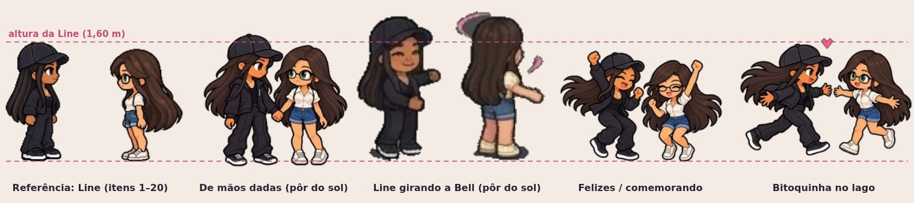
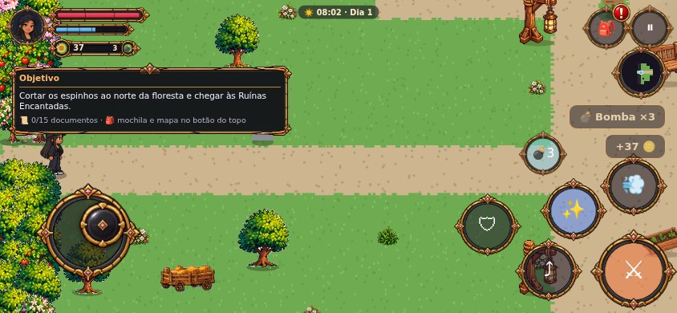
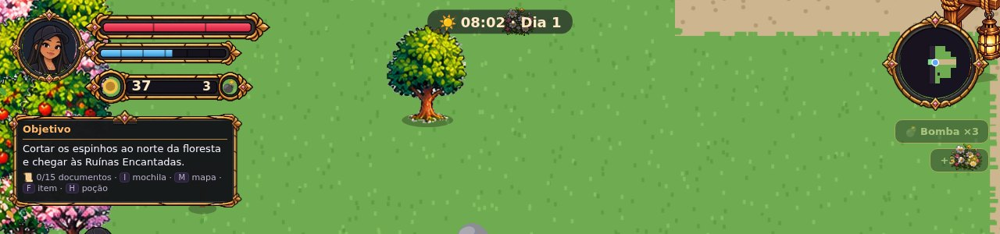
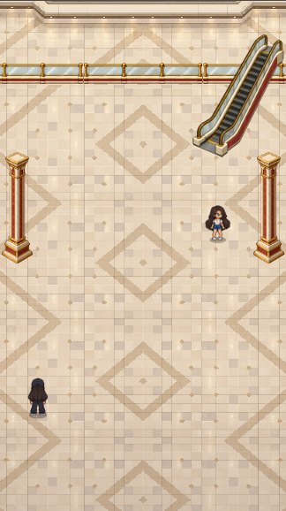

# Line & Bell — o que falta (pendências de arte)

*Atualizado em 05/10/2026. Este documento lista só o que **falta fazer ou refazer**. O que já está pronto fica na documentação completa (`LINE_E_BELL_DOCUMENTACAO.md`). As regras da seção 1 valem para tudo e não mudam.*

**Como usar:** cada linha tem o **código** exato que a arte precisa ter (o jogo procura a imagem pelo código). Quando a arte chega com o código certo, ela entra no jogo sozinha, no lugar da provisória. ✅ = já chegou · 🔁 = o jogo usa uma substituta até chegar · ✏️ = falta e nada substitui · ♻️ = existe, mas precisa refazer.

## 1. Regras (valem para toda arte)

### 1.1 Estilo

1. **Pixel art.** Tudo em pixel art, no mesmo traço, nas mesmas cores e na mesma proporção dos **20 primeiros itens** (`LINE_BELL_ITEM_01` a `20`: a Line e a Bell paradas, andando e correndo). Eles são a **referência oficial** de proporção: cabeça, corpo, pernas e altura.
2. **A Line** usa boné preto, moletom e calça pretos, tênis pretos de sola branca e o colar laranja; cabelo comprido escuro. **A Bell** usa óculos redondos, cropped azul-claro ou blusa branca, short jeans e tênis brancos; cabelo comprido castanho. A identidade nunca muda entre animações.
3. **Theo:** a arte atual do jogo é o layout oficial; só melhorar, sem perder os traços.
4. **Mesma altura sempre:** a Line tem **1,60 m**, que no jogo são **62 unidades** (≈ 85% do quadro de 74). A Bell fica com 96% da altura da Line. Uma animação nova não pode deixar a personagem maior ou menor do que nas 20 primeiras.

### 1.2 Quadros e entrega

1. **Fundo transparente de verdade** (PNG com alfa). Nada de quadriculado, fundo cinza, cenário, sombra no chão ou rótulo dentro do quadro: o jogo desenha a sombra.
2. **Todos os quadros de uma animação do mesmo tamanho**, com **os pés sempre na mesma linha**. Quadros de **1254×1254** (personagens) estão ótimos; o mínimo é 400×400.
3. **Animações de lado viradas para a direita** (o jogo espelha para a esquerda), a não ser que a lista peça as duas.
4. **Quatro direções** quando a ação acontece andando ou lutando: `_FRONT` (de frente, para baixo na tela), `_BACK` (de costas, para cima), `_RIGHT` e, se diferente, `_LEFT`.
5. **Quantidade de quadros:** andar e correr com **8 a 12** quadros; cenas (conversa, abraço, comer) com **pelo menos 10 a 12** quadros diferentes, para não ficarem corridas; golpes com **6 a 10**. Animações de andar ou correr com menos de 3 quadros diferentes são recusadas pelo jogo.
6. **Regra das pernas (andar e correr de lado):** a perna de trás começa o avanço, passa pela posição do meio e termina esticada à frente, enquanto a outra transfere o peso, impulsiona e dobra para trás. Ciclo: contato → absorção do peso → apoio → passagem da perna de trás → impulso → pé subindo → avanço completo → novo contato → o mesmo com a outra perna. Os braços cruzam com as pernas; cabelo, roupa e colar acompanham.
7. **Formatos aceitos:** HTML de item (`LINE_BELL_ITEM_NN.html`, com as imagens **dentro** do HTML, até 25 MB, sem dividir uma animação no meio), pasta `arte/<grupo>/<CODIGO>/00.png…` com `config.json`, ou **zip com as pastas e os PNGs** (o HTML de prévia sozinho não serve: as imagens precisam vir junto). Um PNG por quadro ou por peça, com o nome do código.
8. **Numeração:** cada lote continua a numeração do anterior; se um número se repetir, as peças são chamadas pelo código.

### 1.3 Objetos, cenário e mapas

1. **Uma peça por PNG**, recortada no contorno, com transparência, na perspectiva **de cima em 3/4** do jogo.
2. **Régua de tamanho real:** cada objeto entra pelo tamanho de verdade em relação à Line de 1,60 m (cadeira ≈ 0,9 m, porta ≈ 2,05 m, casa ≈ 7×5 tiles; 1 tile = 32 unidades).
3. **Direção:** sofá, banco, estante, lareira, cômoda e guarda-roupa são vistos **de frente** e ficam encostados na parede do fundo ou ao norte do que olham. Poltrona e cadeira de balanço têm lado (virada para a esquerda, o jogo espelha para a direita).
4. **Nada solto no ar:** sem lustre pendurado, janela, porta ou placa soltas no chão. Coisa de parede vem já presa numa parede.
5. **Dia e noite:** o que acende vem em dois PNGs (`_ON` e `_OFF`, ou `_DAY` e `_NIGHT`).
6. **Mapas das fases:** vista **de cima**, sem céu nem horizonte, desenhados **em cima do gabarito** da fase (`arte/referencias/gabaritos/<fase>.png`), na escala de **128 px por tile**, entregues em **blocos de 2048×2048**. O que é alto (árvore, casa, pilar) vai numa camada da frente, com transparência.
7. **Cenas em pé (prólogo):** base 360×640 (9:16), entrega **2160×3840**; chão e teto numa base vazia e cada móvel/loja à parte, mais um **guia de posicionamento**.
8. **Telas cheias:** 3840×2160 (16:9), nada importante a menos de 10% da borda.

## 2. Animações que precisam de ajuste (refazer)

### 2.1 Ataque nas quatro direções ⚔️

Hoje toda arte de ataque é **de lado**. O golpe já funciona para cima e para baixo no jogo (a área de acerto e o rastro da espada seguem a direção, e a mira vira para o inimigo mais perto), mas a Line continua desenhada de lado. Faltam as versões de **frente** e **de costas** de cada golpe (o `_RIGHT` é o desenho que já existe):

| De frente | De costas | Golpe | Situação |
|---|---|---|---|
| `LINE_ATTACK_HORIZONTAL_FRONT` | `LINE_ATTACK_HORIZONTAL_BACK` | golpe 1 (horizontal) | ✏️ falta |
| `LINE_ATTACK_VERTICAL_FRONT` | `LINE_ATTACK_VERTICAL_BACK` | golpe 2 (de cima para baixo) | ✏️ falta |
| `LINE_ATTACK_COMBO_FRONT` | `LINE_ATTACK_COMBO_BACK` | golpe 3 (combo) | ✏️ falta |
| `LINE_ATTACK_DIAGONAL_FRONT` | `LINE_ATTACK_DIAGONAL_BACK` | investida | ✏️ falta |
| `LINE_PUNCH_FRONT` | `LINE_PUNCH_BACK` | soco sem espada (hoje vem do soco na máquina) | ✏️ falta |
| `LINE_CAST_SPELL_FRONT` | `LINE_CAST_SPELL_BACK` | Raio de Luz | ✏️ falta |
| `BELL_ATTACK_STAR_FRONT` | `BELL_ATTACK_STAR_BACK` | estrela da Bell | ✏️ falta |
| `BELL_ATTACK_SPREAD_FRONT` | `BELL_ATTACK_SPREAD_BACK` | leque de estrelas da Bell | ✏️ falta |

Mesmos quadros e mesmo tempo da versão de lado, para o golpe acertar no mesmo instante. A espada (ou o punho) aponta para baixo da tela no `_FRONT` e para cima no `_BACK`.

### 2.2 Cenas do shopping e do prólogo: poucos quadros ♻️

Estas cenas têm só 3 a 7 quadros diferentes e ficavam corridas. O jogo já toca mais devagar (4 a 6 quadros por segundo), mas o certo é **refazer com 10 a 12 quadros diferentes**, sem mudar o código:

| Código | Cena | Quadros hoje | Pedido |
|---|---|---|---|
| `LINE_ADMIRE` | a Line vê a Bell de longe | 5 | 10 a 12 |
| `BELL_WAIT` | a Bell esperando no shopping | 4 | 10 a 12 |
| `LINE_BELL_MEET` | conversa frente a frente | 3 | 10 a 12 |
| `LINE_BELL_GREET_HUG` | abraço de chegada | 4 | 10 a 12 |
| `LINE_BELL_BK` | comendo BK (sem a mesa: as duas sentadas nas poltronas) | 6 | 10 a 12 |
| `LINE_BELL_TUNNEL_KISS` | o beijo no túnel | 7 | 10 a 12 |
| `BELL_LAUGH_AT_LINE` | a Bell rindo do soco | 6 | 10 a 12 |
| `LINE_BELL_WALK_HANDS` | saindo de mãos dadas | 4 | 10 a 12 |

Também faltam as duas sentadas comendo: `LINE_SIT_CHAIR_EAT` (Line virada para a direita) e `BELL_SIT_CHAIR_EAT` (Bell virada para a esquerda), sem mesa e sem poltrona no desenho.

### 2.3 Pôr do sol, felizes e a Line girando a Bell: desproporcionais ♻️

Estas cenas saíram com a cabeça e o corpo **maiores** que a Line e a Bell das 20 primeiras, e a dança (a Line girando a Bell) está **borrada** (é uma arte antiga pequena, ampliada). Precisam ser **refeitas do zero**, em pixel art, com a Line e a Bell exatamente do tamanho da referência (linha tracejada da imagem):

*Comparação com a referência: a Line e a Bell dos 20 primeiros itens à esquerda; as cenas desproporcionais à direita*

| Código | Cena | Quadros |
|---|---|---|
| `LINE_BELL_HOLD_HANDS` | de mãos dadas olhando o pôr do sol (de lado, as duas viradas para a esquerda) | 10 a 12 |
| `LINE_BELL_DANCE` | a Line girando a Bell pela mão (giro completo, a Bell rodando e o cabelo acompanhando) | 12 a 16 |
| `LINE_BELL_KISS` | a bitoquinha no lago | 10 a 12 |
| `LINE_BELL_CELEBRATE` | as duas felizes comemorando (toca aqui) | 10 a 12 |
| `LINE_BELL_HIGH_FIVE` | toca aqui com brilho | 8 a 10 |
| `LINE_HAPPY` | a Line feliz (a atual foi descartada: era uma corrida que terminava caída) | 8 a 10 |
| `BELL_HAPPY` | a Bell feliz | 8 a 10 |

### 2.4 Outras para refazer

- `LINE_BELL_WALK_HANDS_FRONT`: as duas de mãos dadas andando de frente ainda é a arte pequena do laboratório, ampliada (fica borrada).
- `BELL_DRAGON_CARRIED`: veio com o dragão antigo desenhado junto. Reenviar só a Bell pendurada, de braços para cima, sem dragão.
- **Máquina de soco com o placar 000:** só chegou a de 038; o 000 é feito no jogo a partir dela. Mandar `PLAYGROUND_MAQUINA_SOCO_000` desenhado.

## 3. Animações pendentes (ainda não existem)

Agrupadas como no jogo. 🔁 = o jogo usa a substituta indicada até a arte chegar.

### Line — emoções (1)

| Código | O que mostra | Quadros | Situação |
|---|---|---|---|
| `LINE_HAPPY` | Feliz | 20 | 🔁 usa `LINE_VICTORY` |

### Line e Bell juntas (8)

| Código | O que mostra | Quadros | Situação |
|---|---|---|---|
| `LINE_BELL_WALK_TOGETHER_FRONT` | Andando lado a lado | 16 | 🔁 usa `LINE_BELL_WALK_TOGETHER` |
| `LINE_BELL_WALK_TOGETHER_LEFT` | Andando lado a lado | 16 | 🔁 usa `LINE_BELL_WALK_TOGETHER` |
| `LINE_BELL_WALK_TOGETHER_RIGHT` | Andando lado a lado | 16 | 🔁 usa `LINE_BELL_WALK_TOGETHER` |
| `LINE_BELL_WALK_HANDS_LEFT` | Andando de mãos dadas | 16 | 🔁 usa `LINE_BELL_WALK_HANDS` |
| `LINE_BELL_WALK_HANDS_RIGHT` | Andando de mãos dadas | 16 | 🔁 usa `LINE_BELL_WALK_HANDS` |
| `LINE_BELL_RUN_TOGETHER_FRONT` | Correndo juntas | 12 | 🔁 usa `LINE_BELL_RUN_TOGETHER` |
| `LINE_BELL_RUN_TOGETHER_LEFT` | Correndo juntas | 12 | 🔁 usa `LINE_BELL_RUN_TOGETHER` |
| `LINE_BELL_RUN_TOGETHER_RIGHT` | Correndo juntas | 12 | 🔁 usa `LINE_BELL_RUN_TOGETHER` |

### Dragão (1)

| Código | O que mostra | Quadros | Situação |
|---|---|---|---|
| `DRAGON_SLEEP` | Dormir | 1 | 🔁 usa `DRAGON_DEFEATED` |

### Bell jogável (Parte 2) (18)

| Código | O que mostra | Quadros | Situação |
|---|---|---|---|
| `BELL_COMBAT_IDLE_FRONT` | Bell em guarda, estrelas girando na mão | 8 | 🔁 usa `BELL_IDLE_FRONT` |
| `BELL_COMBAT_IDLE_BACK` | Bell em guarda, estrelas girando na mão | 8 | 🔁 usa `BELL_IDLE_BACK` |
| `BELL_COMBAT_IDLE_LEFT` | Bell em guarda, estrelas girando na mão | 8 | 🔁 usa `BELL_IDLE_LEFT` |
| `BELL_COMBAT_IDLE_RIGHT` | Bell em guarda, estrelas girando na mão | 8 | 🔁 usa `BELL_IDLE_RIGHT` |
| `BELL_ATTACK_STAR` | Bell atira uma estrela (braço à frente) | 8 | 🔁 usa `BELL_HIGH_FIVE` |
| `BELL_ATTACK_SPREAD` | Bell gira e solta o leque de 3 estrelas de luz | 10 | 🔁 usa `BELL_DANCE` |
| `BELL_ATTACK_AIR` | Bell atira estrela no ar (pulando) | 6 | 🔁 usa `BELL_JUMP` |
| `BELL_SING` | Bell canta a Canção (notas coloridas saindo) | 12 | 🔁 usa `BELL_HAPPY` |
| `BELL_BLOCK` | Bell se protege com um escudo de luz rosa | 6 | 🔁 usa `BELL_IDLE_RIGHT` |
| `BELL_DODGE` | Bell esquiva (pulinho de lado) | 6 | 🔁 usa `BELL_JUMP` |
| `BELL_DASH` | Bell arrancada | 6 | 🔁 usa `BELL_RUN_RIGHT` |
| `BELL_HIT` | Bell recebe dano | 4 | 🔁 usa `BELL_SCARED` |
| `BELL_KNOCKDOWN` | Bell cai no chão (golpe forte) | 6 | 🔁 usa `BELL_FALL` |
| `BELL_EXHAUSTED_IDLE` | Bell cansada, ofegante (pouca vida) | 8 | 🔁 usa `BELL_IDLE_RIGHT` |
| `BELL_CROUCH` | Bell agachada (beber na fonte / pegar item) | 6 | 🔁 usa `BELL_IDLE_FRONT` |
| `BELL_DETERMINED` | Bell decidida (punhos fechados) | 6 | 🔁 usa `BELL_IDLE_FRONT` |
| `BELL_CELEBRATE` | Bell comemora vitória | 12 | 🔁 usa `BELL_HAPPY` |
| `BELL_TALK` | Bell falando (cenas) | 8 | 🔁 usa `BELL_IDLE_FRONT` |

### Chefe: Colosso de Raízes (Parte 2) (12)

| Código | O que mostra | Quadros | Situação |
|---|---|---|---|
| `COLOSSO_SLEEP` | Colosso de Raízes — dormindo (antes da luta) | 8 | ✏️ falta |
| `COLOSSO_IDLE` | Colosso de Raízes — parado, respirando | 8 | ✏️ falta |
| `COLOSSO_WAKE` | Colosso de Raízes — acordando / rugido de apresentação | 12 | ✏️ falta |
| `COLOSSO_ATTACK` | Colosso de Raízes — ataque genérico (usado quando o golpe não tem arte própria) | 10 | ✏️ falta |
| `COLOSSO_ROOTS` | Colosso de Raízes — raízes saindo do chão em linha | 10 | ✏️ falta |
| `COLOSSO_THORNS` | Colosso de Raízes — anel de espinhos | 10 | ✏️ falta |
| `COLOSSO_MUD` | Colosso de Raízes — cuspe de lama | 10 | ✏️ falta |
| `COLOSSO_SUMMON` | Colosso de Raízes — chama sombras | 10 | ✏️ falta |
| `COLOSSO_STUNNED` | Colosso de Raízes — cansado, núcleo exposto (hora de atacar) | 8 | ✏️ falta |
| `COLOSSO_HIT` | Colosso de Raízes — recebe dano | 4 | ✏️ falta |
| `COLOSSO_DEATH` | Colosso de Raízes — derrotado (se desfaz em luz) | 14 | ✏️ falta |
| `COLOSSO_FREED` | Colosso de Raízes — libertado, volta às cores verdadeiras e agradece | 12 | ✏️ falta |

### Chefe: Serpente das Marés (Parte 2) (11)

| Código | O que mostra | Quadros | Situação |
|---|---|---|---|
| `SERPENTE_SLEEP` | Serpente das Marés — dormindo (antes da luta) | 8 | ✏️ falta |
| `SERPENTE_IDLE` | Serpente das Marés — parado, respirando | 8 | ✏️ falta |
| `SERPENTE_WAKE` | Serpente das Marés — acordando / rugido de apresentação | 12 | ✏️ falta |
| `SERPENTE_ATTACK` | Serpente das Marés — ataque genérico (usado quando o golpe não tem arte própria) | 10 | ✏️ falta |
| `SERPENTE_DIVE` | Serpente das Marés — mergulho (some e reaparece) | 10 | ✏️ falta |
| `SERPENTE_WATER_JET` | Serpente das Marés — jatos de água | 10 | ✏️ falta |
| `SERPENTE_WAVE` | Serpente das Marés — onda | 10 | ✏️ falta |
| `SERPENTE_STUNNED` | Serpente das Marés — cansado, núcleo exposto (hora de atacar) | 8 | ✏️ falta |
| `SERPENTE_HIT` | Serpente das Marés — recebe dano | 4 | ✏️ falta |
| `SERPENTE_DEATH` | Serpente das Marés — derrotado (se desfaz em luz) | 14 | ✏️ falta |
| `SERPENTE_FREED` | Serpente das Marés — libertado, volta às cores verdadeiras e agradece | 12 | ✏️ falta |

### Chefe: Grifo da Tempestade (Parte 2) (11)

| Código | O que mostra | Quadros | Situação |
|---|---|---|---|
| `GRIFO_SLEEP` | Grifo da Tempestade — dormindo (antes da luta) | 8 | ✏️ falta |
| `GRIFO_IDLE` | Grifo da Tempestade — parado, respirando | 8 | ✏️ falta |
| `GRIFO_WAKE` | Grifo da Tempestade — acordando / rugido de apresentação | 12 | ✏️ falta |
| `GRIFO_ATTACK` | Grifo da Tempestade — ataque genérico (usado quando o golpe não tem arte própria) | 10 | ✏️ falta |
| `GRIFO_GUST` | Grifo da Tempestade — rajada de vento | 10 | ✏️ falta |
| `GRIFO_FEATHERS` | Grifo da Tempestade — leque de penas | 10 | ✏️ falta |
| `GRIFO_LIGHTNING` | Grifo da Tempestade — chama raios | 10 | ✏️ falta |
| `GRIFO_STUNNED` | Grifo da Tempestade — cansado, núcleo exposto (hora de atacar) | 8 | ✏️ falta |
| `GRIFO_HIT` | Grifo da Tempestade — recebe dano | 4 | ✏️ falta |
| `GRIFO_DEATH` | Grifo da Tempestade — derrotado (se desfaz em luz) | 14 | ✏️ falta |
| `GRIFO_FREED` | Grifo da Tempestade — libertado, volta às cores verdadeiras e agradece | 12 | ✏️ falta |

### Chefe: Titã de Magma (Parte 2) (11)

| Código | O que mostra | Quadros | Situação |
|---|---|---|---|
| `MAGMA_SLEEP` | Titã de Magma — dormindo (antes da luta) | 8 | ✏️ falta |
| `MAGMA_IDLE` | Titã de Magma — parado, respirando | 8 | ✏️ falta |
| `MAGMA_WAKE` | Titã de Magma — acordando / rugido de apresentação | 12 | ✏️ falta |
| `MAGMA_ATTACK` | Titã de Magma — ataque genérico (usado quando o golpe não tem arte própria) | 10 | ✏️ falta |
| `MAGMA_SLAM` | Titã de Magma — pisão (onda no chão) | 10 | ✏️ falta |
| `MAGMA_FIRE_RAIN` | Titã de Magma — chuva de fogo | 10 | ✏️ falta |
| `MAGMA_THROW` | Titã de Magma — arremesso de rocha | 10 | ✏️ falta |
| `MAGMA_FIRE_FAN` | Titã de Magma — leque de fogo | 10 | ✏️ falta |
| `MAGMA_STUNNED` | Titã de Magma — cansado, núcleo exposto (hora de atacar) | 8 | ✏️ falta |
| `MAGMA_HIT` | Titã de Magma — recebe dano | 4 | ✏️ falta |
| `MAGMA_DEATH` | Titã de Magma — derrotado (se desfaz em luz) | 14 | ✏️ falta |

### Chefe: Hidra de Lama (Parte 2) (12)

| Código | O que mostra | Quadros | Situação |
|---|---|---|---|
| `HIDRA_SLEEP` | Hidra de Lama — dormindo (antes da luta) | 8 | ✏️ falta |
| `HIDRA_IDLE` | Hidra de Lama — parado, respirando | 8 | ✏️ falta |
| `HIDRA_WAKE` | Hidra de Lama — acordando / rugido de apresentação | 12 | ✏️ falta |
| `HIDRA_ATTACK` | Hidra de Lama — ataque genérico (usado quando o golpe não tem arte própria) | 10 | ✏️ falta |
| `HIDRA_ROOTS` | Hidra de Lama — raízes saindo do chão em linha | 10 | ✏️ falta |
| `HIDRA_WATER_JET` | Hidra de Lama — jatos de água | 10 | ✏️ falta |
| `HIDRA_WAVE` | Hidra de Lama — onda | 10 | ✏️ falta |
| `HIDRA_DIVE` | Hidra de Lama — mergulho (some e reaparece) | 10 | ✏️ falta |
| `HIDRA_MUD` | Hidra de Lama — cuspe de lama | 10 | ✏️ falta |
| `HIDRA_STUNNED` | Hidra de Lama — cansado, núcleo exposto (hora de atacar) | 8 | ✏️ falta |
| `HIDRA_HIT` | Hidra de Lama — recebe dano | 4 | ✏️ falta |
| `HIDRA_DEATH` | Hidra de Lama — derrotado (se desfaz em luz) | 14 | ✏️ falta |

### Chefe: Tempestade Viva (Parte 2) (12)

| Código | O que mostra | Quadros | Situação |
|---|---|---|---|
| `TEMPESTADE_SLEEP` | Tempestade Viva — dormindo (antes da luta) | 8 | ✏️ falta |
| `TEMPESTADE_IDLE` | Tempestade Viva — parado, respirando | 8 | ✏️ falta |
| `TEMPESTADE_WAKE` | Tempestade Viva — acordando / rugido de apresentação | 12 | ✏️ falta |
| `TEMPESTADE_ATTACK` | Tempestade Viva — ataque genérico (usado quando o golpe não tem arte própria) | 10 | ✏️ falta |
| `TEMPESTADE_LIGHTNING` | Tempestade Viva — chama raios | 10 | ✏️ falta |
| `TEMPESTADE_GUST` | Tempestade Viva — rajada de vento | 10 | ✏️ falta |
| `TEMPESTADE_WATER_JET` | Tempestade Viva — jatos de água | 10 | ✏️ falta |
| `TEMPESTADE_WAVE` | Tempestade Viva — onda | 10 | ✏️ falta |
| `TEMPESTADE_FEATHERS` | Tempestade Viva — leque de penas | 10 | ✏️ falta |
| `TEMPESTADE_STUNNED` | Tempestade Viva — cansado, núcleo exposto (hora de atacar) | 8 | ✏️ falta |
| `TEMPESTADE_HIT` | Tempestade Viva — recebe dano | 4 | ✏️ falta |
| `TEMPESTADE_DEATH` | Tempestade Viva — derrotado (se desfaz em luz) | 14 | ✏️ falta |

### Chefe: Quimera Primordial (Parte 2) (22)

| Código | O que mostra | Quadros | Situação |
|---|---|---|---|
| `QUIMERA_SLEEP` | Quimera Primordial — dormindo (antes da luta) | 8 | ✏️ falta |
| `QUIMERA_IDLE` | Quimera Primordial — parado, respirando | 8 | ✏️ falta |
| `QUIMERA_WAKE` | Quimera Primordial — acordando / rugido de apresentação | 12 | ✏️ falta |
| `QUIMERA_ATTACK` | Quimera Primordial — ataque genérico (usado quando o golpe não tem arte própria) | 10 | ✏️ falta |
| `QUIMERA_SLAM` | Quimera Primordial — pisão (onda no chão) | 10 | ✏️ falta |
| `QUIMERA_THROW` | Quimera Primordial — arremesso de rocha | 10 | ✏️ falta |
| `QUIMERA_FIRE_RAIN` | Quimera Primordial — chuva de fogo | 10 | ✏️ falta |
| `QUIMERA_FIRE_FAN` | Quimera Primordial — leque de fogo | 10 | ✏️ falta |
| `QUIMERA_ROOTS` | Quimera Primordial — raízes saindo do chão em linha | 10 | ✏️ falta |
| `QUIMERA_THORNS` | Quimera Primordial — anel de espinhos | 10 | ✏️ falta |
| `QUIMERA_MUD` | Quimera Primordial — cuspe de lama | 10 | ✏️ falta |
| `QUIMERA_DIVE` | Quimera Primordial — mergulho (some e reaparece) | 10 | ✏️ falta |
| `QUIMERA_WATER_JET` | Quimera Primordial — jatos de água | 10 | ✏️ falta |
| `QUIMERA_WAVE` | Quimera Primordial — onda | 10 | ✏️ falta |
| `QUIMERA_GUST` | Quimera Primordial — rajada de vento | 10 | ✏️ falta |
| `QUIMERA_FEATHERS` | Quimera Primordial — leque de penas | 10 | ✏️ falta |
| `QUIMERA_LIGHTNING` | Quimera Primordial — chama raios | 10 | ✏️ falta |
| `QUIMERA_STUNNED` | Quimera Primordial — cansado, núcleo exposto (hora de atacar) | 8 | ✏️ falta |
| `QUIMERA_HIT` | Quimera Primordial — recebe dano | 4 | ✏️ falta |
| `QUIMERA_DEATH` | Quimera Primordial — derrotado (se desfaz em luz) | 14 | ✏️ falta |
| `QUIMERA_PHASE` | Quimera — muda de fase (troca a cor do núcleo e o elemento) | 12 | ✏️ falta |
| `QUIMERA_CALM` | Quimera — acalmada no final (“é... quente”) | 8 | ✏️ falta |

### Fogos-fátuos dos elementos (Parte 2) (9)

| Código | O que mostra | Quadros | Situação |
|---|---|---|---|
| `WISP_EARTH_IDLE` | Fogo-fátuo de terra (verde-musgo) — flutuando | 8 | 🔁 usa `WISP_IDLE` |
| `WISP_EARTH_ATTACK` | Fogo-fátuo de terra (verde-musgo) — atirando | 8 | 🔁 usa `WISP_ATTACK` |
| `WISP_EARTH_DEATH` | Fogo-fátuo de terra (verde-musgo) — apagando | 8 | 🔁 usa `WISP_DEATH` |
| `WISP_WATER_IDLE` | Fogo-fátuo de água (azul) — flutuando | 8 | 🔁 usa `WISP_IDLE` |
| `WISP_WATER_ATTACK` | Fogo-fátuo de água (azul) — atirando | 8 | 🔁 usa `WISP_ATTACK` |
| `WISP_WATER_DEATH` | Fogo-fátuo de água (azul) — apagando | 8 | 🔁 usa `WISP_DEATH` |
| `WISP_AIR_IDLE` | Fogo-fátuo de ar (branco) — flutuando | 8 | 🔁 usa `WISP_IDLE` |
| `WISP_AIR_ATTACK` | Fogo-fátuo de ar (branco) — atirando | 8 | 🔁 usa `WISP_ATTACK` |
| `WISP_AIR_DEATH` | Fogo-fátuo de ar (branco) — apagando | 8 | 🔁 usa `WISP_DEATH` |

### Moradores (todos, incluindo os da Parte 2) (30)

| Código | O que mostra | Quadros | Situação |
|---|---|---|---|
| `CORA_IDLE` | Dona Cora (jardineira do vale) — parado | 8 | ✏️ falta |
| `CORA_TALK` | Dona Cora (jardineira do vale) — falando | 8 | ✏️ falta |
| `CORA_SLEEP` | Dona Cora (jardineira do vale) — dormindo (noite) | 4 | ✏️ falta |
| `TIAO_IDLE` | Seu Tião (pescador do lago) — parado | 8 | ✏️ falta |
| `TIAO_TALK` | Seu Tião (pescador do lago) — falando | 8 | ✏️ falta |
| `TIAO_SLEEP` | Seu Tião (pescador do lago) — dormindo (noite) | 4 | ✏️ falta |
| `BRISA_IDLE` | Vó Brisa (pastora dos picos) — parado | 8 | ✏️ falta |
| `BRISA_TALK` | Vó Brisa (pastora dos picos) — falando | 8 | ✏️ falta |
| `BRISA_SLEEP` | Vó Brisa (pastora dos picos) — dormindo (noite) | 4 | ✏️ falta |
| `ROSA_IDLE` | Dona Rosa (loja) — parado | 8 | ✏️ falta |
| `ROSA_TALK` | Dona Rosa (loja) — falando | 8 | ✏️ falta |
| `ROSA_SLEEP` | Dona Rosa (loja) — dormindo (noite) | 4 | ✏️ falta |
| `BENTO_IDLE` | Seu Bento (ferraria) — parado | 8 | ✏️ falta |
| `BENTO_TALK` | Seu Bento (ferraria) — falando | 8 | ✏️ falta |
| `BENTO_SLEEP` | Seu Bento (ferraria) — dormindo (noite) | 4 | ✏️ falta |
| `ZE_IDLE` | Seu Zé — parado | 8 | ✏️ falta |
| `ZE_TALK` | Seu Zé — falando | 8 | ✏️ falta |
| `ZE_SLEEP` | Seu Zé — dormindo (noite) | 4 | ✏️ falta |
| `LURDES_IDLE` | Dona Lurdes — parado | 8 | ✏️ falta |
| `LURDES_TALK` | Dona Lurdes — falando | 8 | ✏️ falta |
| `LURDES_SLEEP` | Dona Lurdes — dormindo (noite) | 4 | ✏️ falta |
| `PEDRO_IDLE` | Pedrinho — parado | 8 | ✏️ falta |
| `PEDRO_TALK` | Pedrinho — falando | 8 | ✏️ falta |
| `PEDRO_SLEEP` | Pedrinho — dormindo (noite) | 4 | ✏️ falta |
| `TOBIAS_IDLE` | Tobias (caçador) — parado | 8 | ✏️ falta |
| `TOBIAS_TALK` | Tobias (caçador) — falando | 8 | ✏️ falta |
| `TOBIAS_SLEEP` | Tobias (caçador) — dormindo (noite) | 4 | ✏️ falta |
| `TIAO_FISH` | Seu Tião — pescando no píer | 12 | ✏️ falta |
| `BENTO_FORGE` | Seu Bento — martelando na bigorna | 8 | ✏️ falta |
| `PEDRO_RUN` | Pedrinho — correndo pra lá e pra cá | 8 | ✏️ falta |

### Dragão amigo (Parte 2) (3)

| Código | O que mostra | Quadros | Situação |
|---|---|---|---|
| `DRAGON_TALK` | Dragão falando calmo (abertura da Parte 2) | 6 | 🔁 usa `DRAGON_IDLE` |
| `DRAGON_BOW` | Dragão abaixa a cabeça (pede ajuda / agradece) | 8 | 🔁 usa `DRAGON_IDLE` |
| `DRAGON_CURL_SLEEP` | Dragão dormindo enrolado perto da casa (fazenda) | 4 | 🔁 usa `DRAGON_DEFEATED` |

### Line com armadura: Túnica Acolchoada (23)

| Código | O que mostra | Quadros | Situação |
|---|---|---|---|
| `LINE_TUNICA_IDLE_FRONT` | Line com Túnica Acolchoada — parada | 12 | 🔁 usa `LINE_IDLE_FRONT` |
| `LINE_TUNICA_IDLE_BACK` | Line com Túnica Acolchoada — parada | 12 | 🔁 usa `LINE_IDLE_BACK` |
| `LINE_TUNICA_IDLE_LEFT` | Line com Túnica Acolchoada — parada | 12 | 🔁 usa `LINE_IDLE_LEFT` |
| `LINE_TUNICA_IDLE_RIGHT` | Line com Túnica Acolchoada — parada | 12 | 🔁 usa `LINE_IDLE_RIGHT` |
| `LINE_TUNICA_WALK_FRONT` | Line com Túnica Acolchoada — andando | 12 | 🔁 usa `LINE_WALK_FRONT` |
| `LINE_TUNICA_WALK_BACK` | Line com Túnica Acolchoada — andando | 12 | 🔁 usa `LINE_WALK_BACK` |
| `LINE_TUNICA_WALK_LEFT` | Line com Túnica Acolchoada — andando | 12 | 🔁 usa `LINE_WALK_LEFT` |
| `LINE_TUNICA_WALK_RIGHT` | Line com Túnica Acolchoada — andando | 12 | 🔁 usa `LINE_WALK_RIGHT` |
| `LINE_TUNICA_RUN_FRONT` | Line com Túnica Acolchoada — correndo | 12 | 🔁 usa `LINE_RUN_FRONT` |
| `LINE_TUNICA_RUN_BACK` | Line com Túnica Acolchoada — correndo | 12 | 🔁 usa `LINE_RUN_BACK` |
| `LINE_TUNICA_RUN_LEFT` | Line com Túnica Acolchoada — correndo | 12 | 🔁 usa `LINE_RUN_LEFT` |
| `LINE_TUNICA_RUN_RIGHT` | Line com Túnica Acolchoada — correndo | 12 | 🔁 usa `LINE_RUN_RIGHT` |
| `LINE_TUNICA_COMBAT_IDLE` | Line com Túnica Acolchoada — em guarda | 12 | 🔁 usa `LINE_COMBAT_IDLE` |
| `LINE_TUNICA_ATTACK_HORIZONTAL` | Line com Túnica Acolchoada — golpe horizontal | 12 | 🔁 usa `LINE_ATTACK_HORIZONTAL` |
| `LINE_TUNICA_ATTACK_VERTICAL` | Line com Túnica Acolchoada — golpe vertical | 12 | 🔁 usa `LINE_ATTACK_VERTICAL` |
| `LINE_TUNICA_ATTACK_COMBO` | Line com Túnica Acolchoada — golpe final do combo | 12 | 🔁 usa `LINE_ATTACK_COMBO` |
| `LINE_TUNICA_ATTACK_SPIN` | Line com Túnica Acolchoada — giro | 12 | 🔁 usa `LINE_ATTACK_SPIN` |
| `LINE_TUNICA_CAST_SPELL` | Line com Túnica Acolchoada — Raio de Luz | 12 | 🔁 usa `LINE_CAST_SPELL` |
| `LINE_TUNICA_BLOCK` | Line com Túnica Acolchoada — defesa | 12 | 🔁 usa `LINE_BLOCK` |
| `LINE_TUNICA_DODGE` | Line com Túnica Acolchoada — esquiva | 12 | 🔁 usa `LINE_DODGE` |
| `LINE_TUNICA_JUMP` | Line com Túnica Acolchoada — pulo | 12 | 🔁 usa `LINE_JUMP_RIGHT` |
| `LINE_TUNICA_HIT_LIGHT` | Line com Túnica Acolchoada — recebe dano | 12 | 🔁 usa `LINE_HIT_LIGHT` |
| `LINE_TUNICA_KNOCKDOWN` | Line com Túnica Acolchoada — cai no chão | 12 | 🔁 usa `LINE_KNOCKDOWN` |

### Line com armadura: Cota de Malha (23)

| Código | O que mostra | Quadros | Situação |
|---|---|---|---|
| `LINE_MALHA_IDLE_FRONT` | Line com Cota de Malha — parada | 12 | 🔁 usa `LINE_IDLE_FRONT` |
| `LINE_MALHA_IDLE_BACK` | Line com Cota de Malha — parada | 12 | 🔁 usa `LINE_IDLE_BACK` |
| `LINE_MALHA_IDLE_LEFT` | Line com Cota de Malha — parada | 12 | 🔁 usa `LINE_IDLE_LEFT` |
| `LINE_MALHA_IDLE_RIGHT` | Line com Cota de Malha — parada | 12 | 🔁 usa `LINE_IDLE_RIGHT` |
| `LINE_MALHA_WALK_FRONT` | Line com Cota de Malha — andando | 12 | 🔁 usa `LINE_WALK_FRONT` |
| `LINE_MALHA_WALK_BACK` | Line com Cota de Malha — andando | 12 | 🔁 usa `LINE_WALK_BACK` |
| `LINE_MALHA_WALK_LEFT` | Line com Cota de Malha — andando | 12 | 🔁 usa `LINE_WALK_LEFT` |
| `LINE_MALHA_WALK_RIGHT` | Line com Cota de Malha — andando | 12 | 🔁 usa `LINE_WALK_RIGHT` |
| `LINE_MALHA_RUN_FRONT` | Line com Cota de Malha — correndo | 12 | 🔁 usa `LINE_RUN_FRONT` |
| `LINE_MALHA_RUN_BACK` | Line com Cota de Malha — correndo | 12 | 🔁 usa `LINE_RUN_BACK` |
| `LINE_MALHA_RUN_LEFT` | Line com Cota de Malha — correndo | 12 | 🔁 usa `LINE_RUN_LEFT` |
| `LINE_MALHA_RUN_RIGHT` | Line com Cota de Malha — correndo | 12 | 🔁 usa `LINE_RUN_RIGHT` |
| `LINE_MALHA_COMBAT_IDLE` | Line com Cota de Malha — em guarda | 12 | 🔁 usa `LINE_COMBAT_IDLE` |
| `LINE_MALHA_ATTACK_HORIZONTAL` | Line com Cota de Malha — golpe horizontal | 12 | 🔁 usa `LINE_ATTACK_HORIZONTAL` |
| `LINE_MALHA_ATTACK_VERTICAL` | Line com Cota de Malha — golpe vertical | 12 | 🔁 usa `LINE_ATTACK_VERTICAL` |
| `LINE_MALHA_ATTACK_COMBO` | Line com Cota de Malha — golpe final do combo | 12 | 🔁 usa `LINE_ATTACK_COMBO` |
| `LINE_MALHA_ATTACK_SPIN` | Line com Cota de Malha — giro | 12 | 🔁 usa `LINE_ATTACK_SPIN` |
| `LINE_MALHA_CAST_SPELL` | Line com Cota de Malha — Raio de Luz | 12 | 🔁 usa `LINE_CAST_SPELL` |
| `LINE_MALHA_BLOCK` | Line com Cota de Malha — defesa | 12 | 🔁 usa `LINE_BLOCK` |
| `LINE_MALHA_DODGE` | Line com Cota de Malha — esquiva | 12 | 🔁 usa `LINE_DODGE` |
| `LINE_MALHA_JUMP` | Line com Cota de Malha — pulo | 12 | 🔁 usa `LINE_JUMP_RIGHT` |
| `LINE_MALHA_HIT_LIGHT` | Line com Cota de Malha — recebe dano | 12 | 🔁 usa `LINE_HIT_LIGHT` |
| `LINE_MALHA_KNOCKDOWN` | Line com Cota de Malha — cai no chão | 12 | 🔁 usa `LINE_KNOCKDOWN` |

### Line com armadura: Armadura de Brasa (23)

| Código | O que mostra | Quadros | Situação |
|---|---|---|---|
| `LINE_BRASA_IDLE_FRONT` | Line com Armadura de Brasa — parada | 12 | 🔁 usa `LINE_IDLE_FRONT` |
| `LINE_BRASA_IDLE_BACK` | Line com Armadura de Brasa — parada | 12 | 🔁 usa `LINE_IDLE_BACK` |
| `LINE_BRASA_IDLE_LEFT` | Line com Armadura de Brasa — parada | 12 | 🔁 usa `LINE_IDLE_LEFT` |
| `LINE_BRASA_IDLE_RIGHT` | Line com Armadura de Brasa — parada | 12 | 🔁 usa `LINE_IDLE_RIGHT` |
| `LINE_BRASA_WALK_FRONT` | Line com Armadura de Brasa — andando | 12 | 🔁 usa `LINE_WALK_FRONT` |
| `LINE_BRASA_WALK_BACK` | Line com Armadura de Brasa — andando | 12 | 🔁 usa `LINE_WALK_BACK` |
| `LINE_BRASA_WALK_LEFT` | Line com Armadura de Brasa — andando | 12 | 🔁 usa `LINE_WALK_LEFT` |
| `LINE_BRASA_WALK_RIGHT` | Line com Armadura de Brasa — andando | 12 | 🔁 usa `LINE_WALK_RIGHT` |
| `LINE_BRASA_RUN_FRONT` | Line com Armadura de Brasa — correndo | 12 | 🔁 usa `LINE_RUN_FRONT` |
| `LINE_BRASA_RUN_BACK` | Line com Armadura de Brasa — correndo | 12 | 🔁 usa `LINE_RUN_BACK` |
| `LINE_BRASA_RUN_LEFT` | Line com Armadura de Brasa — correndo | 12 | 🔁 usa `LINE_RUN_LEFT` |
| `LINE_BRASA_RUN_RIGHT` | Line com Armadura de Brasa — correndo | 12 | 🔁 usa `LINE_RUN_RIGHT` |
| `LINE_BRASA_COMBAT_IDLE` | Line com Armadura de Brasa — em guarda | 12 | 🔁 usa `LINE_COMBAT_IDLE` |
| `LINE_BRASA_ATTACK_HORIZONTAL` | Line com Armadura de Brasa — golpe horizontal | 12 | 🔁 usa `LINE_ATTACK_HORIZONTAL` |
| `LINE_BRASA_ATTACK_VERTICAL` | Line com Armadura de Brasa — golpe vertical | 12 | 🔁 usa `LINE_ATTACK_VERTICAL` |
| `LINE_BRASA_ATTACK_COMBO` | Line com Armadura de Brasa — golpe final do combo | 12 | 🔁 usa `LINE_ATTACK_COMBO` |
| `LINE_BRASA_ATTACK_SPIN` | Line com Armadura de Brasa — giro | 12 | 🔁 usa `LINE_ATTACK_SPIN` |
| `LINE_BRASA_CAST_SPELL` | Line com Armadura de Brasa — Raio de Luz | 12 | 🔁 usa `LINE_CAST_SPELL` |
| `LINE_BRASA_BLOCK` | Line com Armadura de Brasa — defesa | 12 | 🔁 usa `LINE_BLOCK` |
| `LINE_BRASA_DODGE` | Line com Armadura de Brasa — esquiva | 12 | 🔁 usa `LINE_DODGE` |
| `LINE_BRASA_JUMP` | Line com Armadura de Brasa — pulo | 12 | 🔁 usa `LINE_JUMP_RIGHT` |
| `LINE_BRASA_HIT_LIGHT` | Line com Armadura de Brasa — recebe dano | 12 | 🔁 usa `LINE_HIT_LIGHT` |
| `LINE_BRASA_KNOCKDOWN` | Line com Armadura de Brasa — cai no chão | 12 | 🔁 usa `LINE_KNOCKDOWN` |

### Bell com armadura: Vestido Reforçado (21)

| Código | O que mostra | Quadros | Situação |
|---|---|---|---|
| `BELL_VESTIDO_IDLE_FRONT` | Bell com Vestido Reforçado — parada | 12 | 🔁 usa `BELL_IDLE_FRONT` |
| `BELL_VESTIDO_IDLE_BACK` | Bell com Vestido Reforçado — parada | 12 | 🔁 usa `BELL_IDLE_BACK` |
| `BELL_VESTIDO_IDLE_LEFT` | Bell com Vestido Reforçado — parada | 12 | 🔁 usa `BELL_IDLE_LEFT` |
| `BELL_VESTIDO_IDLE_RIGHT` | Bell com Vestido Reforçado — parada | 12 | 🔁 usa `BELL_IDLE_RIGHT` |
| `BELL_VESTIDO_WALK_FRONT` | Bell com Vestido Reforçado — andando | 12 | 🔁 usa `BELL_WALK_FRONT` |
| `BELL_VESTIDO_WALK_BACK` | Bell com Vestido Reforçado — andando | 12 | 🔁 usa `BELL_WALK_BACK` |
| `BELL_VESTIDO_WALK_LEFT` | Bell com Vestido Reforçado — andando | 12 | 🔁 usa `BELL_WALK_LEFT` |
| `BELL_VESTIDO_WALK_RIGHT` | Bell com Vestido Reforçado — andando | 12 | 🔁 usa `BELL_WALK_RIGHT` |
| `BELL_VESTIDO_RUN_FRONT` | Bell com Vestido Reforçado — correndo | 12 | 🔁 usa `BELL_RUN_FRONT` |
| `BELL_VESTIDO_RUN_BACK` | Bell com Vestido Reforçado — correndo | 12 | 🔁 usa `BELL_RUN_BACK` |
| `BELL_VESTIDO_RUN_LEFT` | Bell com Vestido Reforçado — correndo | 12 | 🔁 usa `BELL_RUN_LEFT` |
| `BELL_VESTIDO_RUN_RIGHT` | Bell com Vestido Reforçado — correndo | 12 | 🔁 usa `BELL_RUN_RIGHT` |
| `BELL_VESTIDO_COMBAT_IDLE` | Bell com Vestido Reforçado — em guarda | 12 | 🔁 usa `BELL_IDLE_RIGHT` |
| `BELL_VESTIDO_ATTACK_STAR` | Bell com Vestido Reforçado — atira estrela | 12 | 🔁 usa `BELL_HIGH_FIVE` |
| `BELL_VESTIDO_ATTACK_SPREAD` | Bell com Vestido Reforçado — leque de estrelas | 12 | 🔁 usa `BELL_DANCE` |
| `BELL_VESTIDO_SING` | Bell com Vestido Reforçado — canção | 12 | 🔁 usa `BELL_HAPPY` |
| `BELL_VESTIDO_BLOCK` | Bell com Vestido Reforçado — escudo de luz | 12 | 🔁 usa `BELL_IDLE_RIGHT` |
| `BELL_VESTIDO_DODGE` | Bell com Vestido Reforçado — esquiva | 12 | 🔁 usa `BELL_JUMP` |
| `BELL_VESTIDO_JUMP` | Bell com Vestido Reforçado — pulo | 12 | 🔁 usa `BELL_JUMP` |
| `BELL_VESTIDO_HIT` | Bell com Vestido Reforçado — recebe dano | 12 | 🔁 usa `BELL_SCARED` |
| `BELL_VESTIDO_KNOCKDOWN` | Bell com Vestido Reforçado — cai no chão | 12 | 🔁 usa `BELL_FALL` |

### Bell com armadura: Manto Estelar (21)

| Código | O que mostra | Quadros | Situação |
|---|---|---|---|
| `BELL_ESTELAR_IDLE_FRONT` | Bell com Manto Estelar — parada | 12 | 🔁 usa `BELL_IDLE_FRONT` |
| `BELL_ESTELAR_IDLE_BACK` | Bell com Manto Estelar — parada | 12 | 🔁 usa `BELL_IDLE_BACK` |
| `BELL_ESTELAR_IDLE_LEFT` | Bell com Manto Estelar — parada | 12 | 🔁 usa `BELL_IDLE_LEFT` |
| `BELL_ESTELAR_IDLE_RIGHT` | Bell com Manto Estelar — parada | 12 | 🔁 usa `BELL_IDLE_RIGHT` |
| `BELL_ESTELAR_WALK_FRONT` | Bell com Manto Estelar — andando | 12 | 🔁 usa `BELL_WALK_FRONT` |
| `BELL_ESTELAR_WALK_BACK` | Bell com Manto Estelar — andando | 12 | 🔁 usa `BELL_WALK_BACK` |
| `BELL_ESTELAR_WALK_LEFT` | Bell com Manto Estelar — andando | 12 | 🔁 usa `BELL_WALK_LEFT` |
| `BELL_ESTELAR_WALK_RIGHT` | Bell com Manto Estelar — andando | 12 | 🔁 usa `BELL_WALK_RIGHT` |
| `BELL_ESTELAR_RUN_FRONT` | Bell com Manto Estelar — correndo | 12 | 🔁 usa `BELL_RUN_FRONT` |
| `BELL_ESTELAR_RUN_BACK` | Bell com Manto Estelar — correndo | 12 | 🔁 usa `BELL_RUN_BACK` |
| `BELL_ESTELAR_RUN_LEFT` | Bell com Manto Estelar — correndo | 12 | 🔁 usa `BELL_RUN_LEFT` |
| `BELL_ESTELAR_RUN_RIGHT` | Bell com Manto Estelar — correndo | 12 | 🔁 usa `BELL_RUN_RIGHT` |
| `BELL_ESTELAR_COMBAT_IDLE` | Bell com Manto Estelar — em guarda | 12 | 🔁 usa `BELL_IDLE_RIGHT` |
| `BELL_ESTELAR_ATTACK_STAR` | Bell com Manto Estelar — atira estrela | 12 | 🔁 usa `BELL_HIGH_FIVE` |
| `BELL_ESTELAR_ATTACK_SPREAD` | Bell com Manto Estelar — leque de estrelas | 12 | 🔁 usa `BELL_DANCE` |
| `BELL_ESTELAR_SING` | Bell com Manto Estelar — canção | 12 | 🔁 usa `BELL_HAPPY` |
| `BELL_ESTELAR_BLOCK` | Bell com Manto Estelar — escudo de luz | 12 | 🔁 usa `BELL_IDLE_RIGHT` |
| `BELL_ESTELAR_DODGE` | Bell com Manto Estelar — esquiva | 12 | 🔁 usa `BELL_JUMP` |
| `BELL_ESTELAR_JUMP` | Bell com Manto Estelar — pulo | 12 | 🔁 usa `BELL_JUMP` |
| `BELL_ESTELAR_HIT` | Bell com Manto Estelar — recebe dano | 12 | 🔁 usa `BELL_SCARED` |
| `BELL_ESTELAR_KNOCKDOWN` | Bell com Manto Estelar — cai no chão | 12 | 🔁 usa `BELL_FALL` |

### Bell com armadura: Armadura da Aurora (21)

| Código | O que mostra | Quadros | Situação |
|---|---|---|---|
| `BELL_AURORA_IDLE_FRONT` | Bell com Armadura da Aurora — parada | 12 | 🔁 usa `BELL_IDLE_FRONT` |
| `BELL_AURORA_IDLE_BACK` | Bell com Armadura da Aurora — parada | 12 | 🔁 usa `BELL_IDLE_BACK` |
| `BELL_AURORA_IDLE_LEFT` | Bell com Armadura da Aurora — parada | 12 | 🔁 usa `BELL_IDLE_LEFT` |
| `BELL_AURORA_IDLE_RIGHT` | Bell com Armadura da Aurora — parada | 12 | 🔁 usa `BELL_IDLE_RIGHT` |
| `BELL_AURORA_WALK_FRONT` | Bell com Armadura da Aurora — andando | 12 | 🔁 usa `BELL_WALK_FRONT` |
| `BELL_AURORA_WALK_BACK` | Bell com Armadura da Aurora — andando | 12 | 🔁 usa `BELL_WALK_BACK` |
| `BELL_AURORA_WALK_LEFT` | Bell com Armadura da Aurora — andando | 12 | 🔁 usa `BELL_WALK_LEFT` |
| `BELL_AURORA_WALK_RIGHT` | Bell com Armadura da Aurora — andando | 12 | 🔁 usa `BELL_WALK_RIGHT` |
| `BELL_AURORA_RUN_FRONT` | Bell com Armadura da Aurora — correndo | 12 | 🔁 usa `BELL_RUN_FRONT` |
| `BELL_AURORA_RUN_BACK` | Bell com Armadura da Aurora — correndo | 12 | 🔁 usa `BELL_RUN_BACK` |
| `BELL_AURORA_RUN_LEFT` | Bell com Armadura da Aurora — correndo | 12 | 🔁 usa `BELL_RUN_LEFT` |
| `BELL_AURORA_RUN_RIGHT` | Bell com Armadura da Aurora — correndo | 12 | 🔁 usa `BELL_RUN_RIGHT` |
| `BELL_AURORA_COMBAT_IDLE` | Bell com Armadura da Aurora — em guarda | 12 | 🔁 usa `BELL_IDLE_RIGHT` |
| `BELL_AURORA_ATTACK_STAR` | Bell com Armadura da Aurora — atira estrela | 12 | 🔁 usa `BELL_HIGH_FIVE` |
| `BELL_AURORA_ATTACK_SPREAD` | Bell com Armadura da Aurora — leque de estrelas | 12 | 🔁 usa `BELL_DANCE` |
| `BELL_AURORA_SING` | Bell com Armadura da Aurora — canção | 12 | 🔁 usa `BELL_HAPPY` |
| `BELL_AURORA_BLOCK` | Bell com Armadura da Aurora — escudo de luz | 12 | 🔁 usa `BELL_IDLE_RIGHT` |
| `BELL_AURORA_DODGE` | Bell com Armadura da Aurora — esquiva | 12 | 🔁 usa `BELL_JUMP` |
| `BELL_AURORA_JUMP` | Bell com Armadura da Aurora — pulo | 12 | 🔁 usa `BELL_JUMP` |
| `BELL_AURORA_HIT` | Bell com Armadura da Aurora — recebe dano | 12 | 🔁 usa `BELL_SCARED` |
| `BELL_AURORA_KNOCKDOWN` | Bell com Armadura da Aurora — cai no chão | 12 | 🔁 usa `BELL_FALL` |

## 4. Armaduras e itens (arte nova para o que já existe no jogo)

As armaduras e os itens já funcionam no jogo, mas aparecem com **emoji** no lugar da arte, e a Line e a Bell continuam com a roupa normal quando vestem uma armadura. A seção 3 lista todas as animações de cada armadura; aqui fica o que falta de **ícone** e de **visual**:

### 4.1 Armaduras

| Armadura | De quem | Hoje | Ícone (128×128) | Personagem vestida | Como é no jogo |
|---|---|---|---|---|---|
| Túnica Acolchoada | Line | 🥋 | `ICON_ARMOR_TUNICA` | `LINE_TUNICA_*` (parada, andar, correr, golpes, dano: seção 3) | 1 escudo. Leve e barata: segura um golpe antes de doer. |
| Cota de Malha | Line | ⛓️ | `ICON_ARMOR_MALHA` | `LINE_MALHA_*` (parada, andar, correr, golpes, dano: seção 3) | 2 escudos. Anéis de ferro trançados pelo Seu Bento. |
| Armadura de Brasa | Line | 🔥 | `ICON_ARMOR_BRASA` | `LINE_BRASA_*` (parada, andar, correr, golpes, dano: seção 3) | 3 escudos, e a Line atravessa o chão em brasa sem se queimar. Feita com a receita do Mestre Aurélio. |
| Vestido Reforçado | Bell | 👗 | `ICON_ARMOR_VESTIDO` | `BELL_VESTIDO_*` (parada, andar, correr, golpes, dano: seção 3) | Da Bell. 1 escudo. Tecido duplo com fios de prata, costurado pela Dona Rosa. |
| Manto Estelar | Bell | 🌟 | `ICON_ARMOR_ESTELAR` | `BELL_ESTELAR_*` (parada, andar, correr, golpes, dano: seção 3) | Da Bell. 2 escudos. Pontilhado de estrelas que brilham quando ela canta. |
| Armadura da Aurora | Bell | 🌈 | `ICON_ARMOR_AURORA` | `BELL_AURORA_*` (parada, andar, correr, golpes, dano: seção 3) | Da Bell. 3 escudos, e atravessa brasa e lama sem perder o passo. Feita com as escamas que os guardiões dão. |

Cada armadura precisa: o **ícone** (loja, mochila e HUD), a **personagem vestida** em todas as animações de movimento e luta (mesmo quadro e mesmos pés da versão sem armadura) e, se quiser, a armadura **exposta na ferraria** do Seu Bento.

### 4.2 Ícones dos itens (128×128, transparentes)

| Item | Hoje | Código do ícone | Para que serve |
|---|---|---|---|
| Poção de Vida | 🧪 | `ICON_ITEM_POCAO` | Cura 2 corações. Use pela mochila, pela cura rápida (H) ou deixe equipada (F). |
| Elixir de Luz | 💧 | `ICON_ITEM_ELIXIR` | Enche toda a magia de uma vez. |
| Bomba | 💣 | `ICON_ITEM_BOMBA` | Explode 2 segundos depois de colocada: quebra paredes e pedras rachadas e fere inimigos em volta. Afaste-se! Equipe e us |
| Pena de Fênix | 🪶 | `ICON_ITEM_PENA` | Se a Line cair, a pena queima e ela se levanta com metade da vida. Funciona sozinha. |
| Chave antiga | 🗝️ | `ICON_ITEM_CHAVE` | Abre uma porta trancada e some. Há três portas trancadas pelo mundo. |
| Lanterna | 🏮 | `ICON_ITEM_LANTERNA` | Clareia as galerias escuras das Minas de Cristal. Funciona sozinha. |
| Gancho | 🪝 | `ICON_ITEM_GANCHO` | Perto de um poste de gancho, puxa a Line até o outro poste, por cima de rios e abismos. |
| Bússola do Mago | 🧭 | `ICON_ITEM_BUSSOLA` | Marca no mapa os baús que ainda não foram abertos, mesmo onde a Line ainda não passou. |
| Botas de Andarilha | 👢 | `ICON_ITEM_BOTAS` | A Line corre mais rápido e não tropeça mais nas raízes. |
| Alavanca de Ferro | ⚙️ | `ICON_ITEM_ALAVANCA` | A alavanca do freio do carrinho de mina. Com ela encaixada, o carrinho volta a andar entre as estações. |
| Escama da Terra | 🟢 | `ICON_ITEM_ESCAMATERRA` | Presente do Colosso libertado. Cheira a chuva no mato. O Seu Bento sabe usar escamas de guardião. |
| Escama da Água | 🔵 | `ICON_ITEM_ESCAMAAGUA` | Presente da Serpente libertada. Sempre molhadinha e fresca. O Seu Bento sabe usar escamas de guardião. |
| Pena-escama do Ar | ⚪ | `ICON_ITEM_ESCAMAAR` | Presente do Grifo libertado. Leve como nuvem. O Seu Bento sabe usar escamas de guardião. |

Também: **moeda** (`ICON_COIN`, parada e girando em 6 quadros), **documento** de cada tipo (`ICON_DOC_<TIPO>`: `anotacao`, `cartaz`, `carta`, `diario`, `pergaminho`, `mapa`, `relatorio`, `receita`, `objeto`), **coração** cheio, metade e vazio (`ICON_HEART_FULL/HALF/EMPTY`), **escudo** cheio e vazio, **gota de magia** cheia e vazia.

## 5. Botões e controles

*Controles do celular hoje: molduras da arte (botões, joystick, HUD e selo) já no jogo; os ícones dentro dos botões ainda são emoji*

**Já chegou e está no jogo ✅:** moldura dos botões redondos (`UI_ACTION_BUTTON_FRAME`), base e botão do joystick (`UI_JOYSTICK_BASE`, `UI_JOYSTICK_KNOB`) e o selo de novidade (`UI_NOTIFICATION_BADGE`).

**Falta o ícone de dentro de cada botão** (PNG 192×192, transparente, só o símbolo; a moldura dourada fica por fora):

| Hoje | Código | Botão |
|---|---|---|
| ⚔ | `UI_ICON_ATTACK` | Atacar (espada; sem espada, soco) — segurar faz o giro |
| ✊ | `UI_ICON_PUNCH` | Atacar sem espada (soco) |
| 🛡 | `UI_ICON_DEFEND` | Defender |
| 💨 | `UI_ICON_DODGE` | Esquivar |
| ⤴ | `UI_ICON_JUMP` | Pular |
| ✨ | `UI_ICON_MAGIC` | Magia (Raio de Luz / canção da Bell) |
| 💣 | `UI_ICON_ITEM` | Item do atalho (mostra o ícone do item equipado) |
| 🔄 | `UI_ICON_SWAP` | Trocar de heroína |
| 🎒 | `UI_ICON_BAG` | Mochila e mapa |
| ⏸ | `UI_ICON_PAUSE` | Pausa |
| Abrir | `UI_BUTTON_INTERACT` | Botão de ação do lugar (Abrir, Falar, Entrar, Tentar!): moldura retangular que estica, 3 fatias |

## 6. HUD do jogador

*HUD hoje com as molduras da arte: retrato, barras de vida e magia, moedas e item, minimapa e o painel de objetivo*

**Já chegou e está no jogo ✅:** moldura do retrato (`UI_HUD_PORTRAIT_FRAME`), barra de status (`UI_HUD_STATUS_BAR_FRAME`, usada na vida e na magia), contador (`UI_HUD_RESOURCE_COUNTER_FRAME`, moedas e item), minimapa (`UI_MINIMAP_FRAME`), painel de objetivo (`UI_MISSION_PANEL_FRAME`) e selo (`UI_NOTIFICATION_BADGE`).

**Falta:**

| Código | Peça | Tamanho | Observação |
|---|---|---|---|
| `UI_HUD_PORTRAIT_LINE` / `UI_HUD_PORTRAIT_BELL` | rosto de cada heroína para o retrato do HUD | 512×512 | hoje usa o retrato do diálogo; com 3 expressões: normal, machucada, caída |
| `UI_BAR_FILL_HP` / `UI_BAR_FILL_MANA` | o miolo das barras (vida vermelha, magia azul), com brilho | 1600×64 | o jogo corta no tamanho certo |
| `UI_BOSS_BAR_FRAME` | barra de vida dos chefes, embaixo da tela | 1600×128 | com espaço para o nome do chefe |
| `UI_CLOCK_FRAME` | moldura do relógio (hora e dia) no topo | 512×128 | com sol e lua (dia e noite) |
| `UI_DIALOG_BOX` | caixa de diálogo com o espaço do retrato | 1600×400 | estica na largura (3 fatias) |
| `UI_TOAST_FRAME` | aviso de item novo (canto direito) | 800×128 | estica na largura |
| `UI_HINT_BAR` | faixa de dica (modo Fácil) | 1600×96 |  |
| `UI_PROMPT_KEY` | teclinha das dicas do teclado (E, I, M, F, H, T) | 128×128 | em branco: o jogo escreve a letra |

## 7. Telas

Telas cheias em **3840×2160** (mínimo 1920×1080), com o importante longe das bordas. Cada janela (mochila, loja, pausa) precisa da moldura e do fundo; os textos e botões o jogo escreve.

| Código | Tela | O que precisa |
|---|---|---|
| `SCREEN_TITLE` | Título e menu inicial | logo **Line & Bell**, fundo com as duas na fazenda, botões Novo jogo / Continuar / Controles / Galeria |
| `SCREEN_LOADING` | Carregando | fundo simples com uma animação pequena (o Theo correndo, por exemplo) |
| `SCREEN_PAUSE` | Pausa | moldura do painel e fundo escurecido |
| `SCREEN_BAG` | Mochila | moldura com 3 abas (Itens, Documentos, Mapa), grade dos itens, folha de documento |
| `SCREEN_WORLD_MAP` | Mapa do mundo | pergaminho **2400×1500** com as 7 áreas da Parte 1 e as da Parte 2 |
| `SCREEN_SHOP` | Loja da Dona Rosa e ferraria do Seu Bento | balcão, prateleira e moldura dos produtos |
| `SCREEN_TRAVEL` | Viagem de carrinho | escolha da estação |
| `SCREEN_DEFEAT` | A heroína caiu | fundo e botões Tentar de novo / Voltar |
| `SCREEN_CHAPTER` | Título de capítulo | faixa decorada para "Capítulo 1 — Nossa vidinha" e os outros |
| `SCREEN_PART2` | Abertura da Parte 2 | ilustração de abertura |
| `SCREEN_END` | Fim e créditos | ilustração final das duas |
| `SCREEN_CONTROLS` | Controles | teclado e celular, com os ícones dos botões da seção 5 |
| `SCREEN_GALLERY` | Galeria | moldura das miniaturas |

## 8. Mapas e cenários

### 8.1 Fases

Cada fase precisa do chão em imagem (seguindo o gabarito) e das peças altas por cima. A fazenda e os interiores das casas já têm arte. O Vilarejo, a Floresta, as Ruínas e a Montanha já usam o **chão das bases** (itens 218 a 222) como textura: grama, mata, laje e rocha da arte cobrem o chão inteiro e os caminhos usam a terra da própria base. Falta a pintura inteira de cada fase, com o desenho do gabarito.

| Fase | Grade (tiles) | Pintura (128 px/tile) | Gabarito | Situação |
|---|---|---|---|---|
| Fazendinha | 46×34 | **5888×4352** | `gabaritos/fazenda.png` | ✅ terreno pronto |
| Floresta Sussurrante | 76×44 | **9728×5632** | `gabaritos/floresta.png` | 🔁 chão com a textura da base; falta a pintura da fase |
| Vilarejo do Riacho | 60×40 | **7680×5120** | `gabaritos/vilarejo.png` | 🔁 chão com a textura da base; falta a pintura da fase |
| Gruta dos Ecos | 64×44 | **8192×5632** | `gabaritos/gruta.png` | ✏️ falta |
| Covil do Dragão | 26×20 | **3328×2560** | `gabaritos/covil.png` | ✏️ falta |
| Ruínas Encantadas | 70×36 | **8960×4608** | `gabaritos/ruinas.png` | 🔁 chão com a textura da base; falta a pintura da fase |
| Montanha de Brasa | 72×40 | **9216×5120** | `gabaritos/montanha.png` | 🔁 chão com a textura da base; falta a pintura da fase |
| Vale das Raízes | 64×42 | **8192×5376** | `gabaritos/vale.png` | ✏️ falta |
| Fenda de Magma | 36×28 | **4608×3584** | `gabaritos/fenda.png` | ✏️ falta |
| Lago Espelhado | 64×42 | **8192×5376** | `gabaritos/lago.png` | ✏️ falta |
| Pântano Sombrio | 38×28 | **4864×3584** | `gabaritos/pantano.png` | ✏️ falta |
| Picos do Vento | 64×42 | **8192×5376** | `gabaritos/picos.png` | ✏️ falta |
| Olho da Tempestade | 36×28 | **4608×3584** | `gabaritos/tempestade.png` | ✏️ falta |
| Coração dos Elementos | 40×32 | **5120×4096** | `gabaritos/coracao.png` | ✏️ falta |

**Bases recebidas (itens 218 a 222):** já estão no jogo como **textura do chão** (seção 22.11.2 da documentação completa). Para virar a pintura final da fase, a próxima versão de cada uma precisa: o **tamanho** da tabela (128 px por tile), a vista **de cima, sem céu nem horizonte**, e o **desenho do gabarito** (o riacho, as matas, os muros e a lava onde a fase tem). A da **Gruta e Minas** (item 223) não veio.

### 8.2 Minas Shopping em peças

O playground e o **shopping** já são montados em peças. O shopping usa a **base nova** (item 218: o teto e o piso de losangos, montados em pé a partir da base deitada), o guarda-corpo do mezanino, a escada rolante animada e os pilares. As lojas, mesas, poltronas e plantas entram conforme chegarem, na posição do **guia de posicionamento** (item 234, que ainda não veio):

*Minas Shopping montado em peças: base nova (chão e teto), mezanino, escada rolante e pilares*

- **Já chegaram ✅:** `SHOP_ESCADA_ROLANTE`, `SHOP_MEZANINO`, `SHOP_PILAR`
- **Faltam ✏️:** `SHOP_BURGER_KING`, `SHOP_CONFEITARIA`, `SHOP_VITRINE_BOLOS`, `SHOP_CAFETERIA`, `SHOP_CORACAO_NEON`, `SHOP_ARVORE_CANTEIRO`, `SHOP_CANTEIRO_RETANGULAR`, `SHOP_CANTEIRO_QUADRADO`, `SHOP_CANTEIRO_CANTO`, `SHOP_LANTERNA`, `SHOP_LUMINARIA`, `SHOP_MESA_REDONDA`, `SHOP_VASO_MESA`, `SHOP_BANDEJA_BK`, `SHOP_POLTRONA_ROSA`, `SHOP_CADEIRA_VERDE`, `SHOP_SOFA_MEIA_LUA`, `SHOP_PUFE`, `SHOP_LIXEIRA`, `SHOP_PLACA`, `SHOP_BANCO_ESPERA`
- A poltrona rosa e a cadeira verde em **4 lados** (`_FRONT`, `_BACK`, `_LEFT`, `_RIGHT`); o coração neon `_ON` e `_OFF`.

### 8.3 Túnel

A ilustração do túnel (onde acontece o beijo) ainda é a do HTML do primeiro encontro: falta a **versão final em 2160×3840**, em peças como o playground (base vazia + lampiões, trepadeiras e corações de luz à parte).

## 9. Ordem sugerida

1. **Ataque nas quatro direções** (seção 2.1): é o que a jogadora mais sente jogando.
2. **Pôr do sol, felizes e a dança** refeitas na proporção certa (seção 2.3).
3. **Cenas do shopping** com 10 a 12 quadros (seção 2.2) e as peças do shopping com o guia (seção 8.2).
4. **Ícones dos botões e do HUD** (seções 5 e 6) e os **ícones dos itens e das armaduras** (seção 4).
5. **Telas** (seção 7), começando pelo título e pela mochila.
6. **Bell jogável e armaduras vestidas** (seção 3).
7. **Mapas das fases** em cima dos gabaritos (seção 8.1).
8. **Chefes e moradores** da Parte 2 (seção 3).

